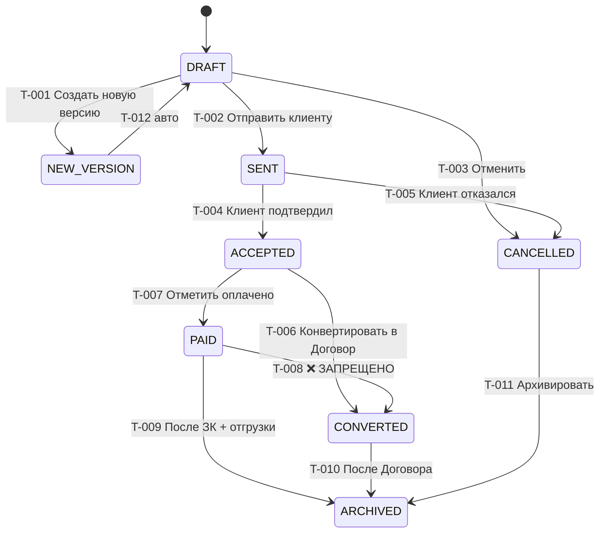

# 03-statusy.md — State-машина 8 статусов КП + переходы + Mermaid-диаграмма

> **Назначение.** Каноническое описание 8 статусов КП + разрешённых переходов. State-машина используется в Phase 1 Bootstrap для RBAC-middleware и UI-кнопок.
> **Автор.** Бизнес-аналитик (Run 1/5, ТЗ-002). Заполнен 2026-06-27.

## 1. Статусы (определения)

| ID | Статус | Англ. имя | Определение | Источник |
|---|---|---|---|---|
| SM-КП-001 | DRAFT | Черновик | Новый КП, редактируется creator'ом; `status='draft'` в БД | МОДУЛЬ §3 |
| SM-КП-002 | NEW_VERSION | Новая версия | Промежуточное состояние при создании версии (`parentProposalId != null`), старый КП автоматически архивируется | МОДУЛЬ §3 |
| SM-КП-003 | SENT | Отправлено | Отправлено клиенту по email; редактирование ЗАБЛОКИРОВАНО (только cancel) | МОДУЛЬ §3 |
| SM-КП-004 | ACCEPTED | Принято | Клиент подтвердил (по email/phone callback); готов к конвертации в Договор | МОДУЛЬ §3 |
| SM-КП-005 | PAID | Оплачено | Клиент оплатил (Payment.registered); триггер на создание ProductionOrder; конвертация ЗАПРЕЩЕНА | МОДУЛЬ §3 + СПОР-5 |
| SM-КП-006 | CONVERTED | Конвертирован в Договор | Contract (Д-XXXX) создан с `parentProposalId`; КП read-only | МОДУЛЬ §3 + СПОР-11 |
| SM-КП-007 | ARCHIVED | В архиве | `isArchived=true`; виден только по фильтру «Архив»; можно смотреть, нельзя редактировать | МОДУЛЬ §3 |
| SM-КП-008 | CANCELLED | Отменено | Отменён клиентом или creator'ом (до оплаты); можно архивировать | МОДУЛЬ §3 |

---

## 2. Переходы (state diagram)

| ID | Из | В | Триггер (UI/API) | RBAC | Условие | Следствие | Источник |
|---|---|---|---|---|---|---|---|
| SM-КП-T-001 | DRAFT | NEW_VERSION | «Создать новую версию» | creator + admin/director | `parentProposalId == null` в текущем | Создаётся НОВЫЙ Proposal (КП-2026-N+1) с `parentProposalId` → старый. Старый → ARCHIVED | МОДУЛЬ §3 |
| SM-КП-T-002 | DRAFT | SENT | «Отправить клиенту» | creator + admin/director | Все позиции заполнены, ИНН клиента, реквизиты подписанта | Email клиенту. КП read-only (`status='sent'`) | МОДУЛЬ §2 Шаг 3 |
| SM-КП-T-003 | DRAFT | CANCELLED | «Отменить черновик» | creator + admin/director | — | КП → `cancelled` | МОДУЛЬ §3 |
| SM-КП-T-004 | SENT | ACCEPTED | Клиент подтвердил (callback в Comment) | director + creator | Подтверждение в Comment (email/phone) | `status='accepted'`; разблокировано для конвертации | МОДУЛЬ §2 |
| SM-КП-T-005 | SENT | CANCELLED | Клиент отказался | creator + admin/director | Подтверждение в Comment | `status='cancelled'` | МОДУЛЬ §3 |
| SM-КП-T-006 | ACCEPTED | CONVERTED | «Конвертировать в Договор» | creator + admin/director | КП ≠ PAID | Создаётся Contract (Д-XXXX) с `parentProposalId`; КП → `converted` | МОДУЛЬ §2 Шаг 5 |
| SM-КП-T-007 | ACCEPTED | PAID | «Отметить оплачено» | director + creator | Payment зарегистрирован в Finance | КП → `paid`; авто-создание ProductionOrder (FLOW-MAP §2) | МОДУЛЬ §8 + СПОР-4 |
| SM-КП-T-008 | PAID | CONVERTED | **ЗАПРЕЩЁН** | — | — | UI скрывает кнопку; API 409. Правовая логика: оплаченное КП не оферта | СПОР-5 + INV-КП-CONV-001 |
| SM-КП-T-009 | PAID | ARCHIVED | «Архивировать» (после завершения ЗК + отгрузки) | creator + admin/director | ProductionOrder.status='completed' + Shipment.delivered | КП → `archived`; цепочка закрыта | МОДУЛЬ §3 |
| SM-КП-T-010 | CONVERTED | ARCHIVED | После закрытия Договора или по истечении | creator + admin/director | — | КП → `archived` | МОДУЛЬ §3 |
| SM-КП-T-011 | CANCELLED | ARCHIVED | «Архивировать отменённое» | creator + admin/director | — | `cancelled` → `archived` | МОДУЛЬ §3 |
| SM-КП-T-012 | NEW_VERSION | DRAFT | автоматически после создания новой версии | (авто) | — | КП в NEW_VERSION = read-only; новый DRAFT создан отдельно | МОДУЛЬ §3 |
| SM-КП-T-013 | CANCELLED | ARCHIVED | «Архивировать отменённое» (дубль T-011) | creator + admin/director | — | `cancelled` → `archived` | МОДУЛЬ §3 |

---

## 3. Mermaid stateDiagram-v2

---

## 4. Что НЕЛЬЗЯ делать (negative-rules)

| ID | Запрещённое действие | Альтернатива | Источник |
|---|---|---|---|
| SM-КП-NO-001 | Конвертировать PAID КП | Сначала закрыть цепочку; или paid → архив напрямую | INV-КП-CONV-001 |
| SM-КП-NO-002 | Редактировать SENT / ACCEPTED / PAID / CONVERTED КП | Создать новую версию (NEW_VERSION) | RBAC-КП-V-001 |
| SM-КП-NO-003 | Удалить DRAFT (физическое удаление запрещено) | Только отмена (CANCELLED) или архивирование | INV-КП-SOFT-001 |
| SM-КП-NO-004 | Восстановить КП из ARCHIVED без admin | «Обратитесь к администратору» | RBAC-КП-OW-004 |

---

## 5. Автоматические триггеры (связаны со статусами)

| Триггер | Что создаёт | Обязательно? | Источник |
|---|---|---|---|
| `Proposal.status = 'paid'` | авто `ProductionOrder` (ЗК-ХХХХ, status=CREATED) | ДА | FLOW-MAP §2 |
| `Proposal.status = 'sent'` | резервирование товара (`Reservation`) | ДА | SCHEMA-CONSOLIDATED §5 |
| `Proposal.status = 'cancelled'` / `archived` | снятие резерва | ДА | SCHEMA-CONSOLIDATED §5 |

---

## 6. Итоговая статистика

| Раздел | Количество |
|---|---|
| Статусы | 8 |
| Переходы (разрешённые + запрещённый) | 13 |
| Negative-rules | 4 |
| Автотриггеры | 3 |
| **ИТОГО** | **28** |

> Минимальное покрытие ТЗ: 20 (8 статусов + 12 переходов). ✅ Фактически: 28.

---

## 7. Связанные документы

- [`04-pravila/04-rbac.md`](../04-pravila/04-rbac.md) — RBAC-матрица (кто может переводить между статусами).
- [`03-perehody.md`](03-perehody.md) — триггеры на каждом переходе.
- [`03-konvertaciya-v-dogovor.md`](03-konvertaciya-v-dogovor.md) — правила конвертации КП → Договор.
- [`FLOW-MAP.md`](../../99_Справочники/FLOW-MAP.md) — визуальная карта потоков.

---

> **Статус:** ✅ Готово (Run 1/5, ТЗ-002). 8 статусов + 13 переходов + Mermaid-диаграмма.

## Версия

| Версия | Дата | Что |
|---|---|---|
| 0.1 | 2026-06-26 | STUB создан Архитектором (PSL-004). |
| 1.0 | 2026-06-27 | Заполнен Бизнес-аналитиком (Run 1/5, ТЗ-002). State-машина с 8 статусами и 13 переходами. |
