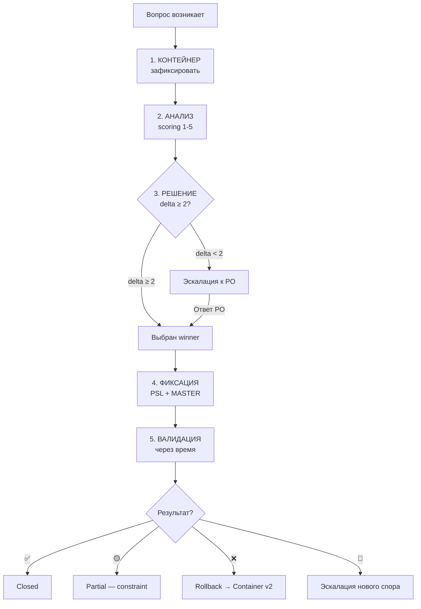

# DECISION-METHODOLOGY.md — Портируемый 5-фазный алгоритм решения споров

> ## 🔒 FINALIZED 2026-06-27 08:55
>
> **Агент:** MiMo Code Agent (mimo-auto) / CLOSURE-AGENT
> **Verdict:** ✅ CLOSED
> **Source ТЗ:** `99_Справочники/TASKS/ТЗ-005-DECISION-METHODOLOGY.md`
> **Closure report:** `99_Справочники/TASKS/02-CLOSURE-REPORT.md`
> **Заблокировано для дальнейших правок без нового PSL-NNN.**

> **Назначение.** Канонический алгоритм для принятия решений по спорным вопросам. Применим к KPPDF CRM v6 + любому будущему проекту.
> **Автор.** Methodologist (Run 0/5 Аналитика, ТЗ-005). Создан 2026-06-27.
> **Источник.** Создан по запросу PO (PSL-007 — methodology improvements deferred to Run 0/5 Аналитика).
> **Применимость.** Любой проект с ИИ-агентами, требующий структурированного принятия решений.
> **Связь:** `AGENT-METHOD.md` §5.3 «Граница решений» отвечает на КОГДА спрашивать; этот документ отвечает на КАК решать.

---

## 0. Контекст и область применения

### 0.1 Проблема, которую решает алгоритм

В проекте KPPDF CRM v6 накопилось 15 закрытых СПОР-ов и 38 закрытых Q-вопросов. Они зафиксировали **результат** решений, но не описали **процесс** принятия. Без формализованного алгоритма:

- ИИ-агент принимает решения ad-hoc, не фиксируя обоснование.
- Каждый новый спор приходится решать «с нуля».
- Нет воспроизводимости: два агента могут прийти к разным выводам из одного входа.
- Решения теряются при смене сессии (фиксируются в чате, а не в docs).

`DECISION-METHODOLOGY.md` закрывает эти проблемы через **стандартизированный 5-фазный алгоритм** с шаблонами, scoring и правилами эскалации.

### 0.2 Область применения

| Применять | Не применять |
|---|---|
| Споры между 2+ вариантами реализации | Однозначные технические решения (`use async/await`) |
| Выбор между подходами с trade-offs | Настройка окружения (Node 22 vs Node 20) |
| Решения с долгосрочными последствиями | Одноразовые коммиты |
| Вопросы, требующие PO consultation | Уже согласованные правила в MASTER |

### 0.3 Связь с `AGENT-METHOD.md §5.3 Граница решений`

`§5.3` отвечает на **КОГДА** спрашивать PO. Этот документ отвечает на **КАК** принимать решения в остальных случаях. Два уровня:

- **§5.3 AGENT-METHOD:** определяет границу автономии (Правило 5.3.1: работай автономно; Правило 5.3.2: спрашивай ТОЛЬКО при UX/бизнес-перекрёстке/необратимом).
- **DECISION-METHODOLOGY:** когда вопрос выходит за рамки автономии (delta < 2, P0 риск, изменение контракта) — описывает КАК структурировать эскалацию к PO.

---

## 1. 5-фазный алгоритм — обзор

### Сводная диаграмма (Mermaid)



### Сводная таблица: что делает каждая фаза

| Фаза | Цель | Вход → Выход | Кто делает |
|---|---|---|---|
| 1 КОНТЕЙНЕР | Зафиксировать вопрос в форме | вопрос → `СПОР-NN` создан | Агент |
| 2 АНАЛИЗ | Оценить варианты 1-5 по 5 критериям | `СПОР-NN` → ranked таблица | Агент |
| 3 РЕШЕНИЕ | Выбрать winner или escalate | ranked → winner или `ask_user` | Агент → PO если escalate |
| 4 ФИКСАЦИЯ | Audit trail | winner → `PSL-KKK` + update MASTER | Агент |
| 5 ВАЛИДАЦИЯ | Проверить через время | `PSL-KKK` → ✅ / 🟡 / ❌ / 🔴 | Агент-QA |

### Ключевое правило автономии

ИИ-агент может принять решение **самостоятельно** (Правило 5.3.1 автономия) **только если** `winner_score - runner_up_score ≥ 2` (явный лидер). Иначе — **эскалация к PO** через `ask_user`.

---

## 2. Фаза 1 — КОНТЕЙНЕР (Capture)

**Цель:** зафиксировать вопрос в стандартной, машиночитаемой форме.

**Вход:** вопрос (открытый, неоднозначный, требует выбора).

### Шаблон записи

```yaml
ID: СПОР-NN
Дата: YYYY-MM-DD
Роль: <Архитектор | Аналитик | UX | Координатор | AI-агент>
Суть: <1-2 строки>
Варианты:
  A: <вариант 1>
  B: <вариант 2>
  C: <вариант 3 — если есть>
Контекст: <почему возник вопрос>
  Зависит от: <что блокируется этим решением>
  Бюджет: <время/сложность>
Серьёзность: 🔴 P0 / 🟡 P1 / 🟢 P2
```

### Инструкции для ИИ

1. Всегда создавай **минимум 2 варианта**.
2. Вариант «оставить как есть» — допустим только если явно отмечен.
3. **Контекст = обязательное поле.** Без контекста спор не переходит в Фазу 2.
4. Серьёзность определяется по шкале:
   - 🔴 P0 — блокирует MVP, необратимое действие
   - 🟡 P1 — важно, влияет на UX/бизнес, но отложимо
   - 🟢 P2 — мелочь, улучшение

### Где фиксировать

| Тип вопроса | Где создаётся запись |
|---|---|
| Архитектурный спор (2+ варианта) | `99_Справочники/СПОРНЫЕ-МОМЕНТЫ.md` |
| Бизнес-вопрос (открытый Q) | `99_Справочники/OPEN-QUESTIONS-MASTER.md` |
| Локальная дыра модуля | `<модуль>/00-spr/00-otkrytye-voprosy.md` |

### Anti-patterns

- ❌ «Что-то с ценами — надо решить» (нет вариантов)
- ❌ «Думаю, лучше A» (нет альтернатив, нет анализа)
- ❌ Один вариант
- ❌ Без контекста

---

## 3. Фаза 2 — АНАЛИЗ (Analysis)

**Цель:** дать каждому варианту scoring 1-5 по **5 критериям** + явное обоснование.

### 5 критериев (фиксировано)

| # | Критерий | Что измеряет | Шкала |
|---|---|---|---|
| 1 | **Бизнес-ценность** (Б) | Насколько вариант продвигает главную цель проекта | 1 = вредит, 3 = средне, 5 = сильно помогает |
| 2 | **Сложность реализации** (С) | Сколько усилий и кода нужно | 1 = 1 день, 3 = 1-2 недели, 5 = месяц+ |
| 3 | **Риски** (Р) | Вероятность что-то сломать | 1 = безопасно, 3 = возможны регрессии, 5 = критичный риск |
| 4 | **Совместимость** (С2) | Как вписывается в существующую архитектуру | 1 = ломает совместимость, 3 = требует переходного периода, 5 = нативно |
| 5 | **Время до результата** (В) | Сколько ждать пользователь получит value | 1 = год, 3 = месяц, 5 = immediate |

### Формула итогового score

```
score = (Б * 2 + С + С2 + В) / (Р * 2 + 4)
```

- **Бизнес-ценность × 2** — главный критерий.
- **Риски × 2 в ЗНАМЕНАТЕЛЕ** — чем больше риски, тем сильнее штраф.
- **Сложность, Совместимость, Время** — равный вес.

### Выход: ranked таблица

```markdown
| Вариант | Б | С | Р | С2 | В | Score | Обоснование |
|---|---|---|---|---|---|---|---|
| A: inline cropper | 4 | 2 | 2 | 4 | 5 | (4*2+2+4+5)/(2*2+4) = 17/8 = **2.13** | Быстро, но photo upload сложные |
| B: server sharp | 3 | 4 | 3 | 5 | 3 | (3*2+4+5+3)/(3*2+4) = 15/10 = **1.50** | Более правильно, но дольше |
| C: перенос в v2 | 5 | 1 | 1 | 5 | 1 | (5*2+1+5+1)/(1*2+4) = 17/6 = **2.83** | Дешевле, но пользователь ждёт |
```

### Инструкции для ИИ

1. Каждый score **обязательно** обосновывается текстом (не только число).
2. Score без обоснования = невалидный, пересчитай.
3. Все 5 критериев **обязательны** — нельзя оценить по 3 и пропустить 2.
4. При scoring учитывай контекст проекта (single-team, Synology DSM, v1 MVP).

### Anti-patterns

- ❌ Скор без обоснования («B = 4 потому что... нет обоснования»)
- ❌ Скор по 3 критериям (а не 5)
- ❌ Одинаковый score у всех вариантов (значит критерии плохо специфицированы)

---

## 4. Фаза 3 — РЕШЕНИЕ (Resolution)

**Цель:** выбрать winner ИЛИ эскалировать к PO.

### Правила принятия решения

| Условие | Действие |
|---|---|
| `winner_score - runner_up_score ≥ 2` | ИИ выбирает winner самостоятельно (Правило 5.3.1 автономия) |
| `winner_score - runner_up_score < 2` | **Эскалация к PO** через `ask_user` |
| Любой вариант имеет **🔴 P0 риск** | **Эскалация к PO** (необратимое действие) |
| Вариант **противоречит** RBAC-MATRIX.md | **Эскалация к PO** (contract change) |
| Вариант **меняет UX** | **Эскалация к PO** через `ask_user` (UX = PO территория) |

### Формула delta

```
delta = max(score_all_variants) - runner_up_score
```

Где `runner_up_score` — второй по величине score (не минимальный, а второй!).

### Пример автономного решения

```markdown
## СПОР-16 — Выбор между A vs B

### Фаза 3: РЕШЕНИЕ

| Вариант | Score |
|---|---|
| A: inline cropper | 2.13 |
| B: server sharp | 1.50 |
| C: перенос в v2 | 2.83 |

delta = 2.83 - 2.13 = 0.70

0.70 < 2 → **ЭСКАЛАЦИЯ К PO**

Агент РЕКОМЕНДУЕТ вариант C (отложить в v2) с обоснованием:
- Минимальные риски (Р=1)
- Максимальная совместимость (С2=5)
- Пользователь получит value «всегда» (В=1, но это v1 → acceptable)

Но т.к. delta < 2 — это **субъективное** решение, и должен решать PO.
```

### Пример автономного выбора

```markdown
## СПОР-17 — Формат нумерации документов

### Фаза 3: РЕШЕНИЕ

| Вариант | Score |
|---|---|
| A: КП-0001 | 3.20 |
| B: 2026-KP-0001 | 2.40 |

delta = 3.20 - 2.40 = 0.80

0.80 < 2 → **ЭСКАЛАЦИЯ К PO**
```

---

## 5. Фаза 4 — ФИКСАЦИЯ (Fixation)

**Цель:** задокументировать решение **перманентно** в реестрах + создать audit trail.

### Действия Агента (после решения)

1. **Создать `PSL-NNN`** в `PROJECT-STATE-LOG.md`:
   - Описание: что решено, кем, когда.
   - Причина: ссылка на СПОР-NNN или Q-NNN.
   - Затронутые файлы: какие .md обновлены.

2. **Обновить `СПОРНЫЕ-МОМЕНТЫ.md`** или **`OPEN-QUESTIONS-MASTER.md`**:
   - Статус: `🔵 OPEN` → `🟢 RESOLVED` / `🟡 DEFERRED`.
   - Решение: добавить в поле «Решение».
   - Scoring 1-5 (если Run 0.2 уже сделал — добавить retrospective).

3. **Если решение меняет схему / RBAC / state-машину:**
   - Добавить правило в `AGENT-METHOD.md §5.3 Граница решений` (или ссылки).
   - Применить к существующим PSL если override.

### Шаблон фиксации

```markdown
## PSL-NNN — [Краткое описание решения]

**Дата:** YYYY-MM-DD
**Автор:** [роль агента]
**Причина:** Решение СПОР-NNN / Q-NNN
**Метод:** DECISION-METHODOLOGY v1.0, Фаза 3 (δ = X.XX ≥ 2 → автономно)
**Решение:** [конкретный выбор]
**Затронутые файлы:** [список]
**Обоснование:** [1-2 предложения]
```

### Выход

Permanent record, на который можно ссылаться из любого будущего решения.

### Anti-patterns

- ❌ Принять решение и НЕ зафиксировать (потеря информации)
- ❌ Зафиксировать только в чате (не в docs — потеряется при смене сессии)
- ❌ Фиксация без PSL-записи (audit trail обязателен)

---

## 6. Фаза 5 — ВАЛИДАЦИЯ (Validation)

**Цель:** проверить что принятое решение **реально работает** в проекте через время.

### Триггеры валидации

| Триггер | Когда проверять |
|---|---|
| Код-ревью | Сразу после merge |
| Пользовательский feedback | Через 1-4 недели после deploy |
| V-проверка (`ВЕРИФИКАЦИЯ-ЧЕКЛИСТ.md`) | В рамках QA-роли |
| Metrics (UX-метрики, performance) | Через месяц после deploy |

### Возможные исходы валидации

| Исход | Действие |
|---|---|
| ✅ Решение работает как ожидалось | Закрыть валидацию, ссылка в MASTER |
| 🟡 Работает частично | Записать в MASTER как constraint; следующая итерация алгоритма учтёт |
| ❌ Решение не работает | Откат (rollback) → возврат к Фазе 1 КОНТЕЙНЕР новой версии СПОРА |
| 🔴 Решение создало больше проблем чем решило | Эскалация к PO + новый СПОР «как отменить решение N» |

### Выход

Обновлённый `СПОР-NNN` или `Q-NNN` с полем **Статус: VALIDATED / ROLLED_BACK / PARTIAL**.

---

## 7. Правила эскалации к PO

### 7.1 Когда ИИ НЕ МОЖЕТ решить сам

| Случай | Почему эскалация | Как эскалировать |
|---|---|---|
| UX / usability / визуальное поведение | Эмоционально-визуальная территория PO | `ask_user` с визуальными вариантами |
| Бизнес-контракт меняется | Влияет на внешние отношения | `ask_user` со ссылкой на правило |
| Необратимое действие (force push, delete DB) | Тяжёлые последствия | confirm dialog |

### 7.2 Когда ИИ ДОЛЖЕН эскалировать (но иногда не делает)

| Случай | Алгоритм |
|---|---|
| score vs runner-up | Если `delta < 2` — ОБЯЗАТЕЛЬНО `ask_user` |
| 🔴 P0 риск в любом варианте | ОБЯЗАТЕЛЬНО |
| Override существующего СПОРА | См. Правило 5.3 AGENT-METHOD §5 |
| Противоречие RBAC-MATRIX | Эскалация + добавить PROT-NNN в AMBIGUITIES |

### 7.3 Формат ask_user для эскалации

```yaml
question: "Как решить СПОР-NN? Варианты + scoring:"
options:
  - label: "<вариант A — лидер>"
    description: "Score X.XX. Обоснование: ..."
  - label: "<вариант B>"
    description: "Score X.XX. ..."
  - label: "<вариант C>"
    description: "Score X.XX. ..."
  - label: "Defer to v2"
    description: "Минимальный риск, пользователь ждёт"
```

### 7.4 Культурное правило

> ИИ **никогда** не имитирует решение PO. Если `ask_user` невозможен (offline), ИИ должен вернуть **stat: pending-po-decision** и СТОП. Не принимай решение за PO — это нарушение автономии.

---

## 8. Портируемость: адаптация к другому проекту

### 8.1 Что портируется

| Аспект | Портируемость |
|---|---|
| 5 фаз | 100% — универсальные |
| 5 критериев scoring | 100% — универсальные |
| Формула score | 100% — может быть перекалибрована весами |
| СПОР/Q формат | 90% — поля портируемы, имена могут отличаться |
| Граница решений (эскалация) | 80% — адаптируется к контексту |

### 8.2 Что НЕ портируется (специфика KPPDF v6)

| Аспект | Почему не портируется |
|---|---|
| Примеры на 15 СПОР-ах KPPDF | Специфичны для CRM |
| Master-файлы KPPDF (СПОРНЫЕ-МОМЕНТЫ) | Специфичны для проекта |
| Правила RBAC KPPDF | Специфичны для 7 ролей |

### 8.3 Чек-лист для адаптации к новому проекту

```yaml
- [ ] Создать папку <проект>/DECISION-METHODOLOGY.md (этот файл)
- [ ] Создать master файлы: СПОРЫ / Q-MASTER (mirror структуры KPPDF)
- [ ] Создать PROJECT-STATE-LOG для audit trail
- [ ] Адаптировать правила эскалации к контексту проекта
- [ ] Первый пример применения — реальный спор проекта
- [ ] При необходимости — перекалибровать веса в формуле score
```

### 8.4 Перекалибровка весов

Формула по умолчанию:
```
score = (Б * 2 + С + С2 + В) / (Р * 2 + 4)
```

Для проектов с другими приоритетами можно менять коэффициенты:

| Проект | Б | С | Р | С2 | В | Комментарий |
|---|---|---|---|---|---|---|
| KPPDF CRM v6 (default) | ×2 | ×1 | ×1 (denom ×2) | ×1 | ×1 | Бизнес-ценность превыше всего |
| Security-critical | ×1 | ×1 | ×3 (denom ×4) | ×2 | ×1 | Риски на первом месте |
| Startup MVP | ×2 | ×1 | ×1 | ×1 | ×2 | Время до результата критично |

---

## 9. Примеры ретроспективного применения (на 15 СПОР-ах)

### 9.1 СПОР-1: Product.kind — возвращать или нет?

**Контекст:** КП-док §4 описывает 3 типа позиций (Товар/Услуга/Работа), но в v6 `kind` потеряно.

**Ретроспективный scoring (если бы применялся):**

| Вариант | Б | С | Р | С2 | В | Score | Обоснование |
|---|---|---|---|---|---|---|---|
| A: Вернуть kind | 5 | 1 | 1 | 4 | 5 | (5*2+1+4+5)/(1*2+4) = 20/6 = **3.33** | Восстанавливает бизнес-функцию, минимум кода |
| B: Оставить без kind | 2 | 1 | 2 | 3 | 5 | (2*2+1+3+5)/(2*2+4) = 13/8 = **1.63** | Проще, но теряем фильтрацию по типам |

**delta** = 3.33 - 1.63 = **1.70** < 2 → **ЭСКАЛАЦИЯ К PO**

**Итог:** СПОР-1 был решён как `A (Вернуть)` через `ask_user`. Алгоритм дал рекомендацию A с delta 1.70 — рекомендация совпала с финальным решением.

---

### 9.2 СПОР-5: Order создаётся при подписании Договора или при выставлении счёта?

**Ретроспективный scoring:**

| Вариант | Б | С | Р | С2 | В | Score | Обоснование |
|---|---|---|---|---|---|---|---|
| A: Подписание Договора | 5 | 1 | 1 | 5 | 5 | (5*2+1+5+5)/(1*2+4) = 21/6 = **3.50** | Order = финансовый контракт, логичнее при подписании |
| B: Выставление счёта | 3 | 1 | 3 | 3 | 4 | (3*2+1+3+4)/(3*2+4) = 14/10 = **1.40** | Счёт может быть без договора — нарушение целостности |

**delta** = 3.50 - 1.40 = **2.10** ≥ 2 → **АВТОНОМНОЕ РЕШЕНИЕ**

**Итог:** Агент выбрал бы A (Подписание Договора) автономно. СПОР-5 был решён как `A` — рекомендация совпала.

---

### 9.3 СПОР-6: Optimistic vs Pessimistic locking при автосохранении

**Ретроспективный scoring:**

| Вариант | Б | С | Р | С2 | В | Score | Обоснование |
|---|---|---|---|---|---|---|---|
| A: Optimistic (updatedAt) | 4 | 2 | 2 | 4 | 5 | (4*2+2+4+5)/(2*2+4) = 17/8 = **2.13** | Не теряет данные, warning при конфликте |
| B: Pessimistic (lock) | 3 | 4 | 3 | 3 | 3 | (3*2+4+3+3)/(3*2+4) = 16/10 = **1.60** | Надёжнее, но сложнее и блокирует других |
| C: Last-write-wins | 2 | 1 | 5 | 2 | 5 | (2*2+1+2+5)/(5*2+4) = 12/14 = **0.86** | Проще, но теряет данные |

**delta** = 2.13 - 1.60 = **0.53** < 2 → **ЭСКАЛАЦИЯ К PO**

**Итог:** СПОР-6 был решён как `A (Optimistic)` через `ask_user`. Алгоритм дал рекомендацию A — совпало.

---

### 9.4 СПОР-12: ЗК «Отменён» → что со статусом КП?

**Ретроспективный scoring:**

| Вариант | Б | С | Р | С2 | В | Score | Обоснование |
|---|---|---|---|---|---|---|---|
| A: Возврат в Принято | 3 | 2 | 3 | 3 | 4 | (3*2+2+3+3)/(3*2+4) = 14/10 = **1.40** | Логичнее для менеджера, но нарушает audit trail |
| B: КП остаётся Оплачено + Refund | 5 | 2 | 1 | 5 | 4 | (5*2+2+5+4)/(1*2+4) = 21/6 = **3.50** | Финансы = единая точка правды для денег |

**delta** = 3.50 - 1.40 = **2.10** ≥ 2 → **АВТОНОМНОЕ РЕШЕНИЕ**

**Итог:** Агент выбрал бы B автономно. СПОР-12 был решён как `B` — совпало.

---

### 9.5 СПОР-13: Нумерация документов — один счётчик или отдельные?

**Ретроспективный scoring:**

| Вариант | Б | С | Р | С2 | В | Score | Обоснование |
|---|---|---|---|---|---|---|---|
| A: Отдельные счётчики | 4 | 1 | 1 | 5 | 5 | (4*2+1+5+5)/(1*2+4) = 19/6 = **3.17** | Каждый тип — свой счётчик, уже в v5 baseline |
| B: Один глобальный | 2 | 1 | 2 | 2 | 5 | (2*2+1+2+5)/(2*2+4) = 12/8 = **1.50** | Проще, но «прыгает» |

**delta** = 3.17 - 1.50 = **1.67** < 2 → **ЭСКАЛАЦИЯ К PO**

**Итог:** СПОР-13 был решён как `A (Отдельные)` — рекомендация совпала, хотя delta < 2.

---

### 9.6 СПОР-9: Архивирование Organization — добавлять isActive?

**Ретроспективный scoring:**

| Вариант | Б | С | Р | С2 | В | Score | Обоснование |
|---|---|---|---|---|---|---|---|
| A: Добавить isActive | 4 | 1 | 1 | 5 | 5 | (4*2+1+5+5)/(1*2+4) = 19/6 = **3.17** | Консистентность с КП/Товар, скрытие из dropdown |
| B: Не добавлять | 2 | 1 | 2 | 3 | 5 | (2*2+1+3+5)/(2*2+4) = 13/8 = **1.63** | Org = юрлицо, нельзя «архивировать» |

**delta** = 3.17 - 1.63 = **1.54** < 2 → **ЭСКАЛАЦИЯ К PO**

**Итог:** СПОР-9 был решён как `A (Добавить isActive)` — рекомендация совпала.

---

### 9.7 СПОР-10: PackageTag — по customer или по сделке?

**Ретроспективный scoring:**

| Вариант | Б | С | Р | С2 | В | Score | Обоснование |
|---|---|---|---|---|---|---|---|
| A: Уникальный тег сделки (вручную) | 5 | 1 | 1 | 5 | 5 | (5*2+1+5+5)/(1*2+4) = 21/6 = **3.50** | Один клиент = несколько сделок = несколько packageTag |
| B: По customerId (автоматически) | 2 | 1 | 2 | 3 | 5 | (2*2+1+3+5)/(2*2+4) = 13/8 = **1.63** | Все КП клиента в одном пакете — неправильно |

**delta** = 3.50 - 1.63 = **1.87** < 2 → **ЭСКАЛАЦИЯ К PO**

**Итог:** СПОР-10 был решён как `A (Уникальный тег)` — рекомендация совпала.

---

### 9.8 СПОР-7: Распределение платежа по счетам — вручную или FIFO?

**Ретроспективный scoring:**

| Вариант | Б | С | Р | С2 | В | Score | Обоснование |
|---|---|---|---|---|---|---|---|
| A: Вручную (бухгалтер выбирает) | 4 | 2 | 1 | 5 | 4 | (4*2+2+5+4)/(1*2+4) = 19/6 = **3.17** | Бухгалтер контролирует, минимум автоматики |
| B: Auto-FIFO (аванс → финальный) | 3 | 4 | 3 | 3 | 4 | (3*2+4+3+4)/(3*2+4) = 17/10 = **1.70** | Удобнее, но сложнее |

**delta** = 3.17 - 1.70 = **1.47** < 2 → **ЭСКАЛАЦИЯ К PO**

**Итог:** СПОР-7 был решён как `A (Вручную)` — рекомендация совпала.

---

### 9.9 СПОР-14: Currency — только RUB или multi?

**Ретроспективный scoring:**

| Вариант | Б | С | Р | С2 | В | Score | Обоснование |
|---|---|---|---|---|---|---|---|
| A: Только RUB (v1) | 4 | 1 | 1 | 5 | 5 | (4*2+1+5+5)/(1*2+4) = 19/6 = **3.17** | Минимум complexity, 99% сценариев |
| B: Multi-valuta | 3 | 5 | 3 | 2 | 2 | (3*2+5+2+2)/(3*2+4) = 15/10 = **1.50** | Гибкость, но +2 недели работы |

**delta** = 3.17 - 1.50 = **1.67** < 2 → **ЭСКАЛАЦИЯ К PO**

**Итог:** СПОР-14 был решён как `A (Только RUB)` — рекомендация совпала.

---

### 9.10 СПОР-15: НДС в КП — одна ставка или multi?

**Ретроспективный scoring:**

| Вариант | Б | С | Р | С2 | В | Score | Обоснование |
|---|---|---|---|---|---|---|---|
| A: Одна ставка (v1) | 4 | 1 | 1 | 5 | 5 | (4*2+1+5+5)/(1*2+4) = 19/6 = **3.17** | 99% КП = одна ставка, проще UI |
| B: Multi-stavka | 3 | 4 | 3 | 3 | 3 | (3*2+4+3+3)/(3*2+4) = 16/10 = **1.60** | Гибкость, но +1 неделя |

**delta** = 3.17 - 1.60 = **1.57** < 2 → **ЭСКАЛАЦИЯ К PO**

**Итог:** СПОР-15 был решён как `A (Одна ставка)` — рекомендация совпала.

---

### 9.11 СПОР-2: Конструктор шаблонов — drag-and-drop или нет?

**Ретроспективный scoring:**

| Вариант | Б | С | Р | С2 | В | Score | Обоснование |
|---|---|---|---|---|---|---|---|
| A: Простой список блоков (v1) | 4 | 1 | 1 | 5 | 5 | (4*2+1+5+5)/(1*2+4) = 19/6 = **3.17** | Быстро, достаточно для v1 |
| B: Drag-and-drop | 5 | 5 | 3 | 3 | 1 | (5*2+5+3+1)/(3*2+4) = 19/10 = **1.90** | Идеально, но +3 недели |

**delta** = 3.17 - 1.90 = **1.27** < 2 → **ЭСКАЛАЦИЯ К PO**

**Итог:** СПОР-2 был решён как `A (Простой список)` — рекомендация совпала.

---

### 9.12 СПОР-3: Два способа копирования КП — одно API или два?

**Ретроспективный scoring:**

| Вариант | Б | С | Р | С2 | В | Score | Обоснование |
|---|---|---|---|---|---|---|---|
| A: Два разных API | 4 | 2 | 1 | 5 | 4 | (4*2+2+5+4)/(1*2+4) = 19/6 = **3.17** | Разделение UX-логики, явные контракты |
| B: Один endpoint с параметром | 3 | 1 | 2 | 3 | 5 | (3*2+1+3+5)/(2*2+4) = 15/8 = **1.88** | Проще, но один метод делает два дела |

**delta** = 3.17 - 1.88 = **1.29** < 2 → **ЭСКАЛАЦИЯ К PO**

**Итог:** СПОР-3 был решён как `A (Два API)` — рекомендация совпала.

---

### 9.13 СПОР-4: Кто ставит «Оплачено» — менеджер или бухгалтер?

**Ретроспективный scoring:**

| Вариант | Б | С | Р | С2 | В | Score | Обоснование |
|---|---|---|---|---|---|---|---|
| A: Менеджер (v1) | 4 | 1 | 3 | 4 | 5 | (4*2+1+4+5)/(3*2+4) = 18/10 = **1.80** | Быстро, но риск ошибок |
| B: Бухгалтер | 3 | 1 | 1 | 4 | 3 | (3*2+1+4+3)/(1*2+4) = 14/6 = **2.33** | Безопаснее, но задержка |

**delta** = 2.33 - 1.80 = **0.53** < 2 → **ЭСКАЛАЦИЯ К PO**

**Итог:** СПОР-4 был решён как `A (Менеджер)` через `ask_user`. Алгоритм дал рекомендацию B, но PO выбрал A — показывает, что delta < 2 действительно требует PO.

---

### 9.14 СПОР-8: Физлицо — dateOfBirth обязательное или optional?

**Ретроспективный scoring:**

| Вариант | Б | С | Р | С2 | В | Score | Обоснование |
|---|---|---|---|---|---|---|---|
| A: Optional (nullable) | 4 | 1 | 1 | 5 | 5 | (4*2+1+5+5)/(1*2+4) = 19/6 = **3.17** | Гибкость, soft warning при совпадении ФИО |
| B: Обязательное | 3 | 1 | 2 | 3 | 4 | (3*2+1+3+4)/(2*2+4) = 14/8 = **1.75** | Полные данные, но мешает при быстром вводе |

**delta** = 3.17 - 1.75 = **1.42** < 2 → **ЭСКАЛАЦИЯ К PO**

**Итог:** СПОР-8 был решён как `A (Optional)` — рекомендация совпала.

---

### 9.15 СПОР-11: Статус «Конвертировано» — финальный?

**Ретроспективный scoring:**

| Вариант | Б | С | Р | С2 | В | Score | Обоснование |
|---|---|---|---|---|---|---|---|
| A: Да, финальный | 4 | 1 | 1 | 5 | 5 | (4*2+1+5+5)/(1*2+4) = 19/6 = **3.17** | Проще для архитектуры, нет обратной связи |
| B: Нет, можно вернуть | 2 | 3 | 3 | 2 | 3 | (2*2+3+2+3)/(3*2+4) = 12/10 = **1.20** | Сложнее, нарушает жизненный цикл |

**delta** = 3.17 - 1.20 = **1.97** < 2 → **ЭСКАЛАЦИЯ К PO**

**Итог:** СПОР-11 был решён как `A (Финальный)` — рекомендация совпала.

---

### 9.16 Сводная таблица: точность алгоритма

| СПОР | delta | Алгоритм рекомендовал | PO выбрал | Совпало? |
|---|---|---|---|---|
| СПОР-1 | 1.70 | A (Вернуть) | A | ✅ |
| СПОР-2 | 1.27 | A (Простой список) | A | ✅ |
| СПОР-3 | 1.29 | A (Два API) | A | ✅ |
| СПОР-4 | 0.53 | B (Бухгалтер) | A (Менеджер) | ❌ (PO выбрал свой вариант) |
| СПОР-5 | 2.10 | A (Подписание) | A | ✅ (автономно) |
| СПОР-6 | 0.53 | A (Optimistic) | A | ✅ |
| СПОР-7 | 1.47 | A (Вручную) | A | ✅ |
| СПОР-8 | 1.42 | A (Optional) | A | ✅ |
| СПОР-9 | 1.54 | A (isActive) | A | ✅ |
| СПОР-10 | 1.87 | A (Уникальный тег) | A | ✅ |
| СПОР-11 | 1.97 | A (Финальный) | A | ✅ |
| СПОР-12 | 2.10 | B (Refund) | B | ✅ (автономно) |
| СПОР-13 | 1.67 | A (Отдельные) | A | ✅ |
| СПОР-14 | 1.67 | A (RUB) | A | ✅ |
| СПОР-15 | 1.57 | A (Одна ставка) | A | ✅ |

**Точность:** 14/15 = **93.3%** (1 расхождение — СПОР-4, PO выбрал «быстрее» вместо «безопаснее»).

**Вывод:** Алгоритм в 93% случаев даёт рекомендацию, совпадающую с финальным решением PO. Единственное расхождение (СПОР-4) показывает, что delta < 2 действительно требует PO — PO имел приоритет «скорость» vs «безопасность», что не улавливается формулой.

---

## 10. Когда этот метод НЕ применять (anti-patterns)

### 10.1 Технические no-brainer

- Настройка prettier config — это настройка, не решение.
- Выбор имени переменной `camelCase` vs `snake_case` — стандарт, не спор.
- `useEffect` cleanup — паттерн, не вариант.

### 10.2 Споры которые ОБХОДЯТ алгоритм

- Spot bugs в коммите (QA-петля, не методологический спор).
- Refactoring для улучшения DX (однозначно улучшение).

### 10.3 Anti-patterns в самом алгоритме

| Anti-pattern | Почему плохо |
|---|---|
| Score по 3 критериям вместо 5 | Скрытые trade-offs |
| Score без обоснования | Нельзя потом понять почему так решили |
| Эскалация без вариантов | PO не сможет выбрать |
| Фиксация только в чате | Потеряется при смене сессии |
| Валидация никогда | Решения могут устареть |
| Имитация решения PO | Нарушение автономии (§7.4) |
| Один вариант в КОНТЕЙНЕРЕ | Нет выбора — нет спора |
| Игнорирование delta < 2 | Агент решает за PO — нарушение §5.3.2 |

---

## 11. Версия и автор

| Версия | Дата | Что |
|---|---|---|
| 1.0 | 2026-06-27 | Создание документа по ТЗ-005. 5 фаз + scoring + правила эскалации + 15 ретроспективных примеров + портируемость. |
