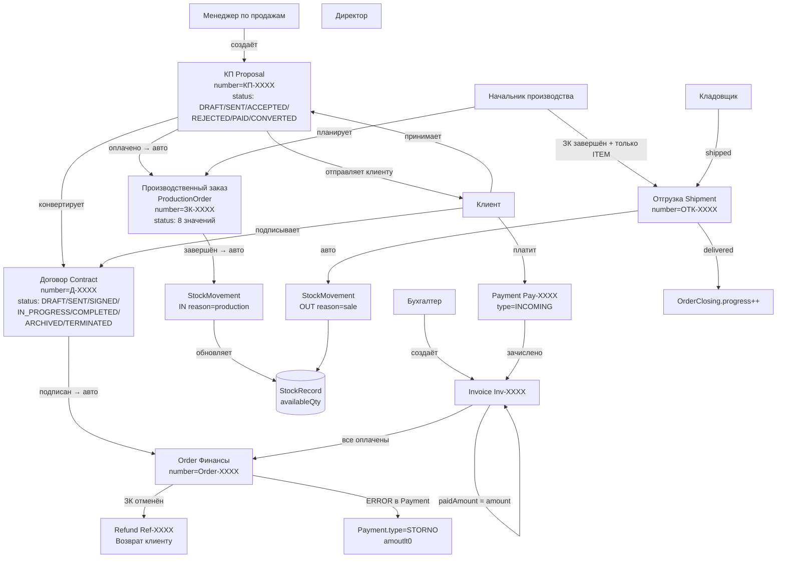

# FLOW-MAP.md — Визуальная карта потоков данных v6

> **Дата:** 2026-06-24.
> **Назначение:** Единая визуальная карта всех потоков данных между 5 модулями + триггеры автоматических переходов + типичные sad-paths.
>
> **Источники:** `МАСТЕР-АУДИТ-V6.md` §6 + `МОДУЛЬ-КОММЕРЧЕСКОЕ-ПРЕДЛОЖЕНИЕ.md` §1, §2 + `МОДУЛЬ-ДОГОВОР.md` §0, §6 + `МОДУЛЬ-ПРОИЗВОДСТВО.md` §0, §6 + `МОДУЛЬ-СКЛАД-ПОДРОБНЫЙ.md` §11 + `МОДУЛЬ-ФИНАНСЫ.md` §4 + `ЖУРНАЛ-ПРОГОНА.md` (R1-R4).

---

## 0. TL;DR — главная цепочка

**Happy path:**
```
КП (DRAFT) → КП (SENT) → КП (ACCEPTED) → КП (PAID → авто ЗК CREATED)
                                                    ↓
Договор (DRAFT) → Договор (SENT) → Договор (SIGNED → авто Order CREATED)
                                              ↓
ЗК (PLANNING) → ЗК (IN_PROGRESS) → ЗК (COMPLETED → авто приход Склад + Shipment)
                                                       ↓
Отгрузка (SHIPPED → авто StockMovement:OUT) → Доставка (DELIVERED → OrderClosing++)
                                                       ↓
Счёт-фактура + Payment → Invoice FULLY_PAID → Order CLOSED → МАРЖА
```

---

## 1. Главная диаграмма потоков (Mermaid + ASCII)

### 1.1 Mermaid



### 1.2 ASCII (читаемая версия)

```
═══════════════════════════════════════════════════════════════════════════
                         ГЛАВНАЯ ЦЕПОЧКА «КП → ДЕНЬГИ»
═══════════════════════════════════════════════════════════════════════════

  Менеджер                   Клиент              Главная цепочка
     │                          │                       │
     │ 1. Создать КП            │                       │
     ▼                          │                       │
   ┌─────────┐                  │                       │
   │ КП-X    │ DRAFT            │                       │
   │ status  │                  │                       │
   └────┬────┘                  │                       │
        │ Отправить             │                       │
        ▼                       │                       │
   ┌─────────┐                  │                       │
   │ КП-X    │ SENT       ─────▶│ Прочитать             │
   │ status  │                  │                       │
   └────┬────┘                  │                       │
        │ ◀─── Принять ────── ─┘                       │
        ▼                                              │
   ┌─────────┐                                          │
   │ КП-X    │ ACCEPTED                                │
   │ status  │                                          │
   └────┬────┘─────┬───────────────┐                    │
        │           │               │                    │
        │           │ Оплатить (авто=>ЗК)              │
        │           ▼               ▼                    │
        │     ┌─────────┐    ┌─────────────┐           │
        │     │  ЗК-Х   │    │ Договор (от │           │
        │     │ CREATED │◀───│ КП)         │           │
        │     └─────────┘    └──────┬──────┘           │
        │           │               │ Подписать         │
        │           │               ▼                   │
        │           │        ┌─────────────┐            │
        │           │        │ Договор     │            │
        │           │        │ SIGNED      │ ──▶ авто────▶ Заказ (Order)
        │           │        └─────────────┘            │
        │           ▼                                  │
        │     ЗК в работу (production_head)             │
        │     ┌─────────────┐                          │
        │     │  ЗК-Х       │                          │
        │     │ IN_PROGRESS │                          │
        │     └──────┬──────┘                          │
        │            │ Завершить (все задачи done)        │
        │            ▼                                  │
        │     ┌─────────────┐                          │
        │     │  ЗК-Х       │                          │
        │     │ COMPLETED   │                          │
        │     └──────┬──────┘                          │
        │            │ (только Product.kind=ITEM)       │
        │            ▼                                  │
        │     ┌─────────────┐    ┌─────────────┐      │
        │     │ ЗК→Склад    │───▶│Shipment ОТК-Х│      │
        │     │ авто-приход │    │ PLANNED     │      │
        │     │ (StockMvmt) │    └──────┬──────┘      │
        │     └─────────────┘           │ Упаковать    │
        │                                ▼             │
        │                          ┌─────────────┐      │
        │                          │Shipment     │      │
        │                          │ PACKED      │      │
        │                          └──────┬──────┘      │
        │                                 │ Отгрузить  │
        │                                 ▼             │
        │                          ┌─────────────┐      │
        │                          │Shipment     │      │
        │                          │ SHIPPED     │────▶ авто StockMvmt OUT
        │                          └──────┬──────┘      │
        │                                 │ Доставить  │
        │                                 ▼             │
        │                          ┌─────────────┐      │
        │                          │Shipment     │────▶ OrderClosing.progress++
        │                          │ DELIVERED   │      │
        │                          └─────────────┘      │
        │                                                │
        ▼                                                │
   Бухгалтер                                            │
     │ Создать счёт (Invoice)                            │
     ▼                                                │
   ┌─────────────┐                                    │
   │Invoice Inv-X│                                    │
   │ ISSUED      │                                    │
   └──────┬──────┘                                    │
          │ Клиент заплатил                            │
          ▼                                            │
   ┌─────────────┐                                    │
   │Payment Pay-X│                                    │
   │ INCOMING    │                                    │
   └──────┬──────┘                                    │
          │ зачислить                                  │
          ▼                                            │
   ┌─────────────┐                                    │
   │Invoice      │                                    │
   │ FULLY_PAID  │                                    │
   └──────┬──────┘                                    │
          │ все Invoice оплачены                       │
          ▼                                            │
   ┌─────────────┐                                    │
   │Order        │                                    │
   │ CLOSED      │ ──▶ МАРЖА = totalAmount - COGS     │
   └─────────────┘                                    │
                                                       ▼
                                                Сделка завершена

═══════════════════════════════════════════════════════════════════════════
```

---

## 2. Автоматические триггеры (явный список)

| Триггер | Что создаёт | Обязательно? |
|---|---|---|
| `Proposal.status = 'paid'` | авто `ProductionOrder` (ЗК-ХХХХ, status=CREATED) | ДА |
| `Contract.status = 'signed'` (СПОР-5) | авто `Order` (Order-ХХХХ, status=DRAFT → авто IN_PROGRESS) | ДА |
| `ProductionOrder.status = 'completed'` (только для `Product.kind='ITEM'`) | авто `StockMovement` (IN, reason=PRODUCTION) для каждой ITEM-задачи | ДА, опционально по типу |
| `ProductionOrder.status = 'completed'` + ЗК имеет ITEM-positions | авто-ПРЕДЛОЖЕНИЕ создать `Shipment` (кладовщик подтверждает кнопкой) | НЕТ — авто-предложение, кладовщик подтверждает |
| `Shipment.status = 'shipped'` | авто `StockMovement` (OUT, reason=SALE) для каждого `ShipmentItem` | ДА |
| `Shipment.status = 'delivered'` | `OrderClosing.progress += quantityActual` (в v1 ручной бухгалтером, v2 авто) | ЧАСТИЧНО |
| `SupplierDelivery.status = 'completed'` | авто `StockMovement` (IN, reason=PURCHASE) для каждого `SupplierDeliveryItem` | ДА |
| `WriteOffAct.status = 'completed'` | авто `StockMovement` (OUT, reason=WRITE_OFF) для каждого `WriteOffItem` | ДА |
| `ProductionOrder.status = 'completed'` (ЗК с НЕ-item позициями) | кладовщик получает **информационное сообщение** (без StockMovement) — GAP-009 ✓ | ДА (закрыто) |
| `availableQty < minStock` (ежедневный cron) | авто `PurchaseRequest` (status=pending, reason=LOW_STOCK) | ДА (через cron) |
| `Shipment.delivered` → StockRecord.quantity vs initial | если quantity < 50%: авто-триггер `ProductionOrder.status = PARTIAL` | v2 |

---

## 3. Sad paths (3 типичных сценария возврата/отмены)

### 3.1 ЗК отменён ПОСЛЕ оплаты клиентом

```
КП «Оплачено» → авто ЗК СОЗДАНА → ЗК в работе → всё оплачено
                                                        ↓
                                              ЗАКАЗЧИК ЗАХОТЕЛ ОТМЕНИТЬ
                                                        ↓
1. Менеджер останавливает производство → ЗК.status = CANCELLED
2. Бухгалтер в Модуле Финансы создаёт Сторно (если была ошибка в Payment)
   ИЛИ
3. Бухгалтер создаёт Refund (возврат реальных денег клиенту)
   - Refund.amount = оплаченная сумма
   - Refund.reason = "Отмена ЗК-ХХХХ по запросу клиента"
   - Refund.originalPaymentId = тот Payment, который был входящим
4. После проведения Refund: Order.status = CANCELLED (закреплено 24.06.2026)
5. КП остаётся в «Оплачено» (СПОР-12) — финальный статус
6. Договор.status = TERMINATED (закреплено 24.06.2026)
```

**Что НЕ происходит:**
- ❌ КП не возвращается в «Принято» (КАТЕГОРИЧЕСКИ ЗАПРЕЩЕНО ретро-менять).
- ❌ Договор не возвращается в черновик.
- ❌ Никаких каскадных переходов (R4 зафиксировано).

### 3.2 Менеджер «Оплачено» по ошибке

```
Менеджер «случайно» нажал «Отметить как оплачено»
   ↓
КП.status = PAID → авто-создана ЗК-ХХХХ (ЗК.CREATED) → ЗК в работе → Shipment возможно отгружен
   ↓
Обнаружена ошибка (через банковскую сверку или просто звонок клиента)
   ↓
Что делать? (GAP-011 было, НО для Phase 1 Bootstrap принят консервативный путь):
1. НЕ автоматический откат (КП нельзя конвертировать из «Оплачено» если уже есть ЗК)
2. ТОЛЬКО через бухгалтера:
   - Если деньги НЕ приходили: бухгалтер создаёт STORNO по ошибке в Payment + Order закрывается с cancaled
   - Если деньги приходили и уже что-то отгрузили: Refund + ручное закрытие Order
3. ЗК остаётся в системе как «отменён канцелярски» с пометками в audit-trail
```

**R0 в v1:** Manual recovery через бухгалтера. Автоматического отката нет.

### 3.3 Клиент вернул товар через 2 недели после отгрузки

```
SHIPMENT.Delivered → клиент использовал товар → обнаружен брак
   ↓
Клиент просит возврат/замену
   ↓
В v1:
  - Товар НЕ возвращается на Склад (нет Shipment.status='returned', нет sale_return)
  - Брак фиксируется через WriteOffAct (reason='defect') — но это не возврат от клиента, а списание на нашей стороне
  - Деньги возвращаются через Refund в Модуле Финансы
В v2:
  - Полноценный flow: Shipment.status='returned' + StockMovement.reason='sale_return' + Refund
```

**Текущее:** Sad path возврата от клиента отложен в v2 (Q-SKOL-2).

---

## 4. R1-R4 (4 архитектурных разрыва — все разрешены)

| # | Разрыв (R) | Решение (24.06.2026) |
|---|---|---|
| **R1** | «ЗК без товаров» — что видит кладовщик? | GAP-009 ✓ — кладовщик получает **информационное сообщение** в /warehouse (без StockMovement). |
| **R2** | Возврат клиентом | Отложен в v2 (Q-SKOL-2). Workaround: WriteOffAct + Refund. |
| **R3** | OrderClosing.trigger | **В v1 ручной** бухгалтером через UI ОрдерКлозинга. Авто-триггер запланирован в v2. |
| **R4** | Каскадные переходы статусов | **ЗАПРЕЩЕНЫ**. Каждый модуль управляет своими статусами. Финансы ЗАВИСЯТ от отгрузки, не наоборот. |

---

## 5. Связи между модулями — таблица FK и зависимостей

### 5.1 Кто кого вызывает (imperative)

| Откуда | Куда | Когда |
|---|---|---|
| КП Оплачено | → ЗК | авто, при `paid` |
| Договор Подписан | → Order (Финансы) | авто, при `signed` (СПОР-5) |
| ЗК Завершён | → StockMovement (IN) | авто, при `completed` (только ITEM) |
| ЗК Завершён + ITEM | → Shipment (предложение) | авто-предложение кладовщику |
| Shipment Shipped | → StockMovement (OUT) | авто, при `shipped` |
| Shipment Delivered | → OrderClosing.progress | ручной бухгалтером (v1), авто (v2) |
| availableQty < minStock | → PurchaseRequest | ежедневный cron |
| ЗК.cancelled (после оплаты) | → Refund (в Финансах) | вручную бухгалтером |

### 5.2 Кто кого ЧИТАЕТ (data-flow)

| Модуль | Читает | Когда |
|---|---|---|
| КП (`ProposalItem.basePrice`) | Product.basePrice | при формировании КП (snapshot) |
| КП (`Reservation`) | StockRecord.availableQty | при открытии корзины / витрины товаров |
| Договор (`ContractItem.*`) | Proposal + ProposalItem | при конвертации (snapshot) |
| ЗК (`ProductionTask.product`) | Product | при распределении |
| Склад (`StockRecord.availableQty`) | Reservation + StockMovement | при показе в /warehouse |
| Финансы (`Order.totalAmount`) | Contract | при создании (snapshot через разные поля) |
| Финансы (`OrderClosing.margin`) | Shipment + WriteOffAct | при ручном / авто расчёте маржи |

### 5.3 FK-связи (БД-уровень)

Все FK — см. `SCHEMA-CONSOLIDATED.md` §2 «Сводная таблица FK + ON DELETE» (50+ строк).

Ключевые ON DELETE = RESTRICT (НЕЛЬЗЯ удалить):
- `ProductionOrder.parentProposalId` — НЕЛЬЗЯ удалить КП пока есть ЗК
- `Contract.parentProposalId` — НЕЛЬЗЯ удалить КП пока есть Договор
- `Order.contractId` — НЕЛЬЗЯ удалить Договор пока есть Order
- `StockRecord.{warehouseId, productId}` — НЕЛЬЗЯ удалить Склад/Товар с ненулевым остатком

---

## 6. RBAC в потоках (кто может двигать что)

Сводная матрица — в `RBAC-MATRIX.md`. Здесь — критичные переходы по потокам:

| Поток | Кто может | RBAC |
|---|---|---|
| КП → ЗК (авто) | авто (система) | — |
| КП «Оплачено» | manager (свой), director, admin | без бухгалтера! (СПОР-4) |
| Договор «Подписан» | manager (свой) | — |
| ЗК → Завершить | production (свой), director | НЕ manager (он уже сделал «Оплачено» — нет) |
| Shipment «Отгрузить» | storekeeper, admin, director | НЕ manager (он создал КП, но не отгружает) |
| WriteOff Approve | accountant (≤ 5000₽), director (любая сумма) | — |
| Refund создать | accountant, director, admin | НЕ manager |
| Payment регистрировать | accountant | — |

---

## 7. Триггеры v2 (отложено)

| Триггер v2 | Что делает |
|---|---|
| Shipment.delivered → авто OrderClosing.progress | вместо ручного бухгалтером |
| Shipment.delivered → авто OrderClosing.recalculate_margin | с учётом WriteOff и Refund |
| Shipment.partial → авто follow-up отгрузка | если quantityActual < quantityPlanned |
| PurchaseRequest разрешён → авто PurchaseOrder (если approved_закупщик) | ускорение закупок |
| Bank statement import → авто reconcile к Payments | заменяет ручной ввод |

---

## 8. Временная шкала типичной сделки

```
День 0:   Менеджер рисует КП-0001
День 1:   КП отправлен клиенту
День 2:   Клиент «Принято»
День 3:   Менеджер конвертирует в Договор-0001 → подписан
День 5:   Клиент «Оплачено» → авто ЗК-0001 (production_head увидел)
День 6:   Материалы в наличии → ЗК.IN_PROGRESS
День 7:   Производство завершено → ЗК.COMPLETED → авто приход Склад
День 8:   Кладовщик упаковал Shipment-0001, отгрузил → Shipment.DELIVERED
День 9:   Бухгалтер выставил Invoice-0001 → клиент платит → Payment-0001 → Order.CLOSED
День 12:  МАРЖА рассчитана ✓
```

---

## Связанные документы

- `BIG-BOOK.md` — Главный консолидатор. Цепочка «КП → Деньги» внутри в сжатой форме.
- `99_Справочники/SCHEMA-CONSOLIDATED.md` §6 — инварианты цепочки на уровне БД.
- `99_Справочники/МАСТЕР-АУДИТ-V6.md` §6 — обоснование этой карты.
- `99_Справочники/OPEN-QUESTIONS-MASTER.md` — все Q, на основании которых согласованы автоматические триггеры.
- `99_Справочники/RBAC-MATRIX.md` — кто может двигать что в потоках.

---

> **Статус:** ✅ V0 (24.06.2026). Единая карта потоков готова. Phase 1 Bootstrap миграций Prisma разблокирован.
