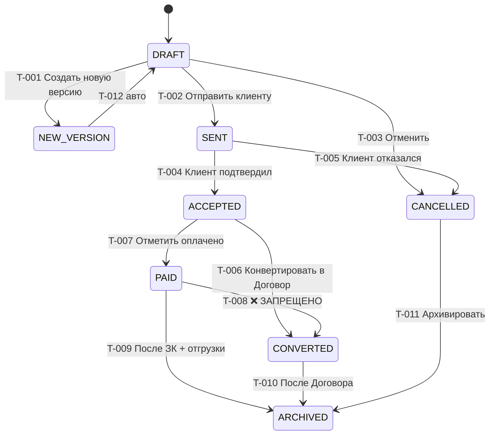

# ТЗ-002-RUN-1-5-АНАЛИТИК-КП.md — Run 1/5 Аналитика: правила для модуля КП

> ## 🔒 FINALIZED 2026-06-27
>
> **Агент:** Бизнес-аналитик / MiMo auto
> **Verdict:** ✅ CLOSED
> **Source ТЗ:** `99_Справочники/TASKS/ТЗ-002-RUN-1-5-АНАЛИТИК-КП.md`
> **Closure report:** `99_Справочники/TASKS/ТЗ-002_02-CLOSURE-REPORT.md`
> **Заблокировано для дальнейших правок без нового PSL-NNN.**

> **Тип документа:** Техническое задание (ТЗ) для параллельного ИИ-агента.
> **ID задачи:** ТЗ-002.
> **Приоритет:** 🔴 P0 (блокер для Phase 1 Bootstrap + UX-дизайна).
> **Статус:** ✅ Готово к запуску (2026-06-27).
> **Автор ТЗ:** Буфер (стратег-ассистент).
> **Заказчик:** параллельный ИИ-агент (далее — «Агент»).
> **Методология работы Агента:** [`AGENT-METHOD.md`](../../AGENT-METHOD.md) §1 «Быстрый старт» + §5.3 «Граница решений» (автономия) + §5.6 «Pre-action Checklist + Post-action Checkpoint» (обязательно).
> **Пререквизиты:** ТЗ-001 (REGISTRY-OF-RULES) уже работает параллельно — этот STUB work **не зависит** от REGISTRY, идёт независимо.

---

## 0. Контекст

### 0.1 Что такое Run 1/5 и зачем он сейчас

Run 1/5 = первый из 5 прогонов Бизнес-аналитика по модулю КП (Phase 1 Bootstrap прогонов). Закрывает **3 базовых STUB**:
1. Видимость полей по ролям (RBAC-матрица КП).
2. Бизнес-инварианты (9 групп правил «нельзя / обязательно»).
3. State-машина 8 статусов КП + диаграмма переходов.

Эти 3 STUB — **фундамент** для всех downstream работ:
- Phase 1 Bootstrap Prisma → нужны правила RBAC + инварианты для миграций и middleware.
- LAUNCH-UX / UX-дизайнер → нужна матрица видимости полей + статусы для кнопок.
- QA-валидатор → нужны инварианты для тест-сценариев.

**Без Run 1/5 Run 2..5 будут строить правила на неполном фундаменте → drift.**

### 0.2 Что в этом ТЗ, чего нет

В этом ТЗ: **только КП**, только **3 STUB-файла**.
НЕ в этом ТЗ: REGISTRY-OF-RULES (ТЗ-001) — извлечение ВСЕХ правил по ВСЕМ 5 модулям.
НЕ в этом ТЗ: Run 2..5 (Договор / Производство / Склад / Финансы).
НЕ в этом ТЗ: Phase 1 Bootstrap Prisma (код).

### 0.3 Кто работает по этому ТЗ

**Агент** — параллельный ИИ, роль = **Бизнес-аналитик** (по `AGENT-ROLES.md` §2.2). Использует launch-пакет `01_КП/LAUNCH-ANALYST.md` как базовый шаблон промпта (это ТЗ — его развёрнутая версия).

---

## 1. Миссия

> **Одной фразой:** Извлечь из исходного `МОДУЛЬ-КОММЕРЧЕСКОЕ-ПРЕДЛОЖЕНИЕ.md` (~945 строк, распущен в 20 STUB в PSL-004) канонические правила и заполнить ими 3 STUB-файла в формате, пригодном для прямого использования в Phase 1 Bootstrap.

**Декомпозиция:**
1. Прочитать `01_КП/README.md` + все 20 STUB (для контекста).
2. Извлечь **видимость полей** → `04-rbac.md` (~50-80 правил).
3. Извлечь **9 групп инвариантов** → `04-biznes-pravila.md` (~30-50 правил).
4. Извлечь **8 статусов + переходы** → `03-statusy.md` (~12-20 правил + Mermaid-диаграмма).
5. Self-verify по §8 настоящего ТЗ → создать Report → handoff.

---

## 2. Scope IN/OUT

### 2.1 IN — Агент делает

| # | Файл | Что делается |
|---|---|---|
| 1 | `01_КП/04-pravila/04-rbac.md` | Заполнить ~50-80 правилами видимости полей по 7 ролям (org matrix). |
| 2 | `01_КП/04-pravila/04-biznes-pravila.md` | Заполнить ~30-50 правилами (9 групп: позиции, цены, скидки, НДС, конвертация, оплата, подписанты, реквизиты, soft-delete). |
| 3 | `01_КП/03-zhiznennyj-cikl/03-statusy.md` | Заполнить 8 статусами + ~12 переходами + ASCII/Mermaid-диаграммой state-машины. |
| 4 | `99_Справочники/TASKS/02-01-LOG.md` | Хронология работы Агента (audit trail). |
| 5 | `99_Справочники/TASKS/02-02-REPORT.md` | Финальный отчёт Агента для PO (метрики покрытия, найденные пробелы). |
| 6 | (опц.) `99_Справочники/TASKS/02-09-AMBIGUITIES.md` | Противоречия между правилами в разных группах. |

### 2.2 OUT — Агент НЕ делает

| # | Что НЕ делает | Почему |
|---|---|---|
| 1 | Не пишет новых правил «от себя» | Только извлечение из исходных МОДУЛЬ-доков. |
| 2 | Не правит `RBAC-MATRIX.md`, `SCHEMA-CONSOLIDATED.md` | Канонические справочники — не трогать. |
| 3 | Не работает с Run 2..5 STUB | Только Run 1 (RBAC + правила + статусы). |
| 4 | Не правит `04-pravila/00-README.md`, `02-konstruktor-kp/00-README.md` и другие 00-README | README-каркасы — оставить как есть. |
| 5 | Не пишет код | Это документация. |

---

## 3. Deliverables — что Агент создаёт

### 3.1 Основные артефакты

| # | Файл | Целевой размер | Hard limit |
|---|---|---|---|
| 1 | `01_КП/04-pravila/04-rbac.md` | 200-300 строк | 400 |
| 2 | `01_КП/04-pravila/04-biznes-pravila.md` | 200-350 строк | 400 |
| 3 | `01_КП/03-zhiznennyj-cikl/03-statusy.md` | 100-200 строк | 250 |
| 4 | `99_Справочники/TASKS/02-01-LOG.md` | без ограничения | — |
| 5 | `99_Справочники/TASKS/02-02-REPORT.md` | 200-300 строк | 400 |
| 6 | `99_Справочники/TASKS/02-09-AMBIGUITIES.md` | по необходимости | — |

### 3.2 Hard limits

| Файл | Hard limit | Что делать при превышении |
|---|---|---|
| Любой из 3 STUB | **400 строк** (по `AGENT-REVIEW.md` §1.6) | Разбить на 2 файла + cross-link |
| 02-REPORT.md | **500 строк** | Сократить таблицы |
| 04-rbac.md | 400 | Если не влезает: разделить на 04-rbac-fields.md (видимость полей) + 04-rbac-actions.md (видимость действий) |

### 3.3 Минимальное покрытие

| Раздел | Правил минимум |
|---|---|
| 04-rbac.md | 50 (RBAC-правила КП: видимость полей формы, видимость действий, ownership «свой») |
| 04-biznes-pravila.md | 30 (9 групп инвариантов × 3-5 правил в каждой) = минимум 27, целевой 30+ |
| 03-statusy.md | 8 (статусы) + 12 (переходы) = 20 |

---

## 4. Inputs — что Агент обязан прочитать

| # | Файл | Приоритет | Зачем |
|---|---|---|---|
| 1 | [`CHECKLIST.md`](../../CHECKLIST.md) | 🔴 | Мастер-навигатор. |
| 2 | [`AGENT-METHOD.md`](../../AGENT-METHOD.md) | 🔴 | §1 «Быстрый старт». §5.3 (граница решений), §5.6 (Pre-action/Post-action), §6 (шаблон OQ). |
| 3 | [`99_Справочники/RBAC-MATRIX.md`](../RBAC-MATRIX.md) | 🔴 | Сводная матрица 7×30, расширить для КП. |
| 4 | [`99_Справочники/SCHEMA-CONSOLIDATED.md`](../SCHEMA-CONSOLIDATED.md) | 🔴 | Терминология сущностей (Proposal / ProposalItem / Organization / Product). |
| 5 | [`99_Справочники/GLOSSARY-MASTER.md`](../GLOSSARY-MASTER.md) | 🟡 | Канонические термины. |
| 6 | [`99_Справочники/FLOW-MAP.md`](../FLOW-MAP.md) | 🟡 | Контекст cross-module для статусов КП. |
| 7 | [`99_Справочники/СПОРНЫЕ-МОМЕНТЫ.md`](../СПОРНЫЕ-МОМЕНТЫ.md) | 🟡 | 15 закрытых СПОР — какие из них относятся к КП. |
| 8 | [`99_Справочники/OPEN-QUESTIONS-MASTER.md`](../OPEN-QUESTIONS-MASTER.md) | 🟡 | 38 Q — какие из них относятся к КП (например, Q-005 видимость полей). |
| 9 | `01_КП/README.md` | 🔴 | Точка входа модуля КП. |
| 10 | `01_КП/00-spr/*` (8 файлов) | 🔴 | Организации / клиенты / продукты / glossary / OQ-001..005. |
| 11 | `01_КП/01-shablon/*` (2 файла) | 🟡 | Шаблоны КП — контекст для правил видимости. |
| 12 | `01_КП/02-konstruktor-kp/*` (6 файлов) | 🔴 | 3-зонный макет + корзина + кнопки — основной рабочий контекст для видимости полей. |
| 13 | `01_КП/03-zhiznennyj-cikl/03-perehody.md` + `03-konvertaciya-v-dogovor.md` | 🔴 | Контекст state-машины (переходы между статусами). |
| 14 | `01_КП/04-pravila/00-README.md` | 🔴 | Контекст папки правил. |
| 15 | git history `01_КП/МОДУЛЬ-КОММЕРЧЕСКОЕ-ПРЕДЛОЖЕНИЕ.md` (распущен PSL-004) | 🟢 | Использовать `git show` если нужно точно восстановить формулировки §9 «Бизнес-правила» из исходника. |

---

## 5. Methodology — как извлекать правила

### 5.1 Алгоритм работы

```
1. Прочитать §4 inputs в порядке 1-14.
2. Для каждого из 3 STUB — пройти структуру 2.2:
   2.1. 04-rbac.md:
        - Какие поля/действия КП видит каждая роль? → таблица RBAC-КП-F-NNN.
        - Правила ownership «свой» (manager редактирует только свой). → ID RBAC-КП-OW-NNN.
   2.2. 04-biznes-pravila.md:
        - 9 групп инвариантов КП (по §9 исходного МОДУЛЬ-дока). → ID INV-КП-NNN.
        - Каждое правило: человеческое описание + ID + источник + следствие в UI/API.
   2.3. 03-statusy.md:
        - 8 статусов КП + определения. → ID SM-КП-NNN.
        - 12+ переходов между ними + триггер. → ID SM-КП-T-NNN.
        - ASCII-диаграмма ИЛИ Mermaid stateDiagram.
3. Каждое правило: ID по формату RULE-{MODULE}-{TYPE}-{NNN}.
4. Каждое правило: ссылка на источник ([git show](git_history#anchor) если был распущен).
5. Каждое правило: явное следствие при нарушении.
6. Перепроверить по §8 self-check.
```

### 5.2 Что считать правилом

**Правило = конкретное действие / ограничение / требование**, которое проверяется в коде:

| Тип | Пример |
|---|---|
| RBAC (видимость) | «manager НЕ видит costPrice в редакторе КП» |
| Validation (данные) | «price ≥ 0» |
| Invariant (всегда true) | «продажа ниже себестоимости → ⚠️-иконка но НЕ блокирует» |
| State machine (переход) | «PAID КП нельзя конвертировать в Договор» |
| Approval workflow | «двухшаговое утверждение write-off > 5000 ₽» |

**Не правило:**
- Описательная фраза без ограничения.
- Терминология.
- Layout UI без запрета/требования.

### 5.3 Чего НЕ делать

- Не придумывать новые правила «от себя» — только извлечение.
- Не решать противоречия — фиксировать в AMBIGUITIES.
- Не повторять общие правила из RBAC-MATRIX.md §3 «Инварианты прав доступа» — ссылаться на него, не дублировать.

---

## 6. Format specification

### 6.1 04-rbac.md — видимость полей КП

```markdown
# 04-rbac.md — RBAC-матрица модуля КП

> **Назначение.** Кто из 7 ролей видит / редактирует / совершает какие действия над сущностями КП (Proposal, ProposalItem, Organization, Product). Расширяет сводную [`RBAC-MATRIX.md`](../RBAC-MATRIX.md) применительно к КП.
> **Автор.** Бизнес-аналитик (Run 1/5, ТЗ-002). Заполнен 2026-06-27.

## 0. Контекст

Каждое правило имеет ID формата `RBAC-КП-{TYPE}-{NNN}`, где TYPE ∈ {F (field visibility), A (action), OW (ownership), V (visibility filter)}.

## 1. Видимость полей формы КП (F-rules)

| ID | Поле Proposal/ProposalItem | admin | director | accountant | manager | production | storekeeper | viewer | Условие | Источник |
|---|---|:-:|:-:|:-:|:-:|:-:|:-:|:-:|---|---|
| RBAC-КП-F-001 | `costPrice` (поле товара в корзине) | ✅ | ✅ | ✅ | ❌ | ❌ | ❌ | ❌ | manager НЕ видит себестоимость | RBAC-MATRIX §3.1 |
| RBAC-КП-F-002 | `margin` (рассчитывается) | ✅ | ✅ | ✅ | ❌ | ❌ | ❌ | ❌ | рассчитывается на основе costPrice, manager тоже не видит | RBAC-MATRIX §3.1 |
| RBAC-КП-F-003 | `vatRate` | ✅ | ✅ | ✅ | ✅ | ❌ | ❌ | ❌ | — | МОДУЛЬ §4 |
| RBAC-КП-F-004 | `quantity` | ✅ | ✅ | ✅ | ✅ | ❌ | ❌ | ❌ | — | МОДУЛЬ §4 |
| RBAC-КП-F-005 | `price` | ✅ | ✅ | ✅ | ✅ | ❌ | ❌ | ❌ | — | МОДУЛЬ §4 |
| RBAC-КП-F-006 | `discount` | ✅ | ✅ | ✅ | ✅ | ❌ | ❌ | ❌ | — | МОДУЛЬ §4 |
| RBAC-КП-F-007 | `validityPeriod` | ✅ | ✅ | ✅ | ✅ | ❌ | ❌ | ❌ | — | МОДУЛЬ §5 |
| RBAC-КП-F-008 | `commentForClient` (комментарий клиенту на КП) | ✅ | ✅ | ❌ | ✅ | ❌ | ❌ | ❌ | только manager/director | МОДУЛЬ §5 |
| RBAC-КП-F-009 | `commentInternal` (внутренний комментарий менеджера) | ✅ | ✅ | ✅ | ✅ свой | ❌ | ❌ | ❌ | manager только свои | МОДУЛЬ §5 |
| RBAC-КП-F-010 | `signers.attorney` (доверенность подписанта) | ✅ | ✅ | ✅ | ✅ | ❌ | ❌ | ❌ | только при наличии | МОДУЛЬ §5 |
| ... (цель ≥30 правил) | | | | | | | | | | |

## 2. Видимость действий (A-rules)

| ID | Действие | admin | director | accountant | manager | production | storekeeper | viewer | Условие | Источник |
|---|---|:-:|:-:|:-:|:-:|:-:|:-:|:-:|---|---|
| RBAC-КП-A-001 | Просмотреть список КП | ✅ | ✅ | ✅ | ✅ свой | ✅ | ✅ | ✅ | ownership | RBAC-MATRIX §1.1 |
| RBAC-КП-A-002 | Создать КП (черновик) | ✅ | ✅ | ❌ | ✅ | ❌ | ❌ | ❌ | — | RBAC-MATRIX §1.1 |
| RBAC-КП-A-003 | Редактировать КП (черновик) | ✅ | ✅ | ❌ | ✅ свой | ❌ | ❌ | ❌ | manager только свои | RBAC-MATRIX §1.1 |
| RBAC-КП-A-004 | Отправить КП клиенту | ✅ | ✅ | ❌ | ✅ свой | ❌ | ❌ | ❌ | — | RBAC-MATRIX §1.1 |
| RBAC-КП-A-005 | Конвертировать КП → Договор | ✅ | ✅ | ❌ | ✅ свой | ❌ | ❌ | ❌ | КП НЕ в PAID | RBAC-MATRIX §1.1 + INV-КП-001 |
| RBAC-КП-A-006 | Отметить «Оплачено» | ✅ | ✅ | ❌ | ✅ свой | ❌ | ❌ | ❌ | — | RBAC-MATRIX §1.1 |
| RBAC-КП-A-007 | Архивировать КП | ✅ | ✅ | ❌ | ✅ свой | ❌ | ❌ | ❌ | — | RBAC-MATRIX §1.1 |
| RBAC-КП-A-008 | Создать новую версию КП | ✅ | ✅ | ❌ | ✅ свой | ❌ | ❌ | ❌ | parentProposalId == null | МОДУЛЬ §3 |
| ... (цель ≥15 правил) | | | | | | | | | | |

## 3. Ownership «свой» (OW-rules)

| ID | Правило | Следствие при нарушении | Источник |
|---|---|---|---|
| RBAC-КП-OW-001 | manager редактирует только КП где createdById == user.id | 403 Forbidden + скрыть в списке | RBAC-MATRIX §2.1 |
| RBAC-КП-OW-002 | manager видит в списке только свои + «доступные» (ACL для director/admin) | фильтр на API route | RBAC-MATRIX §2.1 |
| RBAC-КП-OW-003 | Расторжение/архивирование КП — только creator или admin/director | 403 Forbidden | RBAC-MATRIX §1.1 + INV-КП-008 |

## 4. Visibility filters (V-rules)

| ID | Правило | Источник |
|---|---|---|
| RBAC-КП-V-001 | КП в статусах PAID/CONVERTED/ARCHIVED — режим «только чтение» для всех (даже creator) | МОДУЛЬ §2 |
| RBAC-КП-V-002 | КП в статусе NEW_VERSION — видим только creator + admin + director | МОДУЛЬ §3 |
| RBAC-КП-V-003 | КП с isArchived=true не появляется в основном списке, только по фильтру «Архив» | МОДУЛЬ §2 |

## 5. Условные правила (C-rules)

| ID | Условие | Правило | Источник |
|---|---|---|---|
| RBAC-КП-C-001 | Если price < costPrice | показать жёлтую ⚠️ (manager видит) / красную (director, mode_director=true) | INV-КП-002 |
| RBAC-КП-C-002 | Если КП старше validityPeriod | показать ⚠ + soft-block (нужно подтверждение «Срок истёк, продолжить?») | INV-КП-005 |
```

**Минимальное покрытие §04-rbac.md: 50 правил** (30 полей + 15 действий + 3 ownership + 3 visibility + 2 conditional ≈ 53).

### 6.2 04-biznes-pravila.md — инварианты КП

```markdown
# 04-biznes-pravila.md — Бизнес-инварианты модуля КП

> **Назначение.** Канонические правила модуля КП, которые должны выполняться ВСЕГДА. Нарушение = баг.
> **Автор.** Бизнес-аналитик (Run 1/5, ТЗ-002). Заполнен 2026-06-27.

## 0. Контекст

Каждое правило имеет ID `INV-КП-{GROUP}-{NNN}` где GROUP ∈ {POS, PRICE, DISC, VAT, CONV, PAY, SIGN, REQ, SOFT, MISC}.

## 1. Группа POS — Позиции (минимум 3 правила)

| ID | Правило | Следствие при нарушении | Источник |
|---|---|---|---|
| INV-КП-POS-001 | КП должен иметь ≥ 1 позицию | «Добавьте хотя бы один товар», кнопка «Создать КП» disabled | МОДУЛЬ §4 |
| INV-КП-POS-002 | Каждая позиция должна иметь productId (FK на Product) | «Выберите товар», подсветка строки | МОДУЛЬ §4 |
| INV-КП-POS-003 | Удаление последней позиции запрещено | Кнопка ⌫ в последней строке disabled | МОДУЛЬ §4 |

## 2. Группа PRICE — Цены (минимум 4 правила)

| ID | Правило | Следствие при нарушении | Источник |
|---|---|---|---|
| INV-КП-PRICE-001 | price ≥ 0 | red border + «Цена не может быть отрицательной» | МОДУЛЬ §4 |
| INV-КП-PRICE-002 | КП price (включая quantity × price × (1-discount)) рассчитывается автоматически | При ручной правке → вернуть авто-расчёт | МОДУЛЬ §4 |
| INV-КП-PRICE-003 | Если итоговый price < sum(costPrice × quantity) → показать ⚠ продажи ниже себестоимости | ⚠ возле итоговой суммы | МОДУЛЬ §9 (правка D) |
| INV-КП-PRICE-004 | Цена не округляется — хранить дробные (0.01 ₽ точность в БД) | В БД Int(копейки) или Decimal(18,2) | SCHEMA-CONSOLIDATED §3.4 |

## 3. Группа DISC — Скидки (минимум 3 правила)

| ID | Правило | Следствие при нарушении | Источник |
|---|---|---|---|
| INV-КП-DISC-001 | discount ∈ [0, 100] (%) | «Скидка от 0 до 100%» | МОДУЛЬ §4 |
| INV-КП-DISC-002 | Маржа (margin) может быть отрицательной (продажа ниже себестоимости) | См. INV-КП-PRICE-003 | МОДУЛЬ §9 |
| INV-КП-DISC-003 | Скидка применяется ПОСЛЕ quantity × price, ДО наценки | Формула price × qty × (1 - discount) | МОДУЛЬ §4 |

## 4. Группа VAT — НДС (минимум 3 правила)

| ID | Правило | Следствие при нарушении | Источник |
|---|---|---|---|
| INV-КП-VAT-001 | Один КП имеет ОДНУ ставку НДС на все позиции | При попытке смешать → красная подсветка + «выберите одну ставку» | МОДУЛЬ §4 |
| INV-КП-VAT-002 | Допустимые значения vatRate: 0 (без НДС), 5%, 10%, 20% или customNumber | «Неизвестная ставка НДС» + dropdown | МОДУЛЬ §4 |
| INV-КП-VAT-003 | Дефолт vatRate по последнему КП менеджера (per-user sticky) | Применяется автоматически; manager может изменить | UX-принцип 2 (Smart Suggestions) |

## 5. Группа CONV — Конвертация в Договор (минимум 3 правила)

| ID | Правило | Следствие при нарушении | Источник |
|---|---|---|---|
| INV-КП-CONV-001 | **КАТЕГОРИЧЕСКИ ЗАПРЕЩЕНО** конвертировать PAID КП в Договор | Кнопка «Конвертировать» скрыта; API 409 Conflict | СПОР-5 + МОДУЛЬ §14 |
| INV-КП-CONV-002 | Конвертация создаёт контракт со снапшотом цен (ContractItem.priceSnapshot) | Снимок в момент конвертации | Правка A |
| INV-КП-CONV-003 | parentProposalId на Contract = NOT NULL | API 400 «Договор может быть создан только из КП» | МОДУЛЬ §3 |

## 6. Группа PAY — Оплата (минимум 3 правила)

| ID | Правило | Следствие при нарушении | Источник |
|---|---|---|---|
| INV-КП-PAY-001 | «Оплачено» означает зарегистрирован входящий Payment в Finance для этого КП | Кнопка «Отметить оплачено» доступна только director/manager | RBAC-MATRIX §1.1 |
| INV-КП-PAY-002 | После PAID авто-создаётся ProductionOrder (ЗК) с авто-планированием | Триггер в TRI-001 | FLOW-MAP + §8 |
| INV-КП-PAY-003 | PAID → CONVERTED запрещён (см. INV-КП-CONV-001) | То же | СПОР-5 |

## 7. Группа SIGN — Подписанты (минимум 3 правила)

| ID | Правило | Следствие при нарушении | Источник |
|---|---|---|---|
| INV-КП-SIGN-001 | Подписант обязателен (юрлицо обеих сторон) | «Заполните реквизиты подписанта» | МОДУЛЬ §4 |
| INV-КП-SIGN-002 | Доверенность (attorney) — если подписант ≠ руководитель по ЕГРЮЛ | warn если нет доверенности, но НЕ блок | МОДУЛЬ §4 |
| INV-КП-SIGN-003 | Логотип / печать НЕ загружаются менеджером; только admin/director с 2FA | Кнопка hidden, см. RBAC-MATRIX §2.3 | RBAC-MATRIX §2.3 + GAP-016 |

## 8. Группа REQ — Реквизиты (минимум 3 правила)

| ID | Правило | Следствие при нарушении | Источник |
|---|---|---|---|
| INV-КП-REQ-001 | Пустые реквизиты НЕ выводятся в footer (без прочерков «—») | В footer: только заполненные поля | МОДУЛЬ §9 |
| INV-КП-REQ-002 | ИНН клиента обязателен для отправки КП | «Укажите ИНН клиента» | МОДУЛЬ §5 |
| INV-КП-REQ-003 | При смене юрлица после создания позиций — цены НЕ пересчитываются | Banner: «Цены не изменились» | МОДУЛЬ §3 |

## 9. Группа SOFT — Soft-delete и архивирование (минимум 3 правила)

| ID | Правило | Следствие при нарушении | Источник |
|---|---|---|---|
| INV-КП-SOFT-001 | КП никогда не удаляется физически, только isArchived=true | Физический DELETE запрещён | Правка D / RBAC §4 |
| INV-КП-SOFT-002 | Архивирование доступно creator + admin/director | 403 для accountant/viewer | RBAC-КП-A-007 |
| INV-КП-SOFT-003 | Разархивирование — только admin | Даже creator не может разархивировать; «обратитесь к администратору» | RBAC §1.1 |

## 10. Группа MISC — Прочее (минимум 4 правила)

| ID | Правило | Следствие при нарушении | Источник |
|---|---|---|---|
| INV-КП-MISC-001 | Auto-save каждые 5-10 сек + localStorage persist | Потеря данных при сбое браузера | Правка C |
| INV-КП-MISC-002 | Файл КП (PDF) никогда не содержит себестоимость (даже для director/admin в директорском режиме) | Утечка себестоимости клиенту | GAP-014, RBAC §3.1 |
| INV-КП-MISC-003 | Нумерация KP-YYYY-NNNN по `Counter` таблице (orgType='KP', year reset) | Конфликт счётчиков | SCHEMA-CONSOLIDATED §4 |
| INV-КП-MISC-004 | Режим mode_director (по умолчанию ВЫКЛ) превращает жёлтую ⚠ в красную подсветку | Если mode_director=true постоянно — мешает обычной работе | МОДУЛЬ §9, правка D |
```

**Минимальное покрытие §04-biznes-pravila.md: 30 правил** (по 3 в каждой из 9 групп + дополнения).

### 6.3 03-statusy.md — state-машина КП + переходы

```markdown
# 03-statusy.md — State-машина 8 статусов КП + переходы + Mermaid-диаграмма

> **Назначение.** Каноническое описание 8 статусов КП + разрешённых переходов. State-машина используется в Phase 1 Bootstrap для RBAC-middleware и UI-кнопок.
> **Автор.** Бизнес-аналитик (Run 1/5, ТЗ-002). Заполнен 2026-06-27.

## 1. Статусы (определения)

| ID | Статус | Англ. имя | Определение | Источник |
|---|---|---|---|---|
| SM-КП-001 | DRAFT | Черновик | Новый КП, редактируется creator'ом; status='draft' в БД | МОДУЛЬ §3 |
| SM-КП-002 | NEW_VERSION | Новая версия | Промежуточное состояние при создании версии (parentProposalId != null), старый КП автоматически архивируется | МОДУЛЬ §3 |
| SM-КП-003 | SENT | Отправлено | Отправлено клиенту по email; редактирование ЗАБЛОКИРОВАНО (только cancel) | МОДУЛЬ §3 |
| SM-КП-004 | ACCEPTED | Принято | Клиент подтвердил (по email/phone callback); готов к конвертации в Договор | МОДУЛЬ §3 |
| SM-КП-005 | PAID | Оплачено | Клиент оплатил (Payment.registered); триггер на создание ProductionOrder; конвертация ЗАПРЕЩЕНА | МОДУЛЬ §3 + INV-КП-CONV-001 |
| SM-КП-006 | CONVERTED | Конвертирован в Договор | Contract (Д-XXXX) создан с parentProposalId; КП read-only | МОДУЛЬ §3 |
| SM-КП-007 | ARCHIVED | В архиве | isArchived=true; виден только по фильтру «Архив»; можно смотреть, нельзя редактировать | МОДУЛЬ §3 |
| SM-КП-008 | CANCELLED | Отменено | Отменён клиентом или creator'ом (до оплаты); можно архивировать | МОДУЛЬ §3 |

## 2. Переходы (state diagram)

| ID | Из | В | Триггер (UI/API) | RBAC | Условие | Следствие | Источник |
|---|---|---|---|---|---|---|---|
| SM-КП-T-001 | DRAFT | NEW_VERSION | «Создать новую версию» | creator + admin/director | parentProposalId == null в текущем | Создаётся НОВЫЙ Proposal (KP-2026-N+1) с parentProposalId → старый. Старый → ARCHIVED | МОДУЛЬ §3 |
| SM-КП-T-002 | DRAFT | SENT | «Отправить клиенту» | creator + admin/director | Все позиции заполнены, ИНН клиента, реквизиты подписанта | Email клиенту. КП read-only (status='sent') | МОДУЛЬ §2 Шаг 3 |
| SM-КП-T-003 | DRAFT | CANCELLED | «Отменить черновик» | creator + admin/director | — | КП → cancelled | МОДУЛЬ §3 |
| SM-КП-T-004 | SENT | ACCEPTED | Клиент подтвердил (callback в Comment) | аккаунт-менеджер / director | Подтверждение в Comment (email/phone) | status='accepted'; разблокировано для конвертации | МОДУЛЬ §2 |
| SM-КП-T-005 | SENT | CANCELLED | Клиент отказался | creator + admin/director | Подтверждение в Comment | status='cancelled' | МОДУЛЬ §3 |
| SM-КП-T-006 | ACCEPTED | CONVERTED | «Конвертировать в Договор» | creator + admin/director | КП ≠ PAID | Создаётся Contract (Д-XXXX) с parentProposalId; КП → 'converted' | МОДУЛЬ §2 Шаг 5 |
| SM-КП-T-007 | ACCEPTED | PAID | «Отметить оплачено» | director + creator | Payment зарегистрирован в Finance | КП → 'paid'; авто-создание ProductionOrder (TRI-001) | МОДУЛЬ §8 |
| SM-КП-T-008 | PAID | CONVERTED | **ЗАПРЕЩЁН** | — | — | UI скрывает кнопку; API 409. Правовая логика: оплаченное КП не оферта | СПОР-5 + INV-КП-CONV-001 |
| SM-КП-T-009 | PAID | ARCHIVED | «Архивировать» (после завершения ЗК + отгрузки) | creator + admin/director | ProductionOrder.status='completed' + Shipment.delivered | КП → 'archived'; цепочка закрыта | МОДУЛЬ §3 |
| SM-КП-T-010 | CONVERTED | ARCHIVED | После закрытия Договора или по истечении | creator + admin/director | — | КП → 'archived' | МОДУЛЬ §3 |
| SM-КП-T-011 | CANCELLED | ARCHIVED | «Архивировать отменённое» | creator + admin/director | — | 'cancelled' → 'archived' | МОДУЛЬ §3 |
| SM-КП-T-012 | NEW_VERSION | DRAFT | автоматически после создания новой версии | (авто) | — | КП в NEW_VERSION = read-only; новый DRAFT создан отдельно | МОДУЛЬ §3 |

**Минимум 12 переходов.**

## 3. Mermaid stateDiagram-v2



## 4. Что НЕЛЬЗЯ делать (negative-rules)

| ID | Запрещённое действие | Альтернатива | Источник |
|---|---|---|---|
| SM-КП-NO-001 | Конвертировать PAID КП | Сначала закрыть цепочку; или paid → архив напрямую | INV-КП-CONV-001 |
| SM-КП-NO-002 | Редактировать SENT / ACCEPTED / PAID / CONVERTED КП | Создать новую версию (NEW_VERSION) | RBAC-КП-V-001 |
| SM-КП-NO-003 | Удалить DRAFT (мягкое удаление запрещено) | Только отмена (CANCELLED) или архивирование | INV-КП-SOFT-001 |
```

**Минимальное покрытие §03-statusy.md: 8 статусов + 12 переходов + 3 negative = 23 правила.**

---

## 7. Quality criteria (что делает Run 1/5 готовым)

### 7.1 Hard pass/fail

| # | Критерий | Проверка |
|---|---|---|
| 1 | 04-rbac.md имеет ≥50 правил с ID формата RBAC-КП-{TYPE}-NNN | grep |
| 2 | 04-biznes-pravila.md имеет ≥30 правил (≥3 в каждой из 9 групп) | awk по группам |
| 3 | 03-statusy.md имеет 8 статусов + ≥12 переходов + Mermaid-диаграмму | wc + grep |
| 4 | Каждое правило в 3 STUB имеет источник — ссылку на МОДУЛЬ-док или git show | grep `[МОДУЛЬ](`
| 5 | Каждое правило имеет следствие при нарушении | grep |
| 6 | 04-statusy.md имеет поле «### Шаги» для UX-дизайнера | grep |
| 7 | Все 3 STUB вписываются в hard limit 400 строк каждый | wc -l |
| 8 | Нет правил «от себя» (все ≥ 95% traceable к МОДУЛЬ-доку КП) | ручная проверка |

### 7.2 Soft pass/fail

| # | Критерий | Целевой |
|---|---|---|
| 1 | Каждое правило имеет UI-поведение (что увидит пользователь) | ≥80% правил |
| 2 | Cross-section согласованность (правила из 04-rbac + 04-biznes-pравila + 03-statusy не противоречат друг другу) | 100% |
| 3 | Язык правил — формальный («должно / не должно»), без расплывчатых «возможно / иногда» | 100% |

---

## 8. Self-verification checklist

```
□ 04-rbac.md:
  – Шапка + Назначение + Контекст + 5 разделов (F-rules, A-rules, OW-rules, V-rules, C-rules).
  – ≥30 F-rules (поля КП по 7 ролям).
  – ≥15 A-rules (действия по 7 ролям).
  – ≥3 OW-rules (ownership).
  – ≥3 V-rules (visibility filters).
  – ≥2 C-rules (conditional).
  – Каждое правило: ID + Источник + Условие.

□ 04-biznes-pravila.md:
  – Шапка + Назначение + Контекст + 9 групп (POS / PRICE / DISC / VAT / CONV / PAY / SIGN / REQ / SOFT) + MISC.
  – ≥3 правил в каждой группе.
  – Каждое правило: ID + Источник + Следствие при нарушении.

□ 03-statusy.md:
  – Шапка + Назначение + Контекст + разделы: Статусы / Переходы / Mermaid / Negative-rules.
  – Ровно 8 статусов с определениями + англ. именами.
  – ≥12 переходов.
  – Mermaid stateDiagram-v2.
  – ≥3 negative rules.

□ 02-REPORT.md:
  – Headline (сколько правил в каждом файле, прогресс percentage).
  – Раздел «Найденные противоречия» (если есть, ссылка на AMBIGUITIES).
  – Раздел «Что НЕ сделано / требует продолжения».
  – Рекомендации для PO (3-5 пунктов).
```

Если хотя бы один пункт НЕ пройден → **НЕ сдавать**, исправить.

---

## 9. Pre-action + Post-action (cross-ref AGENT-METHOD.md §5.6)

> **Методология проекта:** см. [`AGENT-METHOD.md` §5.6](../../AGENT-METHOD.md#56).

В начале `02-01-LOG.md` Агент ОБЯЗАН создать блок `## IN-WORK CHECKLIST (Pre-action)` (стандартный шаблон см. §5.6.6). Ниже — REGISTRY-специфичные шаги для Run 1/5:

### Шаги (с указанием целевых минимумов):

1. [ ] Прочитать §4 inputs (15 файлов).
2. [ ] Заполнить `04-rbac.md` (целевой 50-80 правил).
3. [ ] Заполнить `04-biznes-pravila.md` (целевой 30-50 правил).
4. [ ] Заполнить `03-statusy.md` (8 статусов + 12 переходов + диаграмма).
5. [ ] Пройти §8 self-check.
6. [ ] Создать `02-02-REPORT.md`.
7. [ ] При найденных противоречиях — `02-09-AMBIGUITIES.md`.
8. [ ] Финальное обновление `02-01-LOG.md` с Post-action Checkpoint.

### Что НЕ делаю:

- Не редактирую другие файлы проекта (MOДУЛЬ-доки, БОЛЬШИЕ справочники, REGISTRY — онлайн готовится параллельным агентом, не трогаю).
- Не создаю новых правил «от себя».
- Не пишу код.

### Что может пойти не так:

- 04-rbac.md > 400 строк → разбить на 04-rbac-fields.md + 04-rbac-actions.md.
- Противоречие с REGISTRY (параллельный агент уже что-то зафиксировал) → AMBIGUITIES.md.
- 03-statusy.md — слишком много переходов (>20) → ужать до 12-15 самых важных.

---

## 10. Версия и связь с другими документами

| Документ | Связь |
|---|---|
| [`01_КП/LAUNCH-ANALYST.md`](../..//01_КП/LAUNCH-ANALYST.md) | Базовый launch-пакет для Бизнес-аналитика; настоящий ТЗ — его развёрнутая версия для Run 1/5. |
| [`99_Справочники/ТЗ-001-КАТАЛОГ-ПРАВИЛ.md`](ТЗ-001-КАТАЛОГ-ПРАВИЛ.md) | Параллельная задача: REGISTRY по 5 модулям. Не блокирует Run 1/5. |
| [`AGENT-METHOD.md` §5.6](../../AGENT-METHOD.md#56) | Обязательный Pre-action + Post-action паттерн. |
| `01_КП/МОДУЛЬ-КОММЕРЧЕСКОЕ-ПРЕДЛОЖЕНИЕ.md` (распущен PSL-004) | Исходник для извлечения правил. Использовать `git show`. |
| `01_КП/00-spr/00-otkrytye-voprosy.md` | 5 baseline OQ (из PSL-001) — контекст дыр. |

---

> **Статус ТЗ:** ✅ Готово к запуску. Передайте этот файл параллельному ИИ-агенту с указанием «выполни ТЗ-002 (Run 1/5 Аналитика КП)». Параллельные агенты: ТЗ-001 (REGISTRY по 5 модулям) + ТЗ-002 (Run 1/5 для КП). Оба независимы.
