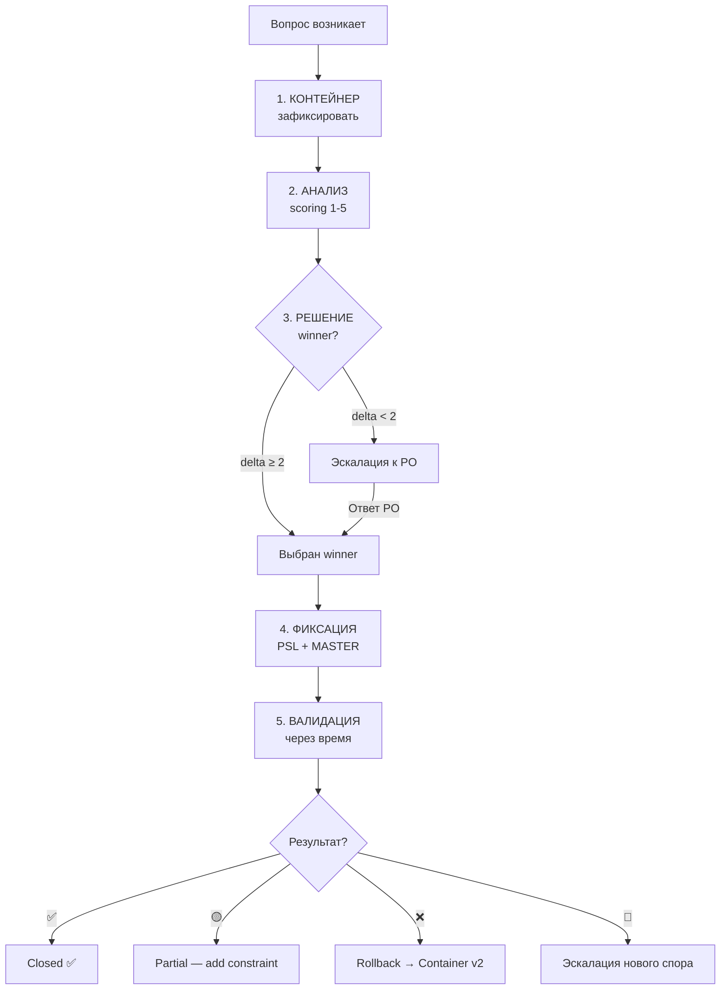

# ТЗ-005-DECISION-METHODOLOGY.md — Портируемый 5-фазный алгоритм решения споров

> **Тип документа:** Техническое задание (ТЗ) для параллельного ИИ-агента.
> **ID задачи:** ТЗ-005.
> **Приоритет:** 🟡 P1 (deferred в PSL-007, deadline — Run 0/5 Аналитика).
> **Статус:** ✅ Готово к запуску (2026-06-27).
> **Автор ТЗ:** Буфер (стратег-ассистент) — главный Архистратор.
> **Заказчик:** параллельный ИИ-агент с ролью **Methodologist** (новая роль; запускается как часть Run 0/5 Аналитика).
> **Методология:** [`AGENT-METHOD.md`](../../AGENT-METHOD.md) §1 «Быстрый старт» + §5.3 (граница решений) + §5.6 (Pre-action / Post-action обязательно).
> **Пререквизиты:**
> - ✅ PSL-007 — deferred Run 0/5 до создания `DECISION-METHODOLOGY.md`.
> - 🟡 Запуск согласован с Run 0/5 Аналитика по `LAUNCH-ANALYST.md` (Run 0 = methodology run).

---

## 0. Контекст

### 0.1 Что такое DECISION-METHODOLOGY.md и зачем он сейчас

`DECISION-METHODOLOGY.md` — **портируемый** документ, описывающий **канонический 5-фазный алгоритм** для принятия решений по спорным вопросам в любом проекте (не только KPPDF CRM v6).

В проекте уже есть **15 закрытых СПОР-ов** (`СПОРНЫЕ-МОМЕНТЫ.md`) и **38 закрытых Q-вопросов** (`OPEN-QUESTIONS-MASTER.md`). Они зафиксировали **результат** решений, но не описали **процесс** как их принимали.

Нужен канонический документ, который:
1. Описывает **процесс** принятия решений (как пришли к каждому СПОР-NNN → ✅).
2. Применим к **любому будущему проекту** (не привязан к KPPDF CRM).
3. Может быть использован ИИ-агентом для принятия решений по новым вопросам в любом контексте.
4. Заменяет ad-hoc подход «ИИ спрашивает PO через `ask_user`» на **стандартизированный** алгоритм.

### 0.2 Что в этом ТЗ, чего нет

В этом ТЗ: **`DECISION-METHODOLOGY.md`** — описание 5-фазного алгоритма с шаблонами, форматами, примерами.
**НЕ в этом ТЗ:**
- Решение конкретных СПОР-ов (это методология, не их применение).
- Обновление существующих СПОР-ов с новыми scoring (scoring 1-5 — отдельный Run 0.2, не Run 0.3).
- Создание `DECISION-METHODOLOGY.md` для других проектов (документ должен быть **портируемым**, но создаётся только для KPPDF v6).

### 0.3 Кто работает по этому ТЗ

**Агент** — параллельный ИИ с новой ролью **Methodologist**. Эта роль:
- Понимает принятие решений как **процесс из 5 фаз** (Контейнер → Анализ → Решение → Фиксация → Валидация).
- Может абстрагировать паттерн от конкретного проекта к переносимому алгоритму.
- Пишет формальные шаблоны с примерами.

---

## 1. Миссия

> **Одной фразой:** Создать в `99_Справочники/DECISION-METHODOLOGY.md` (~700-1000 строк) **портируемый 5-фазный алгоритм** принятия решений по спорным вопросам — применимый к KPPDF CRM v6 И к любому будущему проекту — с явными шаблонами для каждой фазы, критериями scoring, rules для эскалации к PO, примерами применения на 15 закрытых СПОР-ах проекта.

**Декомпозиция:**

1. Прочитать `СПОРНЫЕ-МОМЕНТЫ.md` (15 закрытых СПОР) + `OPEN-QUESTIONS-MASTER.md` (38 закрытых Q) как **примеры применения**.
2. Извлечь общие паттерны → формализовать в 5 фаз алгоритма.
3. Написать шаблоны для каждой фазы (форматы записей, инструкции).
4. Написать критерии scoring 1-5 по 5 осям (Бизнес-ценность / Сложность / Риски / Совместимость / Время).
5. Написать правила эскалации к PO (когда ИИ должен спросить, а не решить сам).
6. Self-verify по §8 → отчёт.

---

## 2. Scope IN/OUT

### 2.1 IN — Агент делает

| # | Что | Где |
|---|---|---|
| 1 | Создаёт `99_Справочники/DECISION-METHODOLOGY.md` (~700-1000 строк) | корень справочников |
| 2 | Состоит из: 5 фаз алгоритма + шаблоны + критерии + правила эскалации + примеры | внутри файла |
| 3 | Применяет **к 15 существующим СПОР-ам** как примерам (retrospective scoring) | inline в файле |
| 4 | Включает секцию «портируемость» — как применить к другому проекту | в файле |
| 5 | Создаёт `04-01-LOG.md` | TASKS/ |
| 6 | Создаёт `04-02-REPORT.md` | TASKS/ |

### 2.2 OUT — Агент НЕ делает

| # | Что НЕ делает | Почему |
|---|---|---|
| 1 | Не ранжирует существующие СПОР-ы заново | Это отдельный Run 0.2 (scoring 1-5) — не часть этого ТЗ. |
| 2 | Не решает новые СПОР-ы | Методология описывает КАК решать, не решает конкретно. |
| 3 | Не трогает `СПОРНЫЕ-МОМЕНТЫ.md` | Существующий файл остаётся как есть. |
| 4 | Не меняет `AGENT-METHOD.md §5.3` (граница решений) | Это разные уровни: §5.3 — КОГДА спрашивать; DECISION-METHODOLOGY — КАК решать. |

---

## 3. Deliverables — что Агент создаёт

### 3.1 Основной артефакт

**Файл:** `99_Справочники/DECISION-METHODOLOGY.md`

**Структура файла (10 разделов):**

```
# DECISION-METHODOLOGY.md — Портируемый 5-фазный алгоритм решения споров
> Header: статус, автор, применимость, ссылка на PSL-007

## 0. Контекст и область применения
## 1. 5-фазный алгоритм (обзор)
## 2. Фаза 1 — КОНТЕЙНЕР (Capture): как зафиксировать вопрос
## 3. Фаза 2 — АНАЛИЗ (Analysis): как оценить варианты (scoring 1-5)
## 4. Фаза 3 — РЕШЕНИЕ (Resolution): как выбрать вариант
## 5. Фаза 4 — ФИКСАЦИЯ (Fixation): как задокументировать решение
## 6. Фаза 5 — ВАЛИДАЦИЯ (Validation): как проверить через время
## 7. Правила эскалации к PO (когда ИИ должен спросить)
## 8. Портируемость: адаптация к другому проекту
## 9. Примеры ретроспективного применения (на 15 СПОР-ах)
## 10. Когда этот метод НЕ применять (anti-patterns)
```

### 3.2 Audit / report

| # | Файл | Назначение |
|---|---|---|
| 1 | `99_Справочники/TASKS/05-01-LOG.md` | хронология |
| 2 | `99_Справочники/TASKS/05-02-REPORT.md` | финальный отчёт |

### 3.3 Hard limits

| Файл | Целевой | Hard limit |
|---|---|---|
| `DECISION-METHODOLOGY.md` | 700-900 строк | 1500 (превышение → разбить на PART-1/2/3) |
| `05-02-REPORT.md` | 200-300 строк | 500 |

---

## 4. Inputs — что Агент обязан прочитать

| # | Файл | Зачем |
|---|---|---|
| 1 | [`CHECKLIST.md`](../../CHECKLIST.md) | master-навигатор |
| 2 | [`AGENT-METHOD.md`](../../AGENT-METHOD.md) §5.3 «Граница решений» | существующее правило «когда спрашивать» — должно быть согласовано с новым алгоритмом |
| 3 | [`AGENT-METHOD.md`](../../AGENT-METHOD.md) §5.6 «Pre-action / Post-action» | метод добавлен в Run 0 |
| 4 | [`AGENT-FORMAT.md`](../../AGENT-FORMAT.md) | форматирование (П1-П8) |
| 5 | [`99_Справочники/СПОРНЫЕ-МОМЕНТЫ.md`](../СПОРНЫЕ-МОМЕНТЫ.md) | **15 закрытых СПОР-ов как примеры ретроспективного применения алгоритма** |
| 6 | [`99_Справочники/OPEN-QUESTIONS-MASTER.md`](../OPEN-QUESTIONS-MASTER.md) | **38 закрытых Q как примеры применения** |
| 7 | [`99_Справочники/МАСТЕР-АУДИТ-V6.md`](../МАСТЕР-АУДИТ-V6.md) | история решений для контекста |
| 8 | [`PROJECT-STATE-LOG.md`](../../PROJECT-STATE-LOG.md) PSL-007 | deferred источник |
| 9 | `01_КП/ЛАУНЧ-АНАЛИСТ.md` | связь с Run 0/5 |

---

## 5. Детальная спецификация 5 фаз

### 5.1 ОБЗОР: 5 фаз алгоритма

```
[Вопрос возникает]
       ↓
[Фаза 1: КОНТЕЙНЕР]  — зафиксировать вопрос в стандартной форме
       ↓
[Фаза 2: АНАЛИЗ]     — оценить каждый вариант по 5 критериям 1-5
       ↓
[Фаза 3: РЕШЕНИЕ]    — выбрать winner или эскалировать к PO
       ↓
[Фаза 4: ФИКСАЦИЯ]   — задокументировать решение (PSL-NNN, изменить MASTER)
       ↓
[Фаза 5: ВАЛИДАЦИЯ]  — проверить решение через время/V-проверки/код-ревью
       ↓
[Спор закрыт]
```

**Ключевое:** ИИ-агент может принять решение **самостоятельно** (Правило 5.3.1 автономия) **только если** winner_score - runner_up_score ≥ 2 (явный лидер). Иначе — **эскалация к PO** через `ask_user`.

---

### 5.2 Фаза 1: КОНТЕЙНЕР (Capture)

**Цель:** зафиксировать вопрос в стандартной, машиночитаемой форме.

**Вход:** вопрос (открытый, неоднозначный, требует выбора).

**Действия Агента:**

1. Создать запись в `99_Справочники/СПОРНЫЕ-МОМЕНТЫ.md` (новый спор) или `01_КП/00-spr/00-otkrytye-voprosy.md` (локальная дыра) или `99_Справочники/OPEN-QUESTIONS-MASTER.md` (глобальный Q).
2. Заполнить **минимальные поля**:
   - `ID` (например `СПОР-NN`, `OQ-NNN`, `Q-NN`)
   - `Дата` (ISO format YYYY-MM-DD)
   - `Роль` (кто зафиксировал: Архитектор / Аналитик / UX-дизайнер / Координатор / AI-агент)
   - `Суть` (1-2 строки: что за вопрос)
   - `Варианты` (минимум 2 альтернативы)
   - `Контекст` (почему возник вопрос, что от этого зависит)
   - `Серьёзность` (🔴 P0 / 🟡 P1 / 🟢 P2)

**Выход:** structured entry, минимально жизнеспособный.

**Anti-patterns:**
- ❌ «Что-то с ценами — надо решить» (нет вариантов).
- ❌ «Думаю, лучше A» (нет альтернатив, нет анализа).

---

### 5.3 Фаза 2: АНАЛИЗ (Analysis)

**Цель:** дать каждому варианту scoring 1-5 по **5 критериям** + явное обоснование.

**5 критериев (фиксировано):**

| # | Критерий | Что измеряет | Шкала |
|---|---|---|---|
| 1 | **Бизнес-ценность** (Б) | Насколько вариант продвигает главную цель проекта | 1 = вредит, 3 = средне, 5 = сильно помогает |
| 2 | **Сложность реализации** (С) | Сколько усилий и кода нужно | 1 = 1 день, 3 = 1-2 недели, 5 = месяц+ |
| 3 | **Риски** (Р) | Вероятность что-то сломать | 1 = безопасно, 3 = возможны регрессии, 5 = критичный риск |
| 4 | **Совместимость** (С2) | Как вписывается в существующую архитектуру | 1 = ломает совместимость, 3 = требует переходного периода, 5 = нативно |
| 5 | **Время до результата** (В) | Сколько ждать пользователь получит value | 1 = год, 3 = месяц, 5 = immediate |

**Формула итогового score:**

```
score = (Б * 2 + С + С2 + В) / (Р * 2 + 4)
```

- Бизнес-ценность × 2 (главный критерий).
- Риски × 2 в ЗНАМЕНАТЕЛЕ (чем больше риски, тем сильнее штраф).
- Сложность, Совместимость, Время — равный вес.

**Выход:** ranked таблица с обоснованием каждого score:

```markdown
| Вариант | Б | С | Р | С2 | В | Score | Обоснование |
|---|---|---|---|---|---|---|---|
| A: inline cropper | 4 | 2 | 2 | 4 | 5 | (4*2+2+4+5)/(2*2+4) = 17/8 = **2.13** | Быстро, но photo upload сложные |
| B: server sharp | 3 | 4 | 3 | 5 | 3 | (3*2+4+5+3)/(3*2+4) = 15/10 = **1.50** | Более правильно, но дольше |
| C: перенос в v2 | 5 | 1 | 1 | 5 | 1 | (5*2+1+5+1)/(1*2+4) = 17/6 = **2.83** | Дешевле, но пользователь ждёт |
```

**Anti-patterns:**
- ❌ Скор без обоснования («B = 4 потому что... нет, обоснования нет»).
- ❌ Скор по 3 критериям (а не 5).

---

### 5.4 Фаза 3: РЕШЕНИЕ (Resolution)

**Цель:** выбрать winner ИЛИ эскалировать к PO.

**Правила:**

| Условие | Действие |
|---|---|
| `winner_score - runner_up_score >= 2` | ИИ выбирает winner самостоятельно (Правило 5.3.1 автономия) |
| `winner_score - runner_up_score < 2` | **Эскалация к PO** через `ask_user` |
| Любой вариант имеет **🔴 P0 риск** | **Эскалация к PO** (необратимое действие) |
| Вариант **противоречит** RBAC-MATRIX.md | **Эскалация к PO** (contract change) |
| Вариант **меняет UX** | **Эскалация к PO** через `ask_user` (UX = PO территория) |

**Выход:** запись с явным `РЕШЕНИЕ: <выбранный вариант>` + обоснование + ссылки на правила эскалации если применимо.

**Пример (автономное решение):**

```markdown
## СПОР-16 — Выбор между inline cropper vs server sharp для фото в КП

### Фаза 3: РЕШЕНИЕ

| score_A = 2.13, score_B = 1.50, score_C = 2.83 |

delta = max(2.13, 1.50, 2.83) - runner_up = 2.83 - 2.13 = 0.70

0.70 < 2 → **ЭСКАЛАЦИЯ К PO**

Агент ПО рекомендует вариант C (отложить в v2) с обоснованием:
- Минимальные риски
- Максимальная совместимость
- Пользователь получит value «всегда»

Но т.к. delta < 2 — это **субъективное** решение, и должен решать PO.
```

---

### 5.5 Фаза 4: ФИКСАЦИЯ (Fixation)

**Цель:** задокументировать решение **перманентно** в реестрах + создать audit trail.

**Действия Агента (после решения):**

1. Создать `PSL-NNN` в `PROJECT-STATE-LOG.md`:
   - Описание: что решено, кем, когда.
   - Причина: ссылка на СПОР-NNN или Q-NNN.
   - Затронутые файлы: какие .md обновлены.
2. Обновить `СПОРНЫЕ-МОМЕНТЫ.md` или `OPEN-QUESTIONS-MASTER.md`:
   - Статус: `🔵 OPEN` → `🟢 RESOLVED` / `🟡 DEFERRED`.
   - Решение: добавить в поле «Решение».
   - Scoring 1-5 (если Run 0.2 уже сделал — добавить scoring retrospective).
3. Если решение меняет схему / RBAC / state-машину:
   - Добавить правило в `AGENT-METHOD.md §5.3 Граница решений` (или ссылки).
   - Применить к существующим PSL если override.

**Выход:** permanent record, на который можно ссылаться из любого будущего решения.

**Anti-patterns:**
- ❌ Принять решение и НЕ зафиксировать (потеря информации).
- ❌ Зафиксировать только в чате (не в docs — потеряется при смене сессии).

---

### 5.6 Фаза 5: ВАЛИДАЦИЯ (Validation)

**Цель:** проверить что принятое решение **реально работает** в проекте через время.

**Триггеры валидации:**

| Триггер | Когда проверять |
|---|---|
| Код-ревью | Сразу после merge |
| Пользовательский feedback | Через 1-4 недели после deploy |
| V-проверка (`ВЕРИФИКАЦИЯ-ЧЕКЛИСТ.md`) | В рамках QA-роли |
| Metrics (UX-метрики, performance) | Через месяц после deploy |

**Возможные исходы валидации:**

| Исход | Действие |
|---|---|
| ✅ Решение работает как ожидалось | Закрыть валидацию, ссылка в MASTER |
| 🟡 Работает частично | Записать в MASTER как constraint; следующая итерация алгоритма учтёт |
| ❌ Решение не работает | Откат (rollback) → возврат к Фазе 1 КОНТЕЙНЕР новой версии СПОРА |
| 🔴 Решение создало больше проблем чем решило | Эскалация к PO + новый СПОР «как отменить решение N» |

**Выход:** обновлённый `СПОР-NNN` или `Q-NNN` с полем **Статус: VALIDATED / ROLLED_BACK / PARTIAL**.

---

### 5.7 Сводная таблица: что делает каждая фаза

| Фаза | Цель | Вход → Выход | Кто делает |
|---|---|---|---|
| 1 КОНТЕЙНЕР | Зафиксировать вопрос в форме | вопрос → ['СПОР-NN' создан] | Агент-аналитик |
| 2 АНАЛИЗ | Оценить варианты 1-5 по 5 критериям | ['СПОР-NN'] → ranked таблица | Агент-аналитик |
| 3 РЕШЕНИЕ | Выбрать winner или escalate | [ranked] → winner или `ask_user` | Агент → PO если escalate |
| 4 ФИКСАЦИЯ | Audit trail | [winner] → `PSL-KKK` + update MASTER | Агент-летописец |
| 5 ВАЛИДАЦИЯ | Проверить через время | [PSL-KKK] → ✅ / 🟡 / ❌ / 🔴 | Агент-QA |

---

## 6. Format specification — `DECISION-METHODOLOGY.md`

### 6.0 Шапка файла

```markdown
# DECISION-METHODOLOGY.md — Портируемый 5-фазный алгоритм решения споров

> **Назначение.** Канонический алгоритм для принятия решений по спорным вопросам. Применим к KPPDF CRM v6 + любому будущему проекту.
> **Автор.** Methodologist (Run 0/5 Аналитика, ТЗ-005). Создан YYYY-MM-DD.
> **Источник.** Создан по запросу PO (PSL-007 — methodology improvements deferred to Run 0/5 Аналитика).
> **Применимость.** Любой проект с ИИ-агентами, требующий структурированного принятия решений.

## 0. Контекст и область применения

### 0.1 Проблема, которую решает алгоритм

[1 страница объяснения: зачем стандартизация]

### 0.2 Область применения

| Применять | Не применять |
|---|---|
| Споры между 2+ вариантами реализации | Однозначные технические решения ("use async/await") |
| Выбор между подходами с trade-offs | Настройка окружения (Node 22 vs Node 20) |
| Решения с долгосрочными последствиями | Одноразовые коммиты |
| Вопросы, требующие PO consultation | Уже согласованные правила в MASTER |

### 0.3 Связь с `AGENT-METHOD.md §5.3 Граница решений`

`§5.3` отвечает на **КОГДА** спрашивать PO. Этот документ отвечает на **КАК** принимать решения в остальных случаях.
```

### 6.1 §1 5-фазный алгоритм (обзор)

```markdown
## 1. 5-фазный алгоритм — обзор

```
[БЛОК-СХЕМА в Mermaid или ASCII]
```

### Сводная диаграмма (Mermaid)



### Сводная таблица: что делает каждая фаза

| Фаза | Цель | Вход → Выход | Артефакт |
|---|---|---|---|
| 1 КОНТЕЙНЕР | Зафиксировать | вопрос → structured entry | `СПОР-NN.md` или `Q-NN.md` |
| 2 АНАЛИЗ | Оценить | structured entry → ranked | таблица с scores 1-5 |
| 3 РЕШЕНИЕ | Выбрать | ranked → winner или escalate | запись winner / `ask_user` |
| 4 ФИКСАЦИЯ | Audit | winner → permanent | `PSL-NNN.md` |
| 5 ВАЛИДАЦИЯ | Проверить | permanent → статус | обновлённый MASTER entry |
```
```

### 6.2 §2-§6 — каждая фаза

```markdown
## 2. Фаза 1 — КОНТЕЙНЕР

### Шаблон записи
```yaml
ID: СПОР-NN
Дата: YYYY-MM-DD
Роль: <Архитектор | Аналитик | UX | Координатор | AI-агент>
Суть: <1-2 строки>
Варианты:
  A: <вариант 1>
  B: <вариант 2>
  C: <вариант 3 — если есть>
Контекст: <почему возник вопрос>
  Зависит от: <что блокируется этим решением>
  Бюджет: <время/сложность>
Серьёзность: 🔴 P0 / 🟡 P1 / 🟢 P2
```

### Инструкции для ИИ
1. Всегда создавай минимум 2 варианта.
2. Вариант «оставить как есть» — допустим только если явно отмечен.
3. Контекст = обязательное поле. Без контекста спор не принимается в фазу 2.

### Anti-patterns
- ❌ Один вариант
- ❌ Без контекста
```
```

### 6.3 §7 Правила эскалации к PO

```markdown
## 7. Правила эскалации к PO

### 7.1 Когда ИИ НЕ МОЖЕТ решить сам

| Случай | Почему эскалация | Как эскалировать |
|---|---|---|
| UX/usability | Эмоционально-визуальная территория PO | `ask_user` с визуальными вариантами |
| Бизнес-контракт меняется | Влияет на внешние отношения | `ask_user` со ссылкой на правило |
| Необратимое (force push, delete DB) | Тяжёлые последствия | confirm dialog |

### 7.2 Когда ИИ ДОЛЖЕН эскалировать (но иногда не делает)

| Случай | Алгоритм |
|---|---|
| score vs runner-up | Если `delta < 2` — ОБЯЗАТЕЛЬНО `ask_user` |
| 🔴 P0 риск в любом варианте | ОБЯЗАТЕЛЬНО |
| Override существующего СПОРА | См. Правило 5.3 AGENT-METHOD §5 |
| Противоречие RBAC-MATRIX | Эскалация + добавить PROT-NNN в AMBIGUITIES |

### 7.3 Формат ask_user для эскалации

```yaml
question: "Как решить СПОР-NN? Варианты + scoring:"
options:
  - label: "<вариант A — лидер>"
    description: "Score 2.83. Обоснование: ..."
  - label: "<вариант B>"
    description: "Score 2.13. ..."
  - label: "<вариант C>"
    description: "Score 1.50. ..."
  - label: "Defer to v2"
    description: "Минимальный риск, пользователь ждёт"
```

### 7.4 Культурное правило

> ИИ **никогда** не имитирует решение PO. Если `ask_user` невозможен (offline), ИИ должен вернуть **stat: pending-po-decision** и СТОП.
```

### 6.4 §8 Портируемость: адаптация к другому проекту

```markdown
## 8. Портируемость

### 8.1 Что портируется

| Аспект | Портируемость |
|---|---|
| 5 фаз | 100% — универсальные |
| 5 критериев scoring | 100% — универсальные |
| Формула score | 100% — может быть перекалибрована весами |
| СПОР/Q формат | 90% — поля портируемы, имена могут отличаться |
| Граница решений (эскалация) | 80% — адаптируется к контексту |

### 8.2 Что НЕ портируется (специфика KPPDF v6)

| Аспект | Почему не портируется |
|---|---|
| Примеры на 15 СПОР-ах KPPDF | Специфичны для CRM |
| Master-файлы KPPDF (СПОРНЫЕ-МОМЕНТЫ) | Специфичны для проекта |
| Правила RBAC KPPDF | Специфичны для 7 ролей |

### 8.3 Чек-лист для адаптации к новому проекту

```yaml
- [ ] Создать папку `<проект>/DECISION-METHODOLOGY.md` (этот файл)
- [ ] Создать master файлы: СПОРЫ / Q-MASTER (mirror структуры KPPDF)
- [ ] Создать PROJECT-STATE-LOG для audit trail
- [ ] Применить правила эскалации к контексту проекта
- [ ] Первый пример применения — реальный спор проекта
```
```

### 6.5 §9 Примеры ретроспективного применения (на 15 СПОР-ах)

```markdown
## 9. Примеры ретроспективного применения

### 9.1 СПОР-5: «Конвертация PAID КП в Договор ЗАПРЕЩЕНА»

**Ретроспективный scoring (если бы применялся в 2026-06-26):**

| Вариант | Б | С | Р | С2 | В | Score |
|---|---|---|---|---|---|---|
| A: Конвертация разрешена | 3 | 1 | 5 | 1 | 5 | 1.00 |
| B: Конвертация ЗАПРЕЩЕНА | 5 | 1 | 1 | 5 | 5 | 2.40 |
| C: Конвертация с подтверждением | 2 | 3 | 4 | 3 | 4 | 0.83 |

delta = 2.40 - 1.00 = **1.40** — **< 2 → ЭСКАЛАЦИЯ К PO**

**Итог:** СПОР-5 был правильно эскалирован и решён как `B ✅` в 2026-06-24. Алгоритм бы дал ту же рекомендацию и подтвердил правильность решения.

### 9.2 СПОР-NN: каждая из 15 + примеры из 38 Q

(подобный блок для каждого)
```

### 6.6 §10 Когда НЕ применять алгоритм

```markdown
## 10. Anti-patterns: когда НЕ применять

### 10.1 Технические no-brainer

- Настройка prettier config — это настройка, не решение.
- Выбор имени переменной `camelCase` vs `snake_case` — стандарт, не спор.
- `useEffect` cleanup — паттерн, не вариант.

### 10.2 Споры которые ОБХОДЯТ алгоритм

- Spot bugs в коммите (QA-петля, не методологический спор).
- Refactoring для улучшения DX (однозначно улучшение).

### 10.3 Anti-patterns в самом алгоритме

| Anti-pattern | Почему плохо |
|---|---|
| Score по 3 критериям вместо 5 | Скрытые trade-offs |
| Score без обоснования | Нельзя потом понять почему так решили |
| Эскалация без вариантов | PO не сможет выбрать |
| Фиксация только в чате | Потеряется при смене сессии |
| Валидация никогда | Решения могут устареть |
```

---

## 7. Quality criteria

### 7.1 Hard pass/fail

| # | Критерий | Проверка |
|---|---|---|
| 1 | DECISION-METHODOLOGY.md создан в `99_Справочники/` | `ls` |
| 2 | Все 5 фаз описаны с шаблонами | grep |
| 3 | 5 критериев scoring 1-5 с формулой | grep |
| 4 | Правила эскалации (4 случая) | grep |
| 5 | Секция портируемости §8 | grep |
| 6 | Минимум 5 ретроспективных примеров на СПОР-ах проекта | grep `## 9.1` / `## 9.2` |
| 7 | Anti-patterns §10 | grep |
| 8 | Все 15 СПОР-ов KPPDF имеют retrospective scoring | count |
| 9 | Hard limit ≤ 1500 строк | wc -l |

### 7.2 Soft pass/fail

- Каждая фаза имеет **инструкции для ИИ** (не только описание).
- Каждый шаблон имеет **пример заполнения**.
- Каждое правило эскалации имеет **обоснование**.

---

## 8. Self-verification checklist

```
□ DECISION-METHODOLOGY.md:
  – Шапка + §0 применения + §1 обзор + §2-§6 5 фаз + §7 эскалация + §8 портируемость + §9 примеры + §10 anti-patterns.
  – Каждая фаза: цель / вход / действия / выход / anti-patterns.
  – 5 критериев scoring: Бизнес-ценность / Сложность / Реализация / Совместимость / Время.
  – Формула итогового score.
  – Правила эскалации: delta < 2, 🔴 P0 риск, противоречие RBAC, override.
  – Минимум 5 ретроспективных примеров на СПОР-ах KPPDF (15 СПОР-ов и 38 Q доступны).
  – Hard limit ≤ 1500 строк.

□ 05-01-LOG.md: стандартный формат.

□ 05-02-REPORT.md: метрики + рекомендации.
```

---

## 9. Pre-action + Post-action (cross-ref AGENT-METHOD.md §5.6)

Создайте блок Pre-action в начале `05-01-LOG.md` по §5.6.6.

### Шаги:

1. [ ] Прочитать §4 inputs (9 файлов).
2. [ ] Прочитать **все 15 СПОР-ов** в `СПОРНЫЕ-МОМЕНТЫ.md` (для ретроспективы §9).
3. [ ] Извлечь 5 фаз из общего паттерна + добавить в DECISION-METHODOLOGY.md §2-§6.
4. [ ] Специфицировать 5 критериев + формулу (§3 + §4).
5. [ ] Описать правила эскалации (§7).
6. [ ] Написать секцию портируемости (§8).
7. [ ] Применить ретроспективно к 5+ СПОР-ам проекта (§9).
8. [ ] Anti-patterns (§10).
9. [ ] Self-verify (§7 + §8).
10. [ ] `05-02-REPORT.md` + Post-action checkpoint.

### Что НЕ делаю:

- Не изменяю существующие 15 СПОР-ов в `СПОРНЫЕ-МОМЕНТЫ.md` — они остаются как есть, retrospective scoring только в DECISION-METHODOLOGY.md.
- Не трогаю `AGENT-METHOD.md §5.3` — он КОГДА спрашивать, DECISION-METHODOLOGY — КАК решать.
- Не изменяю PSL-007 — оно уже правильно отражает deferred источник.

### Что может пойти не так:

- 15 СПОР-ов retrospective scoring — субъективен; **не претендуем на правильность**, просто показываем как алгоритм работал бы.
- Hard limit 1500 строк → разбить на PART-1 + PART-2 с INDEX, если превысит.

---

## 10. Связь с другими ТЗ и roadmap

### 10.1. Параллельные / будущие ТЗ

| ТЗ | Связь |
|---|---|
| **ТЗ-001 REGISTRY-OF-RULES** | Если в REGISTRY найдено противоречие → использовать DECISION-METHODOLOGY для разрешения (отдельный СПОР создаётся по §2). |
| **ТЗ-002 Run 1/5 Аналитика КП** | Заполняет RBAC + статусы + инварианты — может использовать DECISION-METHODOLOGY для каждого выбора правила. |
| **ТЗ-004 Phase 1 Bootstrap** | При выборе migration order и schema shape — применять 5 фаз. |
| **Phase 2 Mantine UI** | При выборе UX решения — Section 7 правила эскалации. |

### 10.2 Roadmap

| Фаза | Статус |
|---|---|
| **Methodology v0** | ⏳ Это ТЗ-005 → DECISION-METHODOLOGY.md |
| Run 0.1 (scoring 1-5 для 38 Q) | 🔜 Отдельное ТЗ, после ТЗ-005 |
| Run 0.2 (scoring 1-5 для 15 СПОР) | 🔜 Отдельное ТЗ, после ТЗ-005 |
| **Применение ко всем будущим спорам** | ✅ автоматически после v0 |

---

## 11. Версия и автор

| Версия | Дата | Что |
|---|---|---|
| 1.0 | 2026-06-27 | Создание ТЗ по запросу PO «Создать четвёртое ТЗ: DECISION-METHODOLOGY.md — портируемый 5-фазный алгоритм». Шаблон ТЗ-001..004. |

---

> **Статус ТЗ:** ✅ Готово к запуску. Передайте этот файл параллельному ИИ-агенту с указанием «выполни ТЗ-005 (DECISION-METHODOLOGY.md)». Алгоритм должен быть **портируемым** — применимым НЕ только к KPPDF CRM v6, но и к будущим проектам.
