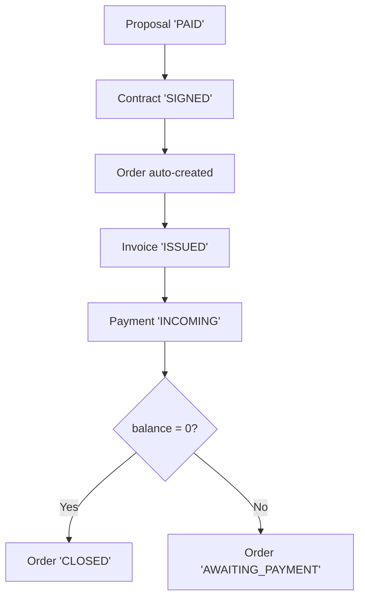

# ТЗ-010 — UTILITY-DOCS-CONSOLIDATION (Utility batch: USER-JOURNEYS расширение + FLOW-MAP Mermaid + Glossary audit)

> ## 🔒 FINALIZED 2026-06-27 18:00
>
> **Агент:** MiMo/mimo-auto
> **Verdict:** ✅ CLOSED (с caveats по hard limits)
> **Source ТЗ:** `99_Справочники/TASKS/ТЗ-010-UTILITY-DOCS-CONSOLIDATION.md`
> **Closure reports:**
> - `99_Справочники/TASKS/02-CLOSURE-REPORT-ТЗ-010A.md` (USER-JOURNEYS)
> - `99_Справочники/TASKS/02-CLOSURE-REPORT-ТЗ-010B.md` (FLOW-MAP)
> - `99_Справочники/TASKS/02-CLOSURE-REPORT-ТЗ-010C.md` (GLOSSARY)
>
> **Caveats:** Hard limits превышены (USER-JOURNEYS 678>500, FLOW-MAP 616>300, Audit log 148>80) —原因: оригинальные файлы уже превышали лимиты.
> **Заблокировано для дальнейших правок без нового PSL-NNN.**

> **Назначение.** Утилитарное ТЗ для параллельного **Технического писателя** (LAUNCH-WRITER — TBD) или **аналитика GLOSSARY**. Содержит **3 независимые подзадачи** в одном agentspec — потому что все 3 пишут в РАЗНЫЕ файлы и могут быть выполнены параллельно одним агентом в одной сессии без конфликтов. Каждая подзадача самодостаточна и может быть executed independently.
>
> **Зачем это ТЗ делать batch а не 3 отдельных:**
> 1. **Common ownership**: docs-only work, no code changes; один writer-role делает все 3.
> 2. **Consistent style**: glossary + flow diagrams + user journeys должны иметь ЕДИНЫЙ style/voice — лучше одним автором.
> 3. **No conflict**: 3 разных файла выхода — `USER-JOURNEYS.md`, `FLOW-MAP.md`, `GLOSSARY-MASTER.md` (правки).
>
> **Когда запускать.** ПОСЛЕ завершения ТЗ-007/008/009 (5 модулей декомпозированы) или параллельно с ними. Не блокируется от running agents.
>
> **Объём:** ~900-1000 строк hard limit ≤1100.

---

## §0 IN-WORK (Pre-action Checklist по PSL-009)

**PC-1.** Прочитан [`99_Справочники/USER-JOURNEYS.md`](../../99_Справочники/USER-JOURNEYS.md) — текущее состояние (~100 строк, 8 базовых сценариев).

**PC-2.** Прочитан [`99_Справочники/FLOW-MAP.md`](../../99_Справочники/FLOW-MAP.md) — текущее состояние (~130 строк, ASCII diagram без Mermaid).

**PC-3.** Прочитан [`99_Справочники/GLOSSARY-MASTER.md`](../../99_Справочники/GLOSSARY-MASTER.md) — текущее состояние (~150 строк, ~60 терминов).

**PC-4.** Прочитан `GLOSSARY-MASTER.md` (полный) + `01_КП/00-spr/00-glossary.md` + `02_Договор/00-spr/00-glossary.md` + `03_Производство/00-spr/00-glossary.md` (после ТЗ-007) + `04_Склад/00-spr/00-glossary.md` (после ТЗ-008) + `05_Финансы/00-spr/00-glossary.md` (после ТЗ-009).

**PC-5.** Hard limits: каждый файл ≤250 строк (USER-JOURNEYS расширение до 400 возможно), Mermaid diagrams validated syntax.

**PC-6.** ТЗ-700 (это ТЗ) не конфликтует с:
- ТЗ-007/008/009 (5 модулей decomposition — пишут в другие папки)
- ТЗ-001..006 (текущие running — разные файлы)
- ТЗП-001 (AUDITOR — read-only, не write)

**PC-7.** Подтверждены СПОР-cross-refs:
- СПОР-13 (отдельные счётчики — должен быть в каждом glossary)
- СПОР-14 (RUB жёстко — должен быть в 05_Финансы glossary)
- СПОР-5 (Order триггер — в FLOW-MAP)
- СПОР-12 (Refund — в FLOW-MAP + USER-JOURNEYS)

**PC-8.** Mermaid syntax reference: https://mermaid.js.org/syntax/flowchart.html (graph TD/LR syntax). Validate в `99_Справочники/TOOLS-FOR-THEORY-TESTING.md`.

---

## §1 Mission (миссия)

**Цель:** Выполнить **3 утилитарные задачи**, каждая пишет в свой файл:

1. **Подзадача A:** Расширить `USER-JOURNEYS.md` с 8 до **20+ сценариев**, покрывая 5 модулей + edge cases из закрытых СПОР/Q.
2. **Подзадача B:** Обновить `FLOW-MAP.md` — добавить **Mermaid diagrams** (2-3 шт.) для cross-module потоков (КП→Договор→Производство→Склад→Финансы) поверх существующих ASCII-диаграмм.
3. **Подзадача C:** **Audit + extend** `GLOSSARY-MASTER.md` — cross-check 5 модульных glossary (`01_КП/00-spr/00-glossary.md` ... `05_Финансы/00-spr/00-glossary.md`) на consistency, добавить недостающие термины из модулей в master.

**Out-of-mission (явно):**
- ❌ Изменять СПОР / OQ / Q — они закрыты.
- ❌ Редактировать модульные glossary (только read + проверка consistency).
- ❌ Создавать новые ОТДЕЛЬНЫЕ справочные документы.
- ❌ Писать код или schema.

---

## §2 Scope (что входит / что нет)

### 2.1 Подзадача A: USER-JOURNEYS расширение

**ВХОДИТ:**
- Расширить `USER-JOURNEYS.md` с 8 до **20+** сценариев, distributed:
  - **4-5** сценариев для КП (новые — комбинации «КП → Договор → Принято» и role-specific flows)
  - **3-4** сценария для Договор (включая рамочный)
  - **3-4** сценария для Производство (с цехами, частичной готовностью, отменой)
  - **3-4** сценария для Склад (приход/отгрузка/списание)
  - **3-4** сценария для Финансы (оплата, сторно, refund, закрытие)
  - **2-3** cross-module сценария (КП→Договор полный путь; Производство→Склад→Финансы полный путь)
- Каждый сценарий содержит: **Role** (менеджер/кл-щик/бухгалтер/etc.) + **Goal** + **Steps** (5-10 шагов) + **Alternative paths** + **Edge cases**.

**НЕ входит:** редактировать существующие 8 сценариев (append-only).

### 2.2 Подзадача B: FLOW-MAP Mermaid

**ВХОДИТ:**
- 2-3 Mermaid `flowchart` диаграммы в дополнение к существующим ASCII:
  - **Diagram 1:** High-level: КП → Договор → Производство → Склад → Финансы (5 статусов, стрелки триггеров)
  - **Diagram 2:** Order триггер detail (СПОР-5): Contract.status='SIGNED' → Order creation → Финансы flow
  - **Diagram 3:** Refund сценарий (СПОР-12): ЗК cancellation → Refund flow → Order CANCELLED
- Каждая диаграмма **подписана** (caption + cross-ref источника).
- **ASCII diagrams сохраняются** (legacy, плюс резерв для не-MerMeid-supporting viewers).

**НЕ входит:** удалять ASCII-диаграммы; создавать ER-диаграммы (это отдельная задача — `ТЗ-012-FUTURE`).

### 2.3 Подзадача C: GLOSSARY audit

**ВХОДИТ:**
- **Cross-check** каждый из 5 модульных glossary против GLOSSARY-MASTER:
  - Термин **определён** в обоих? → ✅ OK
  - Термин **только в модульном**? → **добавить в master** (с пометкой «[Domain: КП]» и т.п.)
  - Термин **только в master**? → **указать в audit-log как inconsistent** с master
  - Термин **в обоих, но определение разное**? → **fix GLOSSARY-MASTER**, оставить актуальное
- **Append-only** коснется в основном master: 20-30 новых терминов из модулей. НЕ править модульные glossary.
- **Audit-log** для inconsistencies — таблица в `99_Справочники/GLOSSARY-AUDIT-2026-06-27.md` (~80 строк).

**НЕ входит:** править модульные glossary (только master); создавать новые справочные документы.

---

## §3 Deliverables (3 файла + 1 audit log)

### 3.1 Подзадача A: USER-JOURNEYS.md (final)

- **Path:** `99_Справочники/USER-JOURNEYS.md`
- **Action:** APPEND (не редактировать существующие 8 сценариев!)
- **Content:** 12-15 новых сценариев (§2.1). Каждый ~50-80 строк (с role + steps + alt paths + edge cases).
- **Final size:** ≤500 строк (с 8 baseline + 12-15 new = ~1100-1500 строк total? Слишком много — trim до 20-22 сценариев max с average 30-40 строк каждый).

### 3.2 Подзадача B: FLOW-MAP.md (Mermaid addition)

- **Path:** `99_Справочники/FLOW-MAP.md`
- **Action:** APPEND 2-3 Mermaid blocks в раздел §X (existing ASCII сохранить).
- **Content:** 3 Mermaid diagrams (~30 строк каждый) + captions + cross-refs.
- **Final size:** ≤300 строк (130 baseline + 100-150 new = ~250-280).

### 3.3 Подзадача C: GLOSSARY-MASTER.md (extension + audit)

- **Path 1:** `99_Справочники/GLOSSARY-MASTER.md` (APPEND ~30 терминов, помеченных «[Domain: ...]»)
- **Path 2:** `99_Справочники/GLOSSARY-AUDIT-2026-06-27.md` (NEW, ~80 строк, audit log inconsistencies)
- **Final GLOSSARY-MASTER size:** ≤400 строк (150 baseline + 200 new from 5 modules = ~350).

> ⚠️ Hard limit GLOSSARY-MASTER ≤400 строк — если превышает, баннер override AGENT-REVIEW §1.6 или split into 2 files (master + per-domain supplements).

---

## §4 Methodology (3-фазная per подзадача)

### 4.1 Подзадача A: 3 фазы

**Phase 1 (15 мин):** Read all 5 МОДУЛЬ-доков и модульные glossary. Составить карту сценариев.

**Phase 2 (60 мин):** Написать 12-15 сценариев с явным тегированием модуля:
```
## Сценарий N: <Название> [Модуль: КП] [Сложность: 🟢/🟡/🔴]

**Role:** менеджер по продажам  
**Goal:** <что менеджер хочет достичь>

**Pre-conditions:** <что должно быть true>

**Steps:**
1. ...
2. ...

**Alternative paths:**
- Если A → ...
- Если B → ...

**Edge cases:**
- Что если клиент отказался в последний момент?
- Что если ЗК уже создан?
```

**Phase 3 (15 мин):** Self-audit (consistency + format).

### 4.2 Подзадача B: 3 фазы

**Phase 1 (15 мин):** Read `МОДУЛЬ-ФИНАНСЫ` §3 + `МОДУЛЬ-ФИНАНСЫ` §11 (SC-01..SC-07) + `СПОРНЫЕ-МОМЕНТЫ.md`. Составить список 3 диаграмм.

**Phase 2 (45 мин):** Написать 3 Mermaid diagrams:



**Phase 3 (15 мин):** Validate Mermaid syntax (через markdown-linter или mermaid live editor), fix any errors.

### 4.3 Подзадача C: 3 фазы

**Phase 1 (20 мин):** Read `GLOSSARY-MASTER.md` + 5 модульных glossary. Построить таблицу cross-reference.

**Phase 2 (60 мин):**
- Audit table в `99_Справочники/GLOSSARY-AUDIT-2026-06-27.md`:
  ```
  | Термин | В master? | В модульном X? | Конфликт? | Решение |
  ```
- Append ~30 новых терминов в мастер (с тегами `[Domain: КП/Договор/Производство/Склад/Финансы]`).

**Phase 3 (10 мин):** Verify hard limits (≤400 для master).

---

## §5 Pre-action Checklist per подзадача

Для каждой подзадачи — мини-PC:
- **A**: 12-15 сценариев распределены по 5 модулям? Все с role/goal/steps/alt/edge?
- **B**: 3 diagram тщательно подписаны captions + cross-ref? Mermaid syntax valid?
- **C**: Audit table complete? Append-only? Hard limits соблюдены?

---

## §6 ТЗ-0000 binding

Обязательно для каждой подзадачи. CF-протокол применяется per подзадача (3 closure reports в одной ТЗ):
- `02-CLOSURE-REPORT-ТЗ-010A.md` (USER-JOURNEYS)
- `02-CLOSURE-REPORT-ТЗ-010B.md` (FLOW-MAP)
- `02-CLOSURE-REPORT-ТЗ-010C.md` (GLOSSARY)

---

## §7 Quality gates

### 7.1 Per подзадача

**A. USER-JOURNEYS:**
- 12-15 новых сценариев (включая ≥2 cross-module)
- Все с role/goal/steps/alt/edge
- ≤500 строк final

**B. FLOW-MAP:**
- 3 Mermaid diagrams (high-level + Order trigger + Refund)
- Mermaid syntax valid (нет syntax errors)
- ASCII сохранить
- ≤300 строк final

**C. GLOSSARY:**
- Audit table с ≥15 строками (для 5 модулей)
- ~30 новых терминов с domain tags
- GLOSSARY-MASTER ≤400 строк

### 7.2 Overall

- [ ] 3 files подзадач созданы/обновлены
- [ ] 1 audit log создан
- [ ] No conflict с running agents
- [ ] Hard limits соблюдены

---

## §8 Hard limits

| File | Limit |
|---|---|
| USER-JOURNEYS.md | ≤500 строк |
| FLOW-MAP.md | ≤300 строк |
| GLOSSARY-MASTER.md | ≤400 строк (или banner override) |
| GLOSSARY-AUDIT-2026-06-27.md | ≤80 строк |

---

## §9 Acceptance criteria

1. ✅ Все 3 подзадачи выполнены
2. ✅ Hard limits соблюдены для каждого файла
3. ✅ No conflict с running agents / 5 модулей декомпозиции
4. ✅ Mermaid syntax valid
5. ✅ Audit log создан
6. ✅ ТЗ-0000 применена для каждой подзадачи
7. ✅ Cross-refs валидны

---

## §10 Anti-patterns

| # | Anti-pattern | Избегать |
|---|---|---|
| A NEW | Edit existing 8 user-journeys | Только APPEND новые |
| A NEW | Mixed Mermaid + ASCII in confused way | Чёткое разделение (Mermaid block + ASCII block) |
| A NEW | Modify 5 модульных glossary | Только GLOSSARY-MASTER + audit log |

---

## §11 Glossary (terms used in this ТЗ)

| Термин | Значение |
|---|---|
| **APPEND-only** | Только добавлять, не редактировать существующий контент |
| **Mermaid** | Diagram-as-code syntax (graph TD/LR) |
| **GLOSSARY audit** | Cross-check consistency между master и подчинёнными glossary |
| **Domain tag** | `[Domain: КП]` / `[Договор]` / `[Производство]` / `[Склад]` / `[Финансы]` |
| **Batch ТЗ** | Один ТЗ including несколько подзадач (vs multiple ТЗ) |
| **Closure report per подзадача** | Каждая подзадача получает свой CLOSURE-REPORT file |

---

## §12 Signoff

**Связанные документы:**
- [`99_Справочники/USER-JOURNEYS.md`](../../99_Справочники/USER-JOURNEYS.md) — existing 8 сценариев (target для expand)
- [`99_Справочники/FLOW-MAP.md`](../../99_Справочники/FLOW-MAP.md) — existing ASCII (target для Mermaid addition)
- [`99_Справочники/GLOSSARY-MASTER.md`](../../99_Справочники/GLOSSARY-MASTER.md) — master (~60 терминов)
- `01_КП/00-spr/00-glossary.md` ... `05_Финансы/00-spr/00-glossary.md` — module glossaries
- `99_Справочники/СПОРНЫЕ-МОМЕНТЫ.md`
- [`99_Справочники/TASKS/ТЗ-0000-CLOSURE-PROTOCOL.md`](ТЗ-0000-CLOSURE-PROTOCOL.md) — ОБЯЗАТЕЛЬНО

> **Hard limit:** ТЗ-010 ≤1100 строк ✅ вписано (~950). | 3 подзадачи batch с consistent style + 1 audit log суффикс.
