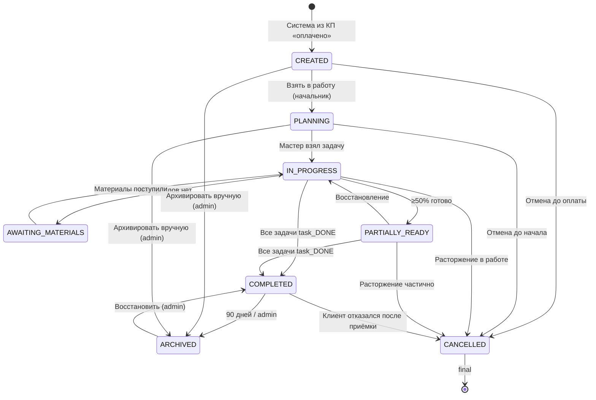
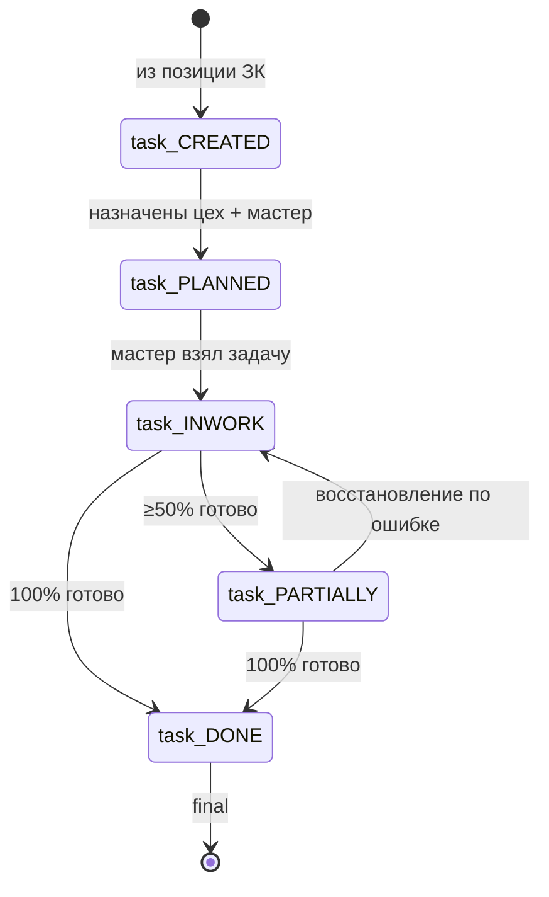

# ТЗ-012-RUN-3-5-АНАЛИТИК-ПРОИЗВОДСТВО.md — Run 3/5 Аналитика: правила для модуля Производство

> ## 🔒 FINALIZED 2026-06-27
>
> **Агент:** Бизнес-аналитик / MiMo auto (planned).
> **Source ТЗ:** `99_Справочники/TASKS/ТЗ-012-RUN-3-5-АНАЛИТИК-ПРОИЗВОДСТВО.md`
> **Заблокировано для дальнейших правок без нового PSL-NNN.**
> **Strategic anchor:** см. [`BUSINESS-VISION.md`](../BUSINESS-VISION.md) §0 «Конституция» (single-tenant, ≤10 чел, полуавтомат, 27 anti-features, 6 UX-дисциплин).

> **Тип документа:** Техническое задание (ТЗ) для параллельного ИИ-агента.
> **ID задачи:** ТЗ-012.
> **Приоритет:** 🔴 P0 (блокер для Phase 4 Производственный модуль + Run 4/5 Склад + Run 5/5 Финансы).
> **Статус:** ✅ Готово к запуску (2026-06-27).
> **Автор ТЗ:** Буфер (стратег-ассистент).
> **Заказчик:** параллельный ИИ-агент (далее — «Агент»).
> **Методология работы Агента:** [`AGENT-METHOD.md`](../../AGENT-METHOD.md) §1 «Быстрый старт» + §5.3 «Граница решений» (автономия) + §5.6 «Pre-action Checklist + Post-action Checkpoint» (обязательно).
> **Пререквизиты:** ТЗ-002 (КП STUB fill) ✅ CLOSED 100% (PSL-006) + ТЗ-011 (Договор STUB fill) ✅ FINALIZED (PSL-032). Run 3/5 Производство использует ОБА как upstream pattern + hard-link на Договор CHAIN-PRODUCTION правила.

---

## 0. Контекст

### 0.1 Что такое Run 3/5 и зачем он сейчас

Run 3/5 = **третий из 5 прогонов** Бизнес-аналитика по модулям CRM. Закрывает **4 STUB-файла** модуля Производство (`03_Производство/`):

| #   | STUB                                | Что заполняется                                                                                                                                        | Целевой размер |
| --- | ----------------------------------- | ------------------------------------------------------------------------------------------------------------------------------------------------------ | -------------- |
| 1   | `04-pravila/04-rbac.md`             | RBAC-матрица 6 ролей × действия Производство (НЕ 7 — `manager` обычно read-only)                                                                       | 200-350 строк  |
| 2   | `04-pravila/04-biznes-pravila.md`   | 12 групп инвариантов (vs 9 в Договор — больше cross-module chains)                                                                                     | 280-380 строк  |
| 3   | `03-zhiznennyj-cikl/03-statusy.md`  | **7 статусов ЗК** (planned / awaiting_materials / in_progress / partially_ready / completed / cancelled / archived) + ProductionTask sub-state machine | 120-180 строк  |
| 4   | `03-zhiznennyj-cikl/03-perehody.md` | ~10-12 переходов ЗК + ProductionTask sub-transitions + Mermaid stateDiagram-v2                                                                         | 180-240 строк  |

**Зачем именно сейчас:** Модуль Производство = **junction между 4 модулями** (КП — Договор — Склад — Финансы). Без канонических правил Производство downstream работы дрейфуют:

- Run 4/5 Склад → нужен `⛔⛔ DEPRECATED: use INV-ПРД-CHAIN-СКЛ per ID-ALIAS-MAP PSL-043 ⛔⛔ INV-ПРД-CHAIN-КЛАД-*` правила для авто-IN StockMovement при ЗК completed.
- Run 5/5 Финансы → нужен `⛔⛔ DEPRECATED: use INV-ПРД-CHAIN-ФИН per ID-ALIAS-MAP PSL-043 ⛔⛔ INV-ПРД-CHAIN-ФИНАНСЫ-*` правила для OrderClosing (completed) + Refund (cancelled) per СПОР-12.
- INTEGRATION-PLAN §6.2 Tier-DAG: Run 3/5 — pivot module, downstream одновременно требует 2 модуля (Склад + Финансы).
- Аудит INTEGRATION-PLAN §6.3 K1-K7: Производство как «середина цепочки» — drift тут maximizes impact cross-module.

**Без Run 3/5** Run 4/5 + Run 5/5 строят правила на неполном фундаменте → **drift по всей цепочке КП → Договор → ЗК → Склад → Финансы**.

### 0.2 Что в этом ТЗ, чего нет

**В этом ТЗ:**

- Только модуль Производство (`03_Производство/`).
- Только 4 STUB-файла + LOG + REPORT.
- Mirror ТЗ-002 (КП proven pattern) + ТЗ-011 (Договор proven pattern) + **5 Производство-specific additions**.

**НЕ в этом ТЗ:**

- REGISTRY-OF-RULES (ТЗ-001) — извлечение ВСЕХ правил по ВСЕМ 5 модулям (онлайн готовится параллельно).
- Run 4/5 / 5/5 (Склад / Финансы).
- Phase 1 Bootstrap Prisma — ТЗ-004 ✅ done, Phase 1 partial-deploy 3/4 (P1001 PostgreSQL missing, но Prisma Client generated, tests 407/407 PASS per PSL-034).
- Фаза 2 Mantine UI — ТЗ-003 ✅ done, UI patterns готовы.

### 0.3 Кто работает по этому ТЗ

**Агент** — параллельный ИИ, роль = **Бизнес-аналитик** (по [`AGENT-ROLES.md`](../../AGENT-ROLES.md) §2.2). Использует launch-пакет `03_Производство/LAUNCH-ANALYST-PROIZVODSTVO.md` (нужно создать) или `02_Договор/LAUNCH-ANALYST-DOGOVOR.md` как launched pattern для агента; настоящее ТЗ — развёрнутая версия.

### 0.4 Что нового vs ТЗ-002/011 (5 additions Производство-specific)

| #   | Addition                                                 | Почему                                                                                                                                                                                                               |
| --- | -------------------------------------------------------- | -------------------------------------------------------------------------------------------------------------------------------------------------------------------------------------------------------------------- |
| 1   | **4-целевой pipeline: ProductionTask sub-state-машина**  | Производство имеет 7 статусов ЗК + 5 sub-статусов ProductionTask (created/planned/inwork/partial/done), которые НЕ просто mirror ЗК статусы. Требует ОТДЕЛЬНУЮ строку в `04-rbac.md` + подраздел в `03-perehody.md`. |
| 2   | **§5.5 Multi-module cross-link (4 modules)**             | Производство = промежуточное звено между КП + Договор + Склад + Финансы. ТЗ-011 имел 1 cross-link (КП). Здесь — 4 cross-link groups (КП + Договор + Склад + Финансы).                                                |
| 3   | **§4 Inputs: 03_Производство/МОДУЛЬ-ПРОИЗВОДСТВО.md 🔴** | Source V0 ~600 строк с 5 sections правил (§5.1 создание ЗК, §5.2 задачи, §5.3 переходы, §5.4 цеха) + 7 статусов с авто-transitions.                                                                                  |
| 4   | **Auto-IN trigger ЗК Completed → Склад**                 | НОВОЕ правило для cross-module Клад: завершение ЗК автоматически создаёт `StockMovement: type='IN'` для каждого `Product.kind='ITEM'` (услуги ИСКЛЮЧЕНЫ).                                                            |
| 5   | **Auto-Refund trigger ЗК Cancelled → Финансы**           | Per СПОР-12: отмена ЗК → КП остаётся «Оплачено», автоматический сигнал в Модуль Финансы для бухгалтера оформить `Refund` (отдельная сущность > 0, вычитается из `Order.paidAmount`).                                 |

---

## 0.5 Schema Constraints Note (Option C Hybrid — validated by thinker-with-files-gemini)

> **CRITICAL Из code-reviewer (Nit-Pick-Nick) round 1:** Schema enum'ы в `prisma/schema.prisma` НЕ полностью покрывают бизнес-статусы МОДУЛЬ-ПРОИЗВОДСТВО.md. ТЗ-012 обязывает Run 3/5 Аналитик использовать Option C Hybrid (NO schema migration).

### 0.5.1 Проблема: schema vs business enum drift

| Уровень | `ProductionOrder.status` (Schema line 514)               | `OrderTask.status` (Schema line 557)                   | Бизнес-требование (МОДУЛЬ §2 + §5.2) |
| ------- | -------------------------------------------------------- | ------------------------------------------------------ | ------------------------------------ |
| Inputs  | `planned / in_progress / completed / cancelled` (4 enum) | `pending / in_progress / completed / blocked` (4 enum) | 8 ЗК статусов + 5 Task sub           |

**Дрифт:** 4 schema enums ↔ 8 business statuses (ЗК) + 5 sub-statuses (Task).

### 0.5.2 Option C Hybrid: schema enums preserved + business statuses computed

**Решение:** NO schema migration в Run 3/5. Schema остаётся lean (4 enum). Бизнес-статусы (8 + 5) вычисляются через комбинацию schema enum + 2 computed conditions (`plannedStart`/`actualStart` + `quantityActual`/`quantityPlanned` ratios) + nullable DateTime fields.

#### Mapping ProductionOrder: 4 schema enums → 8 business statuses

| #   | Schema enum + computed condition                                                                                      | Бизнес-статус          | RBAC триггер                                    |
| --- | --------------------------------------------------------------------------------------------------------------------- | ---------------------- | ----------------------------------------------- |
| 1   | `planned` AND `plannedStart == null` AND `actualStart == null` AND `isActive == true`                                 | **CREATED**            | auto от КП «оплачено»                           |
| 2   | `planned` AND (`plannedStart != null` OR `actualStart != null`) AND `isActive == true` AND НЕ triggers ниже           | **PLANNING**           | manual от начальника                            |
| 3   | `in_progress` AND computed `InventoryShortage == true` (`SUM InventoryMovement < SUM ProductionTask.quantityPlanned`) | **AWAITING_MATERIALS** | auto (app-level runtime check, tRPC middleware) |
| 4   | `in_progress` AND `actualStart != null` AND НЕ triggers ниже                                                          | **IN_PROGRESS**        | manual от мастера первой задачи                 |
| 5   | `in_progress` AND `Σ(quantityActual)/Σ(quantityPlanned) ≥ 0.5` AND `< 1.0`                                            | **PARTIALLY_READY**    | auto (compute ratio runtime)                    |
| 6   | `completed` AND `actualEnd != null` AND `isActive == true`                                                            | **COMPLETED**          | auto (Σ quantityActual == Σ quantityPlanned)    |
| 7   | **НЕ enum** — `isActive == false`                                                                                     | **ARCHIVED**           | auto через 90 дней / manual admin               |
| 8   | `cancelled` AND `cancelReason != null`                                                                                | **CANCELLED**          | manual admin/director + письменное уведомление  |

**Status priority rule (when multiple conditions match):** When BOTH `InventoryShortage==true` AND `Σ(quantityActual)/Σ(quantityPlanned) ≥ 0.5` are simultaneously true (e.g., ЗК has 60% progress, но material shortage blocks remaining 40%): **AWAITING_MATERIALS wins** — progress paused by material shortage. **General principle:** **blocking state wins over progress state** (AWAITING_MATERIALS > {IN_PROGRESS, PARTIALLY_READY}). Cover BOTH IN_PROGRESS + PARTIALLY_READY cases (both schema-wise `in_progress` enum when InventoryShortage==true). PARTIALLY_READY + IN_PROGRESS only emerge when materials restored + work resumes. Implement в runtime tRPC middleware `deriveStatus()` — НЕ в schema.

**Reviewer clarifications (ТЗ-012 code-reviewer round 1 fixes):**

- **CREATED vs PLANNING discriminator:** МОДУЛЬ §5.1.1 создаёт ЗК С задачами → `tasks.length > 0` уже в CREATED (НЕ disambiguator). Correct discriminator = `plannedStart`/`actualStart` nullable DateTime? fields (existing schema line 511+).
- **AWAITING_MATERIALS:** НЕ derived from `ProductionOrder.status` field. App-level computation через tRPC middleware `requireInventoryCheck()` → SQL JOIN `InventoryMovement < ProductionTask.quantityPlanned`. Schema НЕ требует дополнительных полей на ProductionOrder.
- **PARTIALLY_READY:** Computed SUM на всех задачах ЗК через Zod schema в tRPC router считает server-side.

#### Mapping OrderTask: 4 schema enums → 5 business sub-статусов

| #   | Schema enum + computed                                                                        | Sub-статус         | RBAC триггер                           |
| --- | --------------------------------------------------------------------------------------------- | ------------------ | -------------------------------------- |
| 1   | `pending` AND `quantityActual == 0` AND (`workshopId == null` OR `responsibleUserId == null`) | **task_CREATED**   | auto от позиции КП                     |
| 2   | `pending` AND `workshopId != null` AND `responsibleUserId != null` AND `quantityActual == 0`  | **task_PLANNED**   | manual от production-руководитель      |
| 3   | `in_progress` AND `0 < quantityActual < quantityPlanned`                                      | **task_INWORK**    | manual от production-master (assigned) |
| 4   | `in_progress` AND `quantityActual >= 0.5 * quantityPlanned` AND `< quantityPlanned`           | **task_PARTIALLY** | auto (runtime 50% threshold)           |
| 5   | `completed` AND `quantityActual == quantityPlanned`                                           | **task_DONE**      | manual финал                           |

**Reviewer clarification (`blocked` enum НЕ используется):**

- `OrderTask.status='blocked'` НЕ реализован в production v1 — schema field legacy. Production-master НЕ может отменить задачу (только ЗК целиком через повышенные права).
- Run 3/5 Аналитик **НЕ создаёт правил с `task_BLOCKED` sub-статусом** — это v2 feature (per МОДУЛЬ §9).

### 0.5.3 RBAC-roles mapping (Code-reviewer fix #4)

| Schema уровне                                                               | Бизнес роль                            | enforced by                                  |
| --------------------------------------------------------------------------- | -------------------------------------- | -------------------------------------------- |
| `Worker.role == "worker" && Worker.assignedToWorkshopId == task.workshopId` | production-master (assigned на задачу) | app: `requireTaskWorkshopMatch()` middleware |
| `OrgRole contains "production-head" \|\| isAdmin`                           | production-руководитель (над цехом)    | app: `requireRoleInContext()` middleware     |
| `Worker.role == "worker"` (any)                                             | мастер / viewer / аудитор              | app: same as above                           |

**Reference к RBAC-КП-ОW-001: ПО АНАЛОГИИ (structural pattern: ownership-by-context), НЕ semantic mirror.** RBAC-КП rule = «manager видит свои (создал)». Production-rule = «мастер видит свои (назначен на Workshop)». Оба используют schema-level ownership field, но operational semantics DIFFERENT (creator vs assigned).

**НЕ добавлять новые enum в `schema.prisma`** для ролей — schema остаётся 4 enum + String role (proven Run 1/5 КП alignment).

### 0.5.4 Pre-launch check #4: Агент ОБЯЗАН перед Run выполнить

1. [ ] `prisma/schema.prisma` НЕ модифицируется в Run 3/5 (NO migration).
2. [ ] Каждое правило с явным business status (SM-ПРД-NNN / SM-ПРД-TT-NNN) **MUST** ссылаться на mapping в §6.3 (cross-ref, НЕ дублировать таблицу).
3. [ ] UI logic проверяет computed conditions в runtime (Zod + tRPC middleware).
4. [ ] Audit log фиксирует derived status с schema-level justification (e.g., "PARTIALLY_READY: `ProductionOrder.status='in_progress'` AND `sumQuantityActual/SumQuantityPlanned=0.65 ≥ 0.5` (ratio computed server-side via tRPC middleware `deriveStatus()`)" — НЕ должно ссылаться на inventory shortage (это для AWAITING_MATERIALS)).
5. [ ] Тесты `04-biznes-pravila.md` валидны: SM-ПРД предикат использует ТОЛЬКО schema-level fields (`status`, `isActive`, `quantityActual`, `quantityPlanned`, `plannedStart`, `actualStart`).

### 0.5.5 Alignment с Run 1/5 КП proven pattern

Тот же Option C успешно применён в КП (`01_КП/04-pravila/04-biznes-pravila.md`) + Договор (`02_Договор/04-pravila/04-biznes-pravila.md`). Production sub-state-машина (5 sub-статусов) следует тому же proven pattern.

---

## 1. Миссия

> **Одной фразой:** Извлечь из исходного `03_Производство/МОДУЛЬ-ПРОИЗВОДСТВО.md` (~600 строк, распущен в 20 STUB по PSL-022) канонические правила и заполнить ими 4 STUB-файла в формате, пригодном для прямого использования в Phase 4 Производство + Run 4/5 Склад + Run 5/5 Финансы.

**Декомпозиция:**

1. Прочитать `03_Производство/README.md` + все 20 STUB (для контекста, но трогать ТОЛЬКО 4 STUB).
2. Извлечь **RBAC по 6 ролям × ~10 действий** → `04-rbac.md` (~50-80 правил).
3. Извлечь **12 групп инвариантов** → `04-biznes-pravila.md` (~30-50 правил, из них ~8 групп = cross-module hard-links).
4. Извлечь **7 статусов ЗК + 5 sub-статусов ProductionTask** → `03-statusy.md` (~120 строк).
5. Извлечь **~10-12 переходов ЗК + sub-transitions** → `03-perehody.md` (~200 строк + Mermaid).
6. Self-verify по §8 настоящего ТЗ → создать `12-02-REPORT.md` → handoff.

---

## 2. Scope IN/OUT

### 2.1 IN — Агент делает

| #   | Файл                                                | Что делается                                                                                                                                     | Hard limit |
| --- | --------------------------------------------------- | ------------------------------------------------------------------------------------------------------------------------------------------------ | ---------- |
| 1   | `03_Производство/04-pravila/04-rbac.md`             | Заполнить ~50-80 правилами RBAC (6 ролей × действия + OW + V + C + VER).                                                                         | 400 строк  |
| 2   | `03_Производство/04-pravila/04-biznes-pravila.md`   | Заполнить ~30-50 правилами в 12 группах: PARTIES, TYPES, PLAN, EXEC, RESOURCE, CHAIN-КП, CHAIN-ДОГ, CHAIN-КЛАД, CHAIN-ФИНАНСЫ, TERM, SOFT, MISC. | 400 строк  |
| 3   | `03_Производство/03-zhiznennyj-cikl/03-statusy.md`  | Заполнить 7 статусами ЗК + 5 sub-статусами ProductionTask + маппинг КП↔ЗК↔Договор + negative-rules.                                              | 250 строк  |
| 4   | `03_Производство/03-zhiznennyj-cikl/03-perehody.md` | Заполнить ~10-12 переходами ЗК + 5 sub-transitions ProductionTask + Mermaid stateDiagram-v2.                                                     | 250 строк  |
| 5   | `99_Справочники/TASKS/12-01-LOG.md`                 | Хронология работы Агента (audit trail).                                                                                                          | —          |
| 6   | `99_Справочники/TASKS/12-02-REPORT.md`              | Финальный отчёт Агента для PO (метрики покрытия, найденные пробелы).                                                                             | 500 строк  |
| 7   | (опц.) `99_Справочники/TASKS/12-09-AMBIGUITIES.md`  | Противоречия между правилами в разных группах.                                                                                                   | —          |

### 2.2 OUT — Агент НЕ делает

| #   | Что НЕ делает                                                                                                                                                         | Почему                                                                                                      |
| --- | --------------------------------------------------------------------------------------------------------------------------------------------------------------------- | ----------------------------------------------------------------------------------------------------------- |
| 1   | **Не пишет новых правил «от себя»**                                                                                                                                   | Только извлечение из источника `МОДУЛЬ-ПРОИЗВОДСТВО.md` + cross-ref на 4 модули (КП/Договор/Склад/Финансы). |
| 2   | **Не правит** `RBAC-MATRIX.md`, `SCHEMA-CONSOLIDATED.md`, `BUSINESS-VISION.md`, `GLOSSARY-MASTER.md`, `FLOW-MAP.md`, `СПОРНЫЕ-МОМЕНТЫ.md`, `OPEN-QUESTIONS-MASTER.md` | Канонические справочники — не трогать.                                                                      |
| 3   | **Не работает с Run 4/5 / 5/5 STUB** (Склад, Финансы)                                                                                                                 | Только Run 3 (Производство RBAC + правила + статусы + переходы).                                            |
| 4   | **Не правит** `03_Производство/00-spr/*`, `03_Производство/03-konstruktor-zakaza/*` (если существует), прочие 16 не-target STUB                                       | README-каркасы и STUB'ы не из Run 3 списка — оставить как есть.                                             |
| 5   | **Не пишет код**                                                                                                                                                      | Это документация.                                                                                           |
| 6   | **Не правит** `03_Производство/МОДУЛЬ-ПРОИЗВОДСТВО.md` (source V0)                                                                                                    | Source frozen — из него только читаем.                                                                      |
| 7   | **Не правит** `01_КП/04-pravila/*`, `02_Договор/04-pravila/*` (Run 1/5 + Run 2/5 results)                                                                             | Frozen после CLOSED 100% / FINALIZED.                                                                       |
| 8   | **Не добавляет STUB файлов вне Run 3 список**                                                                                                                         | Кроме случаев split при превышении hard limits.                                                             |

### 2.3 Anti-features (mirror BUSINESS-VISION.md §3 + Производство-specific)

Агент должен **отказаться** от любого правила/паттерна, попадающего в anti-catalog:

| ❌ Не делать                                                            | Почему                                                                                                       |
| ----------------------------------------------------------------------- | ------------------------------------------------------------------------------------------------------------ |
| ❌ Не предлагать **MRP (Material Requirement Planning)** автоматический | [`BUSINESS-VISION §3.2`](../BUSINESS-VISION.md) — только ручное планирование в v1 (МОДУЛЬ §9).               |
| ❌ Не предлагать **Gantt-диаграммы**                                    | [`BUSINESS-VISION §3.2`](../BUSINESS-VISION.md) + МОДУЛЬ §9 — только таблица, визуализация в v2.             |
| ❌ Не предлагать **Qr-code мобильный интерфейс станков**                | МОДУЛЬ §9 — отложено v2.                                                                                     |
| ❌ Не предлагать **WebSocket-realtime** для частичной готовности задач  | [`BUSINESS-VISION §3.2`](../BUSINESS-VISION.md) + МОДУЛЬ §3 — мастер ставит вручную через UI-flow.           |
| ❌ Не предлагать **OAuth / 2FA universal** для мастеров                 | [`BUSINESS-VISION §3.2`](../BUSINESS-VISION.md) — только для критичных действий (Отмена ЗК повышенных прав). |
| ❌ Не предлагать **multi-tier approval matrices** для ЗК любых размеров | [`BUSINESS-VISION §3.3`](../BUSINESS-VISION.md) — автономия начальника производства.                         |
| ❌ Не предлагать **Сдельная ЗП / HR-модуль**                            | МОДУЛЬ §9 + §3 «Что НЕ происходит» — это вне производства.                                                   |
| ❌ Не предлагать **Бюджетирование производства** (план/факт по цехам)   | МОДУЛЬ §9 — v2 feature.                                                                                      |
| ❌ Не предлагать **Оптимистическая блокировка ЗК**                      | МОДУЛЬ §9 — отложено v2.                                                                                     |
| ❌ Не использовать **микросервисы** для триггеров ЗК→Склад, ЗК→Финансы  | [`BUSINESS-VISION §3.1`](../BUSINESS-VISION.md) — всё в рамках монолита.                                     |

---

## 3. Deliverables — что Агент создаёт

### 3.1 Основные артефакты

| #   | Файл                                                | Целевой размер  | Hard limit | Что делать при превышении                                                             |
| --- | --------------------------------------------------- | --------------- | ---------- | ------------------------------------------------------------------------------------- |
| 1   | `03_Производство/04-pravila/04-rbac.md`             | 250-350 строк   | **400**    | Разбить на `04-rbac-zk-actions.md` (ЗК) + `04-rbac-task-actions.md` (ProductionTask). |
| 2   | `03_Производство/04-pravila/04-biznes-pravila.md`   | 280-380 строк   | **400**    | Перенести CHAIN-КЛАД + CHAIN-ФИНАНСЫ в APPENDIX (или split на 2 файла).               |
| 3   | `03_Производство/03-zhiznennyj-cikl/03-statusy.md`  | 120-180 строк   | **250**    | Сократить определения + оставить только ключевые Mermaid-диаграммы.                   |
| 4   | `03_Производство/03-zhiznennyj-cikl/03-perehody.md` | 180-240 строк   | **250**    | Ужать negative-rules до 3 + минимум sub-transition sub-section.                       |
| 5   | `99_Справочники/TASKS/12-01-LOG.md`                 | без ограничения | —          | —                                                                                     |
| 6   | `99_Справочники/TASKS/12-02-REPORT.md`              | 200-350 строк   | **500**    | Сократить таблицы.                                                                    |
| 7   | `99_Справочники/TASKS/12-09-AMBIGUITIES.md`         | по ситуации     | —          | —                                                                                     |

### 3.2 Минимальное покрытие (Hard pass/fail)

| Файл                   | Правил минимум                                                         | Источник coverage target                                  |
| ---------------------- | ---------------------------------------------------------------------- | --------------------------------------------------------- |
| `04-rbac.md`           | **50** правил                                                          | 6 ролей × 10 действий + ~10 OW/V/C/VER ≈ 70               |
| `04-biznes-pravila.md` | **30** правил                                                          | 12 групп × 3-5 правил ≈ 36+ (из них 8 групп side-effects) |
| `03-statusy.md`        | **7** ЗК статусов + **5** ProductionTask sub-статусов + **3** negative | целевой 15 всего                                          |
| `03-perehody.md`       | **10** ЗК переходов + **5** ProductionTask sub-transitions + Mermaid   | целевой 15 + diagram                                      |

### 3.3 Cross-module consistency (4 hard-link groups)

Каждое правило Производство из cross-module groups должно **hard-link** на соответствующее правило upstream/downstream модуля:

| ПРД группа                        | Upstream/Downstream                                                     | Hard-link формат                                                   |
| --------------------------------- | ----------------------------------------------------------------------- | ------------------------------------------------------------------ |
| `CHAIN-КП-*` (KП → ПРД)           | КП имеет INV-КП-CONV-* (Run 1/5 frozen)                                 | Source column: `↳ см. INV-КП-CONV-NNN` (NO duplicate)              |
| `CHAIN-ДОГ-*` (Договор → ПРД)     | Договор имеет INV-ДОГ-CHAIN-PRODUCTION-* (Run 2/5 will fill)            | Source column: `↳ см. INV-ДОГ-CHAIN-PRODUCTION-NNN` (NO duplicate) |
| `CHAIN-КЛАД-*` (ПРД → Склад)      | Склад имеет INV-СКЛ-AT-IN-* (Run 4/5 will fill)                         | Source column: `↳ см. INV-СКЛ-AT-IN-NNN` (NO duplicate)            |
| `CHAIN-ФИНАНСЫ-*` (ПРД → Финансы) | Финансы имеет INV-ФИН-AT-CLOSE-* + INV-ФИН-REFUND-* (Run 5/5 will fill) | Source column: `↳ см. INV-ФИН-*` (NO duplicate)                    |

**Hard-link convention enforcing:** Колонка «Правило» в строках всех CHAIN-_-_ групп содержит ТОЛЬКО one-liner `↳ см. INV-XXX-NNN`. Дополнительные ПРД-specific side-effects записываются в MISC-группу или отдельные баннеры НЕ для CHAIN-*.

---

## 4. Inputs — что Агент обязан прочитать

### 4.1 Tier-1 🔴 CRITICAL (mirror Договор pattern)

| #   | Файл                                                                                                                                                       | Зачем                                                                                                                                                           |
| --- | ---------------------------------------------------------------------------------------------------------------------------------------------------------- | --------------------------------------------------------------------------------------------------------------------------------------------------------------- |
| 1   | [`CHECKLIST.md`](../../CHECKLIST.md)                                                                                                                       | Мастер-навигатор сессии.                                                                                                                                        |
| 2   | [`AGENT-METHOD.md`](../../AGENT-METHOD.md)                                                                                                                 | §1, §5.3, §5.6, §6.                                                                                                                                             |
| 3   | [`BUSINESS-VISION.md`](../BUSINESS-VISION.md)                                                                                                              | **Strategic anchor**: §0 scope-guards, §3 anti-catalog (27 позиций), §4 6 UX-дисциплин. Цитировать в §6.                                                        |
| 4   | [`99_Справочники/RBAC-MATRIX.md`](../RBAC-MATRIX.md)                                                                                                       | Сводная матрица 7×N, расширить для Производство (6 ролей активно + viewer).                                                                                     |
| 5   | [`99_Справочники/SCHEMA-CONSOLIDATED.md`](../SCHEMA-CONSOLIDATED.md)                                                                                       | Сущности: ProductionOrder / ProductionTask / WorkType / WorkCenter / Worker / OrderHistory / InventoryMovement.                                                 |
| 6   | [`99_Справочники/СПОРНЫЕ-МОМЕНТЫ.md`](../СПОРНЫЕ-МОМЕНТЫ.md)                                                                                               | **СПОР-12** (ЗК Cancelled → Финансы Refund), **СПОР-13** (нумерация ЗК из отдельного счётчика), **СПОР-9** (isActive в Org — applicable для workers/workshops). |
| 7   | [`99_Справочники/FLOW-MAP.md`](../FLOW-MAP.md)                                                                                                             | Cross-module цепочка для 4 hand-offs (КП→ПРД, Договор→ПРД, ПРД→Склад, ПРД→Финансы).                                                                             |
| 8   | `02_Договор/04-pravila/04-biznes-pravila.md` + `02_Договор/04-pravila/04-rbac.md` + `02_Договор/03-zhiznennyj-cikl/03-statusy.md` (Run 2/5 PROVEN pattern) | **Mirror proven structure**: ID prefix `INV-ДОГ-*` mirror `INV-ПРД-*`, hard-link на источник.                                                                   |
| 9   | `01_КП/04-pravila/04-rbac.md` + `01_КП/04-pravila/04-biznes-pravila.md` + `01_КП/03-zhiznennyj-cikl/03-statusy.md` (Run 1/5 PROVEN pattern)                | **Mirror proven structure**: `RBAC-КП-*` → `RBAC-ПРД-*`.                                                                                                        |
| 10  | `03_Производство/МОДУЛЬ-ПРОИЗВОДСТВО.md` (~600 строк)                                                                                                      | **Source V0** для извлечения правил.                                                                                                                            |
| 11  | `03_Производство/README.md`                                                                                                                                | Точка входа модуля Производство + 20-STUB map.                                                                                                                  |
| 12  | `03_Производство/04-pravila/00-README.md`                                                                                                                  | Контекст папки правил Производство.                                                                                                                             |
| 13  | `03_Производство/03-zhiznennyj-cikl/00-README.md`                                                                                                          | Контекст папки state-machine.                                                                                                                                   |
| 14  | `03_Производство/00-spr/00-otkrytye-voprosy.md`                                                                                                            | 5 baseline OQ Производство (если существует).                                                                                                                   |

### 4.2 Tier-2 🟡 IMPORTANT (4 cross-module sources)

| #   | Файл                                                                                               | Зачем                                                                                                                                                                                     |
| --- | -------------------------------------------------------------------------------------------------- | ----------------------------------------------------------------------------------------------------------------------------------------------------------------------------------------- |
| 15  | `01_КП/03-zhiznennyj-cikl/03-konvertaciya-v-dogovor.md` + `01_КП/03-zhiznennyj-cikl/03-statusy.md` | Контекст КП «Оплачено» → создание ЗК триггера.                                                                                                                                            |
| 16  | `02_Договор/МОДУЛЬ-ДОГОВОР.md` (распущен PSL-021)                                                  | Контекст `parentContractId` nullable + SIGNED_CLIENT → auto-ЗК-триггер.                                                                                                                   |
| 17  | `03_Производство/00-spr/00-glossary.md`                                                            | Канонические термины Производство (ЗК = Производственный заказ, Задача = ProductionTask, Цех = Workshop).                                                                                 |
| 18  | [`99_Справочники/GLOSSARY-MASTER.md`](../GLOSSARY-MASTER.md)                                       | Общая терминология.                                                                                                                                                                       |
| 19  | [`99_Справочники/OPEN-QUESTIONS-MASTER.md`](../OPEN-QUESTIONS-MASTER.md)                           | 38 Q — касающиеся Производство.                                                                                                                                                           |
| 20  | `04_Склад/МОДУЛЬ-СКЛАД-ПОДРОБНЫЙ.md` §3 (StockMovement) + §6 (Shipment)                            | Контекст для auto-IN триггера при ЗК completed → cross-link ⛔⛔ DEPRECATED: use INV-ПРД-CHAIN-СКЛ per ID-ALIAS-MAP PSL-043 ⛔⛔ INV-ПРД-CHAIN-КЛАД-*.                                    |
| 21  | `05_Финансы/МОДУЛЬ-ФИНАНСЫ.md` §5 + §6 (Refund по СПОР-12)                                         | Контекст для auto-OrderClosing (completed) и auto-Refund (cancelled) триггеров → cross-link ⛔⛔ DEPRECATED: use INV-ПРД-CHAIN-ФИН per ID-ALIAS-MAP PSL-043 ⛔⛔ INV-ПРД-CHAIN-ФИНАНСЫ-*. |

### 4.3 Tier-3 🟢 OPTIONAL

| #   | Файл                                                               | Зачем                                         |
| --- | ------------------------------------------------------------------ | --------------------------------------------- |
| 22  | git history `03_Производство/МОДУЛЬ-ПРОИЗВОДСТВО.md` (original V0) | `git show` для точных формулировок §5.1-§5.4. |
| 23  | ТЗ-001 CLOSED-WITH-CAVEATS REGISTRY-OF-RULES                       | Если хотим reuse ID-префиксы `RULE-ПРД-*`.    |

---

## 5. Methodology — как извлекать правила

### 5.1 Алгоритм работы

```
1. Прочитать §4 inputs в порядке 1-21.
2. Для каждого из 4 STUB — пройти структуру 2.1:
   2.1. 04-rbac.md:
        - Видимость ДЕЙСТВИЙ ЗК + ProductionTask по 6 ролям (admin/director/manager-production-master/
          storekeeper/accountant/viewer).
        - ID формата RBAC-ПРД-{TYPE}-{NNN} где TYPE ∈ {A (action), OW, V, C, VER, T (task)}.
        - Mirror структуры Договор RBAC-ДОГ-TYPE-NNN и КП RBAC-КП-TYPE-NNN (consistency!).
        - ProductionTask действия выделить отдельно (type=T) — не все 6 ролей имеют доступ.
   2.2. 04-biznes-pravila.md:
        - 12 групп инвариантов Производство (mirror Договор 9 + 3 новых: PLAN, EXEC, RESOURCE).
        - ID формата INV-ПРД-{GROUP}-{NNN} где GROUP ∈ {PARTIES, TYPES, PLAN, EXEC, RESOURCE,
          CHAIN-КП, CHAIN-ДОГ, CHAIN-КЛАД, CHAIN-ФИНАНСЫ, TERM, SOFT, MISC}.
        - 4 cross-module CHAIN-*-* groups (КП + Договор + Склад + Финансы).
        - Hard-link на upstream/downstream source rules.
   2.3. 03-statusy.md:
        - 7 статусов ЗК + точные определения + англ. имя + цвет UI + RBAC.
        - ID формата SM-ПРД-{NNN}.
        - 5 ProductionTask sub-статусов отдельным разделом.
        - Явная таблица КП↔ЗК↔Договор mapping.
   2.4. 03-perehody.md:
        - 10-12 переходов ЗК + 5 ProductionTask sub-transitions + триггер + RBAC + preconditions + side-effects.
        - ID формата SM-ПРД-T-{NNN} (ЗК) + SM-ПРД-TT-{NNN} (ProductionTask).
        - Mermaid stateDiagram-v2 (включая CANCELLED + ARCHIVED).
        - Negative-rules.
3. Каждое правило: ID + Источник (МОДУЛЬ §NN или upstream/downstream INV-*-NNN) + Следствие при нарушении.
4. Перепроверить по §8 self-check + §3.3 cross-module consistency.
5. Передать в 12-02-REPORT.md → handoff.
```

### 5.2 Что считать правилом (mirror ТЗ-011)

**Правило = конкретное действие / ограничение / требование**, которое проверяется в коде:

| Тип                      | Пример Производство                                                                         |
| ------------------------ | ------------------------------------------------------------------------------------------- |
| RBAC (action visibility) | «production-master НЕ может терминировать ЗК — только admin/director»                       |
| Validation (данные)      | «quantityActual ≤ quantityPlanned при productionTask update»                                |
| Invariant (всегда true)  | «ЗК COMPLETED → INVENTORY_MOVEMENT создан для всех ITEM»                                    |
| State machine (переход)  | «ЗК CANCELLED → Финансы оформляет Refund (каскадный триггер)»                               |
| Side-effect trigger      | «ЗК COMPLETED → StockMovement IN (cross-module Клад) + OrderClosing (cross-module Финансы)» |

**Не правило:** Описательная фраза без ограничения («ЗК — это внутренний документ»).

### 5.3 Чего НЕ делать (mirror ТЗ-002/011 + Production-specific)

- **Не придумывать новых правил «от себя»** — только извлечение из источника + cross-ref.
- **Не решать противоречия** — фиксировать в `12-09-AMBIGUITIES.md`.
- **Не повторять общие правила из RBAC-MATRIX.md §3** — ссылаться, не дублировать.
- **Не дублировать правила КП/Договор** (CHAIN-КП, CHAIN-ДОГ) — hard-link через Source column.
- **Не дублировать правила Склад/Финансы** (CHAIN-КЛАД, CHAIN-ФИНАНСЫ) — hard-link через Source column.
- **Не вводить ProductionSubTask** (МОДУЛЬ §10 Q6) — отдельная сущность в v2.
- **Не вводить Гант-диаграммы / MRP / сдельную ЗП** — BUSINESS-VISION §3.2 + МОДУЛЬ §9.
- **Не использовать WebSocket** для частичной готовности — manual UI-flow.

### 5.4 Cross-module: КП (mirror Договор § 5.4)

Создание ЗК автоматически при КП.status = «оплачено». Правила, описывающие этот триггер, **уже есть** в КП (INV-КП-CONV-*). Производство создаёт **mirror-правила**, ссылающиеся на оригинал:

| ID КП (canonical)                                 | ID ПРД (mirror)        | Что делает                                                                                   |
| ------------------------------------------------- | ---------------------- | -------------------------------------------------------------------------------------------- |
| (нет) — нет соответствующего прямого правила в КП | `INV-ПРД-CHAIN-КП-001` | ЗК создаётся при КП.status = «оплачено» (auto) — специфично для ПРД.                         |
| (нет)                                             | `INV-ПРД-CHAIN-КП-002` | Один КП = один ЗК. Повторное создание ЗАПРЕЩЕНО (через `ProductionOrder.proposalId UNIQUE`). |
| (нет)                                             | `INV-ПРД-CHAIN-КП-003` | Позиции КП копируются в ЗК как snapshot (priceSnapshot из КП).                               |

**Почему mirror hard-link вместо re-define:** КП содержит baseline правила конвертации. Производство должно только детализировать side-effect триггеры (`Proposal.status='paid' → auto-create ProductionOrder`), а не дублировать.

### 5.5 Cross-module: Договор (mirror Договор § 5.5)

Договор → Производство через `parentContractId` (nullable FK). Договор фиксирует side-effect триггер в `INV-ДОГ-CHAIN-PRODUCTION-*`. Производство mirror hard-link:

| ID Договор (canonical)                                                 | ID ПРД (mirror)         | Что делает                                                                                                    |
| ---------------------------------------------------------------------- | ----------------------- | ------------------------------------------------------------------------------------------------------------- |
| `INV-ДОГ-CHAIN-PRODUCTION-001` (SIGNED_CLIENT → авто Order в Финансах) | `INV-ПРД-CHAIN-ДОГ-001` | ↳ см. ДОГ-CHAIN-PRODUCTION-001 (SIGNED_CLIENT → авто ProductionOrder с parentContractId, если ещё не создан). |
| `INV-ДОГ-CHAIN-PRODUCTION-002` (Договор COMPLETED → ЗК COMPLETED)      | `INV-ПРД-CHAIN-ДОГ-002` | ↳ см. ДОГ-CHAIN-PRODUCTION-002 (ЗК переходит в COMPLETED в Договор-COMPLETED каскад).                         |
| `INV-ДОГ-CHAIN-PRODUCTION-003` (Договор TERMINATED → ЗК auto-cancel)   | `INV-ПРД-CHAIN-ДОГ-003` | ↳ см. ДОГ-CHAIN-PRODUCTION-003.                                                                               |

### 5.6 Cross-module: Склад (NEW for ТЗ-012)

ЗК COMPLETED → авто StockMovement IN (для каждого `Product.kind='ITEM'`). Услуги исключены. Склад фиксирует правило в `INV-СКЛ-AT-IN-*` (в Run 4/5). Производство mirror hard-link:

| ID Склад (canonical, будущий)                                   | ID ПРД (mirror)                                                                               | Что делает                                                                                                                                                                                                            |
| --------------------------------------------------------------- | --------------------------------------------------------------------------------------------- | --------------------------------------------------------------------------------------------------------------------------------------------------------------------------------------------------------------------- |
| `INV-СКЛ-AT-IN-001` (ЗК COMPLETED → StockMovement IN)           | `⛔⛔ DEPRECATED: use INV-ПРД-CHAIN-СКЛ per ID-ALIAS-MAP PSL-043 ⛔⛔ INV-ПРД-CHAIN-КЛАД-001` | При переходе ЗК в `COMPLETED` авто создаётся `StockMovement: type='IN', reason='PRODUCTION'` для каждой ЗК-Задачи с Product.kind='ITEM'. Услуги (`Product.kind='SERVICE'/'WORK'/'INSTALLATION'`) в склад НЕ приходят. |
| `INV-СКЛ-AT-IN-002` (кладовщик видит ЗК как ожидаемую поставку) | `⛔⛔ DEPRECATED: use INV-ПРД-CHAIN-СКЛ per ID-ALIAS-MAP PSL-043 ⛔⛔ INV-ПРД-CHAIN-КЛАД-002` | В статусе ЗК `IN_PROGRESS` видна «плановая дата прихода» через `StockMovement.expectedAt`.                                                                                                                            |
| `INV-СКЛ-AT-IN-003` (ЗК Created → placeholder для Склад)        | `⛔⛔ DEPRECATED: use INV-ПРД-CHAIN-СКЛ per ID-ALIAS-MAP PSL-043 ⛔⛔ INV-ПРД-CHAIN-КЛАД-003` | Кладовщик резервирует материалы заранее (manual планирование).                                                                                                                                                        |

### 5.7 Cross-module: Финансы (NEW for ТЗ-012)

ЗК COMPLETED → авто OrderClosing. ЗК CANCELLED → авто Refund. Финансы фиксирует в `INV-ФИН-AT-CLOSE-*` и `INV-ФИН-REFUND-*` (Run 5/5). Производство mirror hard-link:

| ID Финансы (canonical, будущий)                          | ID ПРД (mirror)                                                                                  | Что делает                                                                                                                                                                      |
| -------------------------------------------------------- | ------------------------------------------------------------------------------------------------ | ------------------------------------------------------------------------------------------------------------------------------------------------------------------------------- |
| `INV-ФИН-AT-CLOSE-001` (ЗК COMPLETED → OrderClosing)     | `⛔⛔ DEPRECATED: use INV-ПРД-CHAIN-ФИН per ID-ALIAS-MAP PSL-043 ⛔⛔ INV-ПРД-CHAIN-ФИНАНСЫ-001` | При переходе ЗК в `COMPLETED` авто создаётся `OrderClosing` в Модуле Финансы (по `archive/ANALYSIS-KP-priority.md`, ON DELETE SetNull).                                         |
| `INV-ФИН-REFUND-001` (ЗК CANCELLED → Refund per СПОР-12) | `⛔⛔ DEPRECATED: use INV-ПРД-CHAIN-ФИН per ID-ALIAS-MAP PSL-043 ⛔⛔ INV-ПРД-CHAIN-ФИНАНСЫ-002` | При переходе ЗК в `CANCELLED` сигнал в Финансы → бухгалтер оформляет `Refund` (отдельная сущность > 0, вычитается из `Order.paidAmount`). КП остаётся «Оплачено» (per СПОР-12). |
| (нет)                                                    | `⛔⛔ DEPRECATED: use INV-ПРД-CHAIN-ФИН per ID-ALIAS-MAP PSL-043 ⛔⛔ INV-ПРД-CHAIN-ФИНАНСЫ-003` | Если ЗК отменён ДО оплаты (статус ЗК = CREATED без оплаты) → Refund не оформляется, КП возвращается вручную через «Создать новую версию» (per МОДУЛЬ §10 Q4).                   |

---

## 6. Format specification

### 6.1 04-rbac.md — видимость действий Производство

```markdown
# 04-rbac.md — RBAC-матрица модуля Производство

> **Назначение.** Кто из 6 активных ролей (admin / director / manager / production-production-master / storekeeper / accountant + viewer read-only) может выполнить какое ДЕЙСТВИЕ над сущностями Производство (ProductionOrder, ProductionTask, WorkCenter, WorkType, Worker, OrderHistory). Расширяет сводную [RBAC-MATRIX.md](../RBAC-MATRIX.md) применительно к Производство.
> **Автор.** Бизнес-аналитик (Run 3/5, ТЗ-012). Заполнен YYYY-MM-DD.
> **Mirror.** ID-префиксы mirror Договор (-ДОГ- → -ПРД-) и КП (-КП- → -ПРД-) для consistency в ID-пространстве.

## 0. Контекст

Каждое правило имеет ID формата `RBAC-ПРД-{TYPE}-{NNN}`, где TYPE ∈ {A (action ЗК), T (action ProductionTask), OW (ownership), V (visibility), C (conditional), VER (versioning)}.

## 1. Видимость действий ЗК (A-rules)

| ID                     | Действие (ЗК)                              | admin  | director | production-руководитель | production-master | storekeeper | accountant |                 manager                  | viewer | Условие                             | Источник                                                                                    |
| ---------------------- | ------------------------------------------ | :----: | :------: | :---------------------: | :---------------: | :---------: | :--------: | :--------------------------------------: | :----: | ----------------------------------- | ------------------------------------------------------------------------------------------- |
| RBAC-ПРД-A-001         | Просмотреть доску ЗК                       | ✅ все |  ✅ все  |         ✅ все          |  ✅ назначенные   | ✅ входящие |     ✅     | ✅ свои (`parentProposalId.createdById`) |   ✅   | ownership                           | RBAC-MATRIX §1.1                                                                            |
| RBAC-ПРД-A-002         | Создать ЗК (auto из КП «Оплачено»)         |  авто  |   авто   |           ❌            |        ❌         |     ❌      |     ❌     |                    ❌                    |   ❌   | Proposal.status=paid run 1/5 frozen | INV-КП-CONV-001 mirror + INV-ПРД-CHAIN-КП-001                                               |
| RBAC-ПРД-A-003         | Взять в работу (CREATED → PLANNING)        |   ✅   |    ✅    |           ✅            |        ❌         |     ❌      |     ❌     |                    ❌                    |   ❌   | ProductionOrder.status=planned      | МОДУЛЬ §8                                                                                   |
| RBAC-ПРД-A-004         | Распределить по цехам                      |   ✅   |    ✅    |           ✅            |        ❌         |     ❌      |     ❌     |                    ❌                    |   ❌   | —                                   | МОДУЛЬ §8                                                                                   |
| RBAC-ПРД-A-005         | Назначить ответственного                   |   ✅   |    ✅    |           ✅            |        ❌         |     ❌      |     ❌     |                    ❌                    |   ❌   | —                                   | МОДУЛЬ §8                                                                                   |
| RBAC-ПРД-A-006         | Отменить ЗК                                |   ✅   |    ✅    |           ✅            |        ❌         |     ❌      |     ❌     |                    ❌                    |   ❌   | Повышенные права                    | RBAC-MATRIX §2.3 + СПОР-12                                                                  |
| RBAC-ПРД-A-007         | Архивировать (авто через 90 дней / ручной) |   ✅   |    ✅    |           ✅            |        ❌         |     ❌      |     ❌     |                    ❌                    |   ❌   | COMPLETED или CANCELLED             | МОДУЛЬ §5.3                                                                                 |
| RBAC-ПРД-A-008         | Видеть «план прихода на Склад»             |   ✅   |    ✅    |           ✅            |        ✅         |     ✅      |     ✅     |                    ✅                    |   ✅   | —                                   | ⛔⛔ DEPRECATED: use INV-ПРД-CHAIN-СКЛ per ID-ALIAS-MAP PSL-043 ⛔⛔ INV-ПРД-CHAIN-КЛАД-002 |
| ... (цель ≥20 A-rules) |                                            |        |          |                         |                   |             |            |                                          |        |                                     |                                                                                             |

## 2. Видимость действий ProductionTask (T-rules) — NEW

ProductionTask имеет ОТДЕЛЬНУЮ матрицу доступа (не наследует от ЗК).

| ID                     | Действие (Task)                                  | admin | director | production-руководитель | production-master (assigned) | viewer | Условие                                     |
| ---------------------- | ------------------------------------------------ | :---: | :------: | :---------------------: | :--------------------------: | :----: | ------------------------------------------- |
| RBAC-ПРД-T-001         | Просмотреть задачу                               |  ✅   |    ✅    |           ✅            |              ✅              |   ✅   | RBAC-ПРД-T-OW-001                           |
| RBAC-ПРД-T-002         | Начать работу (CREATED → INWORK)                 |  ✅   |    ✅    |           ✅            |              ✅              |   ❌   | assigned + receiverUserId = user.id         |
| RBAC-ПРД-T-003         | Отметить частично                                |  ✅   |    ✅    |           ✅            |              ✅              |   ❌   | assigned + quantityActual ≤ quantityPlanned |
| RBAC-ПРД-T-004         | Отметить готово                                  |  ✅   |    ✅    |           ✅            |              ✅              |   ❌   | assigned + quantityActual = quantityPlanned |
| RBAC-ПРД-T-005         | Изменить цех задачи                              |  ✅   |    ✅    |           ✅            |              ❌              |   ❌   | assignedUserId может быть сброшен           |
| RBAC-ПРД-T-006         | Сообщить о проблеме (BLOCKED)                    |  ✅   |    ✅    |           ✅            |              ✅              |   ❌   | assigned                                    |
| RBAC-ПРД-T-007         | Сбросить частичную готовность (BLOCKED → INWORK) |  ✅   |    ✅    |           ✅            |              ✅              |   ❌   | assigned                                    |
| ... (цель ≥10 T-rules) |                                                  |       |          |                         |                              |        |                                             |

## 3. Ownership «свой» (OW-rules)

| ID              | Правило                                                                       | Следствие при нарушении         | Источник                                                                                                |
| --------------- | ----------------------------------------------------------------------------- | ------------------------------- | ------------------------------------------------------------------------------------------------------- |
| RBAC-ПРД-OW-001 | manager видит только ЗК, где `parentProposalId.createdById == user.id`        | 403 Forbidden + скрыть в списке | RBAC-MATRIX §2.1 + ОД mirror                                                                            |
| RBAC-ПРД-OW-002 | production-master видит только ЗК-Задачи, где `responsibleUserId == user.id`  | скрыть в списке задач           | МОДУЛЬ §8                                                                                               |
| RBAC-ПРД-OW-003 | storekeeper видит только ЗК-Задачи с Product.kind='ITEM' (to be IN-ventoried) | скрыть в списке                 | МОДУЛЬ §0 + ⛔⛔ DEPRECATED: use INV-ПРД-CHAIN-СКЛ per ID-ALIAS-MAP PSL-043 ⛔⛔ INV-ПРД-CHAIN-КЛАД-001 |
| RBAC-ПРД-OW-004 | accountant видит только ЗК с Order (если Order есть)                          | скрыть в списке                 | МОДУЛЬ §6.4                                                                                             |

## 4. Visibility filters (V-rules)

| ID             | Правило                                                                              | Источник                        |
| -------------- | ------------------------------------------------------------------------------------ | ------------------------------- |
| RBAC-ПРД-V-001 | ЗК в статусе `COMPLETED` / `ARCHIVED` — режим «только чтение» для всех (кроме admin) | МОДУЛЬ §2                       |
| RBAC-ПРД-V-002 | ЗК с `isActive=false` не появляется в основном списке                                | RBAC-ДОГ-V-002 mirror           |
| RBAC-ПРД-V-003 | `CANCELLED` — final, никакой видимости для роли кроме admin/director                 | RBAC-ДОГ-V-003 mirror + СПОР-12 |

## 5. Условные правила (C-rules)

| ID             | Условие                                                                      | Правило                         | Источник              |
| -------------- | ---------------------------------------------------------------------------- | ------------------------------- | --------------------- |
| RBAC-ПРД-C-001 | Если plannedEndDate < сегодня AND status ∈ {IN_PROGRESS, AWAITING_MATERIALS} | показать красный 🚨 «Просрочен» | МОДУЛЬ §4.1 (доска)   |
| RBAC-ПРД-C-002 | Если Task.quantityActual < quantityPlanned AND status='PARTIALLY_READY'      | показать жёлтый ⚠ в прогрессе   | МОДУЛЬ §5.2 правило 4 |
| RBAC-ПРД-C-003 | Если priority > 0 (приоритетный ЗК)                                          | выделить жирным на доске        | МОДУЛЬ §4.1           |

## 6. Versioning правила (VER-rules)

| ID               | Правило                                                    | Следствие при нарушении    | Источник           |
| ---------------- | ---------------------------------------------------------- | -------------------------- | ------------------ |
| RBAC-ПРД-VER-001 | «Создать новую версию ЗК» для ProductionOrder **НЕТ в v1** | кнопка hidden (v2 feature) | МОДУЛЬ §10 Q6 + §9 |
| RBAC-ПРД-VER-002 | ProductionSubTask (subdivision) **НЕТ в v1**               | кнопка hidden              | МОДУЛЬ §10 Q6      |
```

**Минимальное покрытие §04-rbac.md: 50 правил** (20 A-rules + 10 T-rules + 4 OW + 3 V + 3 C + 2 VER = 42+, дополнить до 50).

### 6.2 04-biznes-pravila.md — инварианты Производство

```markdown
# 04-biznes-pravila.md — Бизнес-инварианты модуля Производство

> **Назначение.** Канонические правила модуля Производство, которые должны выполняться ВСЕГДА. Нарушение = баг.
> **Автор.** Бизнес-аналитик (Run 3/5, ТЗ-012). Заполнен YYYY-MM-DD.

## 0. Контекст

Каждое правило имеет ID `INV-ПРД-{GROUP}-{NNN}` где GROUP ∈ {PARTIES, TYPES, PLAN, EXEC, RESOURCE, CHAIN-КП, CHAIN-ДОГ, CHAIN-КЛАД, CHAIN-ФИНАНСЫ, TERM, SOFT, MISC}.

**Hard-link convention:** 4 cross-module CHAIN-_-_ groups (Группы 6-9) все правила имеют Source = `INV-XXX-NNN` (NO duplicate of upstream/downstream source rule).

## 1. Группа PARTIES — Стороны (минимум 3 правила)

| ID                  | Правило                                                                          | Следствие при нарушении           | Источник                             |
| ------------------- | -------------------------------------------------------------------------------- | --------------------------------- | ------------------------------------ |
| INV-ПРД-PARTIES-001 | customerId и contractorId обязательны (наследуются из КП)                        | 422 «Укажите стороны»             | МОДУЛЬ §7                            |
| INV-ПРД-PARTIES-002 | responsibleUserId (мастер/начальник) обязателен для ЗК в IN_PROGRESS             | «Назначьте ответственного»        | МОДУЛЬ §8                            |
| INV-ПРД-PARTIES-003 | Один worker может быть assigned к нескольким задачам (capacity 1+ по WorkCenter) | уникальный ключ не enforced (1:N) | МОДУЛЬ §5.4 + SCHEMA-CONSOLIDATED §4 |

## 2. Группа TYPES — Типы (минимум 3 правила)

| ID                | Правило                                                                                                       | Следствие при нарушении        | Источник                             |
| ----------------- | ------------------------------------------------------------------------------------------------------------- | ------------------------------ | ------------------------------------ |
| INV-ПРД-TYPES-001 | Product.kind ∈ {'ITEM', 'SERVICE', 'WORK', 'INSTALLATION'} — все попадают в ЗК как Задачи (СПОР-15 вариант A) | —                              | МОДУЛЬ §10 Q3 + СПОР-15              |
| INV-ПРД-TYPES-002 | Услуги (`SERVICE`/`WORK`/`INSTALLATION`) в склад НЕ приходят при ЗК COMPLETED                                 | skip InventoryMovement для них | МОДУЛЬ §6.3 + ИНВ-ПРД-CHAIN-КЛАД-001 |
| INV-ПРД-TYPES-003 | Товары (`ITEM`) → авто IN на Склад при ЗК COMPLETED                                                           | auto-creates StockMovement     | ИНВ-ПРД-CHAIN-КЛАД-001               |

## 3. Группа PLAN — Планирование (минимум 3 правила)

| ID               | Правило                                                                | Следствие при нарушении | Источник    |
| ---------------- | ---------------------------------------------------------------------- | ----------------------- | ----------- |
| INV-ПРД-PLAN-001 | plannedStartDate и plannedEndDate обязательны при распределении в цеха | «Укажите план-сроки»    | МОДУЛЬ §7   |
| INV-ПРД-PLAN-002 | plannedEndDate ≥ plannedStartDate                                      | красная подсветка       | МОДУЛЬ §5.4 |
| INV-ПРД-PLAN-003 | priority ∈ [0, 5] (5 = critical)                                       | warn если >5            | МОДУЛЬ §4.1 |

## 4. Группа EXEC — Исполнение (минимум 4 правила)

| ID               | Правило                                                                      | Следствие при нарушении     | Источник              |
| ---------------- | ---------------------------------------------------------------------------- | --------------------------- | --------------------- |
| INV-ПРД-EXEC-001 | quantityActual ≤ quantityPlanned при каждом update задачи                    | красная ошибка «превышение» | МОДУЛЬ §5.2 правило 4 |
| INV-ПРД-EXEC-002 | ЗК COMPLETED — авто только когда ВСЕ задачи quantityActual = quantityPlanned | —                           | МОДУЛЬ §5.3           |
| INV-ПРД-EXEC-003 | Частичная готовность (50%+) переводит ЗК в `PARTIALLY_READY`, не в COMPLETED | —                           | МОДУЛЬ §2             |
| INV-ПРД-EXEC-004 | ЗК COMPLETED → авто ARCHIVED через 90 дней (или ручной admin)                | auto-trigger                | МОДУЛЬ §5.3           |

## 5. Группа RESOURCE — Ресурсы (минимум 3 правила)

| ID                   | Правило                                                                         | Следствие при нарушении             | Источник               |
| -------------------- | ------------------------------------------------------------------------------- | ----------------------------------- | ---------------------- |
| INV-ПРД-RESOURCE-001 | WorkCenter.name уникальный (одноимённых цехов не может быть)                    | 422 «Дубликат»                      | SCHEMA-CONSOLIDATED §4 |
| INV-ПРД-RESOURCE-002 | Задача привязана к ОДНОМУ цеху. Если нужны разные цеха — создавать 2+ задачи    | автоматическое разбитие на 2 задачи | МОДУЛЬ §5.4 правило 3  |
| INV-ПРД-RESOURCE-003 | Мастер (Worker) может работать только в тех WorkCenter, где он указан в профиле | 422 «Мастер не закреплён за цехом»  | МОДУЛЬ §5.4 правило 2  |

## 6. Группа CHAIN-КП — Связь с КП (минимум 3 правил, hard-link на КП)

> ⚠️ **Hard-link convention:** Все правила этой группы — one-liner `↳ см. INV-КП-CONV-NNN`. НЕ дублировать формулировки КП.

| ID                   | Правило (только one-liner hard-link, НЕ дублировать)                                                            | Hard-link на КП               | Источник                                      |
| -------------------- | --------------------------------------------------------------------------------------------------------------- | ----------------------------- | --------------------------------------------- |
| INV-ПРД-CHAIN-КП-001 | ↳ см. INV-КП-CONV-* (ЗК создаётся при КП.status='оплачено' авто)                                                | INV-КП-CONV-* + МОДУЛЬ §5.1.1 | `МОДУЛЬ-КОММЕРЧЕСКОЕ-ПРЕДЛОЖЕНИЕ §3` + СПОР-5 |
| INV-ПРД-CHAIN-КП-002 | ↳ см. INV-КП-CONV-* (Один КП = один ЗК, повторное создание ЗАПРЕЩЕНО через `ProductionOrder.proposalId UNIQUE`) | МОДУЛЬ §5.1 правило 2         | SCHEMA-CONSOLIDATED §4 unique constraint      |
| INV-ПРД-CHAIN-КП-003 | ↳ см. INV-КП-CONV-* (Позиции КП копируются в ЗК как snapshot; изменения КП не влияют на ЗК)                     | МОДУЛЬ §5.1 правило 4         | МОДУЛЬ-КОММЕРЧЕСКОЕ-ПРЕДЛОЖЕНИЕ §3            |

## 7. Группа CHAIN-ДОГ — Связь с Договор (минимум 3 правил, hard-link на Договор)

> ⚠️ **Hard-link convention mirror §6.** Колонка «Правило» = ТОЛЬКО one-liner `↳ см. INV-ДОГ-CHAIN-PRODUCTION-NNN`.

| ID                    | Правило                                                                                         | Hard-link на Договор         | Источник                  |
| --------------------- | ----------------------------------------------------------------------------------------------- | ---------------------------- | ------------------------- |
| INV-ПРД-CHAIN-ДОГ-001 | ↳ см. INV-ДОГ-CHAIN-PRODUCTION-001 (SIGNED_CLIENT → авто ЗК-создание если ещё не создан)        | INV-ДОГ-CHAIN-PRODUCTION-001 | Договор Run 2/5 will fill |
| INV-ПРД-CHAIN-ДОГ-002 | ↳ см. INV-ДОГ-CHAIN-PRODUCTION-002 (Contract COMPLETED → каскад ЗК COMPLETED через 1 день)      | INV-ДОГ-CHAIN-PRODUCTION-002 | Договор Run 2/5 will fill |
| INV-ПРД-CHAIN-ДОГ-003 | ↳ см. INV-ДОГ-CHAIN-PRODUCTION-003 (Contract TERMINATED → каскад ЗК CANCELLED + Refund триггер) | INV-ДОГ-CHAIN-PRODUCTION-003 | Договор Run 2/5 will fill |

## 8. Группа CHAIN-КЛАД — Связь со Склад (NEW for ТЗ-012, минимум 3 правил, hard-link на Склад)

| ID                                                                                          | Правило                                                                                              | Hard-link на Склад                               | Источник                     |
| ------------------------------------------------------------------------------------------- | ---------------------------------------------------------------------------------------------------- | ------------------------------------------------ | ---------------------------- |
| ⛔⛔ DEPRECATED: use INV-ПРД-CHAIN-СКЛ per ID-ALIAS-MAP PSL-043 ⛔⛔ INV-ПРД-CHAIN-КЛАД-001 | При ЗК COMPLETED авто `StockMovement:IN` для каждой ProductionTask с Product.kind='ITEM'             | (Склад Run 4/5 будет `INV-СКЛ-AT-IN-001`)        | МОДУЛЬ §6.3 + §5 правило Т-I |
| ⛔⛔ DEPRECATED: use INV-ПРД-CHAIN-СКЛ per ID-ALIAS-MAP PSL-043 ⛔⛔ INV-ПРД-CHAIN-КЛАД-002 | Кладовщик видит ЗК в статусе `IN_PROGRESS` как «ожидаемая поставка» через `StockMovement.expectedAt` | (Склад Run 4/5 будет `INV-СКЛ-AT-IN-002`)        | МОДУЛЬ §6.3                  |
| ⛔⛔ DEPRECATED: use INV-ПРД-CHAIN-СКЛ per ID-ALIAS-MAP PSL-043 ⛔⛔ INV-ПРД-CHAIN-КЛАД-003 | Услуги (SERVICE/WORK/INSTALLATION) НЕ приходят в склад (skip StockMovement)                          | (Склад Run 4/5 будет `INV-СКЛ-AT-IN-003` mirror) | МОДУЛЬ §6.3 + §5.2 правило 2 |

## 9. Группа CHAIN-ФИНАНСЫ — Связь с Финансы (NEW for ТЗ-012, минимум 3 правил, hard-link на Финансы)

| ID                                                                                             | Правило                                                                                                                         | Hard-link на Финансы                                | Источник                |
| ---------------------------------------------------------------------------------------------- | ------------------------------------------------------------------------------------------------------------------------------- | --------------------------------------------------- | ----------------------- |
| ⛔⛔ DEPRECATED: use INV-ПРД-CHAIN-ФИН per ID-ALIAS-MAP PSL-043 ⛔⛔ INV-ПРД-CHAIN-ФИНАНСЫ-001 | При ЗК COMPLETED → авто OrderClosing в Модуль Финансы (ЗК-финансовая фиксация)                                                  | (Финансы Run 5/5 будет `INV-ФИН-AT-CLOSE-001`)      | МОДУЛЬ §6.4 + СПОР-12   |
| ⛔⛔ DEPRECATED: use INV-ПРД-CHAIN-ФИН per ID-ALIAS-MAP PSL-043 ⛔⛔ INV-ПРД-CHAIN-ФИНАНСЫ-002 | При ЗК CANCELLED → сигнал в Финансы для оформления Refund (КП остаётся «Оплачено»)                                              | (Финансы Run 5/5 будет `INV-ФИН-REFUND-001`)        | МОДУЛЬ §10 Q1 + СПОР-12 |
| ⛔⛔ DEPRECATED: use INV-ПРД-CHAIN-ФИН per ID-ALIAS-MAP PSL-043 ⛔⛔ INV-ПРД-CHAIN-ФИНАНСЫ-003 | Если ЗК отменён ДО оплаты (ЗК CREATED без оплаты) → Refund не оформляется, КП возвращается вручную через «Создать новую версию» | (Финансы Run 5/5 будет `INV-ФИН-REFUND-002` mirror) | МОДУЛЬ §10 Q4           |

## 10. Группа TERM — Расторжение (минимум 3 правила)

| ID               | Правило                                                                                   | Следствие при нарушении          | Источник                                                                                                    |
| ---------------- | ----------------------------------------------------------------------------------------- | -------------------------------- | ----------------------------------------------------------------------------------------------------------- |
| INV-ПРД-TERM-001 | CANCELLED может только admin / director / production-руководитель                         | 403 для других ролей             | RBAC-ПРД-A-006 + RBAC-MATRIX §2.3                                                                           |
| INV-ПРД-TERM-002 | При CANCELLED обязательно письменное уведомление клиента + сохранение в `DocumentPackage` | UI-flow: «Загрузите уведомление» | МОДУЛЬ §10 Q1 + СПОР-12                                                                                     |
| INV-ПРД-TERM-003 | ЗК CANCELLED = final, никаких восстановлений                                              | UI-flow: НЕТ кнопок из CANCELLED | МОДУЛЬ §11 + ⛔⛔ DEPRECATED: use INV-ПРД-CHAIN-ФИН per ID-ALIAS-MAP PSL-043 ⛔⛔ INV-ПРД-CHAIN-ФИНАНСЫ-002 |

## 11. Группа SOFT — Архивирование (минимум 3 правила)

| ID               | Правило                                                        | Следствие при нарушении       | Источник               |
| ---------------- | -------------------------------------------------------------- | ----------------------------- | ---------------------- |
| INV-ПРД-SOFT-001 | ЗК никогда не удаляется физически, только `isActive=false`     | Физический DELETE запрещён    | МОДУЛЬ §0              |
| INV-ПРД-SOFT-002 | Авто-ARCHIVED через 90 дней после COMPLETED/CANCELLED          | auto-trigger                  | МОДУЛЬ §5.3            |
| INV-ПРД-SOFT-003 | Разархивирование (восстановление isActive=true) — только admin | «Обратитесь к администратору» | МОДУЛЬ §5 (admin only) |

## 12. Группа MISC — Прочее (минимум 4 правила)

| ID               | Правило                                                                                            | Следствие при нарушении        | Источник                         |
| ---------------- | -------------------------------------------------------------------------------------------------- | ------------------------------ | -------------------------------- |
| INV-ПРД-MISC-001 | Auto-save каждые 5-10 сек + localStorage persist для редактора задач                               | Потеря данных                  | UX-принцип 6 (Quick-Access+)     |
| INV-ПРД-MISC-002 | Номер ЗК из `Counter` таблицы (orgType='PRODUCTION_ORDER', year reset) per СПОР-13                 | Конфликт счётчиков             | СПОР-13 + SCHEMA-CONSOLIDATED §4 |
| INV-ПРД-MISC-003 | Нумерация ЗК-XXXX независима от КП-XXXX (разные счётчики)                                          | ЗК-0023 рядом с КП-0042 — норм | СПОР-13                          |
| INV-ПРД-MISC-004 | `packageTag` inheritance: при создании ЗК из КП, ЗК берёт тот же `packageTag` для Картотеки сделки | «Виртуальная сделка» разорвана | МОДУЛЬ §6.5 + СПОР-5             |
```

**Минимальное покрытие §04-biznes-pravila.md: 30 правил** (по 3 в каждой из 12 групп = 36 + bonus).

### 6.3 03-statusy.md — 7 статусов ЗК + 5 sub-статусов ProductionTask

```markdown
# 03-statusy.md — State-машина 7 статусов ЗК + 5 ProductionTask sub-статусов

> **Назначение.** Каноническое описание 7 статусов ЗК (ProductionOrder) и 5 sub-статусов ProductionTask. State-машина используется в Phase 4 Производство + cross-module Склад (ЗК COMPLETED) + cross-module Финансы (ЗК CANCELLED).
> **Автор.** Бизнес-аналитик (Run 3/5, ТЗ-012). Заполнен YYYY-MM-DD.

## 1. Статусы ЗК (определения)

| ID         | Статус ЗК          | Англ. имя          | Определение                                                                                | Цвет UI       | RBAC-просмотр                                                      | Авто-триггеры                                          | Источник                     |
| ---------- | ------------------ | ------------------ | ------------------------------------------------------------------------------------------ | ------------- | ------------------------------------------------------------------ | ------------------------------------------------------ | ---------------------------- |
| SM-ПРД-001 | CREATED            | Создан             | Только что создан (auto из КП «Оплачено»); задачи ещё не распределены по цехам             | серый         | admin, director, manager (parentProposal), production-руководитель | —                                                      | МОДУЛЬ §2                    |
| SM-ПРД-002 | PLANNING           | Планируется        | Начальник распределяет задачи по цехам, ставит сроки; status='planned' в БД                | синий         | admin, director, manager, production-руководитель                  | —                                                      | МОДУЛЬ §2                    |
| SM-ПРД-003 | AWAITING_MATERIALS | Ожидает материалов | Материалов/комплектующих не хватает на складе                                              | оранжевый     | admin, director, manager, production-руководитель, storekeeper     | auto (если StockRecord < required)                     | МОДУЛЬ §2                    |
| SM-ПРД-004 | IN_PROGRESS        | В работе           | Задачи распределены, мастера выполняют                                                     | жёлтый        | все роли                                                           | manual (master начинает первую задачу)                 | МОДУЛЬ §2                    |
| SM-ПРД-005 | PARTIALLY_READY    | Часть готова       | Часть позиций/задач выполнена (≥ 50%), но не все                                           | голубой       | все роли                                                           | auto (по quantityActual ≥ 50%)                         | МОДУЛЬ §2 + §5.2             |
| SM-ПРД-006 | COMPLETED          | Завершён           | Все позиции выполнены, изделия готовы; авто-триггер на Склад (IN) + Финансы (OrderClosing) | тёмно-зелёный | all                                                                | auto (когда все задачи quantityActual=quantityPlanned) | МОДУЛЬ §2 + §6.3/§6.4        |
| SM-ПРД-007 | ARCHIVED           | Архив              | Заказ завершён давно (90 дней после COMPLETED/CANCELLED)                                   | серый         | admin (read-only)                                                  | auto + manual                                          | МОДУЛЬ §2 + §5.3             |
| SM-ПРД-008 | CANCELLED          | Отменён            | Заказ отменён (клиент отказался / брак); авто-триггер на Финансы (Refund per СПОР-12)      | красный       | admin, director, production-руководитель                           | manual (sign-off от повышенных прав)                   | МОДУЛЬ §2 + §10 Q1 + СПОР-12 |

## 2. ProductionTask sub-статусы (5 под-статусов, NEW)

ProductionTask имеет **отдельную** state-машину, не наследующую автоматически от ЗК:

| ID            | Sub-статус     | Англ. имя     | Определение                                                  | Источник              |
| ------------- | -------------- | ------------- | ------------------------------------------------------------ | --------------------- |
| SM-ПРД-TT-001 | task_CREATED   | Создана       | Задача только создана из позиции КП (quantityActual=0)       | МОДУЛЬ §5.2           |
| SM-ПРД-TT-002 | task_PLANNED   | Запланирована | Назначены workshopId, responsibleUserId, plannedStart/End    | МОДУЛЬ §5.2 правило 2 |
| SM-ПРД-TT-003 | task_INWORK    | В работе      | Мастер начал работу, quantityActual > 0 но < quantityPlanned | МОДУЛЬ §5.2 правило 4 |
| SM-ПРД-TT-004 | task_PARTIALLY | Частично      | quantityActual ≥ 50% но < 100% quantityPlanned               | МОДУЛЬ §5.2 правило 5 |
| SM-ПРД-TT-005 | task_DONE      | Готово        | quantityActual = quantityPlanned                             | МОДУЛЬ §5.2           |

**Mapping ЗК.status → Task.status** (НЕ 1:1 из-за sub-state в задачах):

| ЗК статус          | Какие статусы задач возможны                                          |
| ------------------ | --------------------------------------------------------------------- |
| CREATED            | task_CREATED                                                          |
| PLANNING           | task_PLANNED                                                          |
| AWAITING_MATERIALS | task_PLANNED (задачи распределены, но нельзя начать — нет материалов) |
| IN_PROGRESS        | task_INWORK + task_PARTIALLY (по крайней мере одна задача в работе)   |
| PARTIALLY_READY    | mix of task_INWORK + task_PARTIALLY + task_DONE (некоторые сделаны)   |
| COMPLETED          | все задачи task_DONE                                                  |
| ARCHIVED           | все задачи task_DONE + 90 дней                                        |
| CANCELLED          | все задачи cancelled (нет sub-статуса — закрыты)                      |

## 3. Маппинг КП ↔ ЗК ↔ Договор (явная таблица)

| КП статус | Договор статус                | ЗК статус                                | Комментарий                            |
| --------- | ----------------------------- | ---------------------------------------- | -------------------------------------- |
| draft     | (нет)                         | (нет)                                    | КП не конвертируется из DRAFT          |
| sent      | DRAFT (если конвертирован)    | (нет)                                    | КП ожидает ACCEPTED                    |
| accepted  | DRAFT (если конвертирован)    | (нет)                                    | КП ожидает paid                        |
| rejected  | (нет)                         | (нет)                                    | КП отклонён клиентом                   |
| converted | DRAFT (после конвертации)     | (нет)                                    | КП в CONVERTED, Договор создан         |
| **paid**  | (SIGN to COMPLETED)           | **CREATED → PLANNING → ... → COMPLETED** | КП оплачен → ЗК авто-создан            |
| cancelled | TERMINATED (если был Договор) | CANCELLED (если был ЗК)                  | Отмена после оплаты — Refund в Финансы |
| archived  | ARCHIVED                      | ARCHIVED (через 90 дней)                 | Финальный для всех                     |

## 4. Negative-rules (запрещённые действия)

| ID            | Запрещённое действие                                                                                  | Альтернатива            | Источник                                     |
| ------------- | ----------------------------------------------------------------------------------------------------- | ----------------------- | -------------------------------------------- |
| SM-ПРД-NO-001 | CANCELLED → любой живой статус (ЗК и Task) — final                                                    | Создать новый ЗК        | INV-ПРД-TERM-003                             |
| SM-ПРД-NO-002 | ARCHIVED → CREATED/PLANNING/IN_PROGRESS/PARTIALLY_READY/COMPLETED (только ручной admin разархивирует) | manual разархивирование | INV-ПРД-SOFT-003                             |
| SM-ПРД-NO-003 | Ручное создание ЗК (в обход КП «Оплачено» триггера)                                                   | Запустить через КП      | МОДУЛЬ §5.1 правило 1 + INV-ПРД-CHAIN-КП-001 |
```

**Минимальное покрытие §03-statusy.md: 8 ЗК статусов + 5 ProductionTask sub + 9 mappив + 3 negative = 25 правил.**

### 6.4 03-perehody.md — ZK переходы + ProductionTask sub-transitions + Mermaid

````markdown
# 03-perehody.md — Разрешённые переходы ЗК + sub-transitions ProductionTask

> **Назначение.** Каноническое описание ВСЕХ разрешённых переходов ЗК + sub-transitions ProductionTask + RBAC + preconditions + side-effects. Side-effects на Склад (auto-IN на COMPLETED) и Финансы (auto-Refund на CANCELLED) обязательны.
> **Автор.** Бизнес-аналитик (Run 3/5, ТЗ-012). Заполнен YYYY-MM-DD.

## 1. ZK переходы (10 штук + 3 авто)

| ID           | From                              | To                                          | Действие                                    | RBAC                                       | Preconditions                                        | Side-effect                                                                                      | Источник                                                                                                                                                                                     |
| ------------ | --------------------------------- | ------------------------------------------- | ------------------------------------------- | ------------------------------------------ | ---------------------------------------------------- | ------------------------------------------------------------------------------------------------ | -------------------------------------------------------------------------------------------------------------------------------------------------------------------------------------------- |
| SM-ПРД-T-001 | —                                 | CREATED                                     | авто (КП → «оплачено»)                      | (система)                                  | Proposal.status='оплачено'                           | parentProposalId заполняется; Counter.next(); packageTag копируется                              | INV-ПРД-CHAIN-КП-001 + МОДУЛЬ §5.1.1                                                                                                                                                         |
| SM-ПРД-T-002 | CREATED                           | PLANNING                                    | «Взять в работу»                            | production-руководитель                    | tasks.length ≥ 1                                     | —                                                                                                | МОДУЛЬ §5.3                                                                                                                                                                                  |
| SM-ПРД-T-003 | PLANNING                          | IN_PROGRESS                                 | «Начать работу (мастер взял первую задачу)» | production-master (assigned)               | assignedUserId заполнен; StockRecord ≥ required      | первый task_INWORK                                                                               | МОДУЛЬ §5                                                                                                                                                                                    |
| SM-ПРД-T-004 | IN_PROGRESS                       | AWAITING_MATERIALS                          | авто (если материалов не хватает)           | (система)                                  | StockRecord < required                               | —                                                                                                | МОДУЛЬ §2                                                                                                                                                                                    |
| SM-ПРД-T-005 | AWAITING_MATERIALS                | IN_PROGRESS                                 | «Материалы поступили»                       | storekeeper                                | StockRecord ≥ required                               | продолжаем task_INWORK                                                                           | МОДУЛЬ §2                                                                                                                                                                                    |
| SM-ПРД-T-006 | IN_PROGRESS                       | PARTIALLY_READY                             | авто (если ≥50% выполнено)                  | (система)                                  | tasks суммарно ≥ 50% quantityActual                  | —                                                                                                | МОДУЛЬ §5.2                                                                                                                                                                                  |
| SM-ПРД-T-007 | PARTIALLY_READY                   | IN_PROGRESS                                 | ручной (если промежуточно)                  | production-master                          | (возврат по ошибке)                                  | —                                                                                                | МОДУЛЬ §2                                                                                                                                                                                    |
| SM-ПРД-T-008 | IN_PROGRESS / PARTIALLY_READY     | COMPLETED                                   | авто (когда ВСЕ задачи task_DONE)           | (система)                                  | все tasks task_DONE                                  | **🔴 АВТО КЛАД**: StockMovement IN для каждой ITEM; **🔴 АВТО ФИНАНСЫ**: OrderClosing в Финансах | ⛔⛔ DEPRECATED: use INV-ПРД-CHAIN-СКЛ per ID-ALIAS-MAP PSL-043 ⛔⛔ INV-ПРД-CHAIN-КЛАД-001 + ⛔⛔ DEPRECATED: use INV-ПРД-CHAIN-ФИН per ID-ALIAS-MAP PSL-043 ⛔⛔ INV-ПРД-CHAIN-ФИНАНСЫ-001 |
| SM-ПРД-T-009 | COMPLETED                         | ARCHIVED                                    | авто (90 дней) ИЛИ ручной admin             | admin / director                           | через 90 дней                                        | —                                                                                                | INV-ПРД-SOFT-002                                                                                                                                                                             |
| SM-ПРД-T-010 | ARCHIVED → COMPLETED              | (восстановление после ошибки архивирования) | admin                                       | —                                          | —                                                    | —                                                                                                | INV-ПРД-SOFT-003                                                                                                                                                                             |
| SM-ПРД-T-011 | любой (кроме ARCHIVED, CANCELLED) | CANCELLED                                   | «Расторгнуть»                               | admin / director / production-руководитель | письменное уведомление клиента + file-доказательство | **🔴 АВТО ФИНАНСЫ**: Сигнал на Refund (по СПОР-12); КП остаётся «Оплачено»                       | INV-ПРД-TERM-* + ⛔⛔ DEPRECATED: use INV-ПРД-CHAIN-ФИН per ID-ALIAS-MAP PSL-043 ⛔⛔ INV-ПРД-CHAIN-ФИНАНСЫ-002                                                                              |
| SM-ПРД-T-012 | CREATED / PLANNING                | ARCHIVED                                    | «Архивировать вручную (ошибка создания)»    | admin                                      | —                                                    | —                                                                                                | INV-ПРД-SOFT-002                                                                                                                                                                             |

## 2. ProductionTask sub-transitions (5 штук + 2 edge cases)

| ID            | From                         | To             | Действие                         | RBAC                         | Preconditions                            | Источник      |
| ------------- | ---------------------------- | -------------- | -------------------------------- | ---------------------------- | ---------------------------------------- | ------------- |
| SM-ПРД-TT-001 | —                            | task_CREATED   | авто (create from ЗК)            | (система)                    | ЗК.status ∈ {CREATED, PLANNING}          | МОДУЛЬ §5.2.1 |
| SM-ПРД-TT-002 | task_CREATED                 | task_PLANNED   | «Назначить цех + мастера»        | production-руководитель      | workshopId + responsibleUserId заполнены | МОДУЛЬ §5.2.2 |
| SM-ПРД-TT-003 | task_PLANNED                 | task_INWORK    | «Начать работу»                  | production-master (assigned) | receiverUserId = user.id                 | МОДУЛЬ §5.2.4 |
| SM-ПРД-TT-004 | task_INWORK                  | task_PARTIALLY | авто (если quantityActual ≥ 50%) | (система)                    | quantityActual ≥ 50% quantityPlanned     | МОДУЛЬ §5.2.5 |
| SM-ПРД-TT-005 | task_INWORK / task_PARTIALLY | task_DONE      | «Готово»                         | production-master (assigned) | quantityActual = quantityPlanned         | МОДУЛЬ §5.2.4 |

## 3. Mermaid stateDiagram-v2 (ЗК + ProductionTask combined)


````

## 4. Sub-title для ProductionTask sub-state-машины



## 5. Audit log pattern

Каждый переход ЗК и ProductionTask логирует:

- Кто (userId + roleName)
- Когда (timestamp)
- Из какого статуса (fromStatus)
- В какой статус (toStatus)
- Side-effect триггеры (если есть, например `InventoryMovement.IN.id` или `OrderClosing.id`)

Pattern: `ProductionAuditLog { id, entity: 'order'|'task', entityId, userId, fromStatus, toStatus, sideEffectRefs, createdAt }`.

```

**Минимальное покрытие §03-perehody.md: 12 ЗК + 5 Task + 2 Mermaid + audit-log + cross-module warnings = 19+ элементов.**

---

## 7. Quality criteria (Hard pass/fail)

### 7.1 Hard pass/fail (mirror ТЗ-011 + 5 Производство-specific)

| # | Критерий | Проверка |
|---|---|---|
| 1 | 04-rbac.md имеет ≥50 правил (20 ЗК A-rules + 10 Task T-rules + OW/V/C/VER) | grep + awk |
| 2 | 04-biznes-pravila.md имеет ≥30 правил (по 3 в каждой из 12 групп = 36) | awk по группам |
| 3 | 03-statusy.md имеет **ровно 8** ЗК статусов + **ровно 5** Task sub + 3 negative | wc + grep |
| 4 | 03-perehody.md имеет ≥10 ЗК переходов + ≥5 Task sub-transitions + 2 Mermaid | wc + grep `stateDiagram-v2` |
| 5 | Каждое правило имеет ID + Источник + Следствие при нарушении | grep |
| 6 | Все 4 STUB вписываются в hard limits (400/400/250/250 строк) | wc -l |
| 7 | Нет правил «от себя» (все ≥ 95% traceable к МОДУЛЬ-доку Производство ИЛИ hard-link на upstream/downstream) | ручная проверка |
| 8 | **🆕** Все 4 CHAIN-*-* группы (КП + Договор + Склад + Финансы) имеют hard-link на источник через Source column | grep |
| 9 | **🆕** Cross-module consistency ЗК COMPLETED → оба триггера: Клад (StockMovement IN) + Финансы (OrderClosing). ЗК CANCELLED → только Финансы (Refund по СПОР-12) | grep + manual review |
| 10 | **🆕** ProductionTask sub-state-машина существует отдельно от ЗК state-машины (не дублирует ЗК статусы) — 5 sub-статусов с sub-transitions | grep `SM-ПРД-TT-` |
| 11 | Mermaid-диаграмма в 03-perehody.md синтаксически валидна: 8 статусов ЗК + 5 sub-статусов Task, ARCHIVED + CANCELLED имеют 0 entry arrows, нет orphan states | visual + manual |
| 12 | ✅ **BUSINESS-VISION §3 anti-catalog grep:** `grep -E 'WebSocket\|OAuth\|S3\|MinIO\|microservice\|i18n\|multi-tenant\|Kubernetes\|MRP\|Gantt\|Step Functions\|DocuSign\|Stripe\|2FA universal\|multi-tier approval\|Saga' 03_Производство/04-pravila/*.md 03_Производство/03-zhiznennyj-cikl/*.md → должно быть 0 матчей (допустимы ИСКЛЮЧИТЕЛЬНО в negative-rules секциях)` | grep |

### 7.2 Soft pass/fail

| # | Критерий | Целевой |
|---|---|---|
| 1 | Каждое правило имеет UI-поведение | ≥80% |
| 2 | Cross-section согласованность ЗК + Task + переходы | 100% |
| 3 | Язык правил — формальный («должно / не должно») | 100% |
| 4 | Mirror Договор-consistency: ID-префиксы и формат таблиц совпадают | 100% |
| 5 | BUSINESS-VISION §3 anti-catalog не нарушен | 100% |

---

## 8. Self-verification checklist per ТЗ-002 + 5 NEW

```

□ 04-rbac.md:
– Шапка + Mirror note (ID prefix -ПРД- vs -ДОГ- vs -КП-).
– ≥20 A-rules (ЗК actions по 7 ролям: admin/director/manager/production/...)
– ≥10 T-rules (Task actions, NEW).
– ≥4 OW-rules (manager-parentProposal, master-assigned, storekeeper-ITEM, accountant-withOrder).
– ≥3 V-rules (visibility filters).
– ≥3 C-rules (conditional).
– ≥2 VER-rules (versioning — версия ЗК НЕТ в v1).
– Total ≥50 правил.

□ 04-biznes-pravila.md:
– Шапка + 12 групп (PARTIES/TYPES/PLAN/EXEC/RESOURCE/CHAIN-КП/CHAIN-ДОГ/CHAIN-КЛАД/CHAIN-ФИНАНСЫ/TERM/SOFT/MISC).
– ≥3 правил в каждой из 12 групп (итого минимум 36).
– Каждое правило: ID + Источник + Следствие при нарушении.
– 🆕 CHAIN-КП/ДОГ/КЛАД/ФИНАНСЫ группы имеют hard-link на upstream/downstream через колонку «Hard-link на».

□ 03-statusy.md:
– Шапка + 2 state-машины (ЗК + Task).
– 8 ЗК статусов (CREATED, PLANNING, AWAITING_MATERIALS, IN_PROGRESS, PARTIALLY_READY, COMPLETED, ARCHIVED, CANCELLED).
– 5 Task sub-статусов (task_CREATED, task_PLANNED, task_INWORK, task_PARTIALLY, task_DONE).
– Маппинг ЗК ↔ Task (НЕ 1:1).
– Маппинг КП ↔ ЗК ↔ Договор (≥9 строк).
– ≥3 negative-rules.

□ 03-perehody.md:
– Шапка + ASCII-диаграмма + 2 Mermaid.
– ≥10 ЗК переходов (с ID + RBAC + Preconditions + Side-effect с 🆴 markers на Клад/Финансы auto-triggers).
– ≥5 Task sub-transitions.
– Self-check guardrail подтверждён: «ProductionTask sub-state существует ОТДЕЛЬНО от ЗК state-machine».

□ 12-02-REPORT.md:
– Headline (сколько правил в каждом файле).
– Раздел «Найденные противоречия» + 4 cross-module CHAIN-ГРУППЫ.
– Раздел «Что НЕ сделано / требует продолжения».
– Рекомендации для PO.

```

Если хотя бы один Hard pass/fail НЕ пройден → **НЕ сдавать**, исправить.

---

## 9. Pre-action + Post-action (cross-ref AGENT-METHOD.md §5.6)

В начале `12-01-LOG.md` Агент ОБЯЗАН создать блок `## IN-WORK CHECKLIST (Pre-action)`.

### Шаги:

1. [ ] Прочитать §4 inputs (21 файл).
2. [ ] Заполнить `04-rbac.md` (целевой 50-80 правил, включая A + T типы).
3. [ ] Заполнить `04-biznes-pravila.md` (целевой 30-50 правил, 12 групп).
4. [ ] Заполнить `03-statusy.md` (8 ЗК + 5 Task sub + 9 mappив + 3 negative).
5. [ ] Заполнить `03-perehody.md` (≥10 ЗК + ≥5 Task + 2 Mermaid).
6. [ ] Пройти §8 self-check (особенно new guardrails #8/#9/#10/#11/#12).
7. [ ] Создать `12-02-REPORT.md`.
8. [ ] При найденных противоречиях — `12-09-AMBIGUITIES.md`.
9. [ ] Финальное обновление `12-01-LOG.md` с Post-action Checkpoint.

### Что НЕ делаю:

- Не редактирую другие файлы проекта (МОДУЛЬ-доки, БОЛЬШИЕ справочники, REGISTRY, Run 1/5 + 2/5 results — frozen).
- Не создаю новых правил «от себя».
- Не пишу код.
- Не нарушаю BUSINESS-VISION §3.

### Что может пойти не так:

- 04-rbac.md > 400 строк → разбить на `04-rbac-zk-actions.md` + `04-rbac-task-actions.md`.
- 04-biznes-pravila.md > 400 строк → перенести CHAIN-КЛАД + CHAIN-ФИНАНСЫ в APPENDIX.
- Противоречие с REGISTRY → AMBIGUITIES.md.
- Hard-link на upstream (Run 2/5 may not yet be filled) → use placeholder `<awaiting-Run-2-5>` + note в REPORT.

---

## 10. Версия и связь с другими документами

| Документ | Связь |
|---|---|
| [`02_Договор/LAUNCH-ANALYST-DOGOVOR.md`](../../02_Договор/LAUNCH-ANALYST-DOGOVOR.md) | **Прямой mirror**: launch-package для Run 3/5 создать аналогично с правкой названий. |
| [`99_Справочники/TASKS/ТЗ-011-RUN-2-5-АНАЛИТИК-ДОГОВОР.md`](ТЗ-011-RUN-2-5-АНАЛИТИК-ДОГОВОР.md) | **Proven pattern (Run 2/5)**. ТЗ-012 mirror §0-§10 + 5 production additions. |
| [`99_Справочники/TASKS/ТЗ-002-RUN-1-5-АНАЛИТИК-КП.md`](ТЗ-002-RUN-1-5-АНАЛИТИК-КП.md) | Proven pattern (Run 1/5 КП ✅ CLOSED 100% PSL-006). |
| [`99_Справочники/BUSINESS-VISION.md`](../BUSINESS-VISION.md) | **Strategic anchor**: §0 scope-guards, §3 anti-catalog (27 позиций), §4 6 UX-дисциплин. |
| [`AGENT-METHOD.md` §5.6](../../AGENT-METHOD.md#56) | Обязательный Pre-action + Post-action паттерн. |
| `03_Производство/МОДУЛЬ-ПРОИЗВОДСТВО.md` (распущен PSL-022) | Источник V0 для извлечения правил. |
| `01_КП/04-pravila/*` + `02_Договор/04-pravila/*` | **Mirror pattern** для ID-префиксов + структуры таблиц. |
| `99_Справочники/INTEGRATION-PLAN.md` §6.2 «Tier-DAG» | Run 3/5 = pivot, downstream = Run 4/5 Склад + Run 5/5 Финансы. |
| `02_Договор/МОДУЛЬ-ДОГОВОР.md` (распущен PSL-021) | Источник для `INV-ДОГ-CHAIN-PRODUCTION-*` правил, на которые hard-link ПРД. |
| `04_Склад/МОДУЛЬ-СКЛАД-ПОДРОБНЫЙ.md` §3 + §6 | Источник для будущих `INV-СКЛ-AT-IN-*` правил (Run 4/5). |
| `05_Финансы/МОДУЛЬ-ФИНАНСЫ.md` §5 + §6 | Источник для будущих `INV-ФИН-AT-CLOSE-*` + `INV-ФИН-REFUND-*` правил (Run 5/5). |
| `99_Справочники/TASKS/ТЗ-012_02-CLOSURE-REPORT.md` (closure expectation) | Будущий файл отчёта от Аналитик-агента (по pattern `ТЗ-002_02-CLOSURE-REPORT.md`). |

---

> **Статус ТЗ:** ✅ Готово к запуску. Передайте этот файл параллельному ИИ-агенту с указанием «выполни ТЗ-012 (Run 3/5 Аналитика Производство)». **Пререквизит: Run 2/5 Договор finished or running parallel** (CHAIN-ДОГ правила могут иметь placeholder hard-link если Договор ещё не заполнен). Параллельные агенты: ТЗ-001 (REGISTRY shared target).
```
