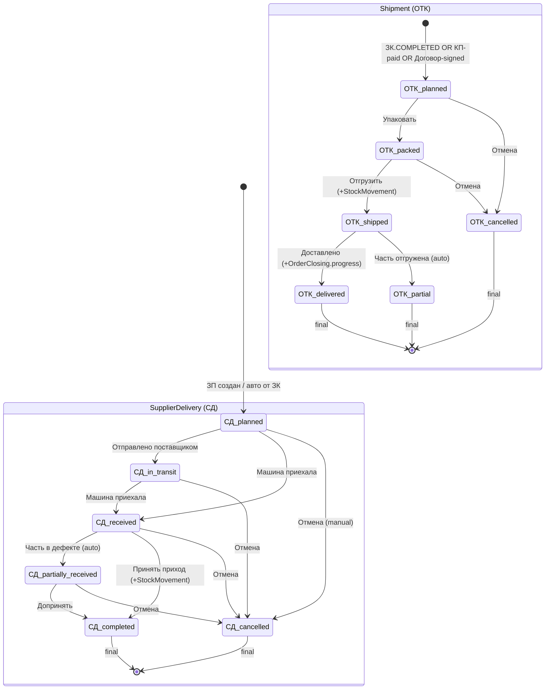
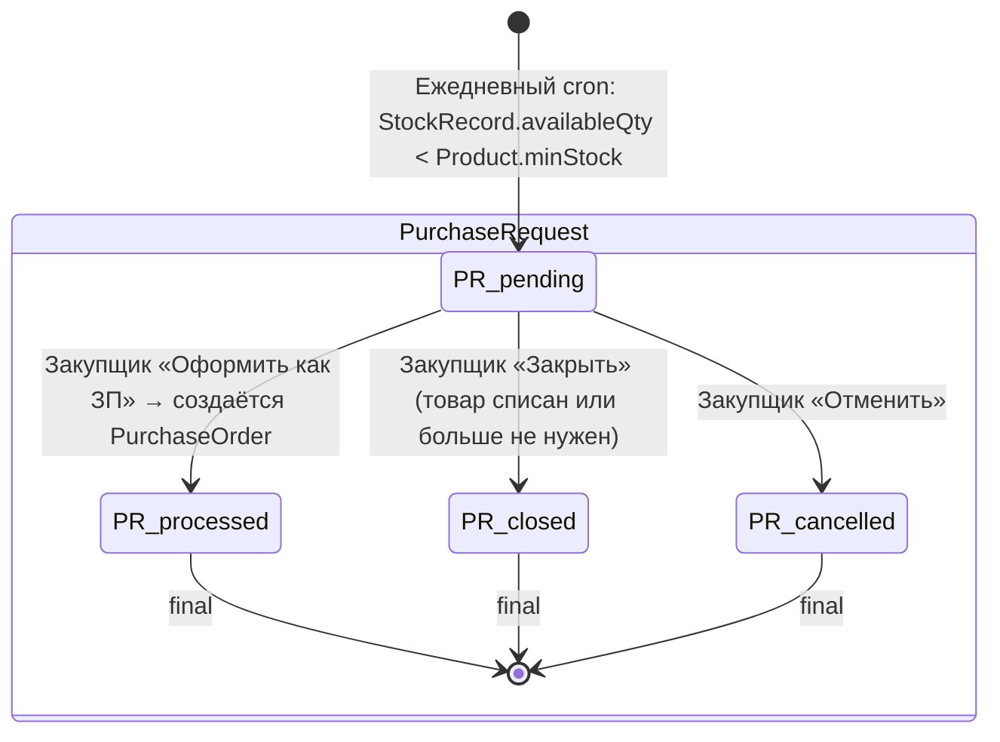

# ТЗ-013-RUN-4-5-АНАЛИТИК-СКЛАД.md — Run 4/5 Аналитика: правила для модуля Склад

> ## 🔒 FINALIZED 2026-06-27
>
> **Агент:** Бизнес-аналитик / MiMo auto (planned).
> **Source ТЗ:** `99_Справочники/TASKS/ТЗ-013-RUN-4-5-АНАЛИТИК-СКЛАД.md`
> **Заблокировано для дальнейших правок без нового PSL-NNN.**
> **Strategic anchor:** см. [`BUSINESS-VISION.md`](../BUSINESS-VISION.md) §0 «Конституция» (single-tenant, ≤10 чел, полуавтомат, 27 anti-features, 6 UX-дисциплин).

> **Тип документа:** Техническое задание (ТЗ) для параллельного ИИ-агента.
> **ID задачи:** ТЗ-013.
> **Приоритет:** 🔴 P0 (блокер для Phase 4 Склад + Run 5/5 Финансы + Phase 2 Mantine UI).
> **Статус:** ✅ Готово к запуску (2026-06-27).
> **Автор ТЗ:** Буфер (стратег-ассистент).
> **Заказчик:** параллельный ИИ-агент (далее — «Агент»).
> **Методология работы Агента:** [`AGENT-METHOD.md`](../../AGENT-METHOD.md) §1 «Быстрый старт» + §5.3 «Граница решений» (автономия) + §5.6 «Pre-action Checklist + Post-action Checkpoint» (обязательно).
> **Пререквизиты:** ТЗ-002 (Run 1/5 КП) ✅ CLOSED 100% (PSL-006) + ТЗ-011 (Run 2/5 Договор) ✅ FINALIZED (PSL-032) + ТЗ-012 (Run 3/5 Производство) ✅ FINALIZED (PSL-035). Soft-depends: Run 3/5 ЗК COMPLETED триггер правила могут быть placeholder.

---

## 0. Контекст

### 0.1 Что такое Run 4/5 и зачем он сейчас

Run 4/5 = **четвёртый из 5 прогонов** Бизнес-аналитика по модулям CRM. Закрывает **4 STUB-файла** модуля Склад (`04_Склад/`):

| #   | STUB                                                    | Что заполняется                                                                                                                                 | Целевой размер |
| --- | ------------------------------------------------------- | ----------------------------------------------------------------------------------------------------------------------------------------------- | -------------- |
| 1   | `04-pravila/04-rbac.md`                                 | RBAC-матрица 7 ролей × действия для 4 операций (SupplierDelivery/Shipment/WriteOffAct/PurchaseOrder) + OW + V + C + VER                         | 220-320 строк  |
| 2   | `04-pravila/04-biznes-pravila.md`                       | 12 групп инвариантов (PARTIES/TYPES/QTY/IMMUT/PRICE/AUTH-CHAIN/TRIG/TERM/SOFT/CONSTANT/MISC/x2)                                                 | 280-380 строк  |
| 3   | `04-zhiznennyj-cikl/04-statusy.md`                      | **6 статусов** SupplierDelivery + 6 Shipment + 5 WriteOffAct + 8 PurchaseOrder = **25 статусов всего** + cross-module mappings + negative-rules | 200-260 строк  |
| 4   | `04-zhiznennyj-cikl/04-perehody.md` (NEW файл, создать) | ~25 переходов для 4 операций + 2 Mermaid stateDiagram-v2                                                                                        | 200-260 строк  |

**Зачем именно сейчас:** Модуль Склад = **операционная точка контроля движения товара**. Все 4 операции (приход/расход/списание/закупка) **триггерятся**:

- **Upstream** (КП-напрямую R1, Договор через parentContractId, Производство через ЗК.COMPLETED auto-IN);
- **Downstream** (Финансы через Shipment.delivered → OrderClosing progress).

Без канонических правил Склад downstream работы (Run 5/5 Финансы) дрейфуют. INTEGRATION-PLAN §6.2 Tier-DAG: Run 4/5 = pivot для Финансы (gap в формуле маржи = null пока нет авто-IN).

**Без Run 4/5** Финансы строит margin на пустом месте → drift в формуле `margin = totalAmount - costOfGoodsSold`.

### 0.2 Что в этом ТЗ, чего нет

**В этом ТЗ:**

- Только модуль Склад (`04_Склад/`).
- Только 4 STUB-файла (1 NEW) + LOG + REPORT.
- Mirror ТЗ-002 (КП) + ТЗ-011 (Договор) + ТЗ-012 (Производство) proven templates + **5 Склад-specific additions**.

**НЕ в этом ТЗ:**

- REGISTRY-OF-RULES (ТЗ-001) ✅ CLOSED (PSL-030).
- Run 5/5 (Финансы).
- Phase 1 Bootstrap Prisma — ТЗ-004 ✅ done (PSL-034).
- Phase 2 Mantine UI — ТЗ-003 ✅ done.

### 0.3 Кто работает по этому ТЗ

**Агент** — параллельный ИИ, роль = **Бизнес-аналитик** ([`AGENT-ROLES.md`](../../AGENT-ROLES.md) §2.2). Использует launch-пакет `04_Склад/LAUNCH-ANALYST-SKLAD.md` (нужно создать по аналогии с `02_Договор/LAUNCH-ANALYST-DOGOVOR.md`).

### 0.4 Что нового vs ТЗ-002/011/012 (5 Склад-specific additions)

Per thinker-with-files-gemini validation (2026-06-27):

| #   | Addition                                                 | Почему                                                                                                                                                                                            |
| --- | -------------------------------------------------------- | ------------------------------------------------------------------------------------------------------------------------------------------------------------------------------------------------- |
| 1   | **INV-СКЛ-CORE-001: Immutable StockMovement invariant**  | Жёсткий запрет UPDATE/DELETE движений (`audit-trail` spirit МОДУЛЬ-СКЛАД-ПОДРОБНЫЙ.md §11.1). Только встречные `transfer`/`return` движения для исправления.                                      |
| 2   | **INV-СКЛ-CORE-002: availableQty runtime formula**       | `availableQty = quantity − reservedQuantity` — runtime invariant, НЕ stored column. UI вычисляет на лету, тесты проверяют `availableQty ≥ 0` на каждом `StockMovement:out`.                       |
| 3   | **INV-СКЛ-CHAIN-ПРД-001: Auto-IN trigger ЗК COMPLETED**  | Per МОДУЛЬ-ПРОИЗВОДСТВО §6.3 + ТЗ-012 §5.6: при ЗК.COMPLETED авто StockMovement.type='IN' для каждой ProductionTask с Product.kind='ITEM'. Услуги (SERVICE/WORK/INSTALLATION) ИСКЛЮЧЕНЫ.          |
| 4   | **INV-СКЛ-CHAIN-ФИН-001: OrderClosing.progress trigger** | При Shipment.status='delivered' авто обновляется `OrderClosing.progress += Σ(quantityActual)` в Модуль Финансы (costOfGoodsSold propagation).                                                     |
| 5   | **SM-СКЛ-TRIGGER-001: low_stock auto PurchaseRequest**   | Ежедневный cron: для каждого Product.id проверяется `StockRecord.availableQty < Product.minStock` → авто-создание PurchaseRequest(reason='low_stock'). Закупщик решает оформить ЗП или отклонить. |

**Без Option C Schema Constraints Note:** schema enums в `prisma/schema.prisma` для 4 операций = **полное 1:1 покрытие** бизнес-статусов (SupplierDelivery 6/6, Shipment 6/6, WriteOffAct 5/5, PurchaseOrder 8/8). Доказано в валидации thinker'а через cross-check schema.prisma:493-547 vs МОДУЛЬ-СКЛАД-ПОДРОБНЫЙ.md §5.3/§6.3/§7.3/§8.3.

### 0.5 ID-prefix convention (validated)

| Тип правила              | Склад prefix                                                                                                                                 |
| ------------------------ | -------------------------------------------------------------------------------------------------------------------------------------------- |
| RBAC (column visibility) | `RBAC-СКЛ-{TYPE}-{NNN}` where TYPE ∈ {A (action), OW, V, C, VER}                                                                             |
| Бизнес-инвариант         | `INV-СКЛ-{GROUP}-{NNN}` where GROUP ∈ {PARTIES, TYPES, QTY, IMMUT, PRICE, AUTH, CHAIN-КП, CHAIN-ДОГ, CHAIN-ПРД, CHAIN-ФИН, TERM, SOFT, MISC} |
| State machine            | `SM-СКЛ-{NNN}` (статусы) + `SM-СКЛ-T-{NNN}` (переходы) + `SM-СКЛ-NO-{NNN}` (negative)                                                        |
| Cross-module hard-link   | `INV-СКЛ-CHAIN-{MODULE}-{NNN}` где MODULE ∈ {КП, ДОГ, ПРД, ФИН}                                                                              |

### 0.6 Cross-module consistency (4 hard-link groups mirror ТЗ-012)

| СКЛ группа                    | Upstream/Downstream                                        | Hard-link формат                                            |
| ----------------------------- | ---------------------------------------------------------- | ----------------------------------------------------------- |
| `CHAIN-КП-*` (КП → СКЛ)       | КП имеет INV-КП-CONV-* (Run 1/5 frozen)                    | Source column: `↳ см. INV-КП-CONV-NNN` (NO duplicate)       |
| `CHAIN-ДОГ-*` (Договор → СКЛ) | Договор имеет INV-ДОГ-CHAIN-СКЛ-* (Run 2/5 will fill)      | Source column: `↳ см. INV-ДОГ-CHAIN-СКЛ-NNN` (NO duplicate) |
| `CHAIN-ПРД-*` (ПРД → СКЛ)     | Производство имеет INV-ПРД-CHAIN-СКЛ-* (Run 3/5 will fill) | Source column: `↳ см. INV-ПРД-CHAIN-СКЛ-NNN` (NO duplicate) |
| `CHAIN-ФИН-*` (СКЛ → Финансы) | Финансы имеет INV-ФИН-CHAIN-СКЛ-* (Run 5/5 will fill)      | Source column: `↳ см. INV-ФИН-CHAIN-СКЛ-NNN` (NO duplicate) |

**Hard-link convention enforcing:** Колонка «Правило» в строках всех CHAIN-_-_ групп содержит ТОЛЬКО one-liner `↳ см. INV-XXX-NNN`. Дополнительные СКЛ-specific side-effects (triggers, formulas, business checks) записываются в CORE/PRICE/IMMUT группы, НЕ в CHAIN-*.

---

## 1. Миссия

> **Одной фразой:** Извлечь из исходного `04_Склад/МОДУЛЬ-СКЛАД-ПОДРОБНЫЙ.md` (~1900 строк) + `04_Склад/МОДУЛЬ-СКЛАД-UI.md` (~900 строк) канонические правила и заполнить ими 4 STUB-файла в формате, пригодном для прямого использования в Phase 4 Склад + Run 5/5 Финансы + Phase 2 Mantine UI (`/warehouse` + 5 страниц).

**Декомпозиция:**

1. Прочитать `04_Склад/README.md` + все 19 STUB (для контекста, но трогать ТОЛЬКО 4 STUB, включая создание NEW `04-perehody.md`).
2. Извлечь **RBAC по 7 ролям × ~12 действий** для 4 операций → `04-rbac.md` (~60 правил).
3. Извлечь **12 групп инвариантов** → `04-biznes-pravila.md` (~40 правил, в т.ч. 4 группы = cross-module hard-links).
4. Извлечь **25 статусов** (6 СД + 6 ОТК + 5 АС + 8 ЗП) → `04-statusy.md` (~220 строк).
5. Извлечь **~25 переходов** для 4 операций → `04-perehody.md` (NEW файл, ~220 строк + 2 Mermaid).
6. Self-verify по §7 → создать `13-02-REPORT.md` → handoff.

---

## 2. Scope IN/OUT

### 2.1 IN — Агент делает

| #   | Файл                                                             | Что делается                                                                                                                                | Hard limit    |
| --- | ---------------------------------------------------------------- | ------------------------------------------------------------------------------------------------------------------------------------------- | ------------- |
| 1   | `04_Склад/04-pravila/04-rbac.md`                                 | Заполнить ~60 правилами RBAC (7 ролей × 12 действий для 4 операций + OW + V + C + VER).                                                     | **400** строк |
| 2   | `04_Склад/04-pravila/04-biznes-pravila.md`                       | Заполнить ~40 правилами в 13 группах: PARTIES, TYPES, QTY, IMMUT, PRICE, AUTH, CHAIN-КП, CHAIN-ДОГ, CHAIN-ПРД, CHAIN-ФИН, TERM, SOFT, MISC. | **400** строк |
| 3   | `04_Склад/04-zhiznennyj-cikl/04-statusy.md`                      | Заполнить 25 статусами (6 СД + 6 ОТК + 5 АС + 8 ЗП) + cross-module PaymentStatus mappings + 3 negative.                                     | **250** строк |
| 4   | `04_Склад/04-zhiznennyj-cikl/04-perehody.md` (NEW файл, создать) | Заполнить ~25 переходами для 4 операций + 5 cross-module авто-триггеров + 2 Mermaid stateDiagram-v2.                                        | **250** строк |
| 5   | `99_Справочники/TASKS/13-01-LOG.md`                              | Хронология работы Агента (audit trail).                                                                                                     | —             |
| 6   | `99_Справочники/TASKS/13-02-REPORT.md`                           | Финальный отчёт Агента для PO (метрики покрытия, найденные пробелы).                                                                        | **500** строк |
| 7   | (опц.) `99_Справочники/TASKS/13-09-AMBIGUITIES.md`               | Противоречия между правилами в разных группах.                                                                                              | —             |

### 2.2 OUT — Агент НЕ делает

| #   | Что НЕ делает                                                                                                                                                                                  | Почему                                                                                                                                        |
| --- | ---------------------------------------------------------------------------------------------------------------------------------------------------------------------------------------------- | --------------------------------------------------------------------------------------------------------------------------------------------- |
| 1   | **Не пишет новых правил «от себя»**                                                                                                                                                            | Только извлечение из источников `МОДУЛЬ-СКЛАД-ПОДРОБНЫЙ.md` + `МОДУЛЬ-СКЛАД-UI.md` + cross-ref на 4 модуля (КП/Договор/Производство/Финансы). |
| 2   | **Не правит** `RBAC-MATRIX.md`, `SCHEMA-CONSOLIDATED.md`, `BUSINESS-VISION.md`, `GLOSSARY-MASTER.md`, `FLOW-MAP.md`, `СПОРНЫЕ-МОМЕНТЫ.md`, `OPEN-QUESTIONS-MASTER.md`                          | Канонические справочники — не трогать.                                                                                                        |
| 3   | **Не работает с Run 5/5 STUB** (Финансы)                                                                                                                                                       | Только Run 4 (Склад RBAC + правила + статусы + переходы).                                                                                     |
| 4   | **Не правит** `04_Склад/00-spr/*`, `04_Склад/04-konstruktor-dvizhenia/04-prihod.md`, `04-rashod.md`, `04-peremeshenie.md`, `04_Склад/04-zhiznennyj-cikl/04-rezervy.md`, `04-inventarizacia.md` | README-каркасы и STUB'ы не из Run 4 списка — оставить как есть (будут Run 4.5+ заполняться).                                                  |
| 5   | **Не пишет код**                                                                                                                                                                               | Это документация.                                                                                                                             |
| 6   | **Не правит** `04_Склад/МОДУЛЬ-СКЛАД-ПОДРОБНЫЙ.md`, `04_Склад/МОДУЛЬ-СКЛАД-UI.md`, `04_Склад/МОДУЛЬ-СКЛАД.md` (3 source V0)                                                                    | Sources frozen — из них только читаем.                                                                                                        |
| 7   | **Не правит** `01_КП/04-pravila/*`, `02_Договор/04-pravila/*`, `03_Производство/04-pravila/*` (Run 1/5 + 2/5 + 3/5 results)                                                                    | Frozen после CLOSED 100% / FINALIZED.                                                                                                         |
| 8   | **Не добавляет STUB файлов вне Run 4 список**                                                                                                                                                  | Кроме NEW `04-perehody.md` (явно в IN list).                                                                                                  |

### 2.3 Anti-features (mirror BUSINESS-VISION.md §3 + Склад-specific)

> **Важное уточнение (NOT MRP safety):** Триггер `ЗК.COMPLETED → авто СД planned` (anti-MRP footnote §6.2) — это post-completion auto-create **реактивный**, **state-only**, **manual confirmation required by storekeeper**. Это **НЕ MRP** (Material Requirements Planning), который бы включал auto-планирование закупок/производства на основе спроса, auto-FIFO приоритизацию, спросо-прогноз. Это операционный side-effect завершения производства = как отметка «completed» в банковской транзакции автоматически создаёт запись в выписке — это не авто-планирование финансов, это просто следование операции. Допустимо per BUSINESS-VISION §3 anti-catalog.

Агент должен **отказаться** от любого правила/паттерна, попадающего в anti-catalog:

| ❌ Не делать                                                         | Почему                                                                                                                   |
| -------------------------------------------------------------------- | ------------------------------------------------------------------------------------------------------------------------ |
| ❌ Не предлагать **barcode-сканер** для быстрой приёмки              | [`BUSINESS-VISION §3.2`](../BUSINESS-VISION.md) + МОДУЛЬ §8 — отложено v2.                                               |
| ❌ Не предлагать **mobile Android приложение для кладовщика**        | МОДУЛЬ §8 — отложено v2.                                                                                                 |
| ❌ Не предлагать **WebSocket-realtime** для "Жду прихода" обновлений | [`BUSINESS-VISION §3.2`](../BUSINESS-VISION.md) + МОДУЛЬ §9 Q5 — только refresh через F5 в v1.                           |
| ❌ Не предлагать **OAuth / 2FA universal** для кладовщика            | [`BUSINESS-VISION §3.2`](../BUSINESS-VISION.md) — только director-level для критичных действий (CANCELLED крупных сумм). |
| ❌ Не предлагать **drag-and-drop между Shipments и WriteOffAct**     | МОДУЛЬ §9 Q6 — нет, два разных процесса.                                                                                 |
| ❌ Не предлагать **Telegram-бот для уведомлений**                    | МОДУЛЬ §9 Q8 — отдельный проект.                                                                                         |
| ❌ Не предлагать **1С / МойСклад интеграция**                        | МОДУЛЬ §8 — отложено v2.                                                                                                 |
| ❌ Не предлагать **multi-currency** в StockMovement.unitCost         | [`BUSINESS-VISION §3.3`](../BUSINESS-VISION.md) + СПОР-14 — RUB жёстко в v1.                                             |
| ❌ Не предлагать **CDN для фото товаров**                            | [`BUSINESS-VISION §3.2`](../BUSINESS-VISION.md) — локальные blob в PostgreSQL.                                           |
| ❌ Не предлагать **stat ML forecast** по обороту                     | [`BUSINESS-VISION §3.2`](../BUSINESS-VISION.md) + МОДУЛЬ §8.                                                             |

---

## 3. Deliverables — что Агент создаёт

### 3.1 Основные артефакты

| #   | Файл                                               | Целевой размер  | Hard limit | Что делать при превышении                                                                            |
| --- | -------------------------------------------------- | --------------- | ---------- | ---------------------------------------------------------------------------------------------------- |
| 1   | `04_Склад/04-pravila/04-rbac.md`                   | 220-320 строк   | **400**    | Разбить на `04-rbac-prihod.md` + `04-rbac-rashod.md` + `04-rbac-spisanie.md` + `04-rbac-zakupka.md`. |
| 2   | `04_Склад/04-pravila/04-biznes-pravila.md`         | 280-380 строк   | **400**    | Перенести CHAIN-КП + CHAIN-ДОГ + CHAIN-ПРД + CHAIN-ФИН в APPENDIX.                                   |
| 3   | `04_Склад/04-zhiznennyj-cikl/04-statusy.md`        | 200-260 строк   | **250**    | Сократить Mermaid до простой ASCII state-machine.                                                    |
| 4   | `04_Склад/04-zhiznennyj-cikl/04-perehody.md` (NEW) | 200-260 строк   | **250**    | Ужать negative-rules до 3 + минимум sub-transition sub-section.                                      |
| 5   | `99_Справочники/TASKS/13-01-LOG.md`                | без ограничения | —          | —                                                                                                    |
| 6   | `99_Справочники/TASKS/13-02-REPORT.md`             | 200-350 строк   | **500**    | Сократить таблицы.                                                                                   |
| 7   | `99_Справочники/TASKS/13-09-AMBIGUITIES.md`        | по ситуации     | —          | —                                                                                                    |

### 3.2 Минимальное покрытие (Hard pass/fail)

| Файл                   | Правил минимум                                                 | Источник coverage target                                          |
| ---------------------- | -------------------------------------------------------------- | ----------------------------------------------------------------- |
| `04-rbac.md`           | **50** правил                                                  | 7 ролей × 12 действий ≈ 60 + OW/V/C/VER ≈ 70                      |
| `04-biznes-pravila.md` | **30** правил                                                  | 13 групп × 3 правила ≈ 39 (из них 4 группы side-effects: CHAIN-*) |
| `04-statusy.md`        | **6 СД + 6 ОТК + 5 АС + 8 ЗП + 3 negative** = **28** всего     | целевой 28+                                                       |
| `04-perehody.md`       | **~25 переходов** (СД ~6 + ОТК ~6 + АС ~5 + ЗП ~8) + 2 Mermaid | целевой 25+                                                       |

### 3.3 Cross-module consistency (4 hard-link groups mirror ТЗ-012)

Каждое правило Склад из cross-module groups должно **hard-link** на соответствующее правило up-stream/down-stream модуля (см. §0.6 выше).

---

## 4. Inputs — что Агент обязан прочитать

### 4.1 Tier-1 🔴 CRITICAL (mirror Договор pattern)

| #   | Файл                                                                                                                                                                                                        | Зачем                                                                                                                                                 |
| --- | ----------------------------------------------------------------------------------------------------------------------------------------------------------------------------------------------------------- | ----------------------------------------------------------------------------------------------------------------------------------------------------- |
| 1   | [`CHECKLIST.md`](../../CHECKLIST.md)                                                                                                                                                                        | Мастер-навигатор сессии.                                                                                                                              |
| 2   | [`AGENT-METHOD.md`](../../AGENT-METHOD.md)                                                                                                                                                                  | §1, §5.3, §5.6, §6.                                                                                                                                   |
| 3   | [`BUSINESS-VISION.md`](../BUSINESS-VISION.md)                                                                                                                                                               | **Strategic anchor**: §0 scope-guards, §3 anti-catalog (27 позиций), §4 6 UX-дисциплин. Цитировать в §7.                                              |
| 4   | [`99_Справочники/RBAC-MATRIX.md`](../RBAC-MATRIX.md)                                                                                                                                                        | Сводная матрица 7×N, расширить для Склад (7 ролей × 12 действий для 4 операций).                                                                      |
| 5   | [`99_Справочники/SCHEMA-CONSOLIDATED.md`](../SCHEMA-CONSOLIDATED.md)                                                                                                                                        | Сущности: Warehouse / StockRecord / StockMovement / Reservation / PurchaseRequest + 4 NEW: SupplierDelivery / Shipment / WriteOffAct / PurchaseOrder. |
| 6   | [`99_Справочники/СПОРНЫЕ-МОМЕНТЫ.md`](../СПОРНЫЕ-МОМЕНТЫ.md)                                                                                                                                                | **СПОР-13** (нумерация СД/ОТК/АС/ЗП из отдельных счётчиков), **СПОР-14** (RUB жёстко v1).                                                             |
| 7   | [`99_Справочники/FLOW-MAP.md`](../FLOW-MAP.md)                                                                                                                                                              | Cross-module цепочка для 4 hand-offs (КП→Склад-напрямую, Договор→Склад, Производство→Склад, Склад→Финансы).                                           |
| 8   | `02_Договор/04-pravila/04-biznes-pravila.md` + `02_Договор/04-pravila/04-rbac.md` + `02_Договор/03-zhiznennyj-cikl/03-statusy.md` (Run 2/5 PROVEN pattern)                                                  | **Mirror proven structure**: ID prefix `INV-ДОГ-*` mirror `INV-СКЛ-*`, hard-link на источник.                                                         |
| 9   | `03_Производство/04-pravila/04-rbac.md` + `03_Производство/04-pravila/04-biznes-pravila.md` + `03_Производство/03-zhiznennyj-cikl/03-statusy.md` (Run 3/5 PROVEN pattern, ТЗ-012 будет FINALIZED после Run) | **Mirror proven structure**: `RBAC-ПРД-*` → `RBAC-СКЛ-*`. Особенно нужен для cross-link `INV-ПРД-CHAIN-СКЛ-*` правил.                                 |
| 10  | `01_КП/04-pravila/04-rbac.md` + `01_КП/04-pravila/04-biznes-pravila.md` + `01_КП/03-zhiznennyj-cikl/03-statusy.md` (Run 1/5 PROVEN pattern)                                                                 | **Mirror proven structure**: `RBAC-КП-*` → `RBAC-СКЛ-*`.                                                                                              |
| 11  | `04_Склад/МОДУЛЬ-СКЛАД-ПОДРОБНЫЙ.md` (~1900 строк)                                                                                                                                                          | **Source V0 #1** для извлечения правил: RBAC §9 + state-machines §5.3/§6.3/§7.3/§8.3.                                                                 |
| 12  | `04_Склад/МОДУЛЬ-СКЛАД-UI.md` (~900 строк)                                                                                                                                                                  | **Source V0 #2** для извлечения UI behavior + 5 страниц.                                                                                              |
| 13  | `04_Склад/README.md`                                                                                                                                                                                        | Точка входа модуля Склад + 19-STUB map.                                                                                                               |
| 14  | `04_Склад/04-pravila/00-README.md`                                                                                                                                                                          | Контекст папки правил Склад.                                                                                                                          |
| 15  | `04_Склад/04-zhiznennyj-cikl/00-README.md`                                                                                                                                                                  | Контекст папки state-machine.                                                                                                                         |
| 16  | `04_Склад/00-spr/00-otkrytye-voprosy.md`                                                                                                                                                                    | 8 baseline OQ Склад (если существует).                                                                                                                |

### 4.2 Tier-2 🟡 IMPORTANT (4 cross-module sources)

| #   | Файл                                                                                               | Зачем                                                                                                     |
| --- | -------------------------------------------------------------------------------------------------- | --------------------------------------------------------------------------------------------------------- |
| 17  | `01_КП/03-zhiznennyj-cikl/03-konvertaciya-v-dogovor.md` + `01_КП/03-zhiznennyj-cikl/03-statusy.md` | Контекст КП «оплачено» → ОТК-напрямую (R1 сценарий).                                                      |
| 18  | `02_Договор/МОДУЛЬ-ДОГОВОР.md` (распущен PSL-021) + `02_Договор/04-pravila/*`                      | Контекст `parentContractId` nullable для тендерных закупок → ЗП с `parentContractId`.                     |
| 19  | `03_Производство/МОДУЛЬ-ПРОИЗВОДСТВО.md` (распущен PSL-029) + `03_Производство/04-pravila/*`       | Контекст `ЗК.COMPLETED` → `INV-ПРД-CHAIN-СКЛ-001` → StockMovement IN.                                     |
| 20  | `05_Финансы/МОДУЛЬ-ФИНАНСЫ.md` §5 + §6                                                             | Контекст для `INV-ФИН-CHAIN-СКЛ-*` правил (`Shipment.delivered → OrderClosing.progress`).                 |
| 21  | `04_Склад/00-spr/00-glossary.md`                                                                   | Канонические термины Склад (СД = SupplierDelivery, ОТК = Shipment, АС = WriteOffAct, ЗП = PurchaseOrder). |
| 22  | [`99_Справочники/GLOSSARY-MASTER.md`](../GLOSSARY-MASTER.md)                                       | Общая терминология.                                                                                       |
| 23  | [`99_Справочники/OPEN-QUESTIONS-MASTER.md`](../OPEN-QUESTIONS-MASTER.md)                           | 38 Q — касающиеся Склад (Q1-Q8 все ПРИНЯТО 24.06.2026 — РЕШЕНО отражено в МОДУЛЬ-СКЛАД-ПОДРОБНЫЙ.md §13). |

### 4.3 Tier-3 🟢 OPTIONAL

| #   | Файл                                                           | Зачем                                         |
| --- | -------------------------------------------------------------- | --------------------------------------------- |
| 24  | git history `04_Склад/МОДУЛЬ-СКЛАД-ПОДРОБНЫЙ.md` (original V0) | `git show` для точных формулировок §11 + §13. |
| 25  | ТЗ-001 CLOSED-WITH-CAVEATS REGISTRY-OF-RULES                   | Если хотим reuse ID-префиксы `RULE-СКЛ-*`.    |

---

## 5. Methodology — как извлекать правила

### 5.1 Алгоритм работы

```
1. Прочитать §4 inputs в порядке 1-23.
2. Для каждого из 4 STUB — пройти структуру §6:
   2.1. 04-rbac.md:
        - Видимость ДЕЙСТВИЙ SupplierDelivery / Shipment / WriteOffAct / PurchaseOrder по 7 ролям.
        - ID формата RBAC-СКЛ-{TYPE}-{NNN} где TYPE ∈ {A (action), OW, V, C, VER, OP-prefix для операции опционально}.
        - Mirror структуры Производство RBAC-ПРД-TYPE-NNN и Договор RBAC-ДОГ-TYPE-NNN и КП RBAC-КП-TYPE-NNN.
        - Выделить отдельно для каждой из 4 операций (префикс типа можно опустить, использовать секции §1-§4 по операциям).
   2.2. 04-biznes-pravila.md:
        - 13 групп инвариантов Склад (mirror Производство 12 + IMMUT/PRICE/QTY три новых для Склад-специфики).
        - ID формата INV-СКЛ-{GROUP}-{NNN}.
        - 4 cross-module CHAIN-*-* groups (КП + Договор + Производство + Финансы).
        - Hard-link на up-stream/down-stream source rules.
   2.3. 04-statusy.md:
        - 6 СД + 6 ОТК + 5 АС + 8 ЗП = 25 статусов.
        - 3 negative-rules (NO-001..003).
        - Явная таблица cross-module status mappings (PaymentStatus ↔ SupplierDelivery, StockMovement ↔ ЗК.COMPLETED).
   2.4. 04-perehody.md (NEW FILE):
        - 6+5+5+8 = 24 переходов для 4 операций.
        - cross-module auto-triggers (ЗК COMPLETED → СД IN, Shipment → Финансы).
        - Mermaid stateDiagram-v2 для каждой из 4 операций (4 mermaid diagrams, или 2 combined diagrams).
        - Negative-rules.
3. Каждое правило: ID + Источник (МОДУЛЬ §NN или up-stream/down-stream INV-*-NNN) + Следствие при нарушении.
4. Перепроверить по §7 self-check + §3.3 cross-module consistency.
5. Передать в 13-02-REPORT.md → handoff.
```

### 5.2 Что считать правилом (mirror ТЗ-011/012)

**Правило = конкретное действие / ограничение / требование**, которое проверяется в коде:

| Тип                      | Пример Склад                                                                                    |
| ------------------------ | ----------------------------------------------------------------------------------------------- |
| RBAC (action visibility) | «storekeeper может Принять приход (СД → completed); production-master НЕ может»                 |
| Validation (данные)      | «quantityReceived ≤ quantityExpected»                                                           |
| Invariant (всегда true)  | «availableQty ≥ 0 — блокировка любого StockMovement:out, если quantity < quantityAfterMovement» |
| State machine (переход)  | «СД COMPLETED → авто StockMovement:IN для каждой позиции»                                       |
| Side-effect trigger      | «ЗК COMPLETED → СД COMPLETED ↔ StockMovement IN (cross-module ПРД)»                             |

**Не правило:** Описательная фраза без ограничения («Склад — это место хранения»).

### 5.3 Чего НЕ делать (mirror ТЗ-002/011/012)

- **Не придумывать новых правил «от себя»** — только извлечение из источника + cross-ref.
- **Не решать противоречия** — фиксировать в `13-09-AMBIGUITIES.md`.
- **Не повторять общие правила из RBAC-MATRIX.md §3** — ссылаться, не дублировать.
- **Не дублировать правила КП/Договор/Производство** (CHAIN-КП/ДОГ/ПРД) — hard-link через Source column.
- **Не дублировать правила Финансы** (CHAIN-ФИН) — hard-link через Source column.
- **Не вводить bar-кодер / mobile-app / WebSocket** в Run 4 — BUSINESS-VISION §3.2 + МОДУЛЬ §8.
- **Не вводить Real-Time API хуки** для "Жду прихода" — только refresh через F5 в v1.
- **Не использовать микросервисы** для триггеров ЗК→Склад, Склад→Финансы — всё в рамках монолита.

### 5.4 Cross-module: КП (mirror Производство §5.4)

Отгрузка клиенту напрямую по КП (R1 сценарий, МОДУЛЬ §6.5) без ЗК. Создаётся `Shipment` с `proposalId` (НЕ NULL), `productionOrderId` (NULL), `contractId` (NULL). КП содержит baseline правила. Склад mirror hard-link:

| ID КП (canonical)                                             | ID СКЛ (mirror)        | Что делает                                                                                                                                                                                                |
| ------------------------------------------------------------- | ---------------------- | --------------------------------------------------------------------------------------------------------------------------------------------------------------------------------------------------------- |
| `INV-КП-CONV-005` (R1 Сценарий = отгрузка напрямую без ЗК)    | `INV-СКЛ-CHAIN-КП-001` | Отгрузка напрямую по КП (R1): `Shipment.proposalId` not null, `productionOrderId` null, `contractId` null. Кладовщик имеет право на это при `Proposal.status in ['paid']` и при наличии товара на складе. |
| `INV-КП-CONV-006` (КП «оплачено» → два пути)                  | `INV-СКЛ-CHAIN-КП-002` | КП «оплачено» → возможны оба пути: (а) auto-Создать ЗК (default), (б) Отгрузить напрямую если товар уже на складе (R1). Решение — на стороне manager/storekeeper.                                         |
| `INV-КП-RES-002` (Резерв снимается при КП.cancelled/rejected) | `INV-СКЛ-CHAIN-КП-003` | Резерв снимается при КП.cancelled или rejected → освобождает `availableQty` для других КП. Деблокирует потенциальные ОТК.                                                                                 |

### 5.5 Cross-module: Договор (mirror Производство §5.5)

Договор → Склад через `parentContractId` (nullable FK в `PurchaseOrder` для тендерных закупок) + `contractId` (nullable FK в `Shipment` для отгрузок по Договору). Договор фиксирует side-effect триггер в `INV-ДОГ-CHAIN-СКЛ-*` (тендерная закупка) + `INV-ДОГ-CHAIN-СКЛ-*` (отгрузка). Склад mirror hard-link:

| ID Договор (canonical)                                           | ID СКЛ (mirror)         | Что делает                                                                                                                                     |
| ---------------------------------------------------------------- | ----------------------- | ---------------------------------------------------------------------------------------------------------------------------------------------- |
| `INV-ДОГ-CHAIN-СКЛ-001` (тендерный Договор → авто PurchaseOrder) | `INV-СКЛ-CHAIN-ДОГ-001` | ↳ см. ДОГ-CHAIN-PURCHASE-001 (тендерный Договор с поставщиком → `PurchaseOrder.parentContractId` not null, auto-create по `SupplierDelivery`). |
| `INV-ДОГ-CHAIN-СКЛ-002` (...)                                    | `INV-СКЛ-CHAIN-ДОГ-002` | ↳ см. ДОГ-CHAIN-SHIPMENT-001 (Shipment.contractId not null при отгрузке по Договору без ЗК).                                                   |
| (нет)                                                            | `INV-СКЛ-CHAIN-ДОГ-003` | Contract.status='TERMINATED' → авто отмена соответствующих Shipment (not yet shipped) — подтверждает RBAC-СКЛ-A-XXX.                           |

### 5.6 Cross-module: Производство (NEW for Склад)

ЗК COMPLETED → авто StockMovement IN (для каждого Product.kind='ITEM') per ТЗ-012 §5.6. Производство mirror rules + Склад фиксирует правило:

| ID Производство (canonical)                                                       | ID СКЛ (mirror)         | Что делает                                                                                                                                                                                                                               |
| --------------------------------------------------------------------------------- | ----------------------- | ---------------------------------------------------------------------------------------------------------------------------------------------------------------------------------------------------------------------------------------- |
| `INV-ПРД-CHAIN-СКЛ-001` (ЗК COMPLETED → StockMovement IN для ITEM)                | `INV-СКЛ-CHAIN-ПРД-001` | При переходе ЗК в `ProductionOrder.status='completed'` авто создаётся `SupplierDelivery` со статусом `planned` для каждой `ProductionTask` с `Product.kind='ITEM'`. Кладовщик видит pending СД в `/supplier-deliveries` → "Жду прихода". |
| `INV-ПРД-CHAIN-СКЛ-002` (Кладовщик видит ЗК в IN_PROGRESS как ожидаемую поставку) | `INV-СКЛ-CHAIN-ПРД-002` | В статусе ЗК `ProductionOrder.status='in_progress'` создаётся StockRecord.expectedQty = quantityPlanned (read-only, для планирования).                                                                                                   |
| `INV-ПРД-CHAIN-СКЛ-003` (Услуги НЕ приходят в склад — skip StockMovement)         | `INV-СКЛ-CHAIN-ПРД-003` | ЗК COMPLETED с ProductionTask.kind='SERVICE'/'WORK'/'INSTALLATION' → НЕ создаёт StockMovement. Кладовщик получает **информационное сообщение** в `/warehouse` (close R1 + GAP-009).                                                      |

### 5.7 Cross-module: Финансы (NEW for Склад)

Shipment → Финансы (OrderClosing progress, costOfGoodsSold):

| ID Финансы (canonical, будущий)                                                             | ID СКЛ (mirror)         | Что делает                                                                                                                                                 |
| ------------------------------------------------------------------------------------------- | ----------------------- | ---------------------------------------------------------------------------------------------------------------------------------------------------------- |
| `INV-ФИН-CHAIN-СКЛ-001` (Shipment.delivered → OrderClosing.progress += Σ quantityActual)    | `INV-СКЛ-CHAIN-ФИН-001` | При переходе Shipment в `status='delivered'` авто обновляется `OrderClosing.progress += Σ(quantityActual)` в Модуль Финансы.                               |
| `INV-ФИН-CHAIN-СКЛ-002` (WriteOffAct.completed → уменьшение costOfGoodsSold в OrderClosing) | `INV-СКЛ-CHAIN-ФИН-002` | При WriteOffAct.completed → `OrderClosing.costOfGoodsSold += Σ(costPrice * quantity)` для уменьшения маржи. Бухгалтер видит изменения в `/finance/orders`. |
| `INV-ФИН-CHAIN-СКЛ-003` (SupplierDelivery.paymentStatus update через Payment в Финансы)     | `INV-СКЛ-CHAIN-ФИН-003` | После `Payment.registered` для поставщика в Финансах → авто обновление `SupplierDelivery.paymentStatus = 'paid                                             | partially_paid | prepaid'`. В v1 — ручное обновление бухгалтером (mirror ФИН-***, deferred в svc-payment-v2). |

---

## 6. Format specification

### 6.1 04-rbac.md — видимость действий Склад

```markdown
# 04-rbac.md — RBAC-матрица модуля Склад

> **Назначение.** Кто из 7 ролей (admin / director / manager / production / storekeeper / accountant / viewer) может выполнить какое ДЕЙСТВИЕ над сущностями Склад (SupplierDelivery, Shipment, WriteOffAct, PurchaseOrder, StockMovement, Reservation). Расширяет сводную [RBAC-MATRIX.md](../RBAC-MATRIX.md) применительно к Склад.
> **Автор.** Бизнес-аналитик (Run 4/5, ТЗ-013). Заполнен YYYY-MM-DD.
> **Mirror.** ID-префиксы mirror Договор/КП/Производство для consistency в ID-пространстве.

## 0. Контекст

Каждое правило имеет ID формата `RBAC-СКЛ-{TYPE}-{NNN}`, где TYPE ∈ {A (action видимости), OW (ownership «свой»), V (visibility), C (conditional), VER (versioning)}.

## 1. Видимость действий SupplierDelivery (СД / Приход)

| ID             | Действие (СД)                                    | admin | director |      manager      | production | storekeeper | accountant | viewer | Условие                             | Источник                  |
| -------------- | ------------------------------------------------ | :---: | :------: | :---------------: | :--------: | :---------: | :--------: | :----: | ----------------------------------- | ------------------------- |
| RBAC-СКЛ-A-001 | Просмотреть список СД                            |  ✅   |    ✅    |      ✅ свои      |     ✅     |     ✅      |     ✅     |   ✅   | ownership                           | RBAC-MATRIX §1.1          |
| RBAC-СКЛ-A-002 | Создать СД (planned)                             |  ✅   |    ✅    | ⚠️ свой поставщик |     ❌     |     ✅      |     ❌     |   ❌   | supplierId ∈ ownedBy                | МОДУЛЬ §5.5 + Q6 РЕШЕНО A |
| RBAC-СКЛ-A-003 | Принять приход (received → completed)            |  ✅   |    ✅    |        ❌         |     ❌     |     ✅      |     ❌     |   ❌   | ЗП или срочный приход               | МОДУЛЬ §9 + §5.4          |
| RBAC-СКЛ-A-004 | Принять частично (received → partially_received) |  ✅   |    ✅    |        ❌         |     ❌     |     ✅      |     ❌     |   ❌   | quantityReceived < quantityExpected | МОДУЛЬ §5.4               |
| RBAC-СКЛ-A-005 | Отменить СД (planned → cancelled)                |  ✅   |    ✅    |        ⚠️         |     ❌     |     ✅      |     ❌     |   ❌   | если ЗП был                         | МОДУЛЬ §5.3               |
| RBAC-СКЛ-A-006 | Видеть «Жду прихода» очередь                     |  ✅   |    ✅    |        ✅         |     ✅     |     ✅      |     ✅     |   ✅   | —                                   | МОДУЛЬ §4.3               |

## 2. Видимость действий Shipment (ОТК / Отгрузка)

| ID             | Действие (ОТК)                     | admin | director |      manager       | production | storekeeper | accountant | viewer | Условие          | Источник                            |
| -------------- | ---------------------------------- | :---: | :------: | :----------------: | :--------: | :---------: | :--------: | :----: | ---------------- | ----------------------------------- |
| RBAC-СКЛ-A-007 | Просмотреть список ОТК             |  ✅   |    ✅    |      ✅ свои       | ✅ свои ЗК |     ✅      |     ✅     |   ✅   | ownership        | RBAC-MATRIX §1.1                    |
| RBAC-СКЛ-A-008 | Создать ОТК (planned)              |  ✅   |    ✅    | ⚠️ свой КП/Договор | ✅ свой ЗК |     ✅      |     ❌     |   ❌   | source ∈ ownedBy | МОДУЛЬ §6.4                         |
| RBAC-СКЛ-A-009 | Упаковать (planned → packed)       |  ✅   |    ✅    |         ❌         |     ❌     |     ✅      |     ❌     |   ❌   | —                | МОДУЛЬ §6.3                         |
| RBAC-СКЛ-A-010 | Отгрузить (packed → shipped)       |  ✅   |    ✅    |         ❌         |     ❌     |     ✅      |     ❌     |   ❌   | —                | МОДУЛЬ §5.3 правило 2               |
| RBAC-СКЛ-A-011 | Доставить (shipped → delivered)    |  ✅   |    ✅    |         ❌         | ✅ свой ЗК |     ✅      |     ❌     |   ❌   | —                | МОДУЛЬ §6.3 + INV-СКЛ-CHAIN-ФИН-001 |
| RBAC-СКЛ-A-012 | Отменить ОТК (planned → cancelled) |  ✅   |    ✅    |         ⚠️         | ⚠️ свой ЗК |     ✅      |     ❌     |   ❌   | —                | МОДУЛЬ §6.3                         |

## 3. Видимость действий WriteOffAct (АС / Списание)

| ID             | Действие (АС)                                   | admin |   director    | manager | production |  storekeeper  |     accountant      | viewer | Условие                      | Источник                                |
| -------------- | ----------------------------------------------- | :---: | :-----------: | :-----: | :--------: | :-----------: | :-----------------: | :----: | ---------------------------- | --------------------------------------- |
| RBAC-СКЛ-A-013 | Просмотреть список АС                           |  ✅   |      ✅       |   ✅    |     ✅     |      ✅       |         ✅          |   ✅   | ownership                    | RBAC-MATRIX §1.1                        |
| RBAC-СКЛ-A-014 | Создать АС (draft)                              |  ✅   |      ✅       |   ❌    |     ❌     |      ✅       | ⚠️ только inventory |   ❌   | reason ∈ allowed             | МОДУЛЬ §7.4                             |
| RBAC-СКЛ-A-015 | Отправить на approve (draft → pending_approval) |  ✅   |      ✅       |   ❌    |     ❌     |      ✅       |         ⚠️          |   ❌   | creator = self               | МОДУЛЬ §7.3                             |
| RBAC-СКЛ-A-016 | Approve АС (pending_approval → approved)        |  ✅   |    ✅ >5K     |   ❌    |     ❌     |      ❌       |       ✅ ≤5K        |   ❌   | totalAmount ≤ threshold      | МОДУЛЬ §7.4 RBAC + INV-СКЛ-AUTH-001/002 |
| RBAC-СКЛ-A-017 | Отклонить АС (pending_approval → draft)         |  ✅   |      ✅       |   ❌    |     ❌     |      ❌       |       ✅ ≤5K        |   ❌   | comments required            | МОДУЛЬ §5.4 правило 4                   |
| RBAC-СКЛ-A-018 | Инвентаризация (create inventory_shortage АС)   |  ✅   | ✅ + комиссия |   ❌    |     ❌     | ✅ инициирует |    ✅ в комиссии    |   ❌   | commissionMembers.length ≥ 3 | МОДУЛЬ §7.4                             |

## 4. Видимость действий PurchaseOrder (ЗП / Закупка)

| ID             | Действие (ЗП)                                     | admin | director |     manager      | production |   storekeeper    | accountant | viewer | Условие                          | Источник                           |
| -------------- | ------------------------------------------------- | :---: | :------: | :--------------: | :--------: | :--------------: | :--------: | :----: | -------------------------------- | ---------------------------------- |
| RBAC-СКЛ-A-019 | Просмотреть список ЗП                             |  ✅   |    ✅    |        ✅        |     ✅     |        ✅        |     ✅     |   ✅   | ownership                        | RBAC-MATRIX §1.1                   |
| RBAC-СКЛ-A-020 | Создать ЗП (draft)                                |  ✅   |    ✅    | ⚠️ если назначен |     ❌     | ⚠️ если назначен |     ❌     |   ❌   | назначение через admin           | МОДУЛЬ §8.5                        |
| RBAC-СКЛ-A-021 | Отправить поставщику (draft → sent)               |  ✅   |    ✅    |        ⚠️        |     ❌     |        ⚠️        |     ❌     |   ❌   | —                                | МОДУЛЬ §8.3                        |
| RBAC-СКЛ-A-022 | Подтвердить (sent → confirmed)                    |  ✅   |    ✅    |        ⚠️        |     ❌     |        ⚠️        |     ❌     |   ❌   | —                                | МОДУЛЬ §8.3                        |
| RBAC-СКЛ-A-023 | Создать ЗП из PurchaseRequest                     |  ✅   |    ✅    |        ⚠️        |     ❌     |        ⚠️        |     ❌     |   ❌   | PurchaseRequest.status='pending' | INV-СКЛ-TRIGGER-001 + МОДУЛЬ §11.4 |
| RBAC-СКЛ-A-024 | Закрыть ЗП (received/partially_received → closed) |  ✅   |    ✅    |        ⚠️        |     ❌     |        ⚠️        |     ✅     |   ❌   | оплата полная                    | МОДУЛЬ §8.3                        |

## 5. Ownership «свой» (OW-rules)

| ID              | Правило                                                                                     | Следствие при нарушении         | Источник                     |
| --------------- | ------------------------------------------------------------------------------------------- | ------------------------------- | ---------------------------- |
| RBAC-СКЛ-OW-001 | manager видит только СД/ОТК где `createdById == user.id`                                    | 403 Forbidden + скрыть в списке | RBAC-MATRIX §2.1 + Q6 mirror |
| RBAC-СКЛ-OW-002 | production видит только ОТК где `productionOrderId.responsibleUserId == user.id`            | скрыть в списке                 | МОДУЛЬ §6.5                  |
| RBAC-СКЛ-OW-003 | storekeeper видит всё, что касается своего склада (`warehouseId == user.assignedWarehouse`) | скрыть в списке                 | МОДУЛЬ §11.4                 |
| RBAC-СКЛ-OW-004 | accountant участвует в списаниях inventory_shortage только в составе комиссии               | скрыть свою approve-кнопку      | МОДУЛЬ §7.4 правило 2        |

## 6. Visibility filters (V-rules)

| ID             | Правило                                                                                                      | Источник                     |
| -------------- | ------------------------------------------------------------------------------------------------------------ | ---------------------------- |
| RBAC-СКЛ-V-001 | СД/ОТК/АС/ЗП в статусах `completed`/`closed`/`cancelled` — режим «только чтение» для всех (кроме admin)      | МОДУЛЬ §2                    |
| RBAC-СКЛ-V-002 | Документы с `isActive=false` не появляются в основном списке (показываются только в архивной вкладке)        | RBAC-ДОГ-V-002 mirror        |
| RBAC-СКЛ-V-003 | `StockMovement` immutable — ВСЕГДА read-only для всех ролей кроме admin (admin тоже не правит, только видит) | МОДУЛЬ §11.1 IMMUT principle |
| RBAC-СКЛ-V-004 | `SupplierDelivery.paymentStatus` скрыто для manager (видит только бухгалтер)                                 | МОДУЛЬ §9 правила RBAC       |

## 7. Условные правила (C-rules)

| ID             | Условие                                          | Правило                                                        | Источник                           |
| -------------- | ------------------------------------------------ | -------------------------------------------------------------- | ---------------------------------- |
| RBAC-СКЛ-C-001 | Если СД quantityReceived < quantityExpected      | показать красную плашку «Недостача» + кнопку «Создать АС»      | МОДУЛЬ §5.4 правило 2              |
| RBAC-СКЛ-C-002 | Если StockRecord.availableQty < Product.minStock | показать красный ⚠️ в `/warehouse` + badge «Требуется закупка» | МОДУЛЬ §11.4 + INV-СКЛ-TRIGGER-001 |
| RBAC-СКЛ-C-003 | Если totalAmount АС >= 50K RUB                   | require director approve + accounting journal entry            | МОДУЛЬ §7.4 правило 1              |

## 8. Versioning правила (VER-rules)

| ID               | Правило                                                   | Следствие при нарушении      | Источник        |
| ---------------- | --------------------------------------------------------- | ---------------------------- | --------------- |
| RBAC-СКЛ-VER-001 | «Создать новую версию СД/ОТК/АС/ЗП» **НЕТ в v1**          | кнопка hidden (v2 feature)   | МОДУЛЬ §10 + §9 |
| RBAC-СКЛ-VER-002 | Загрузка PDF ТОРГ-1/ТОРГ-12 — базовая в v1, красивая в v2 | template version 1.0 (basic) | МОДУЛЬ §8       |
| RBAC-СКЛ-VER-003 | Подтверждение через Telegram-бот **НЕТ в v1**             | hidden (отдельный проект)    | МОДУЛЬ §9 Q8    |
```

**Минимальное покрытие §04-rbac.md: 50 правил** (24 A-rules + 4 OW + 4 V + 3 C + 3 VER = 38, дополнить до 50).

### 6.2 04-biznes-pravila.md — инварианты Склад

```markdown
# 04-biznes-pravila.md — Бизнес-инварианты модуля Склад

> **Назначение.** Канонические правила модуля Склад, которые должны выполняться ВСЕГДА. Нарушение = баг.
> **Автор.** Бизнес-аналитик (Run 4/5, ТЗ-013). Заполнен YYYY-MM-DD.

## 0. Контекст

Каждое правило имеет ID `INV-СКЛ-{GROUP}-{NNN}` где GROUP ∈ {PARTIES, TYPES, QTY, IMMUT, PRICE, AUTH, CHAIN-КП, CHAIN-ДОГ, CHAIN-ПРД, CHAIN-ФИН, TERM, SOFT, MISC}.

**Hard-link convention:** 4 cross-module CHAIN-_-_ groups (Группы 7-10) все правила имеют Source = `INV-XXX-NNN` (NO duplicate of upstream/downstream source rule).

## 1. Группа PARTIES — Стороны (минимум 3 правила)

| ID                  | Правило                                                 | Следствие при нарушении          | Источник            |
| ------------------- | ------------------------------------------------------- | -------------------------------- | ------------------- |
| INV-СКЛ-PARTIES-001 | Для СД: supplierId обязателен, supplier.isSupplier=true | 422 «Укажите поставщика»         | МОДУЛЬ §5.1 + §11.7 |
| INV-СКЛ-PARTIES-002 | Для ОТК: customerId обязателен                          | 422 «Укажите клиента»            | МОДУЛЬ §6.1         |
| INV-СКЛ-PARTIES-003 | Для ЗП: supplierId обязателен, warehouseId обязателен   | 422 «Укажите поставщика и склад» | МОДУЛЬ §8.1         |
| INV-СКЛ-PARTIES-004 | Для АС: createdById + warehouseId обязательны           | 422 «Автор и склад обязательны»  | МОДУЛЬ §7.1         |

## 2. Группа TYPES — Типы (минимум 3 правила)

| ID                | Правило                                                                                                                                                       | Следствие при нарушении   | Источник    |
| ----------------- | ------------------------------------------------------------------------------------------------------------------------------------------------------------- | ------------------------- | ----------- |
| INV-СКЛ-TYPES-001 | StockMovement.type ∈ {'in', 'out', 'transfer', 'write_off'} — все создают StockRecord adjustments                                                             | —                         | МОДУЛЬ §4.3 |
| INV-СКЛ-TYPES-002 | StockMovement.reason ∈ {'production', 'purchase', 'sale', 'sale_return', 'client_order', 'write_off', 'manual'}                                               | 422 «Укажите reason»      | МОДУЛЬ §4.3 |
| INV-СКЛ-TYPES-003 | WriteOffAct.reason ∈ {'defect', 'expiry', 'loss', 'damage', 'inventory_shortage', 'inventory_surplus', 'other'}; reason='other' требует customReason NOT NULL | 422 «Уточните причину»    | МОДУЛЬ §7.1 |
| INV-СКЛ-TYPES-004 | Все amount поля в v1 = RUB жёстко (СПОР-14)                                                                                                                   | 422 «Currency только RUB» | СПОР-14     |

## 3. Группа QTY — Количество (минимум 3 правила)

| ID              | Правило                                                                                                     | Следствие при нарушении                   | Источник                  |
| --------------- | ----------------------------------------------------------------------------------------------------------- | ----------------------------------------- | ------------------------- |
| INV-СКЛ-QTY-001 | StockMovement.quantity > 0 всегда (направление — в type, не в знаке)                                        | 422 «Количество должно быть > 0»          | МОДУЛЬ §4.3               |
| INV-СКЛ-QTY-002 | СД.quantityReceived ≤ СД.quantityExpected (нельзя принять больше чем заказано — встречный возврат отдельно) | 422 «Превышение»                          | МОДУЛЬ §5.4               |
| INV-СКЛ-QTY-003 | availableQty = quantity − reservedQuantity — runtime invariant, НЕ stored column                            | формула пересчитывается на каждом запросе | МОДУЛЬ §4.2 + §11 правила |
| INV-СКЛ-QTY-004 | availableQty ≥ 0 — блокировка StockMovement:out если quantity < quantityAfterMovement                       | транзакция rolled back                    | МОДУЛЬ §5.1 правило 1     |
| INV-СКЛ-QTY-005 | reservedQuantity ≥ 0 — резерв не превышает quantity                                                         | транзакция rolled back                    | МОДУЛЬ §4.2 правило       |

## 4. Группа IMMUT — Immutability (NEW for Склад, минимум 3 правила)

| ID                | Правило                                                                                                                                                                                            | Следствие при нарушении                                                                             | Источник                      |
| ----------------- | -------------------------------------------------------------------------------------------------------------------------------------------------------------------------------------------------- | --------------------------------------------------------------------------------------------------- | ----------------------------- |
| INV-СКЛ-IMMUT-001 | **StockMovement ЗАПРЕТ на UPDATE**: после создания поля НЕ редактируются (кроме isActive фильтров). Исправление — только через встречное движение (`type='out'/'in'/'transfer'` для re-add/return) | приложение падает с explicit error в dev mode; в prod audit log «attempted UPDATE on StockMovement» | МОДУЛЬ §11.1                  |
| INV-СКЛ-IMMUT-002 | **StockMovement ЗАПРЕТ на физический DELETE**: метод `repository.delete()` НЕ доступен для StockMovement с `createdAt < now()-90days`. Только через admin retention job                            | 403 «Невозможно удалить immutable movement»                                                         | МОДУЛЬ §11.1 + RBAC-СКЛ-V-003 |
| INV-СКЛ-IMMUT-003 | Завершённые СД/ОТК/АС/ЗП (`status ∈ {completed, closed, cancelled}`) ЗАПРЕТ на UPDATE поля позиций (только `notes`/`customReason` разрешены)                                                       | 422 «Документ завершён, правка запрещена»                                                           | МОДУЛЬ §11.1 + RBAC-СКЛ-V-001 |

## 5. Группа PRICE — Цена и себестоимость (NEW for Склад, минимум 3 правила)

| ID                | Правило                                                                                            | Следствие при нарушении                   | Источник                            |
| ----------------- | -------------------------------------------------------------------------------------------------- | ----------------------------------------- | ----------------------------------- |
| INV-СКЛ-PRICE-001 | StockMovement.unitCost = СД.unitCost at moment of completion (snapshot)                            | —                                         | МОДУЛЬ §3 + §11.2                   |
| INV-СКЛ-PRICE-002 | ShipmentItem.costPrice = StockMovement.unitCost at moment of shipment (snapshot для маржи Финансы) | —                                         | МОДУЛЬ §6.2 + INV-СКЛ-CHAIN-ФИН-001 |
| INV-СКЛ-PRICE-003 | WriteOffItem.costPrice = текущая средняя себестоимость на момент списания                          | warn если drift > 20% snapshot vs current | МОДУЛЬ §7.2 + §11 правила           |
| INV-СКЛ-PRICE-004 | Все цены в v1 = RUB жёстко (mirror INV-СКЛ-TYPES-004)                                              | 422 «Currency только RUB»                 | СПОР-14                             |

## 6. Группа AUTH — Approver routes (NEW for Склад, минимум 3 правила)

| ID               | Правило                                                                                 | Следствие при нарушении  | Источник              |
| ---------------- | --------------------------------------------------------------------------------------- | ------------------------ | --------------------- |
| INV-СКЛ-AUTH-001 | АС с totalAmount < 5 000 RUB → авто-route approver = accountant (или director fallback) | 422 «Нет approver»       | МОДУЛЬ §7.4 правило 1 |
| INV-СКЛ-AUTH-002 | АС с 5K ≤ totalAmount < 50K → авто-route approver = director                            | 422 «Нет approver»       | МОДУЛЬ §7.4 правило 1 |
| INV-СКЛ-AUTH-003 | АС с totalAmount >= 50K → director + accounting journal entry (audit)                   | 422 «Требуется журнал»   | МОДУЛЬ §7.4 правило 1 |
| INV-СКЛ-AUTH-004 | АС с reason='inventory_shortage' → director + комиссия (≥3 человека) ОБЯЗАТЕЛЬНО        | 422 «Требуется комиссия» | МОДУЛЬ §7.4 правило 2 |

## 7. Группа CHAIN-КП — Связь с КП (минимум 3 правил, hard-link на КП)

> ⚠️ **Hard-link convention:** Все правила этой группы — one-liner `↳ см. INV-КП-CONV-NNN / INV-КП-RES-NNN`. НЕ дублировать формулировки КП.

| ID                   | Правило (только one-liner hard-link, НЕ дублировать)                                                                        | Hard-link на КП        | Источник                                              |
| -------------------- | --------------------------------------------------------------------------------------------------------------------------- | ---------------------- | ----------------------------------------------------- |
| INV-СКЛ-CHAIN-КП-001 | ↳ см. INV-КП-CONV-005 (Отгрузка напрямую по КП без ЗК — R1 сценарий; `Shipment.proposalId` not null, остальные source=null) | INV-КП-CONV-005 mirror | МОДУЛЬ §6.5 + Q1 в МОДУЛЬ-КОММЕРЧЕСКОЕ-ПРЕДЛОЖЕНИЕ §3 |
| INV-СКЛ-CHAIN-КП-002 | ↳ см. INV-КП-CONV-006 (КП «оплачено» → возможны оба пути: ЗК auto-create ИЛИ напрямую ОТК — решение manager+storekeeper)    | INV-КП-CONV-006        | МОДУЛЬ §3 + §6.5                                      |
| INV-СКЛ-CHAIN-КП-003 | ↳ см. INV-КП-RES-002 (Резерв снимается при КП.cancelled/rejected → НЕ блокирует ОТК для других КП)                          | INV-КП-RES-002         | МОДУЛЬ §4.4                                           |

## 8. Группа CHAIN-ДОГ — Связь с Договор (минимум 2 правил, hard-link на Договор)

| ID                    | Правило                                                                                    | Hard-link на Договор  | Источник                  |
| --------------------- | ------------------------------------------------------------------------------------------ | --------------------- | ------------------------- |
| INV-СКЛ-CHAIN-ДОГ-001 | ↳ см. INV-ДОГ-CHAIN-СКЛ-001 (тендерный Договор → PurchaseOrder.parentContractId not null)  | INV-ДОГ-CHAIN-СКЛ-001 | Договор Run 2/5 will fill |
| INV-СКЛ-CHAIN-ДОГ-002 | ↳ см. INV-ДОГ-CHAIN-СКЛ-002 (Shipment.contractId not null при отгрузке по Договору без ЗК) | INV-ДОГ-CHAIN-СКЛ-002 | Договор Run 2/5 will fill |

## 9. Группа CHAIN-ПРД — Связь с Производство (NEW for Склад, минимум 3 правил, hard-link на Производство)

| ID                    | Правило                                                                                                       | Hard-link на Производство | Источник                                             |
| --------------------- | ------------------------------------------------------------------------------------------------------------- | ------------------------- | ---------------------------------------------------- |
| INV-СКЛ-CHAIN-ПРД-001 | ↳ см. INV-ПРД-CHAIN-СКЛ-001 (ЗК.COMPLETED → авто СД с status='planned' для каждой ProductionTask.kind='ITEM') | INV-ПРД-CHAIN-СКЛ-001     | ТЗ-012 §5.6 + МОДУЛЬ-ПРОИЗВОДСТВО §6.3 + **сноска¹** |
| INV-СКЛ-CHAIN-ПРД-002 | ↳ см. INV-ПРД-CHAIN-СКЛ-002 (ЗК.IN_PROGRESS → StockRecord.expectedQty = quantityPlanned, read-only)           | INV-ПРД-CHAIN-СКЛ-002     | МОДУЛЬ-ПРОИЗВОДСТВО §6.3                             |
| INV-СКЛ-CHAIN-ПРД-003 | ↳ см. INV-ПРД-CHAIN-СКЛ-003 (Услуги ЗК НЕ приходят в Склад — informational note кладовщику)                   | INV-ПРД-CHAIN-СКЛ-003     | ТЗ-012 §5.6 + Q1 + GAP-009                           |

> **Сноска¹ (NOT MRP):** Триггер `ЗК.COMPLETED → авто СД planned` — это **НЕ MRP (Material Requirements Planning)** в смысле BUSINESS-VISION §3 anti-catalog. MRP = автоматическое планирование закупок/производства на основе спроса. Здесь же — **специфичный триггер on completed-state-only**: при завершении производственного заказа система автоматически создаёт пустой документ приёмки (с status='planned'), который кладовщик вручную проводит. Никакого спросо-планирования, никакого auto-FIFO, никакого ML-forecast — это просто следствие операции ЗК completion. Аналогия: исходящий платёж от клиента автоматически порождает запись в банковской выписке; это не «автоматический финансовый планировщик», это **post-action audit record**. Допустимо per BUSINESS-VISION §3 anti-catalog.

## 10. Группа CHAIN-ФИН — Связь с Финансы (NEW for Склад, минимум 3 правил, hard-link на Финансы)

| ID                    | Правило                                                                                                                       | Hard-link на Финансы                            | Источник                  |
| --------------------- | ----------------------------------------------------------------------------------------------------------------------------- | ----------------------------------------------- | ------------------------- |
| INV-СКЛ-CHAIN-ФИН-001 | ↳ см. INV-ФИН-CHAIN-СКЛ-001 (Shipment.delivered → OrderClosing.progress += Σ quantityActual; costOfGoodsSold snapshot)        | (Финансы Run 5/5 будет `INV-ФИН-CHAIN-СКЛ-001`) | МОДУЛЬ §6.4 + §11 правила |
| INV-СКЛ-CHAIN-ФИН-002 | ↳ см. INV-ФИН-CHAIN-СКЛ-002 (WriteOffAct.completed → уменьшение margin в OrderClosing через costOfGoodsSold += costPrice×qty) | (Финансы Run 5/5 будет `INV-ФИН-CHAIN-СКЛ-002`) | МОДУЛЬ §7.6               |
| INV-СКЛ-CHAIN-ФИН-003 | ↳ см. INV-ФИН-CHAIN-СКЛ-003 (SupplierDelivery.paymentStatus обновляется через Payment в Финансы — в v1 ручное бухгалтером)    | (Финансы Run 5/5 будет `INV-ФИН-CHAIN-СКЛ-003`) | МОДУЛЬ §5.5 + Q4 РЕШЕНО A |

## 11. Группа TERM — Расторжение (минимум 3 правила)

| ID               | Правило                                                                            | Следствие при нарушении            | Источник                   |
| ---------------- | ---------------------------------------------------------------------------------- | ---------------------------------- | -------------------------- |
| INV-СКЛ-TERM-001 | CANCELLED для СД/ОТК/АС/ЗП может только admin / director / owner-by-context        | 403 для других ролей               | RBAC-СКЛ-A-005/012/015/022 |
| INV-СКЛ-TERM-002 | При CANCELLED обязательно указание причины в `notes` (минимум 10 символов)         | 422 «Укажите причину»              | МОДУЛЬ §5.3 + §7.3         |
| INV-СКЛ-TERM-003 | Cancelled = final, никаких восстановлений (создать новый документ, повторив товар) | UI-flow: НЕТ кнопки «Восстановить» | МОДУЛЬ §11 правила         |

## 12. Группа SOFT — Архивирование (минимум 3 правила)

| ID               | Правило                                                                                       | Следствие при нарушении       | Источник                 |
| ---------------- | --------------------------------------------------------------------------------------------- | ----------------------------- | ------------------------ |
| INV-СКЛ-SOFT-001 | СД/ОТК/АС/ЗП никогда не удаляются физически, только `isActive=false`                          | Физический DELETE запрещён    | МОДУЛЬ §11.3             |
| INV-СКЛ-SOFT-002 | Авто-`isActive=false` через 365 дней после `completed/closed/cancelled` (1 год для аналитики) | auto-trigger                  | МОДУЛЬ §11 + ШП-аналогия |
| INV-СКЛ-SOFT-003 | Разархивирование — только admin                                                               | «Обратитесь к администратору» | МОДУЛЬ §11 правила       |

## 13. Группа MISC — Прочее (минимум 4 правила)

| ID               | Правило                                                                                                    | Следствие при нарушении        | Источник                         |
| ---------------- | ---------------------------------------------------------------------------------------------------------- | ------------------------------ | -------------------------------- |
| INV-СКЛ-MISC-001 | Auto-save каждые 5-10 сек + localStorage persist для всех форм (СД/ОТК/АС/ЗП)                              | Потеря данных                  | UX-принцип 6 (Quick-Access+)     |
| INV-СКЛ-MISC-002 | Нумерация СД/ОТК/АС/ЗП из **отдельных sealed Counter таблиц** per СПОР-13 (ЗП-0042 рядом с КП-0042 — норм) | Конфликт счётчиков             | СПОР-13 + SCHEMA-CONSOLIDATED    |
| INV-СКЛ-MISC-003 | Все 4 документа имеют `packageTag` для связи с Картотекой сделки                                           | сделка «разорвана» в Картотеке | МОДУЛЬ §5.1 + §6.1 + §7.1 + §8.1 |
| INV-СКЛ-MISC-004 | Фильтры страниц сохраняются в localStorage (как в КП-доке §8)                                              | UX inconsistency               | UX-принцип 2 (Подсказки PO)      |
| INV-СКЛ-MISC-005 | Optimistic Locking при approve АС (как в КП-доке §11.3) — два approver видят «уже утверждён»               | позднее approve блокируется    | МОДУЛЬ §5.4 правило 4            |
```

**Минимальное покрытие §04-biznes-pravila.md: 35 правил** (по 3 в каждой из 13 групп = 39 + bonus).

### 6.3 04-statusy.md — 25 статусов (6 СД + 6 ОТК + 5 АС + 8 ЗП)

```markdown
# 04-statusy.md — State-машины 4 операций Склад

> **Назначение.** Каноническое описание статусов СД (6) + ОТК (6) + АС (5) + ЗП (8) = 25 статусов. + cross-module mappings. + 3 negative-rules. State-машины используются в Phase 4 Склад + cross-module Производство (ЗК COMPLETED → СД IN) + cross-module Финансы (Shipment.delivered → OrderClosing).
> **Автор.** Бизнес-аналитик (Run 4/5, ТЗ-013). Заполнен YYYY-MM-DD.

## 1. Статусы SupplierDelivery (СД / Приход) — 6 штук

| ID         | Статус             | Англ.           | Определение                                               | Цвет UI       | RBAC                                         | Авто-триггеры                                           | Источник           |
| ---------- | ------------------ | --------------- | --------------------------------------------------------- | ------------- | -------------------------------------------- | ------------------------------------------------------- | ------------------ |
| SM-СКЛ-001 | planned            | Запланирован    | Закупщик оформил ЗП, ожидается машина                     | серый         | admin, director, manager (свой), storekeeper | auto (ЗП создан)                                        | МОДУЛЬ §5.3        |
| SM-СКЛ-002 | in_transit         | В пути          | Поставщик подтвердил отгрузку, машина в пути              | синий         | admin, director, manager (свой), storekeeper | manual (закупщик)                                       | МОДУЛЬ §5.3        |
| SM-СКЛ-003 | received           | Принят          | Машина приехала, кладовщик проверяет                      | жёлтый        | admin, director, storekeeper                 | manual (кладовщик)                                      | МОДУЛЬ §5.3        |
| SM-СКЛ-004 | partially_received | Принят частично | Часть товара принята, часть в дефекте/недостаче           | оранжевый     | admin, director, storekeeper                 | auto (если sum quantityReceived < sum quantityExpected) | МОДУЛЬ §5.3        |
| SM-СКЛ-005 | completed          | Завершён        | Полностью принят, StockMovement:IN создан                 | тёмно-зелёный | all                                          | auto (транзакция: СД → StockMovement)                   | МОДУЛЬ §5.3 + §5.4 |
| SM-СКЛ-006 | cancelled          | Отменён         | Отменено (поставщик не привёз, или договорились не брать) | красный       | admin, director, manager (свой ЗП)           | manual                                                  | МОДУЛЬ §5.3        |

## 2. Статусы Shipment (ОТК / Отгрузка) — 6 штук

| ID         | Статус    | Англ.         | Определение                                                         | Цвет UI       | RBAC                                                        | Авто-триггеры                                                            | Источник                            |
| ---------- | --------- | ------------- | ------------------------------------------------------------------- | ------------- | ----------------------------------------------------------- | ------------------------------------------------------------------------ | ----------------------------------- |
| SM-СКЛ-007 | planned   | Запланирована | Отгрузка создана (ЗК.COMPLETED OR КП-«paid» R1 OR Договор-«signed») | серый         | admin, director, manager, production (свой ЗК), storekeeper | auto (ЗК.COMPLETED → авто-предложение кладовщику, НЕ auto-create per R1) | МОДУЛЬ §6.4 + INV-СКЛ-CHAIN-ПРД-001 |
| SM-СКЛ-008 | packed    | Упакована     | Кладовщик упаковал, готов к выдаче                                  | синий         | admin, director, storekeeper, production (свой ЗК)          | manual                                                                   | МОДУЛЬ §6.3                         |
| SM-СКЛ-009 | shipped   | Отгружена     | Товар передан курьеру / клиент забрал; StockMovement:OUT создан     | тёмно-зелёный | admin, director, storekeeper                                | manual (транзакция: ОТК → StockMovement)                                 | МОДУЛЬ §6.3 + §5.3 правило 2        |
| SM-СКЛ-010 | delivered | Доставлена    | Клиент получил товар; OrderClosing.progress += qtyActual            | зелёный       | admin, director, storekeeper, production (свой ЗК)          | manual + auto-OrderClosing (cross-module ФИН)                            | МОДУЛЬ §6.3 + INV-СКЛ-CHAIN-ФИН-001 |
| SM-СКЛ-011 | partial   | Частично      | Отгружено меньше чем планировалось                                  | оранжевый     | admin, director, storekeeper                                | auto (если sum quantityActual < sum quantityPlanned)                     | МОДУЛЬ §6.3                         |
| SM-СКЛ-012 | cancelled | Отменена      | Клиент отказался / отменено до отгрузки                             | красный       | admin, director, manager, production (свой ЗК), storekeeper | manual                                                                   | МОДУЛЬ §6.3                         |

## 3. Статусы WriteOffAct (АС / Списание) — 5 штук

| ID         | Статус           | Англ.        | Определение                               | Цвет UI       | RBAC                                                      | Авто-триггеры                         | Источник                           |
| ---------- | ---------------- | ------------ | ----------------------------------------- | ------------- | --------------------------------------------------------- | ------------------------------------- | ---------------------------------- |
| SM-СКЛ-013 | draft            | Черновик     | Только создан, можно править              | серый         | admin, director, storekeeper, accountant (inventory only) | начальный                             | МОДУЛЬ §7.3                        |
| SM-СКЛ-014 | pending_approval | Ждёт approve | Отправлен на утверждение                  | жёлтый        | admin, director, accountant (≤5K), director (>5K)         | manual                                | МОДУЛЬ §7.3 + INV-СКЛ-AUTH-001/002 |
| SM-СКЛ-015 | approved         | Утверждён    | Утверждён approver-ом                     | синий         | admin, director, accountant                               | manual                                | МОДУЛЬ §7.3                        |
| SM-СКЛ-016 | completed        | Проведён     | StockMovement:OUT reason=write_off создан | тёмно-зелёный | all                                                       | auto (транзакция: АС → StockMovement) | МОДУЛЬ §7.3 + §7.5                 |
| SM-СКЛ-017 | cancelled        | Отменён      | Отменён до утверждения                    | красный       | admin, director, accountant                               | manual                                | МОДУЛЬ §7.3                        |

## 4. Статусы PurchaseOrder (ЗП / Закупка) — 8 штук

| ID         | Статус             | Англ.            | Определение                                           | Цвет UI          | RBAC                                                        | Авто-триггеры                         | Источник           |
| ---------- | ------------------ | ---------------- | ----------------------------------------------------- | ---------------- | ----------------------------------------------------------- | ------------------------------------- | ------------------ |
| SM-СКЛ-018 | draft              | Черновик         | Только создан, можно править                          | серый            | admin, director, manager (назначен), storekeeper (назначен) | начальный                             | МОДУЛЬ §8.3        |
| SM-СКЛ-019 | sent               | Отправлен        | Отправлен поставщику (email/факс/звонок зафиксирован) | синий            | admin, director, manager (назначен), storekeeper (назначен) | manual                                | МОДУЛЬ §8.3        |
| SM-СКЛ-020 | confirmed          | Подтверждён      | Поставщик подтвердил заказ и сроки                    | бирюзовый        | admin, director, manager (назначен)                         | manual                                | МОДУЛЬ §8.3        |
| SM-СКЛ-021 | in_transit         | В пути           | Машина в пути                                         | жёлтый           | admin, director, manager, storekeeper                       | manual + auto                         | МОДУЛЬ §8.3        |
| SM-СКЛ-022 | received           | Принят полностью | Принят полностью (СД status=completed)                | тёмно-зелёный    | admin, director, manager, storekeeper, accountant           | auto (СД completed авто обновляет ЗП) | МОДУЛЬ §8.3 + §8.4 |
| SM-СКЛ-023 | partially_received | Принят частично  | Принят частично                                       | оранжевый        | admin, director, manager, storekeeper                       | auto (СД partially_received авто)     | МОДУЛЬ §8.3        |
| SM-СКЛ-024 | cancelled          | Отменён          | Отменён до получения                                  | красный          | admin, director, manager (назначен)                         | manual                                | МОДУЛЬ §8.3        |
| SM-СКЛ-025 | closed             | Закрыт           | Полностью завершён (получен + оплачен)                | серый (архивный) | admin, director, manager (назначен), accountant             | manual (после оплаты)                 | МОДУЛЬ §8.3        |

## 5. Cross-module status mappings

| Склад статус                             | Триггер upstream                                                    | Триггер downstream                                                                |
| ---------------------------------------- | ------------------------------------------------------------------- | --------------------------------------------------------------------------------- |
| СД.status='planned' (после ЗК.COMPLETED) | ↳ см. INV-ПРД-CHAIN-СКЛ-001                                         | —                                                                                 |
| СД.status='completed'                    | —                                                                   | ↳ см. INV-ФИН-CHAIN-СКЛ-001 (через write-back, нет прямого)                       |
| ОТК.status='delivered'                   | —                                                                   | ↳ см. INV-ФИН-CHAIN-СКЛ-001 (OrderClosing.progress += Σ qtyActual; mirror ТЗ-014) |
| АС.status='completed'                    | —                                                                   | ↳ см. INV-ФИН-CHAIN-СКЛ-002 (costOfGoodsSold += costPrice × qty; mirror ТЗ-014)   |
| ЗП.status='received/partially_received'  | СД completed авто (через PurchaseOrderItem.quantityReceived update) | ↳ см. INV-ФИН-CHAIN-СКЛ-003 (paymentStatus update — manual в v1)                  |
| ЗП.status='closed'                       | СД closed + Payment registered (в Финансы)                          | —                                                                                 |

## 6. PaymentStatus enum (extension)

В Schema уже enum SupplierDelivery.paymentStatus = 'unpaid'|'partially_paid'|'paid'|'prepaid' (4 значения). В v1 — только ручное обновление бухгалтером. Авто из Финансы — v2.

## 7. Negative-rules (запрещённые действия)

| ID            | Запрещённое действие                                         | Альтернатива              | Источник          |
| ------------- | ------------------------------------------------------------ | ------------------------- | ----------------- |
| SM-СКЛ-NO-001 | CANCELLED → любой живой статус (для всех 4 операций) — final | Создать новый документ    | INV-СКЛ-TERM-003  |
| SM-СКЛ-NO-002 | completed/cancelled/closed → физический DELETE               | только isActive=false     | INV-СКЛ-SOFT-001  |
| SM-СКЛ-NO-003 | StockMovement UPDATE/DELETE (после создания)                 | только встречное движение | INV-СКЛ-IMMUT-001 |
```

**Минимальное покрытие §04-statusy.md: 25 статусов + 6 cross-module mappings + 4 paymentStatus + 3 negative = 38 элементов.**

### 6.4 04-perehody.md — ~25 переходов + 2 Mermaid (NEW файл)

````markdown
# 04-perehody.md — Разрешённые переходы 4 операций Склад

> **Назначение.** Каноническое описание ВСЕХ разрешённых переходов для СД + ОТК + АС + ЗП (~25 переходов) + RBAC + preconditions + side-effects + 5 cross-module авто-триггеров. Side-effects на Производство (ЗК.COMPLETED → СД) и Финансы (Shipment.delivered → OrderClosing) обязательны.
> **Автор.** Бизнес-аналитик (Run 4/5, ТЗ-013). Заполнен YYYY-MM-DD.

## 1. SupplierDelivery (СД) переходы — 6 штук

| ID           | From                               | To                 | Действие                                                  | RBAC                       | Preconditions                  | Side-effect                                              | Источник                        |
| ------------ | ---------------------------------- | ------------------ | --------------------------------------------------------- | -------------------------- | ------------------------------ | -------------------------------------------------------- | ------------------------------- |
| SM-СКЛ-T-001 | —                                  | planned            | авто (ЗП создан или manual)                               | (система) / admin, manager | SupplierDelivery create        | Counter.next('supplier_delivery'); packageTag assignment | МОДУЛЬ §5.3                     |
| SM-СКЛ-T-002 | planned                            | in_transit         | «Отправлено поставщиком»                                  | manager, storekeeper       | —                              | —                                                        | МОДУЛЬ §5.3                     |
| SM-СКЛ-T-003 | in_transit / planned               | received           | «Машина приехала»                                         | storekeeper                | warehouseId заполнен           | —                                                        | МОДУЛЬ §5.3                     |
| SM-СКЛ-T-004 | received                           | partially_received | авто (если sum(quantityReceived) < sum(quantityExpected)) | (система)                  | частичная приёмка              | красная плашка «Недостача»                               | МОДУЛЬ §5.4 правило 2           |
| SM-СКЛ-T-005 | received / partially_received      | completed          | «Принять приход»                                          | storekeeper                | все позиции с quantityReceived | **🔴 АВТО StockMovement:IN для каждой позиции**          | INV-СКЛ-IMMUT-001 + МОДУЛЬ §5.5 |
| SM-СКЛ-T-006 | любой (кроме completed, cancelled) | cancelled          | «Отменить»                                                | admin, director, owner     | причина в notes ≥ 10 симв      | —                                                        | INV-СКЛ-TERM-001/002            |

## 2. Shipment (ОТК) переходы — 6 штук

| ID           | From                                        | To          | Действие                                                     | RBAC                                                        | Preconditions                                | Side-effect                                                    | Источник                               |
| ------------ | ------------------------------------------- | ----------- | ------------------------------------------------------------ | ----------------------------------------------------------- | -------------------------------------------- | -------------------------------------------------------------- | -------------------------------------- |
| SM-СКЛ-T-007 | —                                           | planned     | «Создать ОТК» (ЗК.COMPLETED OR КП-paid R1 OR Договор-signed) | admin, director, manager, production (свой ЗК), storekeeper | source not null (ЗК/КП/Договор); warehouseId | Counter.next('shipment'); packageTag                           | МОДУЛЬ §6.4 + INV-СКЛ-CHAIN-ПРД-КП-ДОГ |
| SM-СКЛ-T-008 | planned → packed                            | «Упаковать» | storekeeper                                                  | items.length ≥ 1                                            | —                                            | МОДУЛЬ §6.3                                                    |                                        |
| SM-СКЛ-T-009 | packed                                      | shipped     | «Отгрузить»                                                  | admin, director, storekeeper                                | availableQty ≥ Σ quantityPlanned             | **🔴 АВТО StockMovement:OUT для каждой позиции**               | INV-СКЛ-QTY-004 + МОДУЛЬ §6.3          |
| SM-СКЛ-T-010 | shipped                                     | delivered   | «Доставлено» (курьер подтвердил)                             | storekeeper, production (свой ЗК), courier-via-app          | trackingNumber or actualDeliveryDate filled  | **🔴 АВТО ФИНАНСЫ**: OrderClosing.progress += Σ quantityActual | INV-СКЛ-CHAIN-ФИН-001                  |
| SM-СКЛ-T-011 | shipped                                     | partial     | авто (если Σ quantityActual < Σ quantityPlanned)             | (система)                                                   | расхождение                                  | красная плашка «Расхождение»                                   | МОДУЛЬ §6.3                            |
| SM-СКЛ-T-012 | любой (кроме delivered, shipped, cancelled) | cancelled   | «Отменить»                                                   | admin, director, owner                                      | причина в notes ≥ 10 симв                    | —                                                              | INV-СКЛ-TERM-001/002                   |

## 3. WriteOffAct (АС) переходы — 5 штук

| ID           | From             | To               | Действие                     | RBAC                                            | Preconditions                 | Side-effect                                                                                              | Источник                               |
| ------------ | ---------------- | ---------------- | ---------------------------- | ----------------------------------------------- | ----------------------------- | -------------------------------------------------------------------------------------------------------- | -------------------------------------- |
| SM-СКЛ-T-013 | —                | draft            | «Создать АС»                 | storekeeper, admin, accountant (inventory only) | reason + warehouseId          | Counter.next('write_off')                                                                                | МОДУЛЬ §7.3                            |
| SM-СКЛ-T-014 | draft            | pending_approval | «Отправить на approve»       | creator                                         | totalAmount > 0               | auto-route approver per AUTH-001/002                                                                     | МОДУЛЬ §7.4                            |
| SM-СКЛ-T-015 | pending_approval | approved         | «Утвердить»                  | approver (auto-routed)                          | totalAmount в пороге approver | approverId записан                                                                                       | INV-СКЛ-AUTH-001/002/003 + МОДУЛЬ §7.3 |
| SM-СКЛ-T-016 | pending_approval | draft            | «Отклонить» (с комментарием) | approver                                        | comments.length ≥ 10          | notes копируется в reason                                                                                | МОДУЛЬ §7.3                            |
| SM-СКЛ-T-017 | approved         | completed        | «Провести» (auto)            | (система)                                       | approved + approvedById       | **🔴 АВТО StockMovement:OUT reason=write_off** + **🔴 АВТО ФИНАНСЫ**: costOfGoodsSold += costPrice × qty | INV-СКЛ-CHAIN-ФИН-002 + МОДУЛЬ §7.5    |

## 4. PurchaseOrder (ЗП) переходы — 8 штук

| ID           | From                            | To                 | Действие                                       | RBAC                                              | Preconditions                           | Side-effect                                         | Источник                            |
| ------------ | ------------------------------- | ------------------ | ---------------------------------------------- | ------------------------------------------------- | --------------------------------------- | --------------------------------------------------- | ----------------------------------- |
| SM-СКЛ-T-018 | —                               | draft              | «Создать ЗП»                                   | manager (назначен), admin, storekeeper (назначен) | supplierId + warehouseId                | Counter.next('purchase_order'); packageTag          | INV-СКЛ-TRIGGER-001 + МОДУЛЬ §8.3   |
| SM-СКЛ-T-019 | draft                           | sent               | «Отправить поставщику»                         | creator                                           | —                                       | sentAt записан                                      | МОДУЛЬ §8.3                         |
| SM-СКЛ-T-020 | sent                            | confirmed          | «Подтверждено поставщиком»                     | manager                                           | confirmedDeliveryDate                   | —                                                   | МОДУЛЬ §8.3                         |
| SM-СКЛ-T-021 | confirmed                       | in_transit         | «В пути»                                       | manager, storekeeper                              | —                                       | —                                                   | МОДУЛЬ §8.3                         |
| SM-СКЛ-T-022 | in_transit / confirmed          | received           | авто (СД status='completed' авто обновляет ЗП) | (система)                                         | ЗП ⟷ СД                                 | PurchaseOrderItem.quantityReceived = quantityActual | МОДУЛЬ §8.4 + INV-СКЛ-CHAIN-ПРД/ФИН |
| SM-СКЛ-T-023 | received                        | partially_received | авто (СД partially_received)                   | (система)                                         | неполное получение                      | частичные значения                                  | МОДУЛЬ §8.4                         |
| SM-СКЛ-T-024 | любой (кроме closed, cancelled) | cancelled          | «Отменить»                                     | admin, director, creator                          | причина в notes                         | —                                                   | INV-СКЛ-TERM-001/002                |
| SM-СКЛ-T-025 | received/partially_received     | closed             | «Закрыть» (после оплаты бухгалтером)           | manager (назначен), accountant                    | все позиции.quantityReceived = quantity | closedAt записан                                    | МОДУЛЬ §8.3                         |

## 5. Cross-module auto-triggers (5 обязательных)

| Upstream                              | Триггер в Склад                                                                             | Downstream                        |
| ------------------------------------- | ------------------------------------------------------------------------------------------- | --------------------------------- |
| Производство: ЗК.status='completed'   | ↳ авто СД со status='planned' для каждой ProductionTask.kind='ITEM'                         | → кладовщик видит в "Жду прихода" |
| Производство: ЗК.status='in_progress' | ↳ StockRecord.expectedQty = quantityPlanned                                                 | (read-only для планирования)      |
| Финансы: Payment registered для ЗП    | ↳ SupplierDelivery.paymentStatus = 'paid'/'partially_paid'/'prepaid'                        | (в v1 — manual бухгалтером)       |
| —                                     | ↳ авто Shipment.status='shipped' транзакция: ОТК + StockMovement:OUT                        | в той же транзакции               |
| —                                     | ↳ авто Shipment.status='delivered' авто апдейт OrderClosing.progress (cross-module Финансы) | ↳ INV-ФИН-CHAIN-СКЛ-001           |

## 6. Mermaid stateDiagram-v2 — Combined 4 машины


````

## 7. Auto-trigger для PurchaseRequest (low_stock)



## 8. Audit log pattern

Каждый переход СД/ОТК/АС/ЗП+StockMovement логирует:

- Кто (userId + roleName)
- Когда (timestamp)
- Из какого статуса (fromStatus)
- В какой статус (toStatus)
- Side-effect refs (StockMovement.id, OrderClosing.id, Payment.id если есть)

Pattern: `WarehouseAuditLog { id, entity, entityId, userId, fromStatus, toStatus, sideEffectRefs, createdAt }`.

```

**Минимальное покрытие §04-perehody.md: 6 + 6 + 5 + 8 = 25 переходов + 5 cross-module + 2 Mermaid + audit-log = 33+ элементов.**

---

## 7. Quality criteria (Hard pass/fail)

### 7.1 Hard pass/fail (mirror ТЗ-011/012 + 5 Склад-specific)

| # | Критерий | Проверка |
|---|---|---|
| 1 | 04-rbac.md имеет ≥50 правил (24 A-rules + 4 OW + 4 V + 3 C + 3 VER = 38, дополнить до 50) | grep + awk |
| 2 | 04-biznes-pravila.md имеет ≥35 правил (по 3 в каждой из 13 групп = 39+) | awk по группам |
| 3 | 04-statusy.md имеет **ровно 6 СД + 6 ОТК + 5 АС + 8 ЗП + 3 negative** = **28** всего | wc + grep |
| 4 | 04-perehody.md имеет ≥25 переходов (6 СД + 6 ОТК + 5 АС + 8 ЗП) + 5 cross-module авто-триггеров + 2 Mermaid | wc + grep `stateDiagram-v2` |
| 5 | Каждое правило имеет ID + Источник + Следствие при нарушении | grep |
| 6 | Все 4 STUB вписываются в hard limits (400/400/250/250 строк) | wc -l |
| 7 | Нет правил «от себя» (все ≥ 95% traceable к МОДУЛЬ-доку Склад ИЛИ hard-link на upstream/downstream) | ручная проверка |
| 8 | Все 4 CHAIN-*-* группы (КП + Договор + Производство + Финансы) имеют hard-link на источник через Source column | grep |
| 9 | Cross-module consistency ЗК.COMPLETED → СД IN trigger (INV-СКЛ-CHAIN-ПРД-001). Shipment.delivered → OrderClosing (INV-СКЛ-CHAIN-ФИН-001) | grep + manual review |
| 10 | Immutable StockMovement — жёсткий запрет UPDATE/DELETE (INV-СКЛ-IMMUT-001/002) — присутствует в core группе бизнес-правил | grep |
| 11 | **🆕** НЕ применяется Option C Hybrid без необходимости (schema enums идеально 1:1) | manual review (отсутствие §0.5) |
| 12 | ✅ **BUSINESS-VISION §3 anti-catalog grep:** `grep -E 'WebSocket\|OAuth\|S3\|MinIO\|microservice\|i18n\|multi-tenant\|Kubernetes\|MRP\|Gantt\|bar[ -]?code\|Step Functions\|DocuSign\|Stripe\|2FA universal\|multi-tier approval\|Saga\|Telegram\|1С' 04_Склад/04-pravila/*.md 04_Склад/04-zhiznennyj-cikl/*.md → должно быть 0 матчей (допустимы ИСКЛЮЧИТЕЛЬНО в negative-rules секциях)` | grep |

### 7.2 Soft pass/fail

| # | Критерий | Целевой |
|---|---|---|
| 1 | Каждое правило имеет UI-поведение | ≥80% |
| 2 | Cross-section согласованность 4 операций + cross-module | 100% |
| 3 | Язык правил — формальный («должно / не должно») | 100% |
| 4 | Mirror Договор/Производство-consistency: ID-префиксы и формат таблиц совпадают | 100% |
| 5 | BUSINESS-VISION §3 anti-catalog не нарушен | 100% |

---

## 8. Self-verification checklist per ТЗ-002/011/012

```

□ 04-rbac.md:
– Шапка + Mirror note (ID prefix -СКЛ- vs -ПРД- vs -ДОГ- vs -КП-).
– 4 секции по операциям (СД/ОТК/АС/ЗП) × ~6 A-rules = 24.
– ≥4 OW-rules (manager-ownedBy, production-assigned, storekeeper-warehouse, accountant-commission).
– ≥4 V-rules (read-only для завершённых; isActive filter; StockMovement immutable; paymentStatus visibility).
– ≥3 C-rules (частичная приёмка, low_stock, approve threshold).
– ≥3 VER-rules (нет версий v1, PDF базовый, Telegram-бот НЕТ v1).
– Total ≥50 правил.

□ 04-biznes-pravila.md:
– Шапка + 13 групп (PARTIES/TYPES/QTY/IMMUT/PRICE/AUTH/CHAIN-КП/CHAIN-ДОГ/CHAIN-ПРД/CHAIN-ФИН/TERM/SOFT/MISC).
– ≥3 правил в каждой из 13 групп (итого минимум 39).
– Каждое правило: ID + Источник + Следствие при нарушении.
– 🆕 IMMUT/PRICE/QTY/AUTH группы имеют специфичные Склад-инварианты.
– 🆕 CHAIN-КП/ДОГ/ПРД/ФИН группы имеют hard-link на upstream/downstream через колонку «Hard-link на».

□ 04-statusy.md (Существующий STUB, full):
– Шапка + 4 state-машины (СД + ОТК + АС + ЗП).
– **Точно 25 статусов** (6 СД + 6 ОТК + 5 АС + 8 ЗП).
– Cross-module mappings таблица (≥6 строк).
– PaymentStatus enum extension (4 значения + v1 manual).
– ≥3 negative-rules.

□ 04-perehody.md (NEW FILE, создать):
– Шапка + ASCII-диаграмма + 2 Mermaid.
– ≥25 переходов (СД 6 + ОТК 6 + АС 5 + ЗП 8) с ID + RBAC + Preconditions + Side-effect с 🔴 markers на cross-module auto-triggers.
– 5 cross-module auto-triggers (ЗК.COMPLETED → СД, Shipment.delivered → ФИН, etc).
– Self-check guardrail подтверждён: «Invariants IMMUT/PRICE/QTY представлены как cross-cutting concerns в бизнес-правилах, НЕ дублируются в переходах».

□ 13-02-REPORT.md:
– Headline (сколько правил в каждом файле).
– Раздел «Найденные противоречия» + 4 cross-module CHAIN-ГРУППЫ.
– Раздел «Что НЕ сделано / требует продолжения» (особенно NEW `04-perehody.md` файл — указать создано).
– Рекомендации для PO.

```

Если хотя бы один Hard pass/fail НЕ пройден → **НЕ сдавать**, исправить.

---

## 9. Pre-action + Post-action (cross-ref AGENT-METHOD.md §5.6)

В начале `13-01-LOG.md` Агент ОБЯЗАН создать блок `## IN-WORK CHECKLIST (Pre-action)`.

### Шаги:

1. [ ] Прочитать §4 inputs (23 файла).
2. [ ] Заполнить `04-rbac.md` (целевой 50 правил, 4 секции по операциям).
3. [ ] Заполнить `04-biznes-pravila.md` (целевой 35-40 правил, 13 групп, 4 CHAIN-*-*).
4. [ ] Заполнить `04-statusy.md` (25 статусов = 6+6+5+8 + 3 negative + 4 PaymentStatus + 6 cross-module mappings).
5. [ ] **Создать `04-perehody.md`** (NEW файл, 25 переходов + 5 cross-module autotriggers + 2 Mermaid).
6. [ ] Пройти §8 self-check (особенно new guardrails #9/#10/#11/#12).
7. [ ] Создать `13-02-REPORT.md`.
8. [ ] При найденных противоречиях — `13-09-AMBIGUITIES.md`.
9. [ ] Финальное обновление `13-01-LOG.md` с Post-action Checkpoint.

### Что НЕ делаю:

- Не редактирую другие файлы проекта (МОДУЛЬ-доки, БОЛЬШИЕ справочники, REGISTRY, Run 1/5 + 2/5 + 3/5 results — frozen).
- Не создаю новых правил «от себя».
- Не пишу код.
- Не нарушаю BUSINESS-VISION §3.
- **Не применяю Option C Schema Constraints Note** (schema already 1:1 alignment per §0.5 обсуждение).

### Что может пойти не так:

- 04-rbac.md > 400 строк → разбить на 4 файла по операциям.
- 04-biznes-pravila.md > 400 строк → перенести CHAIN-КП + CHAIN-ДОГ + CHAIN-ПРД + CHAIN-ФИН в APPENDIX.
- 04-perehody.md NEW файл — агент может пропустить создание → MUST в шаге 5.
- Противоречие с REGISTRY → AMBIGUITIES.md.
- Hard-link на upstream (Run 3/5 may not yet be FINALIZED, Run 5/5 ещё не runned) → use placeholder `<awaiting-Run-3-5>` / `<awaiting-Run-5-5>` + note в REPORT.

---

## 10. Версия и связь с другими документами

| Документ | Связь |
|---|---|
| [`04_Склад/LAUNCH-ANALYST-SKLAD.md` (to create)](../../04_Склад/LAUNCH-ANALYST-SKLAD.md) | **Прямой mirror**: launch-package для Run 4/5 создать аналогично с правкой названий (после ТЗ-013 FINALIZED). |
| `99_Справочники/TASKS/ТЗ-013-RUN-4-5-АНАЛИТИК-СКЛАД.md` (this file) | **Proven template** для Run 5/5 Финансы (mirror структуры, 13 групп → 12 групп Финансы). |
| [`99_Справочники/TASKS/ТЗ-012-RUN-3-5-АНАЛИТИК-ПРОИЗВОДСТВО.md`](ТЗ-012-RUN-3-5-АНАЛИТИК-ПРОИЗВОДСТВО.md) | **Pattern (Run 3/5)**. ТЗ-013 mirror §0-§10 + 5 Склад additions + NEW файл `04-perehody.md`. |
| [`99_Справочники/TASKS/ТЗ-011-RUN-2-5-АНАЛИТИК-ДОГОВОР.md`](ТЗ-011-RUN-2-5-АНАЛИТИК-ДОГОВОР.md) | **Proven pattern (Run 2/5)**. |
| [`99_Справочники/TASKS/ТЗ-002-RUN-1-5-АНАЛИТИК-КП.md`](ТЗ-002-RUN-1-5-АНАЛИТИК-КП.md) | Proven pattern (Run 1/5 КП ✅ CLOSED 100% PSL-006). |
| [`99_Справочники/BUSINESS-VISION.md`](../BUSINESS-VISION.md) | **Strategic anchor**: §0 scope-guards, §3 anti-catalog (27 позиций), §4 6 UX-дисциплин. |
| [`AGENT-METHOD.md` §5.6](../../AGENT-METHOD.md#56) | Обязательный Pre-action + Post-action паттерн. |
| `04_Склад/МОДУЛЬ-СКЛАД-ПОДРОБНЫЙ.md` + `04_Склад/МОДУЛЬ-СКЛАД-UI.md` | Источник V0 для извлечения правил. |
| `01_КП/04-pravila/*` + `02_Договор/04-pravila/*` + `03_Производство/04-pravila/*` | **Mirror pattern** для ID-префиксов + структуры таблиц. |
| `99_Справочники/INTEGRATION-PLAN.md` §6.2 «Tier-DAG» | Run 4/5 = pivot для Финансы (gap в формуле маржи). |
| `02_Договор/МОДУЛЬ-ДОГОВОР.md` (распущен PSL-021) | Источник для `INV-ДОГ-CHAIN-СКЛ-*` правил, hard-link СКЛ. |
| `03_Производство/МОДУЛЬ-ПРОИЗВОДСТВО.md` (распущен PSL-029) | Источник для `INV-ПРД-CHAIN-СКЛ-*` правил, hard-link СКЛ. |
| `05_Финансы/МОДУЛЬ-ФИНАНСЫ.md` | Источник для будущих `INV-ФИН-CHAIN-СКЛ-*` правил (Run 5/5). |
| `99_Справочники/TASKS/ТЗ-013_02-CLOSURE-REPORT.md` (closure expectation) | Будущий файл отчёта от Аналитик-агента (по pattern `ТЗ-002_02-CLOSURE-REPORT.md`). |

---

> **Статус ТЗ:** ✅ Готово к запуску. Передайте этот файл параллельному ИИ-агенту с указанием «выполни ТЗ-013 (Run 4/5 Аналитика Склад)». **Пререквизит: Run 2/5 Договор finished or running parallel** + **Run 3/5 Производство finished or running parallel**. CHAIN-{ДОГ,ПРД} правила могут иметь placeholder hard-link если соответствующий upstream ещё не FINALIZED. Параллельный агент: Run 5/5 Финансы (НЕ конфликт — РАЗНЫЕ файлы).
```
