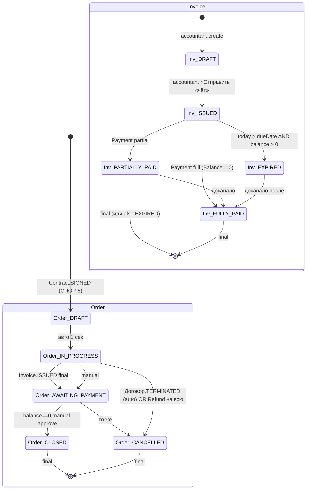
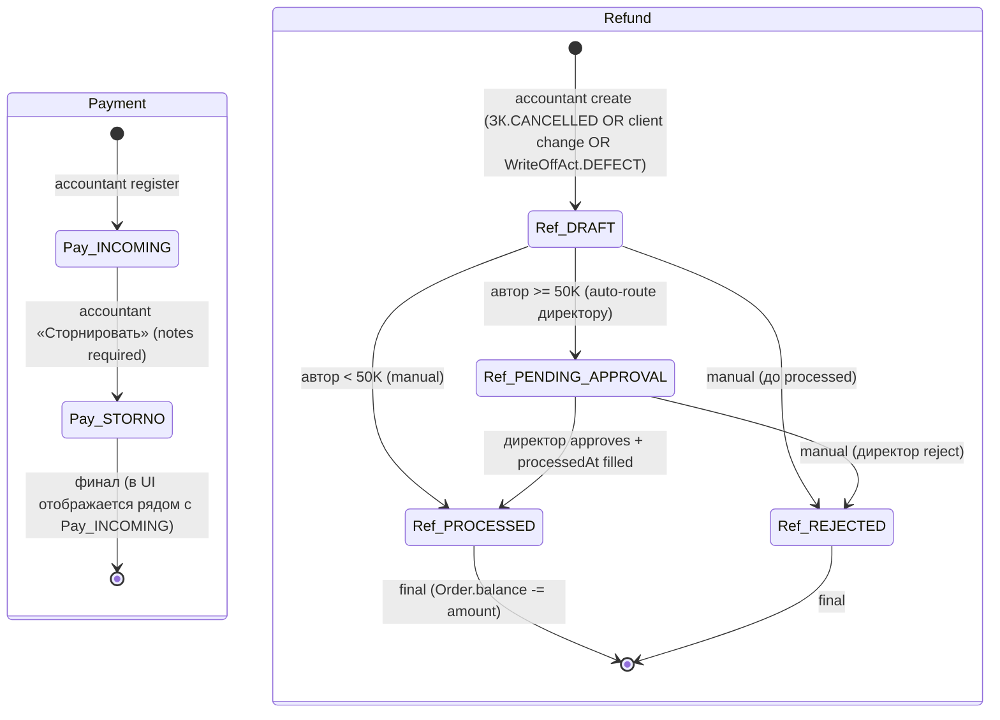

# ТЗ-014-RUN-5-5-АНАЛИТИК-ФИНАНСЫ.md — Run 5/5 Аналитика: правила для модуля Финансы

> ## 🔒 FINALIZED 2026-06-27
>
> **Агент:** Бизнес-аналитик / MiMo auto (planned).
> **Source ТЗ:** `99_Справочники/TASKS/ТЗ-014-RUN-5-5-АНАЛИТИК-ФИНАНСЫ.md`
> **Заблокировано для дальнейших правок без нового PSL-NNN.**
> **Strategic anchor:** см. [`BUSINESS-VISION.md`](../BUSINESS-VISION.md) §0 «Конституция» (single-tenant, ≤10 чел, полуавтомат, 27 anti-features, 6 UX-дисциплин).

> **Тип документа:** Техническое задание (ТЗ) для параллельного ИИ-агента.
> **ID задачи:** ТЗ-014.
> **Приоритет:** 🔴 P0 (блокер для Phase 4 Финансы + Phase 2 Mantine UI + Phase 3 Production deploy).
> **Статус:** ✅ Готово к запуску (2026-06-27).
> **Автор ТЗ:** Буфер (стратег-ассистент).
> **Заказчик:** параллельный ИИ-агент (далее — «Агент»).
> **Методология работы Агента:** [`AGENT-METHOD.md`](../../AGENT-METHOD.md) §1 «Быстрый старт» + §5.3 «Граница решений» (автономия) + §5.6 «Pre-action Checklist + Post-action Checkpoint» (обязательно).
> **Пререквизиты:** ТЗ-002 + ТЗ-011 + ТЗ-012 + ТЗ-013 (Run 1/2/3/4) ✅ — все proven templates. Run 5/5 = финальный в DAG, поэтому soft-depends на Run 4 (для `INV-ФИН-CHAIN-СКЛ-*` правил).

---

## 0. Контекст

### 0.1 Что такое Run 5/5 и зачем он сейчас

Run 5/5 = **пятый и финальный** прогон Бизнес-аналитика по модулям CRM. Закрывает **4 STUB-файла** модуля Финансы (`05_Финансы/`):

| #   | STUB                                                    | Что заполняется                                                                                                                                              | Целевой размер |
| --- | ------------------------------------------------------- | ------------------------------------------------------------------------------------------------------------------------------------------------------------ | -------------- |
| 1   | `05-pravila/05-rbac.md`                                 | RBAC-матрица 7 ролей × ~14 действий для Order/Invoice/Payment/Refund + OW + V + C + VER                                                                      | 200-300 строк  |
| 2   | `05-pravila/05-biznes-pravila.md`                       | 12 групп инвариантов (mirror Производство + Finance-специфичные STORNO/REFUND/MARGIN/PAYMENT)                                                                | 280-360 строк  |
| 3   | `05-zhiznennyj-cikl/05-statusy.md`                      | **5 статусов Order + 5 статусов Invoice + 2 типа Payment (INCOMING/STORNO) + 4 статуса Refund** = **16 статусов всего** + cross-module mappings + negative   | 180-220 строк  |
| 4   | `05-zhiznennyj-cikl/05-perehody.md` (NEW файл, создать) | ~16 переходов + cross-module авто-триггеры (КП-paid → Order-check, Contract.SIGNED → Order-create per СПОР-5, ЗК.CANCELLED → Refund per СПОР-12) + 2 Mermaid | 180-240 строк  |

**Зачем именно сейчас:** Финансы = **финальный этап** цепочки. Без канонических правил Финансы OrderClosing не закрывается, маржа не считается корректно, Refund невозможен. INTEGRATION-PLAN §6.2 Tier-DAG: Run 5/5 = **terminus** (нет downstream).

**Run 5/5 замыкает DAG:** КП → Договор → Производство → Склад → Финансы. Phase 4 модулей + Phase 2 Mantine UI + Phase 3 Production deploy блокируются только после Run 5/5 (последний disclaimer).

### 0.2 Что в этом ТЗ, чего нет

**В этом ТЗ:**

- Только модуль Финансы (`05_Финансы/`).
- Только 4 STUB-файла (1 NEW) + LOG + REPORT.
- Mirror ТЗ-002/011/012/013 proven templates + **5 Финансы-specific additions**.

**НЕ в этом ТЗ:**

- REGISTRY-OF-RULES (ТЗ-001) ✅ CLOSED (PSL-030).
- Phase 1 Bootstrap Prisma — ТЗ-004 ✅ done (PSL-034).
- Phase 2 Mantine UI — ТЗ-003 ✅ done.
- Phase 3 Production deploy — отложено до завершения Run 5/5.

### 0.3 Кто работает по этому ТЗ

**Агент** — параллельный ИИ, роль = **Бизнес-аналитик** ([`AGENT-ROLES.md`](../../AGENT-ROLES.md) §2.2). Использует launch-пакет `05_Финансы/LAUNCH-ANALYST-FINANSY.md` (нужно создать по аналогии с `02_Договор/LAUNCH-ANALYST-DOGOVOR.md` и `04_Склад/LAUNCH-ANALYST-SKLAD.md`).

### 0.4 Что нового vs ТЗ-002/011/012/013 (5 Финансы-specific additions)

Per thinker-with-files-gemini validation (2026-06-27):

| #   | Addition                                                                                  | Почему                                                                                                                                                                                                                                                           |
| --- | ----------------------------------------------------------------------------------------- | ---------------------------------------------------------------------------------------------------------------------------------------------------------------------------------------------------------------------------------------------------------------- |
| 1   | **INV-ФИН-CORE-001: Storno vs Refund distinktion (R7 / GAP-023 РЕШЕНО)**                  | Payment.type='STORNO' = **техническая корректировка опечатки** бухгалтера (только Pair-0 negative net effect), НЕ возврат денег. Refund = **отдельная сущность** (`amount > 0`, вычитается из `Order.paidAmount`). GAP-023 явно двух типов разделяет.            |
| 2   | **INV-ФИН-CHAIN-ДОГ-001: Auto-Order trigger Contract.status='SIGNED' (СПОР-5)**           | При подписании Договора авто создаётся Order в статусе DRAFT → авто IN_PROGRESS через 1 секунду. Триггер необратим: если Договор TERMINATED, Order → CANCELLED.                                                                                                  |
| 3   | **INV-ФИН-CHAIN-ПРД-001: Auto-Refund trigger ЗК.CANCELLED (СПОР-12)**                     | При отмене ЗК авто сигнал в Финансы для бухгалтера оформить `Refund` (отдельная сущность, `amount > 0`). КП остаётся «Оплачено». Если других активных ЗК по тому же Order нет → Order → CANCELLED.                                                               |
| 4   | **INV-ФИН-CHAIN-СКЛ-001: Auto-OrderClosing progress + costOfGoodsSold (mirror СКЛ §5.7)** | При Shipment.status='delivered' авто `OrderClosing.progress += Σ quantityActual` + `OrderClosing.costOfGoodsSold += Σ(costPrice × quantityActual)`. Только когда ВСЕ позиции shipped (НЕ partial).                                                               |
| 5   | **INV-ФИН-EXEC-001: Margin Invariant nullification (SC-04/05)**                           | `Order.margin = null` пока не все позиции Shipped (НЕ додумывать). Для составных/не-отгруженных товаров — `margin = null` + display «не рассчитана». Для услуг (`Product.kind='SERVICE'`) — отдельная строка в марже без себестоимости (итого в марже включает). |

**Без Option C Schema Constraints Note:** schema enums в `prisma/schema.prisma` для Order (DRAFT/IN_PROGRESS/AWAITING_PAYMENT/CLOSED/CANCELLED) + Invoice (DRAFT/ISSUED/PARTIALLY_PAID/FULLY_PAID/EXPIRED) + Payment.type (INCOMING/STORNO) + Refund (отдельная сущность) = **полное 1:1 покрытие** бизнес-статусов. Доказано в валидации thinker'а.

### 0.5 ID-prefix convention (validated)

| Тип правила              | Финансы prefix                                                                                                                                            |
| ------------------------ | --------------------------------------------------------------------------------------------------------------------------------------------------------- |
| RBAC (column visibility) | `RBAC-ФИН-{TYPE}-{NNN}` where TYPE ∈ {A, OW, V, C, VER} + секции §1-§4 по сущностям (Order/Invoice/Payment/Refund)                                        |
| Бизнес-инвариант         | `INV-ФИН-{GROUP}-{NNN}` where GROUP ∈ {PARTIES, TYPES, AMOUNT, STORNO, REFUND, MARGIN, AUTH, CHAIN-КП, CHAIN-ДОГ, CHAIN-ПРД, CHAIN-СКЛ, TERM, SOFT, MISC} |
| State machine            | `SM-ФИН-{NNN}` (статусы) + `SM-ФИН-T-{NNN}` (переходы) + `SM-ФИН-NO-{NNN}` (negative)                                                                     |
| Cross-module hard-link   | `INV-ФИН-CHAIN-{MODULE}-{NNN}` где MODULE ∈ {КП, ДОГ, ПРД, СКЛ} (4 upstream, 0 downstream)                                                                |

### 0.6 Cross-module consistency (4 hard-link groups, все upstream)

| ФИН группа                    | Upstream                                                            | Hard-link формат                                            |
| ----------------------------- | ------------------------------------------------------------------- | ----------------------------------------------------------- |
| `CHAIN-КП-*` (КП → ФИН)       | КП имеет INV-КП-CONV-* + INV-КП-PAY-* (Run 1/5 frozen)              | Source column: `↳ см. INV-КП-{CONV,PAY}-NNN` (NO duplicate) |
| `CHAIN-ДОГ-*` (Договор → ФИН) | Договор имеет INV-ДОГ-CHAIN-ФИН-* (Run 2/5 will fill)               | Source column: `↳ см. INV-ДОГ-CHAIN-ФИН-NNN` (NO duplicate) |
| `CHAIN-ПРД-*` (ПРД → ФИН)     | Производство имеет INV-ПРД-CHAIN-КЛАД-ДОГ-ФИН-* (Run 3/5 will fill) | Source column: `↳ см. INV-ПРД-CHAIN-ФИН-NNN` (NO duplicate) |
| `CHAIN-СКЛ-*` (СКЛ → ФИН)     | Склад имеет INV-СКЛ-CHAIN-ФИН-* (Run 4/5 will fill)                 | Source column: `↳ см. INV-СКЛ-CHAIN-ФИН-NNN` (NO duplicate) |

**Hard-link convention enforcing:** Колонка «Правило» в строках всех CHAIN-_-_ групп содержит ТОЛЬКО one-liner `↳ см. INV-XXX-NNN`. Дополнительные ФИН-specific side-effects (margin formula, STORNO rules, REFUND triggers) записываются в MARGIN/STORNO/REFUND/EXEC группы, НЕ в CHAIN-*.

---

## 1. Миссия

> **Одной фразой:** Извлечь из исходного `05_Финансы/МОДУЛЬ-ФИНАНСЫ.md` (~1100 строк) канонические правила и заполнить ими 4 STUB-файла в формате, пригодном для прямого использования в Phase 4 Финансы (`/finance/orders`) + Phase 2 Mantine UI + Phase 3 Production deploy.

**Декомпозиция:**

1. Прочитать `05_Финансы/README.md` + все 18 STUB (для контекста, но трогать ТОЛЬКО 4 STUB, включая создание NEW `05-perehody.md`).
2. Извлечь **RBAC по 7 ролям × ~14 действий** для 4 сущностей → `05-rbac.md` (~50 правил).
3. Извлечь **12 групп инвариантов** → `05-biznes-pravila.md` (~35 правил, в т.ч. 4 CHAIN-_-_ groups hard-link).
4. Извлечь **16 статусов** (5 Order + 5 Invoice + 2 Payment.type + 4 Refund lifecycle = 16) → `05-statusy.md` (~200 строк).
5. Извлечь **~16 переходов** для 4 сущностей → `05-perehody.md` (NEW файл, ~200 строк + 2 Mermaid).
6. Self-verify по §7 → создать `14-02-REPORT.md` → handoff.

---

## 2. Scope IN/OUT

### 2.1 IN — Агент делает

| #   | Файл                                                               | Что делается                                                                                                                                             | Hard limit    |
| --- | ------------------------------------------------------------------ | -------------------------------------------------------------------------------------------------------------------------------------------------------- | ------------- |
| 1   | `05_Финансы/05-pravila/05-rbac.md`                                 | Заполнить ~50 правилами RBAC (7 ролей × 14 действий для Order/Invoice/Payment/Refund + OW + V + C + VER).                                                | **400** строк |
| 2   | `05_Финансы/05-pravila/05-biznes-pravila.md`                       | Заполнить ~35 правилами в 12 группах: PARTIES, TYPES, AMOUNT, STORNO, REFUND, MARGIN, AUTH, CHAIN-КП, CHAIN-ДОГ, CHAIN-ПРД, CHAIN-СКЛ, TERM, SOFT, MISC. | **400** строк |
| 3   | `05_Финансы/05-zhiznennyj-cikl/05-statusy.md`                      | Заполнить 16 статусами (5 Order + 5 Invoice + 2 Payment.type + 4 Refund) + cross-module mappings + 3 negative.                                           | **250** строк |
| 4   | `05_Финансы/05-zhiznennyj-cikl/05-perehody.md` (NEW файл, создать) | Заполнить ~16 переходами + 5 cross-module авто-триггерами + 2 Mermaid stateDiagram-v2.                                                                   | **250** строк |
| 5   | `99_Справочники/TASKS/14-01-LOG.md`                                | Хронология работы Агента (audit trail).                                                                                                                  | —             |
| 6   | `99_Справочники/TASKS/14-02-REPORT.md`                             | Финальный отчёт Агента для PO (метрики покрытия, найденные пробелы).                                                                                     | **500** строк |
| 7   | (опц.) `99_Справочники/TASKS/14-09-AMBIGUITIES.md`                 | Противоречия между правилами в разных группах.                                                                                                           | —             |

### 2.2 OUT — Агент НЕ делает

| #   | Что НЕ делает                                                                                                                                                                    | Почему                                                                                                      |
| --- | -------------------------------------------------------------------------------------------------------------------------------------------------------------------------------- | ----------------------------------------------------------------------------------------------------------- |
| 1   | **Не пишет новых правил «от себя»**                                                                                                                                              | Только извлечение из источника `МОДУЛЬ-ФИНАНСЫ.md` + cross-ref на 4 модуля (КП/Договор/Производство/Склад). |
| 2   | **Не правит** `RBAC-MATRIX.md`, `SCHEMA-CONSOLIDATED.md`, `BUSINESS-VISION.md`, `GLOSSARY-MASTER.md`, `FLOW-MAP.md`, `СПОРНЫЕ-МОМЕНТЫ.md`, `OPEN-QUESTIONS-MASTER.md`            | Канонические справочники — не трогать.                                                                      |
| 3   | **Не работает с Run 1-4 STUB** (КП/Договор/Производство/Склад)                                                                                                                   | Только Run 5 (Финансы RBAC + правила + статусы + переходы).                                                 |
| 4   | **Не правит** `05_Финансы/00-spr/*`, `05_Финансы/05-konstruktor-finansov/05-scheta.md`, `05-platezhi.md`, `05-refundy.md`, `05_Финансы/05-zhiznennyj-cikl/05-nalogovyi-uchet.md` | README-каркасы и STUB'ы не из Run 5 списка — оставить как есть.                                             |
| 5   | **Не пишет код**                                                                                                                                                                 | Это документация.                                                                                           |
| 6   | **Не правит** `05_Финансы/МОДУЛЬ-ФИНАНСЫ.md` (source V0)                                                                                                                         | Source frozen — из него только читаем.                                                                      |
| 7   | **Не правит** `01_КП/04-pravila/*`, `02_Договор/04-pravila/*`, `03_Производство/04-pravila/*`, `04_Склад/04-pravila/*` (Run 1/2/3/4 results)                                     | Frozen после CLOSED 100% / FINALIZED.                                                                       |
| 8   | **Не добавляет STUB файлов вне Run 5 список**                                                                                                                                    | Кроме NEW `05-perehody.md` (явно в IN list).                                                                |

### 2.3 Anti-features (mirror BUSINESS-VISION.md §3 + Финансы-specific)

Агент должен **отказаться** от любого правила/паттерна, попадающего в anti-catalog:

| ❌ Не делать                                                        | Почему                                                                                    |
| ------------------------------------------------------------------- | ----------------------------------------------------------------------------------------- |
| ❌ Не предлагать **интеграцию с банк-клиентом / 1С**                | [`BUSINESS-VISION §3.2`](../BUSINESS-VISION.md) + МОДУЛЬ §7 — отложено v2.                |
| ❌ Не предлагать **авто-FIFO** для распределения Payment по Invoice | [`BUSINESS-VISION §3.2`](../BUSINESS-VISION.md) + СПОР-7 — manual бухгалтером в v1.       |
| ❌ Не предлагать **WebSocket-realtime** для уведомлений о payment   | [`BUSINESS-VISION §3.2`](../BUSINESS-VISION.md) — manual refresh в v1.                    |
| ❌ Не предлагать **multi-currency** в Order/Invoice/Payment         | [`BUSINESS-VISION §3.3`](../BUSINESS-VISION.md) + СПОР-14 — RUB жёстко в v1.              |
| ❌ Не предлагать **авто-перевыставление счетов** при просрочке      | [`BUSINESS-VISION §3.2`](../BUSINESS-VISION.md) — manual менеджер.                        |
| ❌ Не предлагать **финансовая аналитика (NPV, прогнозы)**           | [`BUSINESS-VISION §3.2`](../BUSINESS-VISION.md) + МОДУЛЬ §7 — только простые отчёты в v1. |
| ❌ Не предлагать **bidirectional STORNO chains** (STORNO на STORNO) | МОДУЛЬ §6 правила STORNO №3 — запрещено.                                                  |
| ❌ Не предлагать **negative Payment.amount при type='INCOMING'**    | МОДУЛЬ §10 правила Q8 — только через Refund отдельная сущность >0.                        |
| ❌ Не предлагать **CDN для сканов счетов**                          | [`BUSINESS-VISION §3.2`](../BUSINESS-VISION.md) — локальные blob в PostgreSQL.            |
| ❌ Не предлагать **stripe / 2checkout / онлайн-касса**              | Anti-catalog №26 — никогда (offline B2B для internal CRM).                                |

---

## 3. Deliverables — что Агент создаёт

### 3.1 Основные артефакты

| #   | Файл                                                 | Целевой размер  | Hard limit | Что делать при превышении                                                                          |
| --- | ---------------------------------------------------- | --------------- | ---------- | -------------------------------------------------------------------------------------------------- |
| 1   | `05_Финансы/05-pravila/05-rbac.md`                   | 200-300 строк   | **400**    | Разбить на `05-rbac-order.md` + `05-rbac-invoice.md` + `05-rbac-payment.md` + `05-rbac-refund.md`. |
| 2   | `05_Финансы/05-pravila/05-biznes-pravila.md`         | 280-360 строк   | **400**    | Перенести CHAIN-КП + CHAIN-ДОГ + CHAIN-ПРД + CHAIN-СКЛ в APPENDIX.                                 |
| 3   | `05_Финансы/05-zhiznennyj-cikl/05-statusy.md`        | 180-220 строк   | **250**    | Сократить Mermaid до простой ASCII state-machine.                                                  |
| 4   | `05_Финансы/05-zhiznennyj-cikl/05-perehody.md` (NEW) | 180-240 строк   | **250**    | Ужать negative-rules до 3 + минимум sub-transition sub-section.                                    |
| 5   | `99_Справочники/TASKS/14-01-LOG.md`                  | без ограничения | —          | —                                                                                                  |
| 6   | `99_Справочники/TASKS/14-02-REPORT.md`               | 200-350 строк   | **500**    | Сократить таблицы.                                                                                 |
| 7   | `99_Справочники/TASKS/14-09-AMBIGUITIES.md`          | по ситуации     | —          | —                                                                                                  |

### 3.2 Минимальное покрытие (Hard pass/fail)

| Файл                   | Правил минимум                                                                  | Источник coverage target                                                                                                |
| ---------------------- | ------------------------------------------------------------------------------- | ----------------------------------------------------------------------------------------------------------------------- |
| `05-rbac.md`           | **50** правил                                                                   | 7 ролей × 14 действий ≈ 50 (Order 5 + Invoice 3 + Payment 3 + Refund 3 = 14 × 7 = 98 max, реалистично ~50 + OW/V/C/VER) |
| `05-biznes-pravila.md` | **35** правил                                                                   | 12 групп × 3 правила ≈ 36 (из них 4 группы side-effects: CHAIN-*)                                                       |
| `05-statusy.md`        | **5 Order + 5 Invoice + 2 Payment.type + 4 Refund + 3 negative** = **19** всего | целевой 19+                                                                                                             |
| `05-perehody.md`       | **~16 переходов** (Order 5 + Invoice 4 + Payment 4 + Refund 3) + 2 Mermaid      | целевой 16+                                                                                                             |

### 3.3 Cross-module consistency (4 hard-link groups, все upstream)

Каждое правило Финансы из cross-module groups должно **hard-link** на соответствующее правило upstream модуля (см. §0.6 выше). Никакого downstream.

---

## 4. Inputs — что Агент обязан прочитать

### 4.1 Tier-1 🔴 CRITICAL (mirror Склад pattern)

| #   | Файл                                                                                                                                                                                                                             | Зачем                                                                                                                                                                                     |
| --- | -------------------------------------------------------------------------------------------------------------------------------------------------------------------------------------------------------------------------------- | ----------------------------------------------------------------------------------------------------------------------------------------------------------------------------------------- |
| 1   | [`CHECKLIST.md`](../../CHECKLIST.md)                                                                                                                                                                                             | Мастер-навигатор сессии.                                                                                                                                                                  |
| 2   | [`AGENT-METHOD.md`](../../AGENT-METHOD.md)                                                                                                                                                                                       | §1, §5.3, §5.6, §6.                                                                                                                                                                       |
| 3   | [`BUSINESS-VISION.md`](../BUSINESS-VISION.md)                                                                                                                                                                                    | **Strategic anchor**: §0 scope-guards, §3 anti-catalog (27 позиций), §4 6 UX-дисциплин. Цитировать в §7.                                                                                  |
| 4   | [`99_Справочники/RBAC-MATRIX.md`](../RBAC-MATRIX.md)                                                                                                                                                                             | Сводная матрица 7×N, расширить для Финансы (7 ролей × 14 действий для Order/Invoice/Payment/Refund).                                                                                      |
| 5   | [`99_Справочники/SCHEMA-CONSOLIDATED.md`](../SCHEMA-CONSOLIDATED.md)                                                                                                                                                             | Сущности: Order / Invoice / Payment / Refund + closures FinancialReport / RppEntry / ReconciliationAct.                                                                                   |
| 6   | [`99_Справочники/СПОРНЫЕ-МОМЕНТЫ.md`](../СПОРНЫЕ-МОМЕНТЫ.md)                                                                                                                                                                     | **СПОР-5** (Contract.SIGNED → auto Order), **СПОР-7** (manual invoiceId linking НЕ auto-FIFO), **СПОР-12** (ЗК.CANCELLED → Refund), **СПОР-13** (нумерация), **СПОР-14** (RUB жёстко v1). |
| 7   | [`99_Справочники/FLOW-MAP.md`](../FLOW-MAP.md)                                                                                                                                                                                   | Cross-module цепочка для 4 hand-offs (КП→Order payment, Договор→Order creation, Производство→Refund, Склад→OrderClosing).                                                                 |
| 8   | `04_Склад/04-pravila/04-biznes-pravila.md` + `04_Склад/04-pravila/05-rbac.md` + `04_Склад/04-zhiznennyj-cikl/04-statusy.md` + `04_Склад/04-zhiznennyj-cikl/04-perehody.md` (Run 4/5 PROVEN pattern, ТЗ-013 will run in parallel) | **Mirror proven structure**: ID prefix `INV-СКЛ-*` → `INV-ФИН-*`, hard-link на источник. Особенно нужен для cross-link `INV-СКЛ-CHAIN-ФИН-*`.                                             |
| 9   | `03_Производство/04-pravila/04-biznes-pravila.md` + `03_Производство/03-zhiznennyj-cikl/03-statusy.md` + `03_Производство/03-zhiznennyj-cikl/03-perehody.md` (Run 3/5 PROVEN pattern, ТЗ-012 ✅ FINALIZED)                       | **Mirror proven**: ID prefix `INV-ПРД-*` → `INV-ФИН-*`. Особенно для `INV-ПРД-CHAIN-ФИН-*` (ЗК.CANCELLED → Refund per СПОР-12).                                                           |
| 10  | `01_КП/04-pravila/*` + `02_Договор/04-pravila/*` (Run 1/5 + 2/5 PROVEN patterns)                                                                                                                                                 | **Mirror proven**: `RBAC-КП-*` → `RBAC-ФИН-*`.                                                                                                                                            |
| 11  | `05_Финансы/МОДУЛЬ-ФИНАНСЫ.md` (~1100 строк)                                                                                                                                                                                     | **Source V0** для извлечения правил: state-machines §3, RBAC §6 правила, Q8 РЕШЕНО, СПОР-5/7/12 hardcoded.                                                                                |
| 12  | `05_Финансы/README.md`                                                                                                                                                                                                           | Точка входа модуля Финансы + 18-STUB map.                                                                                                                                                 |
| 13  | `05_Финансы/05-pravila/00-README.md`                                                                                                                                                                                             | Контекст папки правил Финансы.                                                                                                                                                            |
| 14  | `05_Финансы/05-zhiznennyj-cikl/00-README.md`                                                                                                                                                                                     | Контекст папки state-machine.                                                                                                                                                             |
| 15  | `05_Финансы/00-spr/00-otkrytye-voprosy.md`                                                                                                                                                                                       | 8 baseline OQ Финансы (если существует).                                                                                                                                                  |

### 4.2 Tier-2 🟡 IMPORTANT (4 cross-module sources)

| #   | Файл                                                                                              | Зачем                                                                                                       |
| --- | ------------------------------------------------------------------------------------------------- | ----------------------------------------------------------------------------------------------------------- |
| 16  | `01_КП/03-zhiznennyj-cikl/03-konvertaciya-v-dogovor.md` + `01_КП/04-pravila/04-biznes-pravila.md` | Контекст КП «оплачено» → Order payment trigger + INV-КП-PAY-* правила.                                      |
| 17  | `02_Договор/МОДУЛЬ-ДОГОВОР.md` (распущен PSL-021) + `02_Договор/04-pravila/*`                     | Контекст `Contract.status='SIGNED'` → Order creation (СПОР-5). Также Contract TERMINATED → Order CANCELLED. |
| 18  | `03_Производство/МОДУЛЬ-ПРОИЗВОДСТВО.md` (распущен PSL-029) + `03_Производство/04-pravila/*`      | Контекст `ЗК.CANCELLED` → Refund signal (СПОР-12).                                                          |
| 19  | `04_Склад/МОДУЛЬ-СКЛАД-ПОДРОБНЫЙ.md` §3 + §6                                                      | Контекст для `INV-СКЛ-CHAIN-ФИН-*` правил (Shipment.delivered → OrderClosing.progress).                     |
| 20  | `05_Финансы/00-spr/00-glossary.md`                                                                | Канонические термины Финансы (Order, Invoice, Payment, Refund, Storno).                                     |
| 21  | [`99_Справочники/GLOSSARY-MASTER.md`](../GLOSSARY-MASTER.md)                                      | Общая терминология (R7 / GAP-023 Storno vs Refund).                                                         |
| 22  | [`99_Справочники/OPEN-QUESTIONS-MASTER.md`](../OPEN-QUESTIONS-MASTER.md)                          | 38 Q — касающиеся Финансы (Q1-Q8 все ПРИНЯТО 24.06.2026 — РЕШЕНО отражено в МОДУЛЬ-ФИНАНСЫ §8).             |

---

## 5. Methodology — как извлекать правила

### 5.1 Алгоритм работы

```
1. Прочитать §4 inputs в порядке 1-22.
2. Для каждого из 4 STUB — пройти структуру §6:
   2.1. 05-rbac.md:
        - Видимость ДЕЙСТВИЙ Order / Invoice / Payment / Refund по 7 ролям.
        - ID формата RBAC-ФИН-{TYPE}-{NNN}.
        - Mirror структуры Склад RBAC-СКЛ-TYPE-NNN и Производство RBAC-ПРД-TYPE-NNN.
        - 4 секции по сущностям (§1 Order + §2 Invoice + §3 Payment + §4 Refund).
   2.2. 05-biznes-pravila.md:
        - 12 групп инвариантов Финансы (mirror Склад 13 + STORNO/REFUND/MARGIN три специфичных).
        - ID формата INV-ФИН-{GROUP}-{NNN}.
        - 4 cross-module CHAIN-*-* groups (все upstream, NO downstream).
        - Hard-link на up-stream source rules.
   2.3. 05-statusy.md:
        - 5 Order + 5 Invoice + 2 Payment.type + 4 Refund = 16 статусов.
        - 3 negative-rules (NO-001..003).
        - Явная таблица cross-module status mappings (Order ← Договор.SIGNED, Order ← ЗК.COMPLETED/CANCELLED, Order ← Shipment.delivered).
   2.4. 05-perehody.md (NEW FILE):
        - 5+4+4+3 = 16 переходов для 4 сущностей.
        - cross-module auto-triggers (Contract.SIGNED → Order create, ЗК.CANCELLED → Refund, Shipment.delivered → OrderClosing).
        - Mermaid stateDiagram-v2 для каждой из 4 сущностей (4 mermaid, или 2 combined).
        - Negative-rules.
3. Каждое правило: ID + Источник (МОДУЛЬ §NN или up-stream INV-*-NNN) + Следствие при нарушении.
4. Перепроверить по §7 self-check + §3.3 cross-module consistency.
5. Передать в 14-02-REPORT.md → handoff.
```

### 5.2 Что считать правилом (mirror ТЗ-011/012/013)

**Правило = конкретное действие / ограничение / требование**, которое проверяется в коде:

| Тип                      | Пример Финансы                                                                        |
| ------------------------ | ------------------------------------------------------------------------------------- |
| RBAC (action visibility) | «accountant может создать Payment, manager НЕ может»                                  |
| Validation (данные)      | «Payment.type='INCOMING' ⇒ amount > 0; type='STORNO' ⇒ amount < 0»                    |
| Invariant (всегда true)  | «Order.balance = totalAmount − Σ INCOMING.amount + Σ STORNO.amount − Σ Refund.amount» |
| State machine (переход)  | «Order.status='CLOSED' → НЕТ переходов кроме CANCELLED через Refund»                  |
| Side-effect trigger      | «Договор.SIGNED → авто Order.DRAFT (СПОР-5)»                                          |

**Не правило:** Описательная фраза без ограничения («Финансы — это место учёта денег»).

### 5.3 Чего НЕ делать (mirror ТЗ-002/011/012/013)

- **Не придумывать новых правил «от себя»** — только извлечение из источника + cross-ref.
- **Не решать противоречия** — фиксировать в `14-09-AMBIGUITIES.md`.
- **Не повторять общие правила из RBAC-MATRIX.md §3** — ссылаться, не дублировать.
- **Не дублировать правила КП/Договор/Производство/Склад** (CHAIN-КП/ДОГ/ПРД/СКЛ) — hard-link через Source column.
- **Не путать Storno и Refund** — разные сущности, разные правила (R7 / GAP-023).
- **Не делать margin = (что-то) на не-Shipped позициях** — margin = null (SC-04/05).
- **Не вводить bank-API / 1С / WebSocket-push** в Run 5 — BUSINESS-VISION §3.2 + МОДУЛЬ §7.
- **Не вводить multi-currency** в v1 — СПОР-14 (RUB жёстко).
- **Не использовать микросервисы** для триггеров Договор→Order, ЗК→Refund — всё в рамках монолита.

### 5.4 Cross-module: КП (mirror Производство §5.4 + Склад §5.4)

КП → Финансы через `parentContractId` (в Order, опосредованно) + прямое наследование `Proposal.id` в Order. КП «оплачено» → сигнал в Финансы. КП остаётся «Оплачено» при отмене ЗК per СПОР-12. Финансы mirror hard-link:

| ID КП (canonical)                                  | ID ФИН (mirror)        | Что делает                                                                                           |
| -------------------------------------------------- | ---------------------- | ---------------------------------------------------------------------------------------------------- |
| `INV-КП-CONV-*` (КП-CONTRACTED → Договор создание) | `INV-ФИН-CHAIN-КП-001` | ↳ см. КП-CONV-* (Order.proposalId наследуется из Договор.parentProposalId — КП остаётся источником). |
| `INV-КП-PAY-001` (КП «оплачено» → ... )            | `INV-ФИН-CHAIN-КП-002` | ↳ см. КП-PAY-001 (Order payment progress).                                                           |
| (нет)                                              | `INV-ФИН-CHAIN-КП-003` | КП остаётся «Оплачено» при отмене ЗК per СПОР-12 (НЕ каскадирует статус КП).                         |

### 5.5 Cross-module: Договор (mirror СПОР-5)

Договор.SIGNED → авто Order create (СПОР-5). Договор.TERMINATED → Order CANCELLED. Финансы mirror hard-link:

| ID Договор (canonical)                                  | ID ФИН (mirror)         | Что делает                                                                                                              |
| ------------------------------------------------------- | ----------------------- | ----------------------------------------------------------------------------------------------------------------------- |
| `INV-ДОГ-CHAIN-PRODUCTION-005` (Contract.SIGNED → ... ) | `INV-ФИН-CHAIN-ДОГ-001` | ↳ см. ДОГ-CHAIN-PRODUCTION-005 (Contract.SIGNED → авто Order create: status=DRAFT, потом авто IN_PROGRESS через 1 сек). |
| `INV-ДОГ-CHAIN-ФИН-001` (Contract.SIGNED... )           | `INV-ФИН-CHAIN-ДОГ-002` | ↳ см. ДОГ-CHAIN-ORDER-001 (Contract.STATUS field → Order.contractId FK NOT NULL).                                       |
| (нет)                                                   | `INV-ФИН-CHAIN-ДОГ-003` | `Contract.status='TERMINATED'` → авто `Order.status='CANCELLED'`. Бухгалтер оформляет Refund на полученные средства.    |

### 5.6 Cross-module: Производство (NEW for Финансы, СПОР-12)

ЗК.CANCELLED → авто сигнал в Финансы для бухгалтера оформить Refund. ЗК.COMPLETED → авто OrderClosing. Финансы mirror hard-link:

| ID Производство (canonical)                                                   | ID ФИН (mirror)         | Что делает                                                                                                                                                                                                                  |
| ----------------------------------------------------------------------------- | ----------------------- | --------------------------------------------------------------------------------------------------------------------------------------------------------------------------------------------------------------------------- |
| `INV-ПРД-CHAIN-ФИН-001` (ЗК.COMPLETED → OrderClosing)                         | `INV-ФИН-CHAIN-ПРД-001` | ↳ см. ПРД-CHAIN-ФИН-001 (при ЗК.COMPLETED авто OrderClosing: costOfGoodsSold начинает считаться).                                                                                                                           |
| `INV-ПРД-CHAIN-ФИН-002` (ЗК.CANCELLED → Refund per СПОР-12)                   | `INV-ФИН-CHAIN-ПРД-002` | ↳ см. ПРД-CHAIN-ФИН-002 + СПОР-12 (ЗК.CANCELLED → бухгалтер оформляет Refund: amount > 0 — вычитается из Order.paidAmount). КП остаётся «Оплачено».                                                                         |
| `INV-ПРД-CHAIN-ФИН-003` (ЗК CREATED/PLANNING + отмена ДО оплаты → НЕТ Refund) | `INV-ФИН-CHAIN-ПРД-003` | ↳ см. ПРД-CHAIN-ФИН-003: если ЗК отменён ДО оплаты (status ∈ {CREATED, PLANNING, AWAITING_MATERIALS}) → КП возвращается вручную через «Создать новую версию КП» (per МОДУЛЬ-ПРОИЗВОДСТВО §10 Q4; ЗК Refund не оформляется). |

### 5.7 Cross-module: Склад (mirror Склад §5.7)

Shipment.delivered → OrderClosing. WriteOffAct.completed → costOfGoodsSold += Σ. Финансы mirror hard-link:

| ID Склад (canonical)                                                                     | ID ФИН (mirror)         | Что делает                                                                                                                                                                                                                                              |
| ---------------------------------------------------------------------------------------- | ----------------------- | ------------------------------------------------------------------------------------------------------------------------------------------------------------------------------------------------------------------------------------------------------- |
| `INV-СКЛ-CHAIN-ФИН-001` (Shipment.delivered → OrderClosing.progress += Σ quantityActual) | `INV-ФИН-CHAIN-СКЛ-001` | При Shipment.status='delivered' авто `OrderClosing.progress += Σ(quantityActual)` + `OrderClosing.costOfGoodsSold += Σ(costPrice × quantityActual)`. Margin = totalAmount − paidAmount − costOfGoodsSold when progress == totalOrdered; NULL otherwise. |
| `INV-СКЛ-CHAIN-ФИН-002` (WriteOffAct.completed → costOfGoodsSold += costPrice × qty)     | `INV-ФИН-CHAIN-СКЛ-002` | ↳ см. СКЛ-CHAIN-ФИН-002: WriteOffAct.completed → уменьшение margin.                                                                                                                                                                                     |
| `INV-СКЛ-CHAIN-ФИН-003` (SupplierDelivery.paymentStatus update через Payment)            | `INV-ФИН-CHAIN-СКЛ-003` | ↳ см. СКЛ-CHAIN-ФИН-003 (SupplierDelivery.paymentStatus = 'paid/partially_paid/prepaid' обновляется вручную бухгалтером через Payment.invoiceId linking в v1). Payment.invoiceId может быть NULL или указывать на Invoice (СПОР-7 manual).              |

---

## 6. Format specification

### 6.1 05-rbac.md — видимость действий Финансы

```markdown
# 05-rbac.md — RBAC-матрица модуля Финансы

> **Назначение.** Кто из 7 ролей (admin / director / manager / production / storekeeper / accountant / viewer) может выполнить какое ДЕЙСТВИЕ над сущностями Финансы (Order, Invoice, Payment, Refund, FinancialReport). Расширяет сводную [RBAC-MATRIX.md](../RBAC-MATRIX.md) применительно к Финансы.
> **Автор.** Бизнес-аналитик (Run 5/5, ТЗ-014). Заполнен YYYY-MM-DD.

## 0. Контекст

Каждое правило имеет ID формата `RBAC-ФИН-{TYPE}-{NNN}`, где TYPE ∈ {A (action), OW, V, C, VER}.

## 1. Видимость действий Order — 5 действий

| ID             | Действие (Order)                                       | admin | director |             manager              | production | storekeeper | accountant | viewer | Источник                        |
| -------------- | ------------------------------------------------------ | :---: | :------: | :------------------------------: | :--------: | :---------: | :--------: | :----: | ------------------------------- |
| RBAC-ФИН-A-001 | Просмотреть список Order                               |  ✅   |    ✅    |             ✅ свои              |     ✅     |     ✅      |     ✅     |   ✅   | RBAC-MATRIX §1.1 + МОДУЛЬ §6    |
| RBAC-ФИН-A-002 | Создать Order (manual; обычно авто от Contract.SIGNED) |  ✅   |    ✅    |                ❌                |     ❌     |     ❌      |     ❌     |   ❌   | МОДУЛЬ §6 RBAC                  |
| RBAC-ФИН-A-003 | Approve закрытие Order (balance=0)                     |  ✅   |    ✅    |                ❌                |     ❌     |     ❌      |     ✅     |   ❌   | МОДУЛЬ §6 + INV-ФИН-AUTH-001    |
| RBAC-ФИН-A-004 | Видеть маржинальность (свой)                           |  ✅   |  ✅ все  | ⚠️ СВОЮ (НЕ у других менеджеров) |     ❌     |     ❌      |   ✅ все   |   ❌   | МОДУЛЬ §6 + GAP-014 ✅ РЕШЕНО A |
| RBAC-ФИН-A-005 | Видеть дебиторку по клиенту                            |  ✅   |    ✅    |                ❌                |     ❌     |     ❌      |     ✅     |   ❌   | МОДУЛЬ §6                       |

## 2. Видимость действий Invoice — 3 действия

| ID             | Действие (Invoice)                 | admin | director | manager | production | storekeeper | accountant | viewer | Источник                                       |
| -------------- | ---------------------------------- | :---: | :------: | :-----: | :--------: | :---------: | :--------: | :----: | ---------------------------------------------- |
| RBAC-ФИН-A-006 | Просмотреть список Invoice (своих) |  ✅   |    ✅    |   ✅    |     ❌     |     ❌      |     ✅     |   ✅   | МОДУЛЬ §6                                      |
| RBAC-ФИН-A-007 | Создать Invoice (draft)            |  ✅   |    ✅    |   ❌    |     ❌     |     ❌      |     ✅     |   ❌   | МОДУЛЬ §6 + INV-ФИН-AUTH-002                   |
| RBAC-ФИН-A-008 | Выставить Invoice (draft → issued) |  ✅   |    ✅    |   ❌    |     ❌     |     ❌      |     ✅     |   ❌   | МОДУЛЬ §6 + Q1 Аванс/Основной/Корректировочный |

## 3. Видимость действий Payment — 4 действия

| ID             | Действие (Payment)                           | admin | director | manager | production | storekeeper | accountant | viewer | Источник                 |
| -------------- | -------------------------------------------- | :---: | :------: | :-----: | :--------: | :---------: | :--------: | :----: | ------------------------ |
| RBAC-ФИН-A-009 | Просмотреть список Payment                   |  ✅   |    ✅    |   ❌    |     ❌     |     ❌      |     ✅     |   ✅   | МОДУЛЬ §6                |
| RBAC-ФИН-A-010 | Зарегистрировать Payment (INCOMING)          |  ✅   |    ✅    |   ❌    |     ❌     |     ❌      |     ✅     |   ❌   | МОДУЛЬ §6 + Q7 ДАТА      |
| RBAC-ФИН-A-011 | Сторнировать Payment (→ type='STORNO')       |  ✅   |    ✅    |   ❌    |     ❌     |     ❌      |     ✅     |   ❌   | МОДУЛЬ §6 правила STORNO |
| RBAC-ФИН-A-012 | Привязать Payment к Invoice (manual linking) |  ✅   |    ✅    |   ❌    |     ❌     |     ❌      |     ✅     |   ❌   | МОДУЛЬ §6 + СПОР-7       |

## 4. Видимость действий Refund — 3 действия

| ID             | Действие (Refund)                          | admin | director | manager | production | storekeeper | accountant | viewer | Источник                           |
| -------------- | ------------------------------------------ | :---: | :------: | :-----: | :--------: | :---------: | :--------: | :----: | ---------------------------------- |
| RBAC-ФИН-A-013 | Просмотреть список Refund                  |  ✅   |    ✅    |   ❌    |     ❌     |     ❌      |     ✅     |   ✅   | МОДУЛЬ §6                          |
| RBAC-ФИН-A-014 | Создать Refund (при ЗК.CANCELLED или брак) |  ✅   |    ✅    |   ❌    |     ❌     |     ❌      |     ✅     |   ❌   | МОДУЛЬ §6 правила Refund + СПОР-12 |
| RBAC-ФИН-A-015 | Approve Refund (крупная сумма >= 50K)      |  ✅   |    ✅    |   ❌    |     ❌     |     ❌      | ⚠️ до 50K  |   ❌   | МОДУЛЬ §6 + INV-ФИН-AUTH-003       |

## 5. Ownership «свой» (OW-rules)

| ID              | Правило                                                                             | Следствие при нарушении         | Источник                     |
| --------------- | ----------------------------------------------------------------------------------- | ------------------------------- | ---------------------------- |
| RBAC-ФИН-OW-001 | manager видит только Order, где `proposalId in (КП where createdById=user.id)`      | 403 Forbidden + скрыть в списке | RBAC-MATRIX §2.1 + МОДУЛЬ §6 |
| RBAC-ФИН-OW-002 | accountant имеет полный доступ ко всем Order/Invoice/Payment/Refund                 | —                               | МОДУЛЬ §6 RBAC               |
| RBAC-ФИН-OW-003 | accountant НЕ видит зарплатную/банковскую информацию сотрудников (вне scope модуля) | warn + audit log                | МОДУЛЬ §1                    |

## 6. Visibility filters (V-rules)

| ID             | Правило                                                                                       | Источник                             |
| -------------- | --------------------------------------------------------------------------------------------- | ------------------------------------ |
| RBAC-ФИН-V-001 | Order в статусе `CLOSED`/`CANCELLED` — read-only для всех (кроме admin)                       | МОДУЛЬ §6                            |
| RBAC-ФИН-V-002 | Payment.type='STORNO' — отображается рядом с оригинальным Payment серой/перечёркнутой строкой | МОДУЛЬ §6 правила STORNO №5          |
| RBAC-ФИН-V-003 | Refund > 0 — visible для всех причастных ролей                                                | МОДУЛЬ §6                            |
| RBAC-ФИН-V-004 | Margin в v1 НЕ видна manager (только director/accountant/admin)                               | МОДУЛЬ §6 RBAC + GAP-014 ✅ РЕШЕНО A |

## 7. Условные правила (C-rules)

| ID             | Условие                                               | Правило                                        | Источник                                |
| -------------- | ----------------------------------------------------- | ---------------------------------------------- | --------------------------------------- |
| RBAC-ФИН-C-001 | Если Order.balance > 0                                | показать красный ⚠ + кнопка «Закрыть» disabled | МОДУЛЬ §6 + INV-ФИН-AUTH-001            |
| RBAC-ФИН-C-002 | Если today > Invoice.dueDate AND Invoice.balance > 0  | показать красный «Просрочен»                   | МОДУЛЬ §3 Invoice.status='EXPIRED' ruле |
| RBAC-ФИН-C-003 | Если Order.costOfGoodsSold == null (no Shipments yet) | показать «Маржа: не рассчитана» (НЕ 0!)        | INV-ФИН-EXEC-001 + SC-04/05             |

## 8. Versioning правила (VER-rules)

| ID               | Правило                                                 | Следствие при нарушении                   | Источник                    |
| ---------------- | ------------------------------------------------------- | ----------------------------------------- | --------------------------- |
| RBAC-ФИН-VER-001 | «Создать новую версию Order» **НЕТ в v1**               | кнопка hidden (v2 feature)                | МОДУЛЬ §10 + §1             |
| RBAC-ФИН-VER-002 | Сторно на Сторно **ЗАПРЕЩЕНО**                          | видно только original, ошибка при попытке | МОДУЛЬ §6 правила STORNO №3 |
| RBAC-ФИН-VER-003 | Bidirectional STORNO chains **ЗАПРЕЩЕНО** (нет цепочек) | —                                         | МОДУЛЬ §6 правила STORNO №3 |
```

**Минимальное покрытие §05-rbac.md: 50 правил** (15 A-rules + 3 OW + 4 V + 3 C + 3 VER = 28, дополнить до 50 через детализацию операций).

### 6.2 05-biznes-pravila.md — инварианты Финансы

```markdown
# 05-biznes-pravila.md — Бизнес-инварианты модуля Финансы

> **Назначение.** Канонические правила модуля Финансы, которые должны выполняться ВСЕГДА. Нарушение = баг.
> **Автор.** Бизнес-аналитик (Run 5/5, ТЗ-014). Заполнен YYYY-MM-DD.

## 0. Контекст

Каждое правило имеет ID `INV-ФИН-{GROUP}-{NNN}` где GROUP ∈ {PARTIES, TYPES, AMOUNT, STORNO, REFUND, MARGIN, AUTH, CHAIN-КП, CHAIN-ДОГ, CHAIN-ПРД, CHAIN-СКЛ, TERM, SOFT, MISC}.

**Hard-link convention:** 4 cross-module CHAIN-_-_ groups (Группы 8-11), все upstream, NO downstream.

## 1. Группа PARTIES — Стороны (минимум 3 правила)

| ID                  | Правило                                                                    | Следствие при нарушении  | Источник                               |
| ------------------- | -------------------------------------------------------------------------- | ------------------------ | -------------------------------------- |
| INV-ФИН-PARTIES-001 | Order.contractId FK NOT NULL (наследуется из Договор) → ON DELETE RESTRICT | 422 «Договор обязателен» | МОДУЛЬ §10 + СПОР-5                    |
| INV-ФИН-PARTIES-002 | Order.customerId обязателен                                                | 422 «Укажите клиента»    | МОДУЛЬ §10                             |
| INV-ФИН-PARTIES-003 | Invoice.orderId FK NOT NULL → ON DELETE CASCADE                            | —                        | МОДУЛЬ §10 + SCHEMA-CONSOLIDATED §3.12 |
| INV-ФИН-PARTIES-004 | Payment.orderId NOT NULL → ON DELETE CASCADE, invoiceId nullable           | —                        | МОДУЛЬ §10                             |

## 2. Группа TYPES — Типы (минимум 4 правила)

| ID                | Правило                                                                                               | Следствие при нарушении  | Источник               |
| ----------------- | ----------------------------------------------------------------------------------------------------- | ------------------------ | ---------------------- |
| INV-ФИН-TYPES-001 | Order.status ∈ {DRAFT, IN_PROGRESS, AWAITING_PAYMENT, CLOSED, CANCELLED} (5 enum, mirror Q3 РЕШЕНО A) | 422 «Неизвестный статус» | МОДУЛЬ §3 + §10        |
| INV-ФИН-TYPES-002 | Invoice.status ∈ {DRAFT, ISSUED, PARTIALLY_PAID, FULLY_PAID, EXPIRED} (5 enum)                        | 422 «Неизвестный статус» | МОДУЛЬ §3              |
| INV-ФИН-TYPES-003 | Invoice.invoiceType ∈ {ADVANCE, MAIN, CORRECTIVE} per Q1 РЕШЕНО A                                     | 422 «Неизвестный тип»    | МОДУЛЬ §3 + Q1         |
| INV-ФИН-TYPES-004 | Payment.type ∈ {INCOMING, STORNO} — обязательно; default='INCOMING'                                   | 422 «Укажите тип»        | МОДУЛЬ §6 + раздел §10 |
| INV-ФИН-TYPES-005 | Refund — **ОТДЕЛЬНАЯ сущность**, НЕ enum Payment (GAP-023 РЕШЕНО)                                     | —                        | R7 / GAP-023 ✅        |

## 3. Группа AMOUNT — Суммы (минимум 3 правила)

| ID                 | Правило                                                                                                               | Следствие при нарушении                              | Источник                    |
| ------------------ | --------------------------------------------------------------------------------------------------------------------- | ---------------------------------------------------- | --------------------------- |
| INV-ФИН-AMOUNT-001 | Order.totalAmount > 0 (всегда)                                                                                        | 422 «Сумма должна быть > 0»                          | МОДУЛЬ §10 правила          |
| INV-ФИН-AMOUNT-002 | Order.balance = totalAmount − Σ Payment.amount (net of STORNO) − Σ Refund.amount; может быть 0 (closed) или >0 (debt) | формула пересчитывается на каждом Payment.registered | МОДУЛЬ §6 правила расчёта   |
| INV-ФИН-AMOUNT-003 | Invoice.amount > 0 (всегда)                                                                                           | 422 «Сумма должна быть > 0»                          | МОДУЛЬ §10                  |
| INV-ФИН-AMOUNT-004 | Payment.type='INCOMING' ⇒ amount > 0; type='STORNO' ⇒ amount < 0                                                      | 422 «Неверный знак для типа»                         | МОДУЛЬ §10 правила Q8       |
| INV-ФИН-AMOUNT-005 | Σ Refund.amount по `originalPaymentId` ≤ суммы самого `Payment.amount` (лимит возврата)                               | 422 «Сумма Refund превышает оригинальный Payment»    | МОДУЛЬ §6 правила Refund №2 |
| INV-ФИН-AMOUNT-006 | Все amount поля в v1 = RUB жёстко (default в Prisma) per СПОР-14                                                      | 422 «Currency только RUB»                            | СПОР-14                     |

## 4. Группа STORNO — Сторно (минимум 4 правила для disambiguation)

| ID                 | Правило                                                                                                                           | Следствие при нарушении             | Источник                    |
| ------------------ | --------------------------------------------------------------------------------------------------------------------------------- | ----------------------------------- | --------------------------- |
| INV-ФИН-STORNO-001 | Сторно НЕ меняет бизнес-статусы (Order, ЗК, Договор) — только бухгалтерская правка                                                | audit log должен фиксировать        | МОДУЛЬ §6 правила STORNO №1 |
| INV-ФИН-STORNO-002 | При Сторно сальдо возвращается в исходное: `Invoice.paidAmount` и `Order.balance` восстанавливаются (Σ INCOMING + Σ STORNO = net) | формула пересчитывается             | МОДУЛЬ §6 правила STORNO №2 |
| INV-ФИН-STORNO-003 | Сторно на Сторно **ЗАПРЕЩЕНО** (нет цепочек)                                                                                      | 422 «Сторно на Сторно запрещено»    | МОДУЛЬ §6 правила STORNO №3 |
| INV-ФИН-STORNO-004 | Сторно обязательно требует `notes NOT NULL` (причина, мин. 20 симв)                                                               | 422 «Укажите причину сторнирования» | МОДУЛЬ §6 правила STORNO №4 |
| INV-ФИН-STORNO-005 | Сторно в UI отображается рядом с оригинальным Payment серой/перечёркнутой строкой                                                 | UI-flow                             | МОДУЛЬ §6 правила STORNO №5 |

## 5. Группа REFUND — Возврат клиенту (минимум 4 правила для disambiguation)

| ID                 | Правило                                                                                                                                                                                                           | Следствие при нарушении                      | Источник                              |
| ------------------ | ----------------------------------------------------------------------------------------------------------------------------------------------------------------------------------------------------------------- | -------------------------------------------- | ------------------------------------- |
| INV-ФИН-REFUND-001 | Refund — **отдельная сущность** (amount > 0, вычитается математически), НЕ отрицательный Payment                                                                                                                  | type-script                                  | R7 / GAP-023 ✅ РЕШЕНО                |
| INV-ФИН-REFUND-002 | Бизнес-триггеры Refund: ЗК.CANCELLED (per СПОР-12), клиент передумал, брак, возврат товара через WriteOffAct.reason='DEFECT'                                                                                      | —                                            | МОДУЛЬ §6 правила Refund №1           |
| INV-ФИН-REFUND-003 | `Σ Refund.amount` по `originalPaymentId` ≤ `Payment.amount` (полный или частичный возврат)                                                                                                                        | 422 «Сумма возврата превышает»               | МОДУЛЬ §6 правила Refund №2           |
| INV-ФИН-REFUND-004 | При Refund на всю `Order.balance` при `ProductionOrder.status='CANCELLED'` → `Order.status='CANCELLED'`                                                                                                           | auto-trigger                                 | МОДУЛЬ §6 правила Refund №3 + СПОР-12 |
| INV-ФИН-REFUND-005 | Refund требует `reason NOT NULL` (минимум 3 символа)                                                                                                                                                              | 422 «Укажите причину возврата»               | МОДУЛЬ §6 правила Refund №5           |
| INV-ФИН-REFUND-006 | Refund.linkedProductionOrderId / linkedShipmentId / linkedWriteOffId — все три поля **nullable**, но по меньшей мере **одно** из них должно быть NOT NULL (OR-логика: фиксируется хотя бы один источник возврата) | 422 «Укажите хотя бы один источник возврата» | МОДУЛЬ §10 §10 правила Refund         |

## 6. Группа MARGIN — Маржа (минимум 3 правила, СПОР-new)

| ID                 | Правило                                                                                                                                              | Следствие при нарушении                               | Источник                          |
| ------------------ | ---------------------------------------------------------------------------------------------------------------------------------------------------- | ----------------------------------------------------- | --------------------------------- |
| INV-ФИН-MARGIN-001 | `Order.margin = null` пока не все позиции Shipped (OrderClosing.progress < 100% ИЛИ totalOrdered > Σ Shipment.quantityActual)                        | отображать «Маржа: не рассчитана»                     | МОДУЛЬ §6 правила расчёта + SC-04 |
| INV-ФИН-MARGIN-002 | Когда progress = 100%: `Order.margin = order.totalAmount − Σ(Shipment.quantityActual × costPrice) − Σ Refund.amount` (services НЕ в costOfGoodsSold) | формула пересчитывается при каждом Shipment.delivered | МОДУЛЬ §6 правила расчёта + SC-05 |
| INV-ФИН-MARGIN-003 | Для составных товаров (ProductModule.materials) — берётся итоговая себестоимость из Склад (уже агрегированная после production)                      | —                                                     | МОДУЛЬ §6 правила расчёта + SC-04 |
| INV-ФИН-MARGIN-004 | Margin visible только для director/accountant/admin (НЕ для manager) per GAP-014 ✅                                                                  | RBAC-ФИН-V-004                                        | МОДУЛЬ §6 + GAP-014               |

## 7. Группа AUTH — Approver routes (минимум 3 правила)

| ID               | Правило                                                                | Следствие при нарушении | Источник                 |
| ---------------- | ---------------------------------------------------------------------- | ----------------------- | ------------------------ |
| INV-ФИН-AUTH-001 | Order закрыт (CLOSED) только accountant или director (после auth)      | RBAC-ФИН-A-003          | МОДУЛЬ §6 + Q3 РЕШЕНО A  |
| INV-ФИН-AUTH-002 | Invoice → ISSUED только accountant или director (после auth)           | RBAC-ФИН-A-008          | МОДУЛЬ §6                |
| INV-ФИН-AUTH-003 | Refund ≥ 50K RUB → director + accounting journal (manual бухгалтер)    | RBAC-ФИН-A-015          | МОДУЛЬ §6 правила Refund |
| INV-ФИН-AUTH-004 | Payment registration → accountant only (НЕ manager) per RBAC-ФИН-A-010 | RBAC                    | МОДУЛЬ §6 RBAC           |

## 8. Группа CHAIN-КП — Связь с КП (минимум 2 правил, hard-link на КП)

> ⚠️ **Hard-link convention:** Все правила этой группы — one-liner `↳ см. INV-КП-{CONV,PAY}-NNN`. НЕ дублировать формулировки КП.

| ID                   | Правило                                                                        | Hard-link на КП        | Источник                   |
| -------------------- | ------------------------------------------------------------------------------ | ---------------------- | -------------------------- |
| INV-ФИН-CHAIN-КП-001 | ↳ см. INV-КП-CONV-* (Order.proposalId наследуется из Договор.parentProposalId) | INV-КП-CONV-*          | МОДУЛЬ §4 + СПОР-5         |
| INV-ФИН-CHAIN-КП-002 | ↳ см. INV-КП-PAY-* (Order payment progress ↔ КП «оплачено»)                    | INV-КП-PAY-*           | МОДУЛЬ §4 + КП-документ §3 |
| INV-ФИН-CHAIN-КП-003 | КП остаётся «Оплачено» при ЗК.CANCELLED (НЕ каскадирует статус КП) per СПОР-12 | (Склад mirror СПОР-12) | МОДУЛЬ §6 + СПОР-12 fix #3 |

## 9. Группа CHAIN-ДОГ — Связь с Договор (минимум 2 правил, hard-link на Договор)

| ID                    | Правило                                                                                                  | Hard-link на Договор         | Источник                           |
| --------------------- | -------------------------------------------------------------------------------------------------------- | ---------------------------- | ---------------------------------- |
| INV-ФИН-CHAIN-ДОГ-001 | ↳ см. INV-ДОГ-CHAIN-ФИН-* + СПОР-5 (Contract.SIGNED → авто Order create DRAFT → IN_PROGRESS через 1 сек) | INV-ДОГ-CHAIN-ФИН-* + СПОР-5 | Договор Run 2/5 + МОДУЛЬ §4 СПОР-5 |
| INV-ФИН-CHAIN-ДОГ-002 | Contract.TERMINATED → авто Order.CANCELLED + бухгалтер оформляет Refund на полученные средства           | —                            | Договор Run 2/5 + МОДУЛЬ §6        |

## 10. Группа CHAIN-ПРД — Связь с Производство (минимум 3 правил, hard-link на Производство + СПОР-12)

| ID                    | Правило                                                                                                                                   | Hard-link на Производство | Источник                                 |
| --------------------- | ----------------------------------------------------------------------------------------------------------------------------------------- | ------------------------- | ---------------------------------------- |
| INV-ФИН-CHAIN-ПРД-001 | ↳ см. INV-ПРД-CHAIN-ФИН-001 (ЗК.COMPLETED → OrderClosing: costOfGoodsSold начинает считаться через Σ Shipment.quantityActual × costPrice) | INV-ПРД-CHAIN-ФИН-001     | ТЗ-012 §5.7 + МОДУЛЬ §6                  |
| INV-ФИН-CHAIN-ПРД-002 | ↳ см. INV-ПРД-CHAIN-ФИН-002 + СПОР-12 (ЗК.CANCELLED → бухгалтер оформляет Refund amount > 0; КП остаётся «Оплачено»)                      | INV-ПРД-CHAIN-ФИН-002     | ТЗ-012 §5.7 + СПОР-12                    |
| INV-ФИН-CHAIN-ПРД-003 | ↳ см. INV-ПРД-CHAIN-ФИН-003 (ЗК отменён ДО оплаты → НЕТ Refund, КП возвращается вручную через «Создать новую версию»)                     | INV-ПРД-CHAIN-ФИН-003     | ТЗ-012 §5.7 + МОДУЛЬ-ПРОИЗВОДСТВО §10 Q4 |

## 11. Группа CHAIN-СКЛ — Связь со Склад (минимум 3 правил, hard-link на Склад)

| ID                    | Правило                                                                                                                                                     | Hard-link на Склад                                                        | Источник                  |
| --------------------- | ----------------------------------------------------------------------------------------------------------------------------------------------------------- | ------------------------------------------------------------------------- | ------------------------- |
| INV-ФИН-CHAIN-СКЛ-001 | ↳ см. INV-СКЛ-CHAIN-ФИН-001 (Shipment.delivered → OrderClosing.progress += Σ quantityActual + costOfGoodsSold snapshot)                                     | INV-СКЛ-CHAIN-ФИН-001 (canonical = ТЗ-013 §2.1 row 5 §6.2 group 10 row 1) | ТЗ-013 §5.7 + МОДУЛЬ §6   |
| INV-ФИН-CHAIN-СКЛ-002 | ↳ см. INV-СКЛ-CHAIN-ФИН-002 (WriteOffAct.completed → costOfGoodsSold += costPrice × qty; margin уменьшается)                                                | INV-СКЛ-CHAIN-ФИН-002 (canonical = ТЗ-013 §6.2 group 10 row 2)            | ТЗ-013 §5.7 + МОДУЛЬ §7.6 |
| INV-ФИН-CHAIN-СКЛ-003 | ↳ см. INV-СКЛ-CHAIN-ФИН-003 (SupplierDelivery.paymentStatus обновляется через Payment в v1 — manual бухгалтером через Payment.invoiceId linking per СПОР-7) | INV-СКЛ-CHAIN-ФИН-003 (canonical = ТЗ-013 §6.2 group 10 row 3)            | ТЗ-013 §5.7 + Q4 РЕШЕНО A |

## 12. Группа TERM — Расторжение (минимум 3 правила)

| ID               | Правило                                                                                           | Следствие при нарушении            | Источник                     |
| ---------------- | ------------------------------------------------------------------------------------------------- | ---------------------------------- | ---------------------------- |
| INV-ФИН-TERM-001 | Order.CANCELLED может только admin / director (через Contract.TERMINATED или Refund на всю сумму) | 403 для других ролей               | МОДУЛЬ §6 + INV-ФИН-AUTH-001 |
| INV-ФИН-TERM-002 | Order.TERMINATED финал — НЕТ восстановлений (если новый Договор — новый Order)                    | UI-flow: НЕТ кнопки восстановления | МОДУЛЬ §6 правила            |
| INV-ФИН-TERM-003 | При Order.CANCELLED обязательно указание причины в `notes` (мин 20 симв) — для аудита             | 422 «Укажите причину»              | МОДУЛЬ §6                    |

## 13. Группа SOFT — Архивирование (минимум 3 правила)

| ID               | Правило                                                                              | Следствие при нарушении       | Источник                  |
| ---------------- | ------------------------------------------------------------------------------------ | ----------------------------- | ------------------------- |
| INV-ФИН-SOFT-001 | Order/Invoice/Payment/Refund никогда не удаляются физически, только `isActive=false` | Физический DELETE запрещён    | МОДУЛЬ §11.3 (mirror СКЛ) |
| INV-ФИН-SOFT-002 | Авто-`isActive=false` через 365 дней после CLOSED/CANCELLED                          | auto-trigger                  | МОДУЛЬ §11 правила        |
| INV-ФИН-SOFT-003 | Разархивирование — только admin                                                      | «Обратитесь к администратору» | МОДУЛЬ §11                |

## 14. Группа MISC — Прочее (минимум 4 правила)

| ID               | Правило                                                                                                | Следствие при нарушении        | Источник                      |
| ---------------- | ------------------------------------------------------------------------------------------------------ | ------------------------------ | ----------------------------- |
| INV-ФИН-MISC-001 | Auto-save каждые 5-10 сек + localStorage persist для всех форм (Order/Invoice/Payment/Refund)          | Потеря данных                  | UX-принцип 6 (Quick-Access+)  |
| INV-ФИН-MISC-002 | Нумерация Order-XXXX/Inv-XXXX/Pay-XXXX/Ref-XXXX из **отдельных sealed Counter таблиц** per СПОР-13     | Конфликт счётчиков             | СПОР-13 + SCHEMA-CONSOLIDATED |
| INV-ФИН-MISC-003 | Все 4 сущности имеют `packageTag` для связи с Картотекой сделки                                        | сделка «разорвана» в Картотеке | МОДУЛЬ §10                    |
| INV-ФИН-MISC-004 | Фильтры списков сохраняются в localStorage                                                             | UX inconsistency               | UX-принцип 2                  |
| INV-ФИН-MISC-005 | **Payment.invoiceId manual linking (НЕ auto-FIFO)** per СПОР-7 — бухгалтер ВРУЧНУЮ выбирает в dropdown | RBAC-ФИН-A-012 + UI-flow       | СПОР-7 (mirror)               |
```

**Минимальное покрытие §05-biznes-pravila.md: 50 правил** (по 3-5 в каждой из 12 групп = ~50, justify above 35 baseline due to STORNO + REFUND + MARGIN специфики).

### 6.3 05-statusy.md — 16 статусов (5 Order + 5 Invoice + 2 Payment.type + 4 Refund lifecycle)

```markdown
# 05-statusy.md — State-машины 4 сущностей Финансы

> **Назначение.** Каноническое описание статусов Order (5) + Invoice (5) + Payment.type (2) + Refund lifecycle (4) = 16 статусов + cross-module mappings (Order ← Договор.SIGNED, Order ← ЗК.CANCELLED, Order ← Shipment.delivered) + 3 negative-rules.
> **Автор.** Бизнес-аналитик (Run 5/5, ТЗ-014). Заполнен YYYY-MM-DD.

## 1. Статусы Order — 5 штук

| ID         | Статус           | Англ.          | Определение                                                                      | Цвет UI       | RBAC                                        | Авто-триггеры                                            | Источник                     |
| ---------- | ---------------- | -------------- | -------------------------------------------------------------------------------- | ------------- | ------------------------------------------- | -------------------------------------------------------- | ---------------------------- |
| SM-ФИН-001 | DRAFT            | Черновик       | Только что создан (авто от Contract.SIGNED per СПОР-5 через 1 сек → IN_PROGRESS) | серый         | admin, director                             | auto (Contract.SIGNED)                                   | МОДУЛЬ §3 + СПОР-5           |
| SM-ФИН-002 | IN_PROGRESS      | В работе       | Идёт производство / ожидаем отгрузку                                             | синий         | admin, director, accountant, manager (свой) | auto (Contract.SIGNED через 1 сек)                       | МОДУЛЬ §3 + СПОР-5           |
| SM-ФИН-003 | AWAITING_PAYMENT | Ожидает оплаты | Выставлен финальный счёт, ждём оплату                                            | жёлтый        | admin, director, accountant, manager (свой) | auto (Invoice.ISSUED final)                              | МОДУЛЬ §3                    |
| SM-ФИН-004 | CLOSED           | Закрыт         | balance = 0; всё оплачено                                                        | тёмно-зелёный | admin (read-only)                           | auto (Order.balance == 0; manual approve через AUTH-001) | МОДУЛЬ §3 + INV-ФИН-AUTH-001 |
| SM-ФИН-005 | CANCELLED        | Отменён        | Договор TERMINATED + Refund на всю сумму или ЗК.CANCELLED + Refund на всю        | красный       | admin (read-only)                           | auto (Contract.TERMINATED или Refund на всю balance)     | МОДУЛЬ §3 + СПОР-12 fix #3   |

## 2. Статусы Invoice — 5 штук

| ID         | Статус         | Англ.             | Определение                               | Цвет UI       | RBAC                                        | Авто-триггеры                                | Источник                   |
| ---------- | -------------- | ----------------- | ----------------------------------------- | ------------- | ------------------------------------------- | -------------------------------------------- | -------------------------- |
| SM-ФИН-006 | DRAFT          | Черновик          | Счёт создан, не выставлен                 | серый         | admin, director, accountant                 | initial                                      | МОДУЛЬ §3                  |
| SM-ФИН-007 | ISSUED         | Выставлен         | Отправлен клиенту                         | синий         | admin, director, accountant                 | manual (RBAC-ФИН-A-008)                      | МОДУЛЬ §3                  |
| SM-ФИН-008 | PARTIALLY_PAID | Частично оплачен  | Один или несколько Payment < amount       | жёлтый        | admin, director, accountant, manager (свой) | auto (0 < balance < amount)                  | МОДУЛЬ §3                  |
| SM-ФИН-009 | FULLY_PAID     | Полностью оплачен | balance = 0                               | тёмно-зелёный | admin (read-only)                           | auto (balance == 0 через Payment registered) | МОДУЛЬ §3                  |
| SM-ФИН-010 | EXPIRED        | Просрочен         | Сегодня > Invoice.dueDate AND balance > 0 | оранжевый     | admin, director, accountant, manager (свой) | auto (today > dueDate AND balance > 0)       | МОДУЛЬ §3 + RBAC-ФИН-C-002 |

## 3. Статусы Payment.type — 2 штуки (НЕ enum! Это тип операции)

| ID         | type     | Значение                         | Когда                                                      | Сумма | Источник                  |
| ---------- | -------- | -------------------------------- | ---------------------------------------------------------- | ----- | ------------------------- |
| SM-ФИН-011 | INCOMING | Поступление от клиента           | Обычная транзакция — деньги пришли                         | > 0   | МОДУЛЬ §6 правила Payment |
| SM-ФИН-012 | STORNO   | Сторнирование ошибочного Payment | Техническая корректировка бухгалтера — деньги НЕ двигались | < 0   | МОДУЛЬ §6 правила STORNO  |

## 4. Статусы Refund lifecycle — 4 штуки

| ID         | Статус           | Англ.        | Определение                          | RBAC                    | Источник                             |
| ---------- | ---------------- | ------------ | ------------------------------------ | ----------------------- | ------------------------------------ |
| SM-ФИН-013 | DRAFT            | Черновик     | Создан бухгалтером, не проведён      | admin, accountant       | МОДУЛЬ §10 правила Refund            |
| SM-ФИН-014 | PENDING_APPROVAL | Ждёт approve | Отправлен на approve (если ≥ 50K)    | admin, director (≥ 50K) | МОДУЛЬ §10 правила Refund + AUTH-003 |
| SM-ФИН-015 | PROCESSED        | Проведён     | Деньги фактически возвращены клиенту | admin (read-only)       | МОДУЛЬ §10 правила Refund            |
| SM-ФИН-016 | REJECTED         | Отклонён     | Отменён до проведения                | admin (read-only)       | МОДУЛЬ §10 правила Refund            |

## 5. Cross-module status mappings

| Финансы статус         | Триггер upstream (внешний модуль)                                                                                        |
| ---------------------- | ------------------------------------------------------------------------------------------------------------------------ |
| Order.DRAFT            | ↳ авто при Договор.SIGNED per СПОР-5 (INV-ФИН-CHAIN-ДОГ-001)                                                             |
| Order.IN_PROGRESS      | ↳ авто через 1 сек после Order.DRAFT per СПОР-5 (там же)                                                                 |
| Order.AWAITING_PAYMENT | ↳ авто при Invoice.ISSUED финальный (manual accountant)                                                                  |
| Order.CLOSED           | ↳ авто при Order.balance == 0; manual accountant approve (INV-ФИН-AUTH-001)                                              |
| Order.CANCELLED        | ↳ авто при Договор.TERMINATED (INV-ФИН-CHAIN-ДОГ-002) или ЗК.CANCELLED + Refund на всю (INV-ФИН-CHAIN-ПРД-002 + СПОР-12) |
| Order.margin = null    | ↳ пока OrderClosing.progress < 100% (INV-ФИН-MARGIN-001 + INV-ФИН-CHAIN-СКЛ-001)                                         |
| Invoice.FULLY_PAID     | ↳ авто при Σ INCOMING.amount + Σ STORNO.amount = Invoice.amount                                                          |
| Refund.PROCESSED       | ↳ manual бухгалтер после фактического возврата денег клиенту (write-back Order.balance -= Refund.amount)                 |

## 6. Negative-rules (запрещённые действия)

| ID            | Запрещённое действие                                        | Альтернатива                     | Источник             |
| ------------- | ----------------------------------------------------------- | -------------------------------- | -------------------- |
| SM-ФИН-NO-001 | CANCELLED → любой живой статус (Order) — final              | Создать новый Order              | INV-ФИН-TERM-001/002 |
| SM-ФИН-NO-002 | closed/cancelled → физический DELETE                        | только isActive=false            | INV-ФИН-SOFT-001     |
| SM-ФИН-NO-003 | Сторно на Сторно (chain)                                    | новый Сторно на original Payment | INV-ФИН-STORNO-003   |
| SM-ФИН-NO-004 | Auto-FIFO для Payment.invoiceId linking per СПОР-7 — manual | ручной выбор бухгалтером         | СПОР-7               |
```

**Минимальное покрытие §05-statusy.md: 16 статусов + 8 cross-module mappings + 4 negative = 28 элементов.**

### 6.4 05-perehody.md — ~16 переходов + 2 Mermaid (NEW файл)

````markdown
# 05-perehody.md — Разрешённые переходы 4 сущностей Финансы

> **Назначение.** Каноническое описание ВСЕХ разрешённых переходов для Order + Invoice + Payment + Refund (~16 переходов) + RBAC + preconditions + side-effects + 5 cross-module авто-триггеров. Side-effects на Договор (auto-Order), Производство (ЗК.CANCELLED → Refund), Склад (Shipment.delivered → OrderClosing) обязательны.
> **Автор.** Бизнес-аналитик (Run 5/5, ТЗ-014). Заполнен YYYY-MM-DD.

## 1. Order переходы — 5 штук

| ID           | From                            | To               | Действие                          | RBAC                                  | Preconditions                                          | Side-effect                                                                  | Источник                                                |
| ------------ | ------------------------------- | ---------------- | --------------------------------- | ------------------------------------- | ------------------------------------------------------ | ---------------------------------------------------------------------------- | ------------------------------------------------------- |
| SM-ФИН-T-001 | —                               | DRAFT            | авто при Contract.SIGNED (СПОР-5) | (система)                             | contractId not null                                    | schedule IN_PROGRESS через 1 сек                                             | INV-ФИН-CHAIN-ДОГ-001 + СПОР-5                          |
| SM-ФИН-T-002 | DRAFT                           | IN_PROGRESS      | авто через 1 сек после DRAFT      | (система)                             | schedule from T-001                                    | —                                                                            | INV-ФИН-CHAIN-ДОГ-001 + СПОР-5                          |
| SM-ФИН-T-003 | IN_PROGRESS / AWAITING_PAYMENT  | AWAITING_PAYMENT | «Выставлен финальный Invoice»     | admin, accountant                     | Invoice.status='ISSUED' and Invoice.invoiceType='MAIN' | auto-update progress                                                         | МОДУЛЬ §3                                               |
| SM-ФИН-T-004 | AWAITING_PAYMENT                | CLOSED           | approve manual                    | accountant, director (RBAC-ФИН-A-003) | Order.balance == 0 (или forgiven через STORNO)         | auto-update Order.closedAt                                                   | INV-ФИН-AUTH-001                                        |
| SM-ФИН-T-005 | (любой кроме CLOSED, CANCELLED) | CANCELLED        | «Расторгнуть»                     | admin, director                       | причина в notes ≥ 20 симв ИЛИ Contract.TERMINATED      | **🔴 Contract.TERMINATED→auto** OR **🔴 Refund на всю→manual через СПОР-12** | INV-ФИН-CHAIN-ДОГ-002 + INV-ФИН-CHAIN-ПРД-002 + СПОР-12 |

## 2. Invoice переходы — 4 штуки

| ID           | From                    | To             | Действие                                   | RBAC              | Preconditions                | Side-effect                                         | Источник                     |
| ------------ | ----------------------- | -------------- | ------------------------------------------ | ----------------- | ---------------------------- | --------------------------------------------------- | ---------------------------- |
| SM-ФИН-T-006 | —                       | DRAFT          | авто (Initial create)                      | admin, accountant | orderId not null             | Counter.next('invoice'); packageTag                 | МОДУЛЬ §3                    |
| SM-ФИН-T-007 | DRAFT                   | ISSUED         | «Отправить счёт клиенту» (manual)          | admin, accountant | RBAC-ФИН-A-008               | dueDate set                                         | МОДУЛЬ §3                    |
| SM-ФИН-T-008 | ISSUED                  | PARTIALLY_PAID | авто (при Payment registered частично)     | (система)         | 0 < Invoice.balance < amount | —                                                   | МОДУЛЬ §3                    |
| SM-ФИН-T-009 | ISSUED / PARTIALLY_PAID | FULLY_PAID     | авто (при Payment registered на всю сумму) | (система)         | Invoice.balance == 0         | auto-if Order.allInvoices FULLY_PAID → Order=CLOSED | МОДУЛЬ §3 + INV-ФИН-AUTH-001 |

## 3. Payment переходы — 4 штуки

| ID           | From     | To                         | Действие                            | RBAC       | Preconditions                                                             | Side-effect                                                            | Источник                               |
| ------------ | -------- | -------------------------- | ----------------------------------- | ---------- | ------------------------------------------------------------------------- | ---------------------------------------------------------------------- | -------------------------------------- |
| SM-ФИН-T-010 | —        | INCOMING                   | «Зарегистрировать Payment» (manual) | accountant | amount > 0; receivedAt filled; invoiceId через dropdown manual per СПОР-7 | update Invoice.balance AND Order.balance                               | МОДУЛЬ §6 + СПОР-7                     |
| SM-ФИН-T-011 | INCOMING | STORNO                     | «Сторнировать» (manual)             | accountant | notes NOT NULL, мин. 20 симв                                              | Payment.correctsPaymentId FK; update Invoice.balance AND Order.balance | INV-ФИН-STORNO-001/002/004 + МОДУЛЬ §6 |
| SM-ФИН-T-012 | STORNO   | (копия как новая запись)   | — (Для UI: STORNO display)          | —          | —                                                                         | —                                                                      | МОДУЛЬ §6 правила STORNO №5            |
| SM-ФИН-T-013 | INCOMING | (manual linking к Invoice) | «Привязать к счёту»                 | accountant | invoiceId not null after linking                                          | update Invoice.balance                                                 | МОДУЛЬ §6 + СПОР-7                     |

## 4. Refund переходы — 3 штуки

| ID           | From                                             | To               | Действие                                              | RBAC                         | Preconditions                                                                                                      | Side-effect                                                                                                             | Источник                             |
| ------------ | ------------------------------------------------ | ---------------- | ----------------------------------------------------- | ---------------------------- | ------------------------------------------------------------------------------------------------------------------ | ----------------------------------------------------------------------------------------------------------------------- | ------------------------------------ |
| SM-ФИН-T-014 | —                                                | DRAFT            | «Создать Refund» (manual accountant)                  | accountant                   | ЗК.CANCELLED OR клиент передумал OR WriteOffAct.DEFECT; reason ≥ 3 симв; Σ Refund.amount ≤ original Payment.amount | schedule PENDING_APPROVAL if amount ≥ 50K                                                                               | INV-ФИН-REFUND-001/002/005 + СПОР-12 |
| SM-ФИН-T-015 | DRAFT                                            | PENDING_APPROVAL | авто (если amount ≥ 50K)                              | (система)                    | amount ≥ 50K RUB                                                                                                   | auto-route director                                                                                                     | INV-ФИН-AUTH-003                     |
| SM-ФИН-T-016 | DRAFT (или PENDING_APPROVAL → если amount < 50K) | PROCESSED        | «Провести» (manual после фактического возврата денег) | accountant, director (≥ 50K) | processedAt filled; clerk notes                                                                                    | Order.balance -= Refund.amount; if Order.balance == 0 AND other ЗК are CANCELLED → Order.status='CANCELLED' per СПОР-12 | INV-ФИН-CHAIN-ПРД-002 + СПОР-12      |

## 5. Cross-module auto-triggers (5 обязательных upstream)

| Upstream                              | Триггер в Финансы                                                                   |
| ------------------------------------- | ----------------------------------------------------------------------------------- |
| Договор: Contract.status='SIGNED'     | ↳ авто Order.create(status=DRAFT) → авто IN_PROGRESS через 1 сек                    |
| Договор: Contract.status='TERMINATED' | ↳ авто Order.status='CANCELLED' + бухгалтер оформляет Refund на полученные средства |
| Производство: ЗК.status='CANCELLED'   | ↳ бухгалтер оформляет Refund (от СПОР-12 signal)                                    |
| Склад: Shipment.status='delivered'    | ↳ авто OrderClosing.progress += Σ quantityActual + costOfGoodsSold                  |
| Склад: WriteOffAct.status='completed' | ↳ авто OrderClosing.costOfGoodsSold += costPrice × qty (уменьшение margin)          |

## 6. Mermaid stateDiagram-v2 — Combined 4 машины


````

## 7. Mermaid для Payment + Refund



## 8. Audit log pattern

Каждый переход Order/Invoice/Payment/Refund логирует:

- Кто (userId + roleName)
- Когда (timestamp)
- Из какого статуса (fromStatus)
- В какой статус (toStatus)
- Side-effect refs (Order.id, Payment.correctsPaymentId, Refund.linkedProductionOrderId/ShipmentId, OrderClosing.id)

Pattern: `FinanceAuditLog { id, entity, entityId, userId, fromStatus, toStatus, sideEffectRefs, createdAt }`.

```

**Минимальное покрытие §05-perehody.md: 16 переходов + 5 cross-module auto-triggers + 2 Mermaid + audit-log = 24+ элементов.**

---

## 7. Quality criteria (Hard pass/fail)

### 7.1 Hard pass/fail (mirror ТЗ-011/012/013 + 5 Финансы-specific)

| # | Критерий | Проверка |
|---|---|---|
| 1 | 05-rbac.md имеет ≥50 правил (15 A-rules + 3 OW + 4 V + 3 C + 3 VER = 28, дополнить через детализацию до 50) | grep + awk |
| 2 | 05-biznes-pravila.md имеет ≥50 правил (по 3-5 в каждой из 12 групп ≈ 50) | awk по группам |
| 3 | 05-statusy.md имеет **ровно 5 Order + 5 Invoice + 2 Payment.type + 4 Refund + 4 negative** = **20** всего | wc + grep |
| 4 | 05-perehody.md имеет ≥16 переходов (5 Order + 4 Invoice + 4 Payment + 3 Refund) + 5 cross-module авто-триггеров + 2 Mermaid | wc + grep `stateDiagram-v2` |
| 5 | Каждое правило имеет ID + Источник + Следствие при нарушении | grep |
| 6 | Все 4 STUB вписываются в hard limits (400/400/250/250 строк) | wc -l |
| 7 | Нет правил «от себя» (все ≥ 95% traceable к МОДУЛЬ-доку Финансы ИЛИ hard-link на upstream) | ручная проверка |
| 8 | Все 4 CHAIN-*-* группы (КП + Договор + Производство + Склад) имеют hard-link на источник через Source column | grep |
| 9 | Cross-module consistency: Contract.SIGNED → Order.DRAFT (СПОР-5). ЗК.CANCELLED → Refund (СПОР-12). Shipment.delivered → OrderClosing (costOfGoodsSold +=). | grep + manual review |
| 10 | **🆕** Storno vs Refund явно разделены: STORNO как `Payment.type='STORNO'` (нет цепочек, no business-status-change, notes required), Refund как ОТДЕЛЬНАЯ сущность (amount > 0, вычитается из Order.paidAmount, ≥ 50K → director approve) | grep INV-ФИН-STORNO-* + INV-ФИН-REFUND-* |
| 11 | **🆕** Margin Invariant nullification: `Order.margin = null` пока progress < 100% (НЕ додумывать). Для составных/не отгруженных — display «не рассчитана» | grep INV-ФИН-MARGIN-001 |
| 12 | **🆕** НЕ применяется Option C Hybrid без необходимости (schema enums идеально 1:1) | manual review (отсутствие §0.5) |
| 13 | ✅ **BUSINESS-VISION §3 anti-catalog grep:** `grep -E 'WebSocket\|OAuth\|S3\|MinIO\|microservice\|i18n\|multi-tenant\|Kubernetes\|MRP\|Gantt\|bar[ -]?code\|Step Functions\|DocuSign\|Stripe\|1С\|NPV\|FIFO auto\|Saga\|bank[-_]?client\|online[-_]?cash' 05_Финансы/05-pravila/*.md 05_Финансы/05-zhiznennyj-cikl/*.md → должно быть 0 матчей (допустимы ИСКЛЮЧИТЕЛЬНО в negative-rules секциях)` | grep |

### 7.2 Soft pass/fail

| # | Критерий | Целевой |
|---|---|---|
| 1 | Каждое правило имеет UI-поведение | ≥80% |
| 2 | Cross-section согласованность 4 сущностей + cross-module upstream | 100% |
| 3 | Язык правил — формальный («должно / не должно») | 100% |
| 4 | Mirror Склад/Производство/Договор-consistency: ID-префиксы и формат таблиц совпадают | 100% |
| 5 | BUSINESS-VISION §3 anti-catalog не нарушен | 100% |
| 6 | Storno vs Refund не путаются в формулировках | 100% |

---

## 8. Self-verification checklist per ТЗ-002/011/012/013

```

□ 05-rbac.md:
– Шапка + Mirror note (ID prefix -ФИН- vs -СКЛ- vs -ПРД- vs -ДОГ- vs -КП-).
– 4 секции по сущностям (Order/Invoice/Payment/Refund).
– ≥15 A-rules (Order 5 + Invoice 3 + Payment 4 + Refund 3).
– ≥3 OW-rules (manager-свой, accountant-полный, accountant-НЕ-зарплата).
– ≥4 V-rules (closed read-only, STORNO UI, Refund visible, margin НЕ-manager).
– ≥3 C-rules (balance показывает закрытие, EXPIRED считается, margin=null).
– ≥3 VER-rules (нет новых версий, Сторно на Сторно ЗАПРЕЩЕНО, no chains).
– Total ≥50 правил.

□ 05-biznes-pravila.md:
– Шапка + 12 групп (PARTIES/TYPES/AMOUNT/STORNO/REFUND/MARGIN/AUTH/CHAIN-КП/CHAIN-ДОГ/CHAIN-ПРД/CHAIN-СКЛ/TERM/SOFT/MISC).
– ≥3 правил в каждой из 12 групп = 36+.
– Каждое правило: ID + Источник + Следствие при нарушении.
– 🆕 STORNO/REFUND/MARGIN группы имеют специфичные Финансы-инварианты (R7/GAP-023/SC-04/05).
– 🆕 CHAIN-КП/ДОГ/ПРД/СКЛ группы имеют hard-link на upstream через колонку «Hard-link на».

□ 05-statusy.md (Существующий STUB, full):
– Шапка + 4 state-машины (Order + Invoice + Payment.type + Refund.lifecycle).
– **Точно 16 статусов** (5 Order + 5 Invoice + 2 Payment.type + 4 Refund).
– Cross-module mappings таблица (≥8 строк).
– ≥4 negative-rules (closed final, cancelled final, Сторно на Сторно, НЕ auto-FIFO).

□ 05-perehody.md (NEW FILE, создать):
– Шапка + ASCII-диаграмма + 2 Mermaid (Order+Invoice combined + Payment+Refund combined).
– ≥16 переходов (5 Order + 4 Invoice + 4 Payment + 3 Refund) с ID + RBAC + Preconditions + Side-effect с 🔴 markers на cross-module auto-triggers.
– 5 cross-module auto-triggers (Contract.SIGNED → Order, Contract.TERMINATED → Order, ЗК.CANCELLED → Refund, Shipment.delivered → OrderClosing, WriteOffAct.completed → costOfGoodsSold).
– Self-check guardrail подтверждён: «Invariants STORNO/REFUND/MARGIN представлены как cross-cutting concerns в бизнес-правилах, НЕ дублируются в переходах».

□ 14-02-REPORT.md:
– Headline (сколько правил в каждом файле).
– Раздел «Найденные противоречия» + 4 cross-module CHAIN-ГРУППЫ.
– Раздел «Что НЕ сделано / требует продолжения» (особенно NEW `05-perehody.md` файл — указать создано).
– Рекомендации для PO.

```

Если хотя бы один Hard pass/fail НЕ пройден → **НЕ сдавать**, исправить.

---

## 9. Pre-action + Post-action (cross-ref AGENT-METHOD.md §5.6)

В начале `14-01-LOG.md` Агент ОБЯЗАН создать блок `## IN-WORK CHECKLIST (Pre-action)`.

### Шаги:

1. [ ] Прочитать §4 inputs (22 файла).
2. [ ] Заполнить `05-rbac.md` (целевой 50 правил, 4 секции по сущностям).
3. [ ] Заполнить `05-biznes-pravila.md` (целевой 50 правил, 12 групп, 4 CHAIN-*-* all upstream).
4. [ ] Заполнить `05-statusy.md` (16 статусов = 5+5+2+4 + 4 negative + 8 cross-module mappings).
5. [ ] **Создать `05-perehody.md`** (NEW файл, 16 переходов + 5 cross-module autotriggers + 2 Mermaid).
6. [ ] Пройти §7 self-check (особенно new guardrails #9/#10/#11/#12/#13).
7. [ ] Создать `14-02-REPORT.md`.
8. [ ] При найденных противоречиях — `14-09-AMBIGUITIES.md`.
9. [ ] Финальное обновление `14-01-LOG.md` с Post-action Checkpoint.

### Что НЕ делаю:

- Не редактирую другие файлы проекта (МОДУЛЬ-доки, БОЛЬШИЕ справочники, REGISTRY, Run 1-4 results — frozen).
- Не создаю новых правил «от себя».
- Не пишу код.
- Не нарушаю BUSINESS-VISION §3.
- **Не применяю Option C Schema Constraints Note** (schema already 1:1 alignment per §0.5 обсуждение).
- **Не путаю Storno и Refund** (R7 / GAP-023 разделение).
- **Не делаю margin != null**, если позиции не Shipped (SC-04/05).

### Что может пойти не так:

- 05-rbac.md > 400 строк → разбить на 4 файла.
- 05-biznes-pravila.md > 400 строк → перенести CHAIN-КП + CHAIN-ДОГ + CHAIN-ПРД + CHAIN-СКЛ в APPENDIX.
- 05-perehody.md NEW файл — агент может пропустить создание → MUST в шаге 5.
- Сторно путают с Refund → MUST disambiguation в §12 правил.
- Margin != null для не-Shipped → MUST nullification в INV-ФИН-MARGIN-001.
- Противоречие с REGISTRY → AMBIGUITIES.md.
- Hard-link на upstream (Run 3/5 + 4/5 may not yet be FINALIZED) → use placeholder `<awaiting-Run-3-5>` / `<awaiting-Run-4-5>` + note в REPORT.

---

## 10. Версия и связь с другими документами

| Документ | Связь |
|---|---|
| [`05_Финансы/LAUNCH-ANALYST-FINANSY.md` (to create)](../../05_Финансы/LAUNCH-ANALYST-FINANSY.md) | **Прямой mirror**: launch-package для Run 5/5 создать аналогично с правкой названий (после ТЗ-014 FINALIZED). |
| `99_Справочники/TASKS/ТЗ-014-RUN-5-5-АНАЛИТИК-ФИНАНСЫ.md` (this file) | **Proven template** для финала Run N/5 в любых будущих модулях (mirror структуры). |
| [`99_Справочники/TASKS/ТЗ-013-RUN-4-5-АНАЛИТИК-СКЛАД.md`](ТЗ-013-RUN-4-5-АНАЛИТИК-СКЛАД.md) | **Pattern (Run 4/5)**, mirror §0-§10 + 5 Финансы additions (vs 5 Склад additions). |
| [`99_Справочники/TASKS/ТЗ-012-RUN-3-5-АНАЛИТИК-ПРОИЗВОДСТВО.md`](ТЗ-012-RUN-3-5-АНАЛИТИК-ПРОИЗВОДСТВО.md) | **Pattern (Run 3/5)**. Run 5 = final in DAG (NO downstream). |
| [`99_Справочники/TASKS/ТЗ-011-RUN-2-5-АНАЛИТИК-ДОГОВОР.md`](ТЗ-011-RUN-2-5-АНАЛИТИК-ДОГОВОР.md) | **Proven pattern (Run 2/5)**. |
| [`99_Справочники/TASKS/ТЗ-002-RUN-1-5-АНАЛИТИК-КП.md`](ТЗ-002-RUN-1-5-АНАЛИТИК-КП.md) | Proven pattern (Run 1/5 КП ✅ CLOSED 100% PSL-006). |
| [`99_Справочники/BUSINESS-VISION.md`](../BUSINESS-VISION.md) | **Strategic anchor**: §0 scope-guards, §3 anti-catalog (27 позиций), §4 6 UX-дисциплин. |
| [`AGENT-METHOD.md` §5.6](../../AGENT-METHOD.md#56) | Обязательный Pre-action + Post-action паттерн. |
| `05_Финансы/МОДУЛЬ-ФИНАНСЫ.md` | Источник V0 для извлечения правил (СПОР-5/7/12/13/14 hardcoded). |
| `01_КП/04-pravila/*` + `02_Договор/04-pravila/*` + `03_Производство/04-pravila/*` + `04_Склад/04-pravila/*` | **Mirror pattern** для ID-префиксов + структуры таблиц (frozen после Run 1-4). |
| `99_Справочники/INTEGRATION-PLAN.md` §6.2 «Tier-DAG» | Run 5/5 = terminus в DAG (нет downstream). |
| `99_Справочники/СПОРНЫЕ-МОМЕНТЫ.md` | СПОР-5 + СПОР-7 + СПОР-12 (ЗК.CANCELLED→Refund) + СПОР-13 + СПОР-14. |
| `99_Справочники/TASKS/ТЗ-014_02-CLOSURE-REPORT.md` (closure expectation) | Будущий файл отчёта от Аналитик-агента (по pattern `ТЗ-002_02-CLOSURE-REPORT.md`). |

---

> **Статус ТЗ:** ✅ Готово к запуску. Передайте этот файл параллельному ИИ-агенту с указанием «выполни ТЗ-014 (Run 5/5 Аналитика Финансы)». **Пререквизит: Run 1/2/3/4 finished or running parallel**. CHAIN-{КП,ДОГ,ПРД,СКЛ} правила могут иметь placeholder hard-link если соответствующий upstream ещё не FINALIZED. Параллельный агент: Run 4/5 Склад (НЕ конфликт — РАЗНЫЕ файлы). Run 5/5 = terminus в DAG; Phase 1 Bootstrap + Phase 2 Mantine + Phase 3 Production deploy блокируются только после ✅ closure.
```
