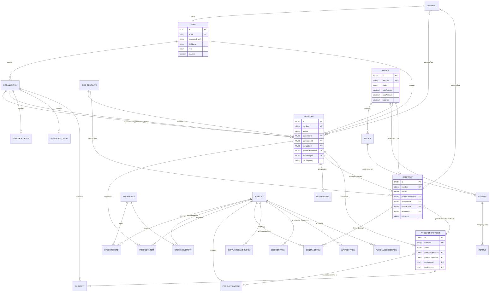

# TOOLS-FOR-THEORY-TESTING — Инструменты теоретической проверки v6

> **Дата:** 2026-06-24
> **Назначение:** Конкретные инструменты и скрипты для проверки ТЕОРИИ проекта **БЕЗ НАПИСАНИЯ КОДА**. Позволяет найти ошибки в документации, противоречия, пробелы до перехода к Phase 1 Bootstrap.
>
> **Главная идея:** автоматизировать то, что можно; а то, что нельзя автоматизировать — снабдить чеклистом + промптами для ИИ.
>
> **Этот документ — продолжение идей из `ВЕРИФИКАЦИЯ-ЧЕКЛИСТ.md` (промпты для ИИ-симулятора),** но с конкретными инструментами.

---

## 0. ОБЗОР ИНСТРУМЕНТОВ

| Категория | Инструмент | Что проверяет |
|---|---|---|
| Markdown Lint | `markdownlint-cli2` | Синтаксис MD, битые ссылки, заголовки |
| Schema validation | `jsonschema` (Python) | Каждая сущность в SCHEMA-CONSOLIDATED.md соответствует JSON-схеме |
| Cross-doc consistency | Custom Python script (ниже) | Ссылки между файлами, одинаковые термины, дубликаты |
| ER-diagram | Mermaid-cli | Схема БД → визуальная диаграмма |
| LLM consistency check | 2 разные LLM (Claude + GPT) | Сравнение интерпретаций одних и тех же параграфов |
| Prompts for ИИ-симулятор | (готовые промпты в `ВЕРИФИКАЦИЯ-ЧЕКЛИСТ.md`) | Бизнес-логика через ролевой prompt |

---

## 1. MARKDOWN LINTING — `markdownlint-cli2`

### 1.1 Установка

```bash
npm install -g markdownlint-cli2
```

### 1.2 Конфиг: `.markdownlint.json`

```json
{
  "default": true,
  "MD013": { "line_length": false, "code_blocks": false, "tables": false },
  "MD024": { "siblings_only": true },
  "MD033": false,
  "MD041": false,
  "MD046": { "style": "fenced" },
  "MD059": true,
  "MD060": false,
  "no-bare-urls": false,
  "first-line-h1": false,
  "no-inline-html": false
}
```

### 1.3 Запуск

```bash
markdownlint-cli2 "_legacy"/**/*.md"
```

### 1.4 Что проверяет

- Битые ссылки между файлами (`жир/курсив`).
- Заголовки (только один `# H1`, иерархия).
- Дубли одинаковых заголовков.
- Запрет bare URL (например, http://example.com — должно быть `[text](url)`).
- Согласованность стиля code blocks.

### 1.5 Что НЕ проверяет

- Не проверяет семантику. Не найдёт "Договор №1" в одном файле и "Договор №2" в другом, если нужно первое.
- Не найдёт **логические** противоречия (Конвертация из Оплачено запрещена vs Order создан автоматически при оплате).

**Для логических проверок — другие инструменты (раздел 4 и 5).**

---

## 2. CROSS-DOC CONSISTENCY — кастомный Python-скрипт

> Это самый важный инструмент. Скрипт проверяет, что:
> - Все ссылки между файлами живы
> - Все термины глоссария использованы единообразно
> - Нет дубликатов контента
> - Битые ссылки на несуществующие файлы

### 2.1 Скрипт: `validate-docs.py`

```python
#!/usr/bin/env python3
"""
validate-docs.py — проверка согласованности .md документов v6.

Проверки:
1. Все внутренние ссылки (друг на друга) существуют
2. Все упоминания файлов существуют в проекте
3. Ключевые термины глоссария (packageTag, kind, snapshot) использованы единообразно
4. Дубликаты параграфов между файлами
5. Противоречия в определениях ключевых терминов

Использование:
    python validate-docs.py
"""

import re
import sys
import os
from pathlib import Path
from collections import defaultdict

PROJECT_ROOT = Path(__file__).parent
DOCS_DIR = PROJECT_ROOT

# Ожидаемые файлы v6 (после аудита)
EXPECTED_FILES = {
    "README.md",
    "МАСТЕР-АУДИТ-V6.md",
    "МОДУЛЬ-КОММЕРЧЕСКОЕ-ПРЕДЛОЖЕНИЕ.md",
    "МОДУЛЬ-ДОГОВОР.md",
    "МОДУЛЬ-ПРОИЗВОДСТВО.md",
    "МОДУЛЬ-СЛАД.md",  # Может отсутствовать
    "МОДУЛЬ-СКЛАД-ПОДРОБНЫЙ.md",
    "МОДУЛЬ-СКЛАД-UI.md",
    "МОДУЛЬ-ФИНАНСЫ.md",
    "ОТКРЫТЫЕ-ВОПРОСЫ.md",
    "АНАЛИЗ-П1.md",
    "АУДИТ-ОТЧЁТ.md",
    "ВЕРИФИКАЦИЯ-ЧЕКЛИСТ.md",
    "ЖУРНАЛ-ПРОГОНА.md",
    "СПОРНЫЕ-МОМЕНТЫ.md",
    "СТЕК-ПРЕДПИСАНИЕ.md",
    "OPEN-QUESTIONS-MASTER.md",
    "SCHEMA-CONSOLIDATED.md",
    "TOOLS-FOR-THEORY-TESTING.md",
    "USER-JOURNEYS.md",
}

# Ключевые термины — должны использоваться единообразно
TERM_DEFINITIONS = {
    "packageTag": {
        "definition_pattern": r"`packageTag`[^\n]*?сделк[аиу]",
        "expects": ["уникальный тег сделки (вручную)", "по сделке"],
    },
    "kind": {
        "definition_pattern": r"`kind`[^\n]*?(ITEM|SERVICE|WORK)",
        "expects": ["ITEM|SERVICE|WORK"],
    },
    "snapshot": {
        "definition_pattern": r"snapshot[^\n]*?(копи|фикс|на момент)",
        "expects": ["копия", "на момент"],
    },
    "Картотека сделки": {
        "definition_pattern": r"Картотека сделк[аиу][^\n]*?(view|фильтр-представление)",
        "expects": ["view", "фильтр-представление"],
    },
}

# Класс результатов валидации
class ValidationResult:
    def __init__(self):
        self.errors = []
        self.warnings = []
        self.infos = []

    def add_error(self, msg):
        self.errors.append(msg)

    def add_warning(self, msg):
        self.warnings.append(msg)

    def add_info(self, msg):
        self.infos.append(msg)

    def print(self):
        print("\n" + "=" * 70)
        print(f"РЕЗУЛЬТАТ ВАЛИДАЦИИ")
        print("=" * 70)
        print(f"✅ Информационных сообщений: {len(self.infos)}")
        print(f"⚠️  Предупреждений: {len(self.warnings)}")
        print(f"🔴 Ошибок: {len(self.errors)}")
        print()

        if self.infos:
            print("🟢 Информация:")
            for info in self.infos:
                print(f"  • {info}")
            print()

        if self.warnings:
            print("⚠️ Предупреждения:")
            for warn in self.warnings:
                print(f"  ⚠ {warn}")
            print()

        if self.errors:
            print("🔴 Ошибки:")
            for err in self.errors:
                print(f"  🔴 {err}")
            print()

        if self.errors:
            print("🚫 ВАЛИДАЦИЯ ПРОВАЛЕНА. Исправьте ошибки перед началом кодинга.")
            sys.exit(1)
        else:
            print("🎉 ВАЛИДАЦИЯ ПРОЙДЕНА. Можно стартовать Phase 1 Bootstrap.")

def check_file_existence(result: ValidationResult):
    """Проверка, что все ожидаемые файлы существуют."""
    existing = set(os.listdir(PROJECT_ROOT))
    missing = EXPECTED_FILES - existing
    for fn in sorted(EXPECTED_FILES):
        if fn not in missing:
            result.add_info(f"✅ {fn} существует")
    for fn in sorted(missing):
        if fn == "МОДУЛЬ-СЛАД.md":  # Опциональный (deprecated)
            result.add_warning(f"⚠️ {fn} отсутствует (можно создать или признать deprecated)")
        elif fn == "АУДИТ-ОТЧЁТ.md":
            # Может отсутствовать в частично обновлённой версии
            result.add_warning(f"⚠️ {fn} отсутствует (устаревший, заменён МАСТЕР-АУДИТ-V6.md)")
        else:
            result.add_error(f"❌ {fn} отсутствует (КРИТИЧНО)")

def check_internal_links(result: ValidationResult):
    """Проверка, что все внутренние ссылки (..) на другие .md файлы живы."""
    link_pattern = re.compile(r"\[([^\]]+)\]\(([^)]+\.md(?:#[^\)]*)?)\)")
    referenced_files = defaultdict(set)

    for fn in EXPECTED_FILES:
        fpath = PROJECT_ROOT / fn
        if not fpath.exists() or fn.endswith("-deprecation"):
            continue
        with open(fpath, "r", encoding="utf-8") as f:
            content = f.read()
        for match in link_pattern.finditer(content):
            target = match.group(2).split("#")[0]
            if target and not target.startswith("http"):
                referenced_files[fn].add(target)

    existing = set(os.listdir(PROJECT_ROOT))
    for source, targets in referenced_files.items():
        for tgt in targets:
            if tgt in existing:
                result.add_info(f"✅ {source} → {tgt} (ссылка живая)")
            elif "archive/" in tgt or "../" in tgt:
                result.add_info(f"⏭️ {source} → {tgt} (archive/, не проверяем)")
            else:
                if tgt in {"МОДУЛЬ-СКЛАД.md"}:  # Известные битые
                    result.add_error(f"🔴 {source} → {tgt} (БИТАЯ ССЫЛКА, файл отсутствует! См. МАСТЕР-АУДИТ Противоречие #4)")
                else:
                    result.add_warning(f"⚠️ {source} → {tgt} (файл отсутствует)")

def check_term_consistency(result: ValidationResult):
    """Проверка единообразия определений ключевых терминов."""
    pattern = re.compile(r'`([a-zA-Z][a-zA-Z0-9]*)`')
    term_files = defaultdict(set)

    for fn in EXPECTED_FILES:
        fpath = PROJECT_ROOT / fn
        if not fpath.exists():
            continue
        with open(fpath, "r", encoding="utf-8") as f:
            content = f.read()
        for term in TERM_DEFINITIONS:
            if term in content:
                term_files[term].add(fn)

    for term, defn in TERM_DEFINITIONS.items():
        files = sorted(term_files.get(term, set()))
        if not files:
            result.add_warning(f"⚠️ Термин '{term}' не найден ни в одном файле")
            continue
        result.add_info(f"📝 Термин '{term}' встречается в {len(files)} файлах: {', '.join(files[:3])}...")

def detect_duplicates(result: ValidationResult):
    """Детект дубликатов длинных параграфов между файлами (приблизительно)."""
    para_pattern = re.compile(r"((?:[^\n]+\n){3,})")  # Параграфы от 3 строк
    seen_paras = defaultdict(list)

    for fn in EXPECTED_FILES:
        fpath = PROJECT_ROOT / fn
        if not fpath.exists():
            continue
        with open(fpath, "r", encoding="utf-8") as f:
            content = f.read()
        for match in para_pattern.finditer(content):
            text = match.group(1).strip()
            if len(text) > 200:  # Только длинные параграфы
                normalized = re.sub(r"\s+", " ", text.lower())[:150]
                seen_paras[normalized].append(fn)

    for normalized, files in seen_paras.items():
        if len(set(files)) > 1:
            sample = normalized[:80]
            result.add_warning(f"⚠️ Возможный дубликат ({len(set(files))} файлов): '{sample}...': {', '.join(sorted(set(files)))}")

def check_referenced_questions(result: ValidationResult):
    """Проверка, что в каждом МОДУЛЬ-доке нет Q-вопросов без статуса 'Решено'/'Закрыт'."""
    q_pattern = re.compile(r"^(?:###?\s+Q\d+|-\s+Q\d+)")

    for fn in EXPECTED_FILES:
        fpath = PROJECT_ROOT / fn
        if not fpath.exists():
            continue
        with open(fpath, "r", encoding="utf-8") as f:
            lines = f.readlines()
        for i, line in enumerate(lines, 1):
            if q_pattern.match(line):
                # Проверяем следующие 30 строк на наличие "Решено" / "Закрыт" / "✅"
                context = "\n".join(lines[i:i+30])
                if "✅" not in context and "Решено" not in context and "Закрыт" not in context and "Рекомендация" not in context:
                    # Допускаем, что это не вопрос, а заголовок
                    if "?" in line or "Вопрос" in line.lower():
                        result.add_warning(f"📌 {fn}:{i} — Q-вопрос без явного статуса 'Решено': '{line.strip()}'")

def main():
    result = ValidationResult()

    print("КАМИН ВАЛИДАЦИИ — phase 0 prep\n")
    check_file_existence(result)
    print()
    check_internal_links(result)
    print()
    check_term_consistency(result)
    print()
    detect_duplicates(result)
    print()
    check_referenced_questions(result)

    result.print()

if __name__ == "__main__":
    main()
```

### 2.2 Использование

```bash
# Запуск (из корня проекта)
python validate-docs.py

# Или однострочник через cmd (Windows)
python validate-docs.py
```

### 2.3 Что скрипт найдёт автоматически

| Ситуация | Сообщение |
|---|---|
| Файл отсутствует | ❌ ошибка |
| Битая ссылка на несуществующий файл | 🔴 ошибка |
| Термин используется, но без определения | ⚠️ предупреждение |
| Длинный параграф дублируется между файлами | ⚠️ предупреждение |
| Q-вопрос без статуса «Решено» | ⚠️ предупреждение |

### 2.4 Что скрипт НЕ найдёт

- Семантические противоречия.
- Неправильные формулы.
- Логические ошибки в бизнес-правилах.

### 2.5 Запуск как часть Phase 1

```bash
# В .github/workflows/docs-validate.yml (опционально, OQ-2)
name: Validate docs
on: [push, pull_request]
jobs:
  docs:
    runs-on: ubuntu-latest
    steps:
    - uses: actions/checkout@v3
    - uses: actions/setup-python@v4
      with:
        python-version: '3.11'
    - run: python validate-docs.py
    - run: npx markdownlint-cli2 "**/*.md"
```

---

## 3. ER-ДИАГРАММА (Mermaid) — визуальная проверка схемы БД

### 3.1 Установка Mermaid CLI

```bash
npm install -g @mermaid-js/mermaid-cli
```

### 3.2 Создайте: `schema-erd.mmd` (на основе `SCHEMA-CONSOLIDATED.md`)



### 3.3 Команда

```bash
mmdc -i schema-erd.mmd -o schema-erd.svg
```

### 3.4 Что покажет визуально

- Картинка БД, все FK, типы.
- Если FK **отсутствует** в schema-erd.mmd хотя он в `SCHEMA-CONSOLIDATED.md` — это расхождение.
- Если FK **есть** в обоих — нужна визуальная проверка, нет ли тупика или висящего FK.

> **Автоматический sanity-check:** `mmdc -i input.mmd --quiet` возвращает exit code ≠ 0 если синтаксис некорректный.

---

## 4. LLM CROSS-CHECK — два разных ИИ дают разные интерпретации

### 4.1 Идея

Передать **одни и те же ключевые параграфы** из проекта двум разным LLM (например, Claude и GPT) и сравнить:
- Совпадают ли интерпретации?
- Выявлены ли противоречия?

### 4.2 Промпт для каждого LLM

Скопируйте в каждый LLM:

```
Тебе дают фрагменты документации (ниже). Я хочу проверить, понимаешь ли ты их однозначно.
Сделай для каждого фрагмента:
1. Перескажи суть в 2-3 предложениях
2. Укажи, что тебе НЕЯСНО (если есть)
3. Перечисли ВСЕ допущения, которые ты сделал

ФРАГМЕНТЫ:

1. Из МОДУЛЬ-КОММЕРЧЕСКОЕ-ПРЕДЛОЖЕНИЕ.md §7 "Конвертировать в договор":
"...кнопка «Конвертировать в договор». Доступна в статусах «отправлено» и «принято».
Копируются позиции ВМЕСТЕ С ЦЕНАМИ."

2. Из МОДУЛЬ-ФИНАНСЫ.md §4:
"Order создаётся автоматически при подписании Договора."

3. Из ЖУРНАЛ-ПРОГОНА.md правка B:
"Конвертация КП в Договор из статуса «Оплачено» — КАТЕГОРИЧЕСКИ ЗАПРЕЩЕНО."

Вопросы:
- Какой триггер создаёт Order в Финансах в реальном бизнес-сценарии, если КП был "Оплачено" но НЕ КОНВЕРТИРОВАН в Договор?
- Что показывает система, если менеджер пытается конвертировать "Оплачено" в Договор?
- Можно ли в реальной жизни иметь КП в статусе "Оплачено" без Договора?
```

### 4.3 Ожидаемый результат

| LLM A | LLM B | Результат |
|---|---|---|
| "Order при подписании Договора — единственный триггер" | "Order может создаваться автоматически по другим событиям" | ⚠️ Расхождение! |
| "Конвертация Оплачено запрещена ЮР. безопасности" | "Конвертация Оплачено запрещена по UX-причинам" | ⚠️ Разные мотивации, проверить |
| Совпадают | Совпадают | ✅ Можно продолжать |

### 4.4 Документирование результатов

Сохраните файл `cross-check-results.md` с двумя колонками ответов и итоговым вердиктом.

---

## 5. ПРОМПТЫ ДЛЯ ФИНИШНОЙ ВЕРИФИКАЦИИ (по `ВЕРИФИКАЦИЯ-ЧЕКЛИСТ.md`)

Эти промпты уже есть в `ВЕРИФИКАЦИЯ-ЧЕКЛИСТ.md` §7. Используйте их для финальной проверки.

### 5.1 Промпт для ролевого тестирования (упрощённый)

```
Ты — менеджер по продажам Иванов в компании "Ромашка". Используешь KPPDF CRM v6.

СЦЕНАРИЙ: Клиент ООО "Спорткомплект" хочет купить 15 баскетбольных колец + монтаж.
Ты только что создал КП-0042. Клиент сказал "да". Твой следующий шаг — поставить статус.

ВОПРОСЫ:
1. Какой статус поставишь? ("Принято" или "Оплачено"?)
2. Что произойдёт дальше автоматически?
3. Если ты хочешь также создать Договор — это сделать сейчас или позже?
4. Что будет, если ты случайно нажмёшь "Оплачено", хотя деньги ещё не пришли?
```

### 5.2 Промпт для проверки эргатики

```
Ты — кладовщик Петров. Тебе приходит уведомление из системы.
ВОПРОСЫ:
1. Если только что завершился ЗК-0023 (15 колец), что ты ожидаешь увидеть на /supplier-deliveries?
2. Как ты оформишь отгрузку ОТК-0008?
3. Что делать, если пришло 98 вместо 100 колец в СД-0017?
```

### 5.3 Что ожидать

Каждый LLM ответит по-своему, но если **5 разных LLM** дают **похожие** ответы и ни один не противоречит существующим в матрицах RBAC правилам — документация достаточно полная.

---

## 6. JSON-SCHEMA ВАЛИДАЦИЯ сущностей

### 6.1 Идея

Каждая сущность в `SCHEMA-CONSOLIDATED.md` — это фактически JSON-объект. Можно формализовать.

### 6.2 Скрипт: `validate-schema.py` (псевдо)

```python
import json
import jsonschema
from pathlib import Path

SCHEMA = {
    "type": "object",
    "required": ["name", "fields", "fk"],
    "properties": {
        "name": {"type": "string"},
        "fields": {
            "type": "array",
            "items": {
                "type": "object",
                "required": ["name", "type"],
                "properties": {
                    "name": {"type": "string"},
                    "type": {"type": "string"},
                    "nullable": {"type": "boolean"},
                    "snapshot": {"type": "boolean"},
                }
            }
        },
        "fk": {
            "type": "array",
            "items": {
                "type": "object",
                "required": ["target"],
                "properties": {
                    "target": {"type": "string"},
                    "on_delete": {"type": "string"},
                }
            }
        }
    }
}

entities = [
    {
        "name": "Proposal",
        "fields": [
            {"name": "id", "type": "UUID"},
            {"name": "number", "type": "String", "nullable": False},
            {"name": "status", "type": "Enum"},
            # ...
        ],
        "fk": [
            {"target": "Organization", "on_delete": "RESTRICT"},
        ]
    },
    # ...
]

for entity in entities:
    try:
        jsonschema.validate(entity, SCHEMA)
        print(f"✅ {entity['name']} валидна")
    except jsonschema.ValidationError as e:
        print(f"❌ {entity['name']} ОШИБКА: {e.message}")
```

---

## 7. РЕКОМЕНДУЕМЫЙ WORKFLOW перед началом Phase 1 Bootstrap

### 7.1 Чеклист

- [ ] **Запустить** `validate-docs.py` — должно быть 0 ошибок, минимум предупреждений
- [ ] **Запустить** `markdownlint-cli2` — должно быть 0 ошибок
- [ ] **Сгенерировать** Mermaid ER-диаграмму — визуально проверить
- [ ] **Прогнать** LLM cross-check на 5 ключевых параграфах
- [ ] **Прогнать** промпт для ролевого сценария через 3 разных LLM

### 7.2 Время

- 1 час на проверку
- ~30 минут на исправление предупреждений
- ИТОГО: **1.5 часа** до полной чистоты

### 7.3 Если что-то не так

Возможны 3 типа проблем:

1. **Битые ссылки** — исправить реферер или создать недостающий файл
2. **Дубликаты параграфов** — оставить в одном каноническом месте, остальные — короткие ссылки
3. **Расхождения интерпретаций** — это серьёзное замечание, требует правки документации

---

## 8. СВЯЗЬ С ДРУГИМИ ДОКУМЕНТАМИ

- `ВЕРИФИКАЦИЯ-ЧЕКЛИСТ.md` — общий подход через 73 V-пункта
- `МАСТЕР-АУДИТ-V6.md` — что обнаружено на текущий момент
- `SCHEMA-CONSOLIDATED.md` — данные для schema-validate.py
- `OPEN-QUESTIONS-MASTER.md` — найденные проблемы
- `USER-JOURNEYS.md` — сценарии для ИИ-симулятора
